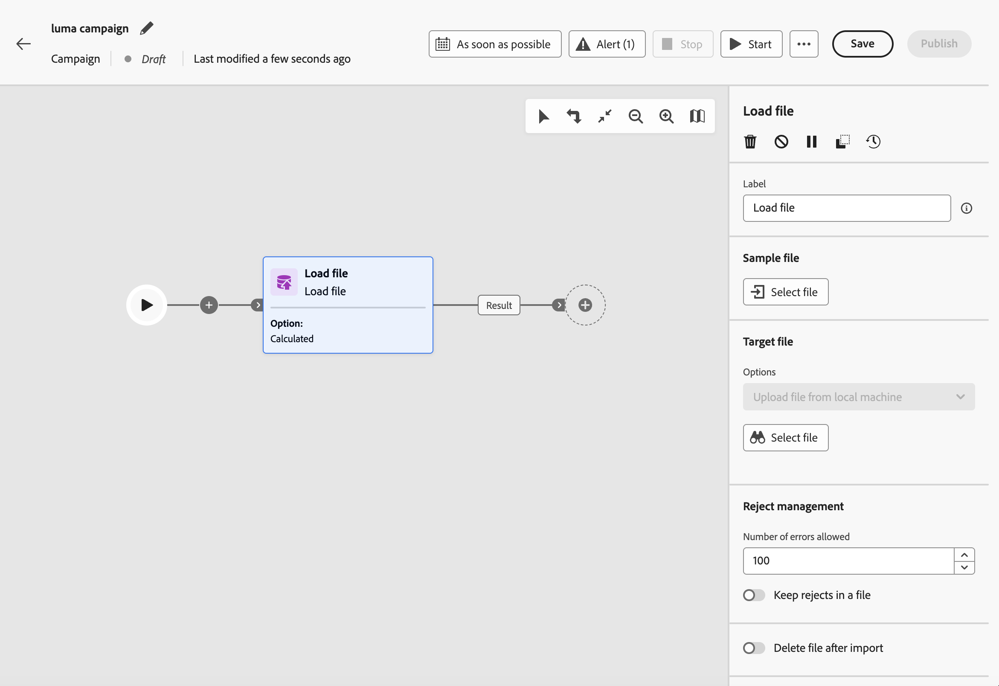
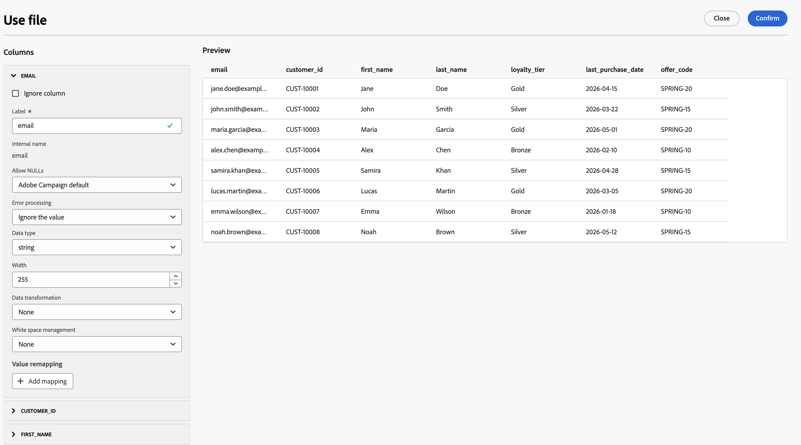

# Datei laden {#load-file}

>[!CONTEXTUALHELP]
>id="ajo_orchestration_load_file"
>title="Aktivität „Datei laden“"
>abstract="Die Aktivität **Datei laden** ist eine Aktivität **Daten-Management** . Verwenden Sie diese Option, um mit Profilen und Daten zu arbeiten, die in einer externen Datei auf der orchestrierten Kampagnen-Arbeitsfläche gespeichert sind, und um die Kampagnen-Audience zu definieren. Dateidaten werden zur Ausführungszeit genutzt und nicht als Adobe Experience Platform-Datensatz beibehalten."

Die Aktivität **[!UICONTROL Datei laden]** ist eine Aktivität **[!UICONTROL Daten-Management]** . Verwenden Sie diese Option, um mit Profilen und Daten zu arbeiten, die in einer externen Datei gespeichert sind. Es unterstützt **dateibasiertes Targeting** in orchestrierten Kampagnen, wenn Ihre Empfängerliste von einem externen System stammt (z. B. einem CRM-Export oder einer Partnerdatei) und Sie eine Kampagne ausführen möchten, ohne zuvor eine vollständige Adobe Experience Platform-Aufnahme-Pipeline zu erstellen.

>[!AVAILABILITY]
>
>Die **Datei laden**-Aktivität ist für **Reihe von** in „Eingeschränkte Verfügbarkeit“ verfügbar. Wenden Sie sich an Ihren Adobe-Support-Mitarbeiter, um Zugriff anzufordern. Informationen zu Verfügbarkeitsphasen finden Sie unter [Journey Optimizer-Versionszyklus](../../rn/releases.md).
>
>Die Aktivität ist derzeit nicht für die Verwendung mit **Healthcare Shield** verfügbar.

## Leitlinien und Einschränkungen {#limitations}

Die folgenden Einschränkungen gelten für die Aktivität Datei laden :

* Sie können bis zu 50 MB pro Datei hochladen.
* Es werden nur CSV- und TXT-Dateien mit flachen Strukturen unterstützt.
* Hochgeladene Daten werden bei der Kampagnenausführung verwendet und nicht als Adobe Experience Platform-Datensatz gespeichert.

Einschränkungen für Kanal- und Arbeitsflächen-Aktivitäten finden Sie unter [Leitplanken und Einschränkungen](../guardrails.md#activities-limitations).

## Konfigurieren der Aktivität „Datei laden“ {#load-file-configuration}

Konfigurieren Sie die Aktivität in zwei Teilen: Definieren Sie die erwartete Dateistruktur mit einer Beispieldatei und geben Sie dann die Datei an, die bei der Ausführung der Kampagne geladen werden soll.

1. Fügen Sie **[!UICONTROL orchestrierten Kampagnen]** Arbeitsfläche die Aktivität „Datei laden“ hinzu.

   

1. Geben Sie einen **[!UICONTROL Titel]** für die Aktivität ein.

### Definieren der Beispieldatei {#sample-file}

Verwenden Sie eine Beispieldatei zum Konfigurieren von **[!UICONTROL Spalten]** und **[!UICONTROL Formatierung]**. Die Beispieldaten werden nicht als Kampagnen-Audience importiert.

1. Wählen Sie im **[!UICONTROL Beispieldatei]** die lokale Datei aus, die die erwartete Struktur definiert.

   >[!NOTE]
   >
   > Die Beispieldatei wird nur zum Konfigurieren von Spalten und zur Formatierung verwendet. Die Daten werden nicht als Kampagnentität importiert. Das Format muss mit den Dateien übereinstimmen, die bei der Ausführung der Kampagne geladen werden.

1. Geben **[!UICONTROL in der Dropdown]** Liste Dateityp an, ob die Datei **Spalten mit Trennzeichen** oder **Spalten mit fester Breite** verwendet.

   

1. Erweitern Sie im Abschnitt **[!UICONTROL Spalten]** jede Spalte und konfigurieren Sie deren Eigenschaften.

   

   Nachdem Sie einen **[!UICONTROL Datentyp]** ausgewählt haben, werden zusätzliche Optionen für diesen Typ angezeigt. Erweitern Sie die folgenden Abschnitte für Parameter, die für alle Spalten gelten, und für typspezifische Optionen.

   +++Allgemeine Spaltenparameter

   * **[!UICONTROL Spalte ignorieren]** - Schließt die Spalte aus dem Import aus, wenn ausgewählt.
   * **[!UICONTROL label]** - Anzeigename für die Spalte (z. B. `email`).
   * **[!UICONTROL Interner Name]** - Systemname für die Spalte, abgeleitet aus der Dateikopfzeile (schreibgeschützt).
   * **[!UICONTROL Datentyp]** - Datentyp in der Spalte.
   * **[!UICONTROL NULL zulassen]** - Gibt an, wie leere Werte in der Spalte verwaltet werden:

      * **[!UICONTROL Adobe Campaign-Standard]** - Generiert einen Fehler nur für numerische Felder. Fügt andernfalls einen NULL-Wert ein.
      * **[!UICONTROL Leerer Wert zulässig]** - Autorisiert leere Werte. Der Wert NULL wird eingefügt.
      * **[!UICONTROL Immer befüllt]** - Generiert einen Fehler, wenn ein Wert leer ist.

   * **[!UICONTROL Fehlerverarbeitung]** - Definiert das Verhalten, wenn ein Fehler in der Spalte auftritt:

      * **[!UICONTROL Wert ignorieren]** - Der Wert wird ignoriert.
      * **[!UICONTROL Zeile ablehnen]** - Die gesamte Zeile wird nicht verarbeitet.
      * **[!UICONTROL Standardwert im Fehlerfall verwenden]** - Ersetzt den Wert, der den Fehler verursacht, durch einen Standardwert, der im Feld **[!UICONTROL Standardwert]** definiert ist.
      * **[!UICONTROL Standardwert verwenden, falls der Wert nicht neu zugeordnet wurde]** - Ersetzt den den Fehler verursachenden Wert durch einen Standardwert, der im Feld **[!UICONTROL Standardwert“]** ist, es sei denn, für den fehlerhaften Wert wurde eine Zuordnung definiert.
      * **[!UICONTROL Zeile ablehnen, wenn kein Neuzuordnungswert vorhanden ist]** - Die gesamte Zeile wird nicht verarbeitet, es sei denn, für den fehlerhaften Wert wurde eine Zuordnung definiert.

   * **[!UICONTROL Standardwert]** - Standardwert, der verwendet wird, wenn **[!UICONTROL Fehlerverarbeitung]** auf die Verwendung eines Standardwerts eingestellt ist.
   * **[!UICONTROL Wert-Neuzuordnung]** - Ordnen Sie bestimmte Werte neuen Werten zu. Klicken Sie **[!UICONTROL Zuordnung hinzufügen]**, um jede Zuordnung zu definieren (ersetzen Sie beispielsweise `True`/`False` durch `1`/`0`).

   +++

   +++Parameter der Zeichenfolgenspalten

   * **[!UICONTROL Breite]** - Maximale Zeichenanzahl.
   * **[!UICONTROL Datenumwandlung]** — Auf Zeichenfolgenwerte angewendete Groß-/Kleinschreibung (z. B. keine oder Groß-/Kleinschreibung).
   * **[!UICONTROL Leerraum-Management]** - Umgang mit führenden oder nachfolgenden Leerzeichen in Zeichenfolgenwerten.

   +++

   +++Parameter für Spalten mit Ganzzahlen und unverankerten Zahlen

   * **[!UICONTROL Format]** - Definiert, wie numerische Werte in der Datei gelesen werden:

      * **[!UICONTROL Sonstige]** - Definieren Sie **[!UICONTROL Tausendertrennzeichen]** und **[!UICONTROL Dezimaltrennzeichen]** im Abschnitt **[!UICONTROL Trennzeichen]**.
      * **[!UICONTROL 1.000.00]** - Komma als Tausendertrennzeichen und Punkt als Dezimaltrennzeichen.
      * **[!UICONTROL 1 000,00]** — Leerzeichen als Tausendertrennzeichen und Komma als Dezimaltrennzeichen.

   * **[!UICONTROL Trennzeichen]** (wenn **[!UICONTROL format]** den Wert **[!UICONTROL Other]** hat):

      * **[!UICONTROL Tausendertrennzeichen]** - Zeichen, das Tausende in numerischen Werten gruppiert (leer lassen, wenn es nicht verwendet wird).
      * **[!UICONTROL Dezimaltrennzeichen]** - Zeichen, das für den Dezimalteil numerischer Werte verwendet wird (z. B. `,` oder `.`).

   +++

   +++Parameter für Datums- und Uhrzeitspalten

   Die Optionen hängen davon ab, ob **[!UICONTROL Datentyp]** &quot;**Datum**, **Uhrzeit** oder **Datum und Uhrzeit** ist.

   **Datum**

   * **[!UICONTROL Datumsformat]** - Muster, das dem Aussehen von Datumsangaben in der Datei entspricht (z. B. `yyyy/mm/dd`).
   * **[!UICONTROL Trennzeichen]**:

      * **[!UICONTROL Jahr, Monat,]**: Zeichen zwischen den Komponenten für Jahr, Monat und Tag (z. B. `/`).

   **Zeit**

   * **[!UICONTROL Zeitformat]** - Muster, das dem Aussehen der Zeiten in der Datei entspricht (z. B. `13:30` für 24-Stunden-Stunden und -Minuten).
   * **[!UICONTROL Trennzeichen]**:

      * **[!UICONTROL Stunde, Minute, Sekunde]** - Zeichen zwischen der Stunde, Minute und der zweiten Komponente (z. B. `:`).

   **Datum und Uhrzeit**

   * **[!UICONTROL Datumsformat]** - Das Muster, das dem Aussehen des Datumsbereichs in der Datei entspricht.
   * **[!UICONTROL Zeitformat]** - Muster, das dem Aussehen des Zeitabschnitts in der Datei entspricht.
   * **[!UICONTROL Trennzeichen]** - Zeichen zwischen Datums- und Zeitkomponenten.

   +++

1. Geben **[!UICONTROL im Abschnitt]** an, wie die Datei strukturiert ist, damit Zeilen und Spalten bei der Kampagnenausführung korrekt gelesen werden. Die Zieldatei muss dieselbe Formatierung wie die Beispieldatei verwenden.

   

   * **[!UICONTROL Erste Zeile als Spaltenüberschrift verwenden]** - Wenn diese Option aktiviert ist, wird die erste Zeile der Datei als Spaltenname behandelt. Diese Option ist normalerweise aktiviert, wenn Sie das Beispiel aus einer Datei konfigurieren, die eine Kopfzeile enthält.
   * **[!UICONTROL Zeilennummer als Kennung verwenden]** - Wenn diese Option aktiviert ist, wird jede Zeile durch ihre Zeilennummer in der Datei identifiziert.
   * **[!UICONTROL Datensätze erstrecken sich über mehrere Zeilen]** - Wenn diese Option aktiviert ist, kann ein einzelner Datensatz mehrere Zeilen in der Datei umfassen (z. B. wenn Felder Zeilenumbrüche enthalten).
   * **[!UICONTROL Zu ignorierende Zeilen]** - Anzahl der Zeilen, die am Anfang der Datei übersprungen werden sollen, bevor Daten gelesen werden (z. B. Kommentar- oder Metadatenzeilen).
   * **[!UICONTROL Zeitzone]** - Zeitzone, die beim Importieren von Datums- und Zeitwerten angewendet wird.
   * **[!UICONTROL Codierung]** - Zeichencodierung der Datei. Wählen Sie die Kodierung aus, die Ihrer Quelldatei entspricht.
   * **[!UICONTROL Zeichenfolgen-Trennzeichen]** - Zum Einschließen von Zeichenfolgenwerten in die Datei verwendetes Zeichen.
   * **[!UICONTROL Spaltentrennzeichen]** - Zeichen, das Spalten in einer durch Trennzeichen getrennten Datei trennt.

1. Klicken Sie **[!UICONTROL Bestätigen]**, um die Beispieldateikonfiguration zu validieren.

### Definieren der Zieldatei {#target-file}

Geben Sie die Datei an, die bei der Kampagnenausführung geladen werden soll, und wie jede Zeile mit den vorhandenen Empfängern abgeglichen werden soll.

1. Wählen Sie im Abschnitt **[!UICONTROL Target]** die CSV- oder TXT-Datei aus, die Folgendes enthält:

   

   >[!CAUTION]
   >
   > Stellen Sie sicher, dass die Zieldatei demselben Format, derselben Spaltenstruktur und derselben Spaltenanzahl folgt wie die Beispieldatei.

1. Definieren Sie **[!UICONTROL Abschnitt]** Zurückweisungsverwaltung“, wie sich die Aktivität verhält, wenn bei der Dateiverarbeitung Fehler auftreten:

   * **[!UICONTROL Anzahl der zulässigen Fehler]** — Maximal zulässige Anzahl von Fehlern, bevor die Aktivität fehlschlägt.
   * **[!UICONTROL Zurückweisungen in einer Datei beibehalten]** - Wenn diese Option aktiviert ist, werden Zeilen, die nicht geladen werden konnten, nach der Ausführung zur Überprüfung in eine Zurückweisungsdatei auf dem Server geschrieben.

1. Optional können Sie **[!UICONTROL Datei nach Import löschen]** aktivieren, um die hochgeladene Datei nach der Kampagnenausführung vom Server zu entfernen.

Nachdem **[!UICONTROL Datei laden]** die Zielgruppe aufgelöst hat, verbinden Sie die ausgehende Transition mit nachgelagerten Aktivitäten. [Weitere Informationen zur Orchestrierung von Kampagnenaktivitäten](../orchestrate-activities.md)
