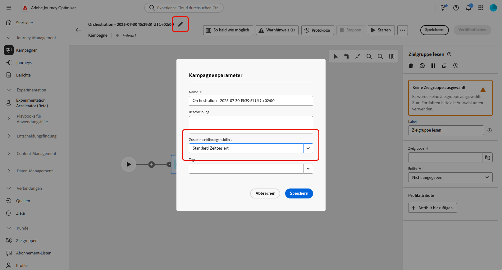
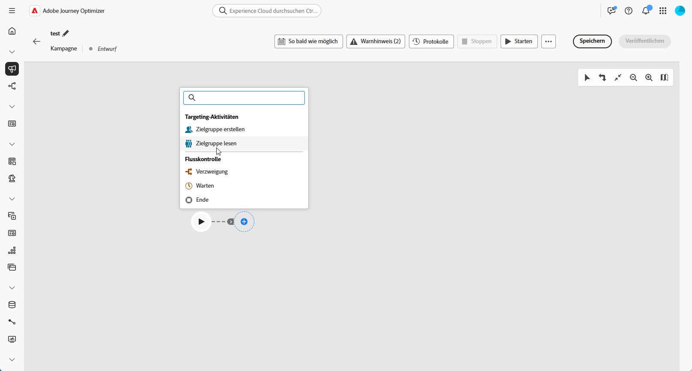
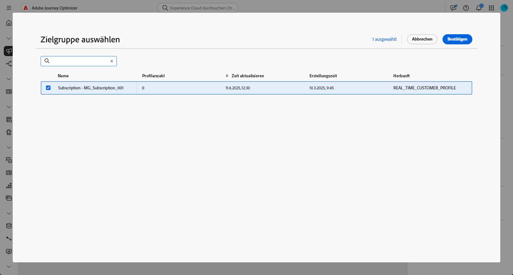
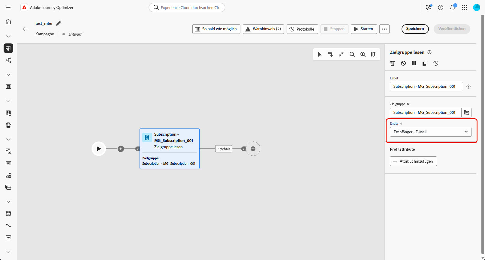
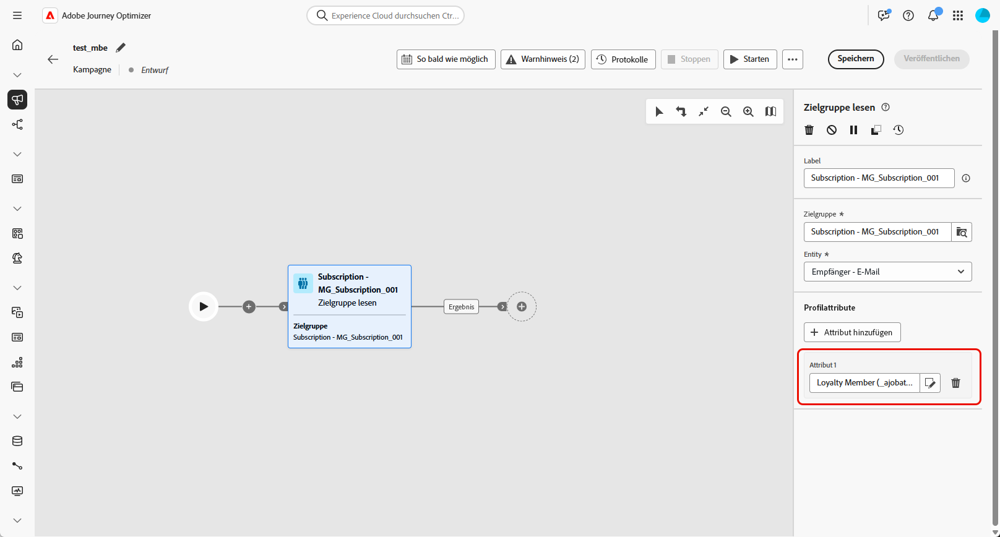
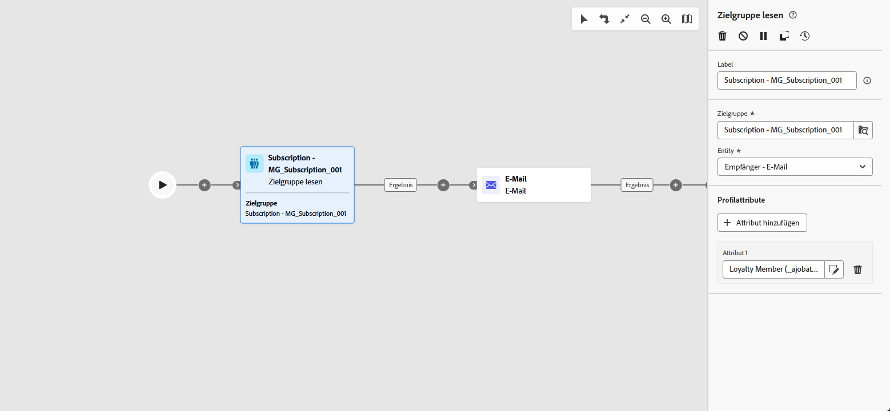

# Zielgruppe lesen {#read-audience}

>[!CONTEXTUALHELP]
>id="ajo_orchestration_read_audience"
>title="Aktivität „Zielgruppe erstellen“"
>abstract="Mit der Aktivität **Zielgruppe erstellen** können Sie die Zielgruppe auswählen, die in die orchestrierte Kampagne eintritt. Bei dieser Zielgruppe kann es sich um eine bestehende Adobe Experience Platform-Zielgruppe oder um eine aus einer CSV-Datei abgerufene Zielgruppe handeln. Beim Senden von Nachrichten im Rahmen einer orchestrierten Kampagne wird die Nachrichtenzielgruppe nicht in der Kanalaktivität, sondern in der Aktivität **Zielgruppe lesen** oder in der Aktivität **Zielgruppe erstellen** definiert."

Mit der Aktivität **[!UICONTROL Zielgruppe lesen]** können Sie eine vorhandene Zielgruppe (die zuvor gespeichert oder importiert wurde) abrufen und in einer orchestrierten Kampagne wiederverwenden. Diese Aktivität ist besonders nützlich, um einen vordefinierten Satz von Profilen anzusprechen, ohne dass ein neuer Segmentierungsprozess ausgeführt werden muss.

Nachdem die Zielgruppe geladen wurde, können Sie sie optional verfeinern, indem Sie ein Feld für eine eindeutige Identität auswählen und die Zielgruppe mit zusätzlichen Profilattributen für Targeting-, Personalisierungs- oder Berichtszwecke anreichern.

## Cache für „Zielgruppe lesen“ {#cache}

Beim Testen einer orchestrierten Kampagne dauert das Abrufen von Daten durch die Aktivität **[!UICONTROL Zielgruppe lesen]** normalerweise einige Zeit, was dazu führen kann, dass Testläufe länger dauern. Um dies zu beschleunigen, ist ein Cache für **[!UICONTROL Zielgruppe lesen]** verfügbar.

Der Cache speichert die Zielgruppe zusammen mit den ausgewählten Attributen für **bis zu zwei Stunden**. Während dieser Zeit können alle nachfolgenden Testausführungen die zwischengespeicherten Ergebnisse verwenden, sodass die Daten nicht erneut abgerufen werden müssen. Nach Ablauf des **zweistündigen Zeitraums** müssen die Daten neu abgerufen werden.

Der Cache wird für jede orchestrierte Kampagne gespeichert, nicht für die Zielgruppe selbst. Wenn dieselbe Zielgruppe in einer Aktivität **[!UICONTROL Zielgruppe lesen]** innerhalb einer anderen orchestrierten Kampagne verwendet wird, muss das System die Daten dennoch erneut abrufen.

Der Cache wird in den folgenden Fällen nicht beibehalten:

* Wenn die Aktivität **[!UICONTROL Zielgruppe lesen]** mit neuen Attributen aktualisiert wird, wird der Cache mit den neuen Datenattributen aktualisiert. Daher dauert der erste Testlauf nach der Aktualisierung länger, da die Daten erneut abgerufen werden müssen.

* Bei der Veröffentlichung der orchestrierten Kampagne werden die neuesten Daten abgerufen, wenn die orchestrierte Live-Kampagne ausgeführt wird.

## Konfigurieren der Aktivität „Zielgruppe lesen“ {#read-audience-configuration}

Führen Sie die folgenden Schritte aus, um die Aktivität **[!UICONTROL Zielgruppe lesen]** zu konfigurieren:

1. Bevor Sie die Aktivität **[!UICONTROL Zielgruppe lesen]** hinzufügen, müssen Sie in Ihren Kampagneneinstellungen eine **[!UICONTROL Zusammenführungsrichtlinie]** auswählen.

   

1. Fügen Sie Ihrer orchestrierten Kampagne eine Aktivität des Typs **[!UICONTROL Zielgruppe lesen]** hinzu.

   

1. Fügen Sie Ihrer Aktivität einen **[!UICONTROL Label]** hinzu. Dieses Label dient als Name Ihrer Zielgruppe.

1. Klicken Sie , um die Audience auszuwählen, die Sie für Ihre orchestrierte Kampagne ansprechen möchten. [ Erfahren Sie mehr darüber, wie Sie in Journey Optimizer Zielgruppen generieren und ansprechen ](../../audience/about-audiences.md).

   

1. Wählen Sie eine **[!UICONTROL Entität]** aus der Zielgruppendimension Ihrer Kampagne aus. Diese Einstellung definiert die Zielentität und das Attribut, das zur Abstimmung der Zielgruppe mit der Zieldimension verwendet wird.

   ➡️ [Führen Sie die auf dieser Seite beschriebenen Schritte aus, um die Zielgruppendimension für Ihre Kampagne zu erstellen.](../target-dimension.md)

   

1. Wählen Sie **[!UICONTROL Attribut hinzufügen]** aus, um Ihre ausgewählte Zielgruppe mit zusätzlichen Daten anzureichern. In diesem Schritt können Sie der Zielgruppe Profilattribute hinzufügen, was zu einer Liste von Empfängerinnen und Empfängern führt, die mit diesen Attributen erweitert werden.

1. Wählen Sie die **[!UICONTROL Attribute]** aus, die Sie Ihrer Zielgruppe hinzufügen möchten. Die Attributauswahl zeigt Felder aus dem **vereinigten Profilschema** an:

   * Bei CSV-basierten Zielgruppen umfasst dies sowohl **Profilattribute** als auch benutzerdefinierte Attribute auf Zielgruppenebene. Diese Attribute befinden sich unter dem folgenden Schemapfad:

     `<audienceid> > _ajobatchjourneystage > audienceEnrichment > CustomerAudienceUpload > <audienceid>`

   * Bei standardmäßigen AEP-Zielgruppen sind nur **Profilattribute** verfügbar, da sie keine eingebetteten zielgruppenspezifischen Felder enthalten.

   >[!NOTE]
   >
   > Einige Attribute werden zwar möglicherweise in der Auswahl angezeigt, ihre Verfügbarkeit zur Laufzeit hängt jedoch davon ab, ob die Zielgruppendaten erfolgreich mit dem **Adobe Experience Platform-Profil** abgestimmt und zusammengeführt wurden.

   

Nachdem eine Zielgruppe erstellt wurde, ist sie schreibgeschützt verfügbar und kann nicht mehr bearbeitet werden. Sie kann erst verwendet werden, wenn der Erstellungsprozess vollständig abgeschlossen ist.

## Beispiel

Im folgenden Beispiel wird die Aktivität **[!UICONTROL Zielgruppe lesen]** verwendet, um eine zuvor erstellte und gespeicherte Zielgruppe von Profilen abzurufen, die sich für den Newsletter angemeldet haben. Die Zielgruppe wird dann mit dem Attribut **Mitgliedschaft in Treueprogramm** angereichert, um die Zielgruppenbestimmung für Benutzende zu ermöglichen, die registrierte Mitglieder des Treueprogramms sind.

