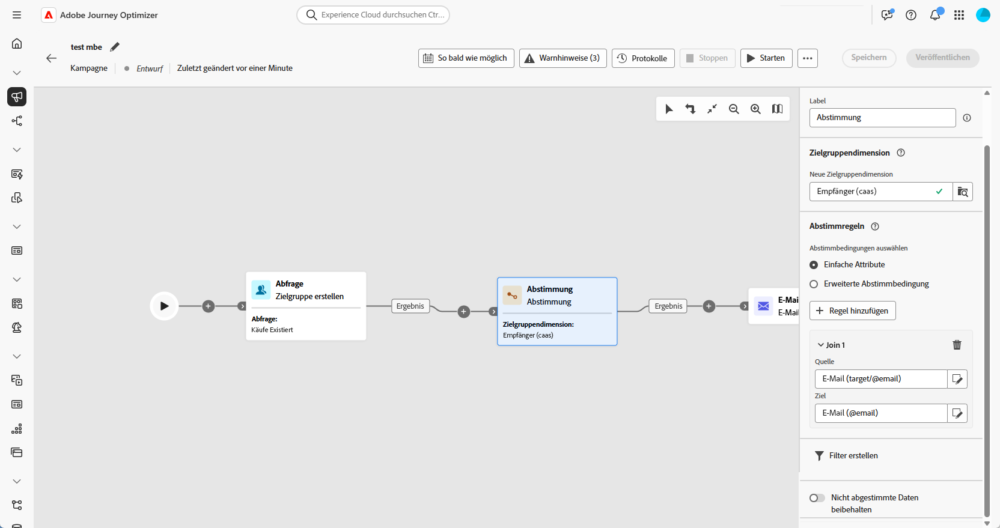
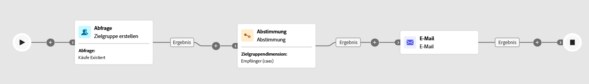

# Abstimmung {#reconciliation}

>[!CONTEXTUALHELP]
>id="ajo_orchestration_reconciliation"
>title="Aktivität „Abstimmung“"
>abstract="Die Aktivität **Abstimmung** ist eine Aktivität zur **Zielgruppenbestimmung**, mit der Sie die Verknüpfung zwischen den Daten in der Adobe Campaign-Datenbank und den Daten in einer Arbeitstabelle definieren können."

>[!CONTEXTUALHELP]
>id="ajo_orchestration_reconciliation_field"
>title="Abstimmung – Feld auswählen"
>abstract="Abstimmung – Feld auswählen"

>[!CONTEXTUALHELP]
>id="ajo_orchestration_reconciliation_condition"
>title="Abstimmung – Bedingung erstellen"
>abstract="Abstimmung – Bedingung erstellen"

>[!CONTEXTUALHELP]
>id="ajo_orchestration_reconciliation_complement"
>title="Abstimmung – Komplement erzeugen"
>abstract="Abstimmung – Komplement erzeugen"

Die Aktivität **[!UICONTROL Abstimmung]** ist eine **[!UICONTROL Targeting]**-Aktivität, mit der Sie die Verknüpfung zwischen den Daten in Adobe Journey Optimizer und den Daten in einer Arbeitstabelle definieren können, beispielsweise aus einer externen Datei geladene Daten. 

Die Aktivität **[!UICONTROL Anreicherung]** ermöglicht das Hinzufügen zusätzlicher Daten zu einer orchestrierten Kampagne, beispielsweise durch das Kombinieren von Daten aus mehreren Quellen oder durch Verknüpfen mit einer temporären Ressource. Dagegen werden mit der Aktivität **[!UICONTROL Abstimmung]** nicht identifizierte oder externe Daten mit vorhandenen Ressourcen in der Datenbank abgeglichen.

Die **[!UICONTROL Abstimmung]** erfordert, dass die entsprechenden Einträge bereits im System vorhanden sind. Wenn Sie beispielsweise eine Kaufdatei importieren, in der Produkte, Zeitstempel und Kundeninformationen aufgelistet sind, müssen sowohl die Produkte als auch die Kundinnen und Kunden bereits in der Datenbank vorhanden sein, um die Verknüpfung herzustellen.

## Konfigurieren der Abstimmungsaktivität {#reconciliation-configuration}

>[!CONTEXTUALHELP]
>id="ajo_orchestration_reconciliation_targeting"
>title="Zielgruppendimension"
>abstract="Wählen Sie die neue Zielgruppendimension aus. Mit einer Dimension können Sie die Zielpopulation definieren: Empfängerinnen und Empfänger, Abonnentinnen und Abonnenten der App, Benutzerinnen und Benutzer, Abonnentinnen und Abonnenten usw. Standardmäßig ist die aktuelle Zielgruppendimension ausgewählt."

>[!CONTEXTUALHELP]
>id="ajo_orchestration_reconciliation_rules"
>title="Abstimmungsregeln"
>abstract="Wählen Sie die für die Deduplizierung zu verwendenden Abstimmungsregeln aus. Um Attribute zu verwenden, wählen Sie die Option **Einfache Attribute** und dann die Quell- und Zielfelder aus. Um mit dem Regel-Builder Ihre eigene Abstimmungsbedingung zu erstellen, wählen Sie die Option **Erweiterte Abstimmbedingungen** aus."

>[!CONTEXTUALHELP]
>id="ajo_orchestration_reconciliation_targeting_selection"
>title="Auswählen der Zielgruppendimension"
>abstract="Wählen Sie die Zielgruppendimension für Ihre eingehenden Daten zum Abstimmen aus."
>additional-url="https://experienceleague.adobe.com/docs/campaign-web/v8/audiences/gs-audiences-recipients.html?lang=de#targeting-dimensions" text="Zielgruppendimensionen"

>[!CONTEXTUALHELP]
>id="ajo_orchestration_keep_unreconciled_data"
>title="Beibehalten nicht abgestimmter Daten"
>abstract="Standardmäßig werden nicht abgestimmte Daten in der ausgehenden Transition beibehalten und stehen in der Arbeitstabelle zur späteren Verwendung zur Verfügung. Um nicht abgestimmte Daten zu entfernen, deaktivieren Sie die Option **Nicht abgestimmte Daten beibehalten**."

>[!CONTEXTUALHELP]
>id="ajo_orchestration_reconciliation_attribute"
>title="Abstimmattribut"
>abstract="Wählen Sie das Attribut aus, das zur Abstimmung der Daten verwendet werden soll, und klicken Sie auf „Bestätigen“."

Gehen Sie wie folgt vor, um die Aktivität **[!UICONTROL Abstimmung]** zu konfigurieren:

1. Fügen Sie der Arbeitsfläche eine Aktivität des Typs **[!UICONTROL Abstimmung]** hinzu.

1. Wählen Sie eine neue Zielgruppendimension aus, um zu definieren, wen Sie ansprechen möchten, z. B. Empfangende oder Abonnierende.

1. Legen Sie die Felder fest, die für den Abgleich Ihrer eingehenden Daten mit vorhandenen Profilen verwendet werden sollen.

1. Um Daten mithilfe einfacher Felder abzugleichen, wählen Sie **[!UICONTROL Einfache Attribute]** aus.

1. Legen Sie die abzugleichenden Felder fest:

   * **[!UICONTROL Quelle]**: Listet die Felder mit eingehenden Daten auf.

   * **[!UICONTROL Ziel]**: Bezieht sich auf Felder in der ausgewählten Zielgruppendimension.

   Eine Übereinstimmung tritt auf, wenn beide Werte gleich sind, beispielsweise Abgleich durch **[!UICONTROL E-Mail]**, um Profile zu identifizieren.

   

1. Um weitere Regeln für den Abgleich hinzuzufügen, klicken Sie auf **[!UICONTROL Regel hinzufügen]**. Alle Bedingungen müssen erfüllt sein, damit eine Übereinstimmung auftritt.

1. Für komplexere Bedingungen wählen Sie **[!UICONTROL Erweiterte Abstimmbedingungen]**. Verwenden Sie den [Regel-Builder](../orchestrated-rule-builder.md), um benutzerdefinierte Logik zu definieren.

1. Um zu filtern, welche Daten abgestimmt werden sollen, klicken Sie auf **[!UICONTROL Filter erstellen]** und definieren Sie Ihre Bedingung im Regel-Builder.

1. Standardmäßig werden nicht abgeglichene Einträge in der ausgehenden Transition beibehalten und in der Arbeitstabelle gespeichert. Um diese zu entfernen, aktivieren Sie die Option **[!UICONTROL Nicht abgestimmte Daten beibehalten]**.

## Beispiel {#example-reconciliation}

In diesem Beispiel wird die Aktivität **[!UICONTROL Abstimmung]** in Adobe Journey Optimizer verwendet, um sicherzustellen, dass E-Mails nur an bekannte Kundinnen und Kunden gesendet werden. Die Daten fließen über eine Aktivität vom Typ **[!UICONTROL Zielgruppe lesen]** ein, die Benutzende mit früheren Bestellungen anspricht. Die Aktivität **[!UICONTROL Abstimmung]** gleicht diese eingehenden Daten dann mithilfe des E-Mail-Felds mit vorhandenen Profilen in der Datenbank ab.

