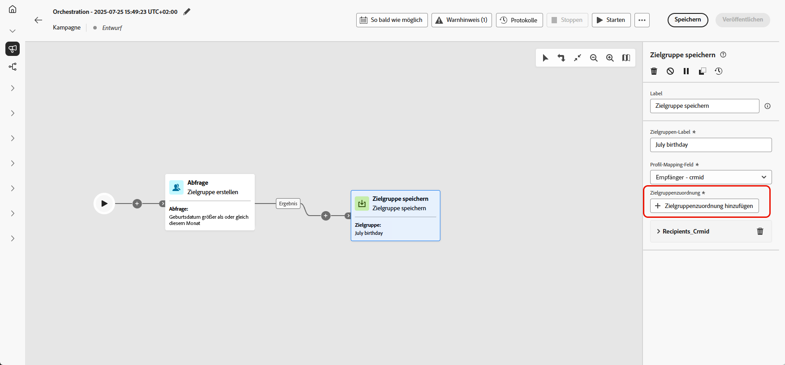
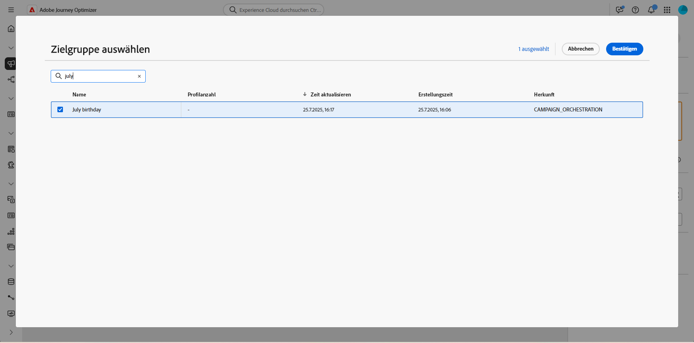
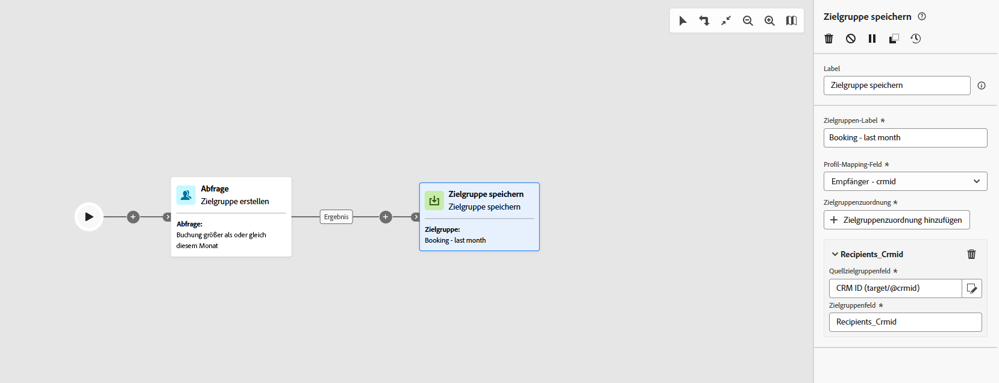

# Speichern einer Zielgruppe {#save-audience}

>[!CONTEXTUALHELP]
>id="ajo_orchestration_save_audience"
>title="Aktivität „Zielgruppe speichern“"
>abstract="Die Aktivität **Zielgruppe speichern** ist eine **Targeting**-Aktivität, mit der Sie eine vorhandene Zielgruppe aktualisieren oder eine neue Zielgruppe aus der zuvor in der orchestrierten Kampagne generierten Population erstellen können. Nach der Erstellung werden diese Zielgruppen zur Liste der Anwendungszielgruppen hinzugefügt und können über das Menü **Zielgruppen** aufgerufen werden."

Die Aktivität **[!UICONTROL Zielgruppe speichern]** ist eine **[!UICONTROL Targeting]**-Aktivität, mit der basierend auf der zuvor in der orchestrierten Kampagne generierten Population eine neue Zielgruppe erstellt oder eine vorhandene aktualisiert wird. Nach dem Speichern werden diese Zielgruppen zur Liste der Anwendungszielgruppen hinzugefügt und können über das Menü **[!UICONTROL Zielgruppen]** aufgerufen werden.

Sie dient häufig dazu, Zielgruppensegmente zu erfassen, die innerhalb desselben Kampagnen-Workflows erstellt wurden, sodass sie zur Wiederverwendung in zukünftigen Kampagnen verfügbar sind. Normalerweise ist dies mit anderen Targeting-Aktivitäten verbunden, z. B. **[!UICONTROL Zielgruppe erstellen]** oder **[!UICONTROL Kombinieren]**, um die endgültige Zielpopulation zu speichern.
Beachten Sie, dass Sie eine vorhandene Zielgruppe nicht mit der Aktivität **[!UICONTROL Zielgruppe speichern]** aktualisieren können. Sie können lediglich eine neue Zielgruppe erstellen oder eine vorhandene mit einer neuen Definition überschreiben.

## Konfigurieren der Aktivität „Zielgruppe speichern“ {#save-audience-configuration}

Führen Sie die folgenden Schritte aus, um die Aktivität **[!UICONTROL Zielgruppe aufbauen]** zu konfigurieren:

1. Fügen Sie Ihrer orchestrierten Kampagne eine Aktivität des Typs **[!UICONTROL Zielgruppe speichern]** hinzu.

1. Geben Sie ein **[!UICONTROL Zielgruppen-Label]** ein, das die gespeicherte Zielgruppe identifiziert.

   >[!NOTE]
   >
   >Das **[!UICONTROL Zielgruppen-Label]** muss in allen Kampagnen eindeutig sein. Sie können keinen Zielgruppennamen wiederverwenden, der bereits in der Aktivität **[!UICONTROL Zielgruppe speichern]** einer anderen Kampagne genutzt wird.

1. Wählen Sie ein **[!UICONTROL Profil-Mapping-Feld]** aus der Zielgruppendimension Ihrer Kampagne aus. Diese Zuordnung definiert, wie Profile in der **gespeicherten Zielgruppe** bei der Ausführung mit der Zieldimension der Kampagne verknüpft werden.

   Um eine ordnungsgemäße Abstimmung zwischen der Zielgruppe und dem Kampagnenkontext sicherzustellen, sind in der Dropdown-Liste nur Zuordnungen verfügbar, die mit der aktuellen Zieldimension kompatibel sind, d. h. mit der der eingehenden Transition.

   ➡️ [Führen Sie die auf dieser Seite beschriebenen Schritte aus, um die Zielgruppendimension für Ihre Kampagne zu erstellen.](../target-dimension.md)

   

1. Klicken Sie auf **[!UICONTROL Zielgruppenzuordnungen hinzufügen]**, um zusätzliche Daten aus Attributen der **[!UICONTROL Zieldimension]** oder aus angereicherten **[!UICONTROL Profilattributen]** einzuschließen.

   So können Sie der Aktivität **[!UICONTROL Gespeicherte Zielgruppe]** über die primäre Profilzuordnung hinaus weitere Informationen zuordnen, wodurch die Targeting- und Personalisierungsoptionen verbessert werden.

   

1. Schließen Sie die Einrichtung ab, indem Sie die orchestrierte Kampagne speichern und veröffentlichen. Dadurch wird Ihre Zielgruppe generiert und gespeichert.

1. Veröffentlichen Sie die Kampagne für die Zielgruppe, die erstellt oder ersetzt werden soll, da die Aktivität **[!UICONTROL Zielgruppe speichern]** nicht ausgeführt wird, während sich die Kampagne im **[!UICONTROL Entwurfsmodus]** befindet.

Der Inhalt der gespeicherten Zielgruppe ist dann in der Detailansicht der Zielgruppe verfügbar. Diese kann über das Menü **[!UICONTROL Zielgruppen]** aufgerufen oder bei der Zielgruppenbestimmung ausgewählt werden, z. B. mit der Aktivität **[!UICONTROL Zielgruppe lesen]**.

>[!NOTE]
>
>Wenn Ihre Zielgruppendefinition Experience Platform-Schemaattribute verwendet, die mit Datennutzungskennzeichnungen (DULE) gekennzeichnet sind, werden diese Kennzeichnungen automatisch von der gespeicherten Zielgruppe übernommen. Sie müssen sie nicht erneut anwenden. [Weitere Informationen zu Data Governance](../../action/action-privacy.md)

## Beispiel {#save-audience-example}

Im folgenden Beispiel wird veranschaulicht, wie eine einfache Zielgruppe mithilfe von Targeting erstellt wird. Eine Abfrage identifiziert alle Empfängerinnen und Empfänger, die in den letzten 30 Tagen eine Reise gebucht haben, indem sie diese Population in Ihrer orchestrierten Kampagne filtert. Wenn Sie **Empfänger – CRMID** als **Zielgruppendimension** auswählen, richtet sich die Zielgruppe an jedes einzelne Buchungsereignis und nicht nur an die Empfängerin bzw. den Empfänger als Ganzes. Die Aktivität **[!UICONTROL Zielgruppe speichern]** erfasst dann diese Profile, um eine wiederverwendbare Zielgruppe aus kürzlichen Käuferinnen und Käufern zu erstellen.

