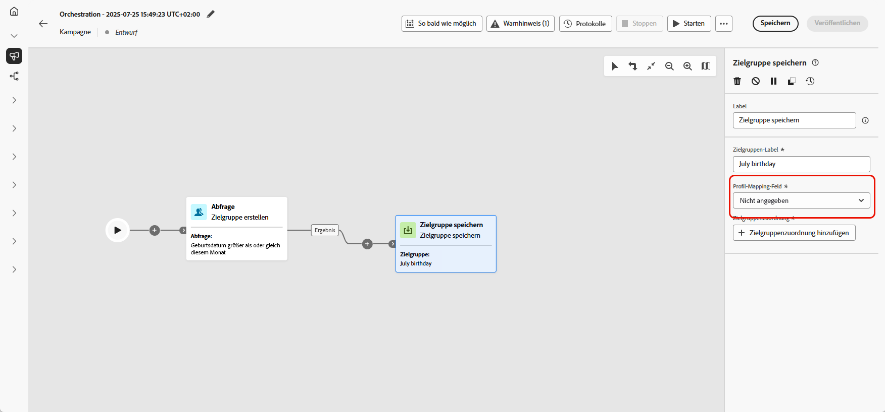

# Speichern einer Zielgruppe {#save-audience}

>[!CONTEXTUALHELP]
>id="ajo_orchestration_save_audience"
>title="Audience-Aktivität speichern"
>abstract="Die Aktivität **Zielgruppe speichern** ist eine **Targeting**-Aktivität, mit der Sie eine vorhandene Zielgruppe aktualisieren oder eine neue Zielgruppe aus der zuvor in der orchestrierten Kampagne generierten Population erstellen können. Nach der Erstellung werden diese Zielgruppen zur Liste der Anwendungszielgruppen hinzugefügt und können über das Menü **Zielgruppen** aufgerufen werden."

+++ Inhaltsverzeichnis

| Willkommen bei orchestrierten Kampagnen | Starten Ihrer ersten orchestrierten Kampagne | Abfragen der Datenbank | Aktivitäten für orchestrierte Kampagnen |
|---|---|---|---|
| [Erste Schritte mit orchestrierten Kampagnen](../gs-orchestrated-campaigns.md)  Erstellen und Verwalten von relationalen Schemata und Datensätzen:  <ul><li>[Erste Schritte mit Schemata und Datensätzen](../gs-schemas.md)</li><li>[Manuelles Schema](../manual-schema.md)</li><li>[Datei-Upload-Schema](../file-upload-schema.md)</li><li>[Daten aufnehmen](../ingest-data.md)</li></ul>[Zugreifen auf und Verwalten von orchestrierten Kampagnen](../access-manage-orchestrated-campaigns.md) | [Wichtige Schritte beim Erstellen einer orchestrierten Kampagne](../gs-campaign-creation.md)  [Erstellen und Planen der Kampagne](../create-orchestrated-campaign.md)  [Orchestrieren von Aktivitäten](../orchestrate-activities.md)  [Starten und Überwachen der Kampagne](../start-monitor-campaigns.md)  [Reporting](../reporting-campaigns.md) | [Arbeiten mit dem Regel-Builder](../orchestrated-rule-builder.md)  [Erstellen der ersten Abfrage](../build-query.md)  [Bearbeiten von Ausdrücken](../edit-expressions.md)  [Retargeting](../retarget.md) | [Erste Schritte mit Aktivitäten](about-activities.md)  Aktivitäten: [Und-Verknüpfung](and-join.md) – [Zielgruppe erstellen](build-audience.md) – [Dimensionsänderung](change-dimension.md) – [Kanalaktivitäten](channels.md) – [Kombinieren](combine.md) – [Deduplizierung](deduplication.md) – [Anreicherung](enrichment.md) – [Verzweigung](fork.md) – [Abstimmung](reconciliation.md) – <b>[Zielgruppe speichern](save-audience.md)</b> – [Aufspaltung](split.md) – [Warten](wait.md) |

{style="table-layout:fixed"}

+++

 

>[!BEGINSHADEBOX]

 

Der Inhalt dieser Seite ist nicht endgültig und kann geändert werden.

>[!ENDSHADEBOX]

Die Aktivität **[!UICONTROL Zielgruppe speichern]** ist eine **[!UICONTROL Zielgruppenbestimmungs]**-Aktivität, mit der basierend auf der zuvor in der orchestrierten Kampagne generierten Population eine neue Zielgruppe erstellt oder eine vorhandene aktualisiert wird. Nach dem Speichern wird die Zielgruppe zur Liste der Anwendungszielgruppen hinzugefügt und kann über das Menü **[!UICONTROL Zielgruppen]** aufgerufen werden.

Sie wird häufig verwendet, um Zielgruppensegmente zu erfassen, die innerhalb desselben Kampagnen-Workflows erstellt wurden, und sie so für die Wiederverwendung in zukünftigen Kampagnen verfügbar zu machen. Normalerweise ist dies mit anderen Zielgruppenbestimmungsaktivitäten verbunden, z. B. **[!UICONTROL Zielgruppe erstellen]** oder **[!UICONTROL Kombinieren]**, um die endgültige Zielpopulation zu speichern.

## Konfigurieren der Aktivität „Zielgruppe speichern“ {#save-audience-configuration}

Führen Sie die folgenden Schritte aus, um die Aktivität **[!UICONTROL Zielgruppe aufbauen]** zu konfigurieren:

1. Fügen Sie Ihrer orchestrierten Kampagne eine Aktivität des Typs **[!UICONTROL Zielgruppe speichern]** hinzu.

1. Geben Sie ein **[!UICONTROL Zielgruppen-Label]** ein, das die gespeicherte Zielgruppe identifiziert.

1. Wählen Sie ein **[!UICONTROL Profilzuordnungsfeld&#x200B; aus]** Zielgruppendimension Ihrer Kampagne aus.

   ➡️ [Führen Sie die auf dieser Seite beschriebenen Schritte aus, um Ihre Zielgruppendimension für Campaign zu erstellen](../target-dimension.md)

   

1. Klicken Sie **[!UICONTROL Zielgruppenzuordnungen hinzufügen]**, wenn Sie die gespeicherte Zielgruppe mit zusätzlichen Identitätsfeldern verknüpfen möchten.

   

1. Schließen Sie die Einrichtung ab, indem Sie die orchestrierte Kampagne speichern und veröffentlichen. Dadurch wird Ihre Zielgruppe generiert und gespeichert.

Der Inhalt der gespeicherten Zielgruppe ist dann in der Detailansicht der Zielgruppe verfügbar. Diese kann über das Menü **[!UICONTROL Zielgruppen]** aufgerufen oder bei der Zielgruppenbestimmung ausgewählt werden, z. B. mit der Aktivität **[!UICONTROL Zielgruppe lesen]**.

## Beispiel {#save-audience-example}

Im folgenden Beispiel wird veranschaulicht, wie eine einfache Zielgruppe mithilfe von Targeting erstellt wird. Eine Abfrage identifiziert alle Empfängerinnen und Empfänger, die in den letzten 30 Tagen eine Reise gebucht haben, indem sie diese Population innerhalb Ihrer orchestrierten Kampagne filtert. Wenn Sie **Empfänger - CRMID** als **Zielgruppendimension** auswählen, richtet sich die Zielgruppe an jedes einzelne Buchungsereignis und nicht nur an den Empfänger als Ganzes. Die Aktivität **[!UICONTROL Zielgruppe speichern]** erfasst dann diese Profile, um eine wiederverwendbare Zielgruppe aus aktuellen Käuferinnen und Käufern zu erstellen.

