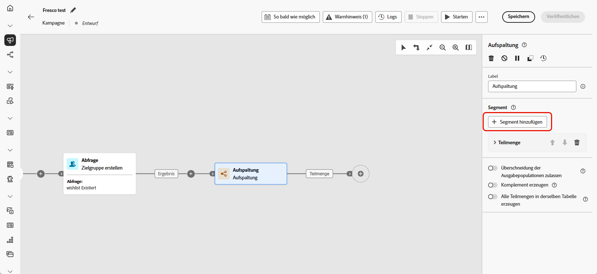

# Aufspaltung {#split}

>[!CONTEXTUALHELP]
>id="ajo_orchestration_split"
>title="Aktivität „Aufspaltung“"
>abstract="Mit der Aktivität **Aufspaltung** können eingehende Populationen basierend auf unterschiedlichen Auswahlkriterien in mehrere Teilmengen segmentiert werden, z. B. Filterregeln oder Populationsgröße."

+++ Inhaltsverzeichnis

| Willkommen bei orchestrierten Kampagnen | Starten der ersten orchestrierten Kampagne | Abfragen der Datenbank | Aktivitäten für orchestrierte Kampagnen |
|---|---|---|---|
| [Erste Schritte mit orchestrierten Kampagnen](../gs-orchestrated-campaigns.md)  Erstellen und Verwalten von relationalen Schemata und Datensätzen:  <ul><li>[Erste Schritte mit Schemata und Datensätzen](../gs-schemas.md)</li><li>[Manuelles Schema](../manual-schema.md)</li><li>[Datei-Upload-Schema](../file-upload-schema.md)</li><li>[Daten aufnehmen](../ingest-data.md)</li></ul>[Zugreifen auf und Verwalten von orchestrierten Kampagnen](../access-manage-orchestrated-campaigns.md) | [Wichtige Schritte zum Erstellen einer orchestrierten Kampagne](../gs-campaign-creation.md)  [Erstellen und Planen der Kampagne](../create-orchestrated-campaign.md)  [Orchestrieren von Aktivitäten](../orchestrate-activities.md)  [Starten und Überwachen der Kampagne](../start-monitor-campaigns.md)  [Reporting](../reporting-campaigns.md) | [Arbeiten mit dem Regel-Builder](../orchestrated-rule-builder.md)  [Erstellen der ersten Abfrage](../build-query.md)  [Bearbeiten von Ausdrücken](../edit-expressions.md)  [Retargeting](../retarget.md) | [Erste Schritte mit Aktivitäten](about-activities.md)  Aktivitäten: [Und-Verknüpfung](and-join.md) – [Zielgruppe erstellen](build-audience.md) – [Dimensionsänderung](change-dimension.md) – [Kanalaktivitäten](channels.md) – [Kombinieren](combine.md) – [Deduplizierung](deduplication.md) – [Anreicherung](enrichment.md) – [Verzweigung](fork.md) – [Abstimmung](reconciliation.md) – [Zielgruppe speichern](save-audience.md) – <b>[Aufspaltung](split.md)</b> – [Warten](wait.md) |

{style="table-layout:fixed"}

+++

 

>[!BEGINSHADEBOX]

 

Der Inhalt dieser Seite ist nicht endgültig und kann geändert werden.

>[!ENDSHADEBOX]

Die Aktivität **[!UICONTROL Aufspaltung]** ist eine **[!UICONTROL Targeting]**-Aktivität, mit der Sie die eingehende Population basierend auf definierten Auswahlkriterien in mehrere Teilmengen segmentieren können, z. B. basierend auf Filterregeln oder Populationsgröße.

## Konfigurieren der Aufspaltungsaktivität {#split-configuration}

>[!CONTEXTUALHELP]
>id="ajo_orchestration_split_segments"
>title="Segmente für die Aktivität „Aufspaltung“"
>abstract="Es können beliebig viele Teilmengen hinzugefügt werden, um die eingehende Population zu segmentieren.  Bei Ausführung der Aktivität **Aufspaltung** wird die Population sukzessive in unterschiedliche Teilmengen segmentiert, und zwar in der Reihenfolge, in der diese zur Aktivität hinzugefügt werden. Stellen Sie vor Beginn der orchestrierten Kampagne sicher, dass Sie die Teilmengen mithilfe der Pfeilschaltflächen in der Ihren Anforderungen entsprechenden Reihenfolge sortiert haben."

>[!CONTEXTUALHELP]
>id="ajo_orchestration_split_filter"
>title="Filter „Aufspaltungsaktivität“"
>abstract="Auf **[!UICONTROL Filter erstellen]** klicken und die gewünschte Filterregel mithilfe des Abfrage-Modelers konfigurieren, um eine Filterbedingung auf die Teilmenge anzuwenden. Es können beispielsweise Profile aus der eingehenden Population eingeschlossen werden, deren E-Mail-Adresse in der Datenbank vorhanden ist."

>[!CONTEXTUALHELP]
>id="ajo_orchestration_split_limit"
>title="Begrenzung der Aufspaltungsaktivität"
>abstract="Um die Anzahl der von der Teilmenge ausgewählten Profile zu begrenzen, muss **[!UICONTROL Grenzwert aktivieren]** aktiviert und die Anzahl oder der Prozentsatz der einzuschließenden Population angegeben werden."

>[!CONTEXTUALHELP]
>id="ajo_orchestration_split_sorting"
>title="Sortierung der Aufspaltungsaktivität"
>abstract="Beim Festlegen einer Populationsbegrenzung für eine Teilmenge können die ausgewählten Profile anhand eines bestimmten Profilattributs in auf- oder absteigender Reihenfolge sortiert werden. Dazu die Option **Sortierung aktivieren** einschalten. Teilmengen können z. B. so eingeschränkt werden, dass nur die 50 Top-Profile mit dem höchsten Einkaufsbetrag einbezogen werden."

>[!CONTEXTUALHELP]
>id="ajo_orchestration_split_complement"
>title="Aufspaltung – Komplement erzeugen"
>abstract="Nachdem Sie alle Teilmengen konfiguriert haben, kann die verbleibende Population ausgewählt werden, die keiner der Teilmengen entspricht, und in eine zusätzliche ausgehende Transition eingeschlossen werden. Schalten Sie dazu die Option **Komplement erzeugen** ein."

>[!CONTEXTUALHELP]
>id="ajo_orchestration_split_generatesubsets"
>title="Alle Teilmengen in derselben Tabelle erzeugen"
>abstract="Diese Option aktivieren, um alle Teilmengen in einer Ausgabetransition zusammenzufassen."

>[!CONTEXTUALHELP]
>id="ajo_orchestration_split_emptytransition"
>title="Leere Transition überspringen"
>abstract="Die Option **[!UICONTROL Leere Transition überspringen]** aktivieren, um die ausgehende Transition für diese Teilmenge zu deaktivieren, wenn die Eingangspopulation leer ist."

>[!CONTEXTUALHELP]
>id="ajo_orchestration_split_enable_overlapping"
>title="Überschneidung der Ausgabepopulationen zulassen"
>abstract=" Die Option **[!UICONTROL Überschneidung der Ausgabepopulationen zulassen]** ermöglicht den Umgang mit Profilen, die in mehreren Teilmengen enthalten sind. Wenn das Kästchen nicht aktiviert ist, stellt die Aufspaltungsaktivität sicher, dass eine Empfängerin oder ein Empfänger nicht in mehreren Ausgangstransitionen vorhanden sein kann, selbst wenn sie bzw. er die Kriterien mehrerer Teilmengen erfüllt. Sie bzw. er befindet sich in der Zielgruppe der ersten Registerkarte mit entsprechenden Kriterien. Wenn das Kästchen aktiviert ist, können die Empfangenden in mehreren Teilmengen gefunden werden, falls sie ihren Filterkriterien entsprechen."

Folgen Sie diesen Schritten, um die Aktivität **[!UICONTROL Aufspaltung]** zu konfigurieren:

1. Fügen Sie **[!UICONTROL orchestrierten Kampagne]** Aktivität „Aufspaltung“ hinzu.

1. Der Konfigurationsbereich für die Aktivität wird mit einer standardmäßigen Teilmenge geöffnet. Klicken Sie auf die Schaltfläche **[!UICONTROL Segment hinzufügen]**, um so viele Teilmengen wie gewünscht zum Segmentieren der eingehenden Population hinzuzufügen.

   

   >[!IMPORTANT]
   >
   >Die Aktivität **Aufspaltung** verarbeitet Teilmengen in der Reihenfolge, in der sie hinzugefügt werden. Wenn beispielsweise die erste Teilmenge 70 % der Population erfasst, wendet die nächste Teilmenge ihre Kriterien auf die verbleibenden 30 % an.
   >
   >Stellen Sie vor der Ausführung der orchestrierten Kampagne sicher, dass die Teilmengen wie vorgesehen sortiert sind. Verwenden Sie die Pfeiltasten, um ihre Position anzupassen.

1. Sobald die Teilmengen hinzugefügt wurden, zeigt die Aktivität für jede Teilmenge eine ausgehende Transition. Es wird dringend empfohlen, die Beschriftung jeder Teilmenge zu ändern, um sie auf der Arbeitsfläche für orchestrierte Kampagnen leicht identifizieren zu können.

1. Konfigurieren Sie Filter für jede Teilmenge:

   1. Klicken Sie auf eine Teilmenge, um deren Einstellungen zu öffnen.

   1. Klicken Sie auf **[!UICONTROL Filter erstellen]**, um Filterregeln mithilfe des Abfrage-Modelers zu definieren, beispielsweise die Auswahl von Profilen mit einer gültigen E-Mail-Adresse.

      

   1. Um die Anzahl der ausgewählten Profile zu begrenzen, aktivieren Sie **[!UICONTROL Grenzwert aktivieren]** und geben Sie eine Zahl oder einen Prozentsatz an.

   1. Um eine Transition zu überspringen, wenn die Teilmenge leer ist, aktivieren Sie **[!UICONTROL Leere Transition überspringen].**

1. Um Profile einzuschließen, die keiner Teilmenge entsprechen, aktivieren Sie **[!UICONTROL Komplement erzeugen]**. Dadurch wird eine zusätzliche ausgehende Transition für die verbleibende Population erstellt.

   >[!NOTE]
   >
   >Aktivieren Sie **[!UICONTROL Alle Teilmengen in derselben Tabelle erzeugen]**, um alle Teilmengen in einer einzelnen Transition zu gruppieren.

1. Verwenden Sie **[!UICONTROL Überschneidung der Ausgabepopulationen zulassen]** damit Profile in mehreren Teilmengen angezeigt werden können:

   * **Wenn diese Option deaktiviert ist**, wird jedes Profil nur der ersten Teilmenge zugewiesen, deren Kriterien es entspricht, selbst wenn es für andere Teilmengen qualifiziert ist.

   * **Wenn diese Option aktiviert ist**, können Profile in mehrere Teilmengen eingeschlossen werden, wenn sie die jeweiligen Kriterien erfüllen.

Der Aktivität ist jetzt konfiguriert. Bei der orchestrierten Kampagnenausführung wird die Population in der Reihenfolge in die verschiedenen Untergruppen segmentiert, in der sie der Aktivität hinzugefügt wurden.

## Beispiel{#split-example}

Im folgenden Beispiel wird die Aktivität **[!UICONTROL Aufspaltung]** verwendet, um eine Zielgruppe basierend auf dem Kommunikationskanal, den wir verwenden möchten, in verschiedene Teilmengen zu unterteilen:

* **Teilmenge 1 „email“**: Schließt Profile ein, die eine Telefonnummer angegeben haben.

* **Teilmenge 2 „sms“**: Spricht Profile mit einer in der Datenbank gespeicherten Mobiltelefonnummer an.

* **Komplementtransition**: Erfasst alle verbleibenden Profile, die die Kriterien für keine der Teilmengen erfüllen.

