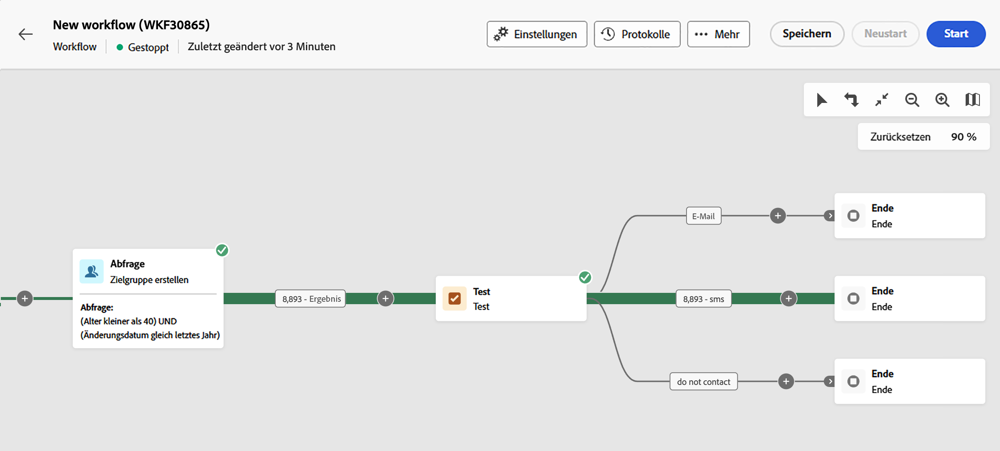

# Test {#test}

>[!CONTEXTUALHELP]
>id="ajo_orchestration_test"
>title="Testaktivität"
>abstract="Die Aktivität **Test** ist eine Aktivität zur **Flusskontrolle**. Sie ermöglicht die Aktivierung von Transitionen auf der Basis der angegebenen Bedingungen."

>[!CONTEXTUALHELP]
>id="ajo_orchestration_test_conditions"
>title="Bedingungen"
>abstract="Die Aktivität **Test** kann mehrere ausgehende Transitionen aufweisen. Während der Ausführung der orchestrierten Kampagne wird jede Bedingung nacheinander getestet, bis eine der Bedingungen erfüllt ist. Wenn keine der Bedingungen erfüllt ist, wird die orchestrierte Kampagne entlang des Pfads der **[!UICONTROL Standardbedingung]** fortgesetzt. Wenn keine Standardbedingung aktiviert ist, wird die orchestrierte Kampagne an dieser Stelle gestoppt."

Die Aktivität **[!UICONTROL Test]** ist eine Aktivität zur **[!UICONTROL Flusskontrolle]**. Verzweigen Sie Ihren Kampagnenfluss, indem Sie je nach den von Ihnen definierten Bedingungen verschiedene Transitionen aktivieren. Jede Bedingung kann Daten aus der eingehenden Transition auswerten, und Sie können festlegen, welche Transition zuerst ausgeführt werden soll, und zwar in der Reihenfolge, in der die Bedingungen ausgewertet werden.

## Konfigurieren der Aktivität „Test“ {#test-configuration}

So richten Sie die Aktivität **[!UICONTROL Test]** ein:

1. Ziehen Sie eine **[!UICONTROL Test]**-Aktivität in die Arbeitsfläche Ihrer orchestrierten Kampagne.

1. Standardmäßig stellt die Aktivität einen einzelnen booleschen Test bereit: Wenn die Bedingung „True“ erfüllt ist, wird diese Transition aktiviert. Andernfalls wird die Transition „False“ (Standard) aktiviert.

   

1. Definieren Sie die Bedingung für eine Transition, indem Sie die folgenden Felder ausfüllen:

   * **label**: Ein Name für die Transition, der auf der Arbeitsfläche erkennbar ist.

   * **Bedingungstyp**: Die standardmäßig auszuwertenden Daten zur Populationsanzahl.

   * **Operator**: Der anzuwendende Vergleich, z. B. gleich, größer als, kleiner als. Die Liste der Operatoren hängt vom Datentyp des Bedingungstyps ab.

   * **value**: Der Wert, mit dem der Bedingungstyp verglichen werden soll.

   

1. Um nach mehr als zwei Ergebnissen zu verzweigen, klicken Sie auf **[!UICONTROL Bedingung hinzufügen]** und definieren Sie einen Titel und eine Bedingung für jede zusätzliche Transition.

1. Zur Laufzeit bewertet die Kampagne die Bedingungen der Reihe nach und folgt der ersten, die übereinstimmt. Wenn keine Bedingung zutrifft, folgt die Ausführung **[!UICONTROL Standardbedingung]** wenn eine festgelegt ist. Andernfalls stoppt die Kampagne bei der Aktivität **[!UICONTROL Test]**.

## Beispiel {#example}

In diesem Beispiel werden verschiedene Transitionen basierend auf der Anzahl der Profile aktiviert, die von einer Aktivität vom Typ „Zielgruppe **[!UICONTROL &quot; angesprochen]**. Bedingungen werden der Reihe nach ausgewertet. Der letzte Übergang ist die Standardeinstellung und wird verwendet, wenn keine vorherige Bedingung zutrifft.

* Bei mehr als 10.000 ausgewählten Profilen wird eine E-Mail-Nachricht gesendet.
* Standard (keine Bedingung erfüllt): Wenn die Anzahl 10.000 oder weniger beträgt, wird die Population an eine Transition des Typs „Nicht kontaktieren“ weitergeleitet.

