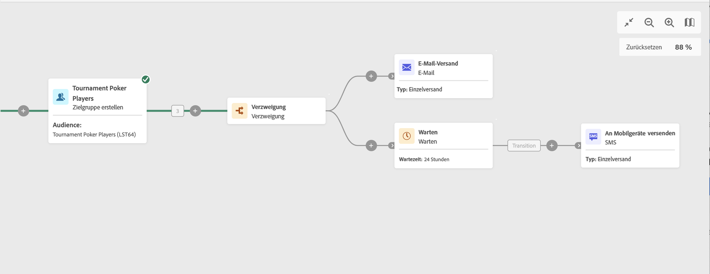

# Warten {#wait}

>[!CONTEXTUALHELP]
>id="ajo_orchestration_wait"
>title="Aktivität „Warten“"
>abstract="Die Aktivität **Warten** wird verwendet, um die Transition von einer Aktivität zu einer anderen zu verzögern."

+++ Inhaltsverzeichnis

| Willkommen bei koordinierten Kampagnen | Starten der ersten orchestrierten Kampagne | Abfragen der Datenbank | Orchestrierte Kampagnenaktivitäten |
|---|---|---|---|
| [Erste Schritte mit orchestrierten Kampagnen](../gs-orchestrated-campaigns.md)  [Konfigurationsschritte](../configuration-steps.md)  [Schlüsselschritte für die orchestrierte Kampagnenerstellung](../gs-campaign-creation.md) | [Orchestrierte Kampagne erstellen](../create-orchestrated-campaign.md)  [Aktivitäten orchestrieren](../orchestrate-activities.md)  [ Nachrichten mit orchestrierten Kampagnen senden](../send-messages.md)  [Kampagne starten und überwachen](../start-monitor-campaigns.md)  [Reporting](../reporting-campaigns.md) | [Arbeiten mit der Abfrage Modeler](../orchestrated-query-modeler.md)  [Erstellen Sie Ihre ersten ](../build-query.md)  [-Bearbeitungsausdrücke](../edit-expressions.md) | [Erste Schritte mit Aktivitäten](about-activities.md)  Aktivitäten: [Und-Verknüpfung](and-join.md) - [Zielgruppe aufbauen](build-audience.md) - [Dimensionsänderung](change-dimension.md) - [Kombinieren](combine.md) - [Deduplizierung](enrichment.md) - [Verzweigung](fork.md) - [Abstimmung](reconciliation.md) - [Aufspaltung](split.md) Warten](deduplication.md) [ |

{style="table-layout:fixed"}

+++

  

Die Aktivität **Warten** ist eine Aktivität zur **Flusskontrolle**. Sie wird verwendet, um einen bestimmten Zeitraum zwischen der Ausführung zweier Aktivitäten zu definieren. Beispielsweise kann man mehrere Tage nach einer E-Mail-Versandaktivität warten, dann die während dieses Zeitraums erfolgten Öffnungen und Klicks analysieren, bevor man weitere Verarbeitungsschritte (Erinnerungs-E-Mail, Zielgruppenerstellung etc.) unternimmt.

## Konfiguration{#wait-configuration}

Gehen Sie folgendermaßen vor, um die Aktivität **Warten** zu konfigurieren:

1. Fügen Sie **orchestrierten Kampagne** Aktivität „Warten“ hinzu.

1. Geben Sie die **Dauer** der Wartezeit zwischen den eingehenden und ausgehenden Transitionen an.

1. Wählen Sie die Zeiteinheit im Feld **Zeiträume** aus: Sekunden, Minuten, Stunden, Tage.

## Beispiel{#wait-example}

Das folgende Beispiel erläutert die Aktivität **Warten** anhand eines typischen Fallbeispiels. Darin wird eine E-Mail mit einer Einladung zu einem Event verschickt. 24 Stunden nach dem Versand wird ein SMS-Versand an dieselbe Population gesendet.

