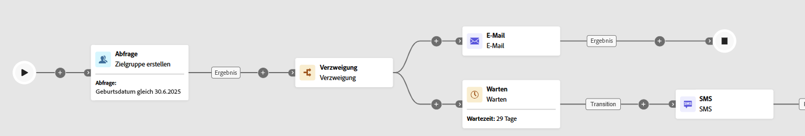

# Warten {#wait}

>[!CONTEXTUALHELP]
>id="ajo_orchestration_wait"
>title="Aktivität „Warten“"
>abstract="Die Aktivität **Warten** wird verwendet, um die Transition von einer Aktivität zu einer anderen zu verzögern."

+++ Inhaltsverzeichnis

| Willkommen bei koordinierten Kampagnen | Starten der ersten orchestrierten Kampagne | Abfragen der Datenbank | Orchestrierte Kampagnenaktivitäten |
|---|---|---|---|
| [Erste Schritte mit orchestrierten Kampagnen](../gs-orchestrated-campaigns.md)  [Konfigurationsschritte](../configuration-steps.md)  [Schlüsselschritte für die orchestrierte Kampagnenerstellung](../gs-campaign-creation.md) | [Orchestrierte Kampagne erstellen](../create-orchestrated-campaign.md)  [Aktivitäten orchestrieren](../orchestrate-activities.md)  [ Nachrichten mit orchestrierten Kampagnen senden](../send-messages.md)  [Kampagne starten und überwachen](../start-monitor-campaigns.md)  [Reporting](../reporting-campaigns.md) | [Arbeiten mit der Abfrage Modeler](../orchestrated-query-modeler.md)  [Erstellen Sie Ihre ersten ](../build-query.md)  [-Bearbeitungsausdrücke](../edit-expressions.md) | [Erste Schritte mit Aktivitäten](about-activities.md)  Aktivitäten: [Und-Verknüpfung](and-join.md) - [Zielgruppe aufbauen](build-audience.md) - [Dimensionsänderung](change-dimension.md) - [Kombinieren](combine.md) - [Deduplizierung](enrichment.md) - [Verzweigung](fork.md) - [Abstimmung](reconciliation.md) - [Aufspaltung](split.md) [&#128279;](wait.md) Warten[&#128279;](deduplication.md)  |

{style="table-layout:fixed"}

+++

 

Die **Warten**-Aktivität ist eine **Fluss-Kontrolle**-Komponente, die verwendet wird, um in einer orchestrierten Kampagne eine Verzögerung zwischen zwei Aktivitäten einzuführen. Dadurch können Sie sicherstellen, dass Ihre Folgeaktivitäten zeitlich besser abgestimmt und für die Benutzerinteraktion relevanter sind.

Sie können beispielsweise einige Tage nach einem E-Mail-Versand warten, um Öffnungen und Klicks zu verfolgen, bevor Sie eine Folgenachricht senden.

## Konfiguration{#wait-configuration}

Gehen Sie folgendermaßen vor, um die Aktivität **Warten** zu konfigurieren:

1. Fügen Sie **orchestrierten Kampagne** Aktivität „Warten“ hinzu.

1. Wählen Sie den Wartetyp aus, der Ihren Anforderungen am besten entspricht:

   * **Dauer**: Geben Sie eine Verzögerung in Sekunden, Minuten, Stunden oder Tagen an, bevor Sie mit der nächsten Aktivität fortfahren.

   * **Feste Zeit**: Legen Sie ein bestimmtes Datum und eine bestimmte Uhrzeit fest, nach denen die nächste Aktivität beginnt.

   

## Beispiel{#wait-example}

Das folgende Beispiel veranschaulicht die **Warten**-Aktivität in einem typischen Anwendungsfall.  An Profile, die Geburtstag feiern, wird eine E-Mail mit einem Promo-Code gesendet. Nach 29 Tagen wird eine SMS an dieselbe Gruppe gesendet, um sie daran zu erinnern, dass ihr Geburtstags-Promo-Code bald abläuft.

