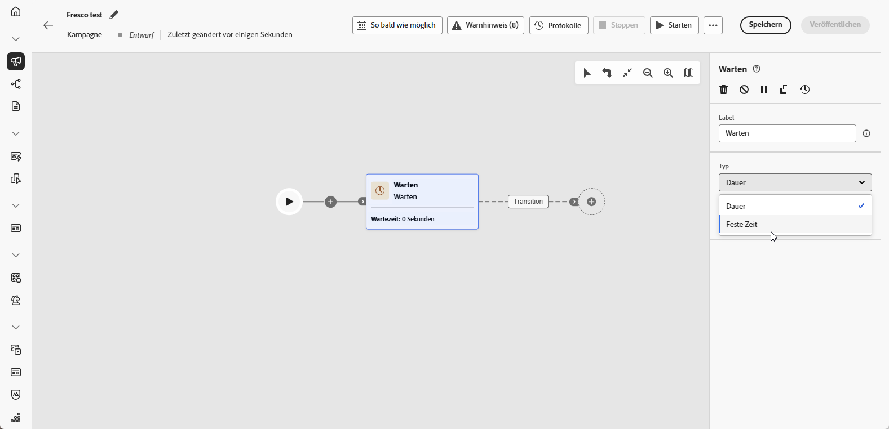

# Warten {#wait}

>[!CONTEXTUALHELP]
>id="ajo_orchestration_wait"
>title="Aktivität „Warten“"
>abstract="Die Aktivität **Warten** wird verwendet, um die Transition von einer Aktivität zu einer anderen zu verzögern."

Die Aktivität **[!UICONTROL Warten]** ist eine Komponente zur **[!UICONTROL Flusskontrolle]**, die verwendet wird, um in einer orchestrierten Kampagne eine Verzögerung zwischen zwei Aktivitäten einzuführen. Dadurch können Sie sicherstellen, dass Ihre Folgeaktivitäten zeitlich besser abgestimmt und relevanter für die Benutzerinteraktion sind.

Sie können beispielsweise einige Tage nach einem E-Mail-Versand warten, um Öffnungen und Klicks zu verfolgen, bevor Sie eine Folgenachricht senden.

## Konfiguration{#wait-configuration}

>[!IMPORTANT]
>
>Daten in temporären Tabellen bleiben nicht länger als **5 Tage** bestehen. Wenn Sie **[!UICONTROL Dauer]** oder **[!UICONTROL Feste Zeit]** verwenden, stellen Sie sicher, dass die verstrichene Zeit bis zum Abschluss der nächsten Aktivität innerhalb dieses Limits liegt, damit Zwischendaten verfügbar bleiben.

Gehen Sie folgendermaßen vor, um die Aktivität **[!UICONTROL Warten]** zu konfigurieren:

1. Fügen Sie Ihrer orchestrierten Kampagne eine Aktivität des Typs **[!UICONTROL Warten]** hinzu.

1. Wählen Sie den Wartetyp aus, der am besten Ihren Anforderungen entspricht:

   * **[!UICONTROL Dauer]**: Geben Sie die Verzögerung bis zum Fortfahren mit der nächsten Aktivität in Sekunden, Minuten, Stunden oder Tagen an.

   * **[!UICONTROL Feste Zeit]**: Legen Sie ein bestimmtes Datum und eine bestimmte Uhrzeit fest, an denen die nächste Aktivität beginnt.

   

## Beispiel{#wait-example}

Das folgende Beispiel erläutert die Aktivität **[!UICONTROL Warten]** anhand eines typischen Fallbeispiels.  An Profile, die Geburtstag feiern, wird eine E-Mail mit einem Gutschein-Code gesendet. Nach 2 Tagen wird eine SMS an dieselbe Gruppe gesendet, um sie daran zu erinnern, dass ihr Gutschein-Code für ihren Geburtstag bald abläuft.

