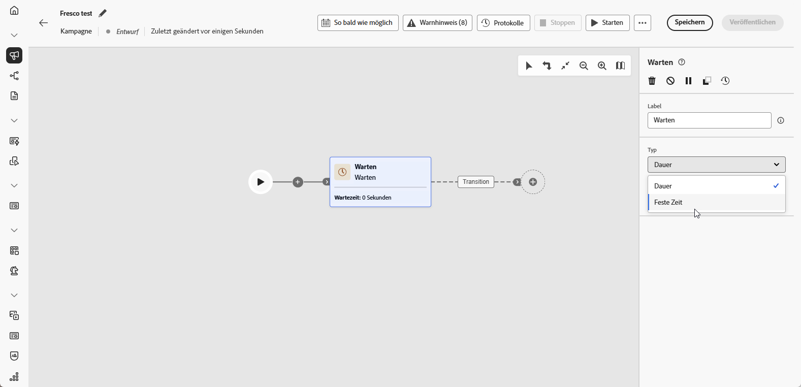

# Warten {#wait}

>[!CONTEXTUALHELP]
>id="ajo_orchestration_wait"
>title="Aktivität „Warten“"
>abstract="Die Aktivität **Warten** wird verwendet, um die Transition von einer Aktivität zu einer anderen zu verzögern."

+++ Inhaltsverzeichnis

| Willkommen bei koordinierten Kampagnen | Starten Ihrer ersten orchestrierten Kampagne | Abfragen der Datenbank | Aktivitäten für orchestrierte Kampagnen |
|---|---|---|---|
| [Erste Schritte mit orchestrierten Kampagnen](gs-orchestrated-campaigns.md)  [Konfigurationsschritte](configuration-steps.md)  [Zugreifen auf und Verwalten von orchestrierten Kampagnen](access-manage-orchestrated-campaigns.md) | [Wichtige Schritte für die orchestrierte Kampagnenerstellung](gs-campaign-creation.md)  [Erstellen und Planen der Kampagne](create-orchestrated-campaign.md)  [Orchestrieren von Aktivitäten](orchestrate-activities.md)  <b>[Starten und Überwachen der Kampagne](start-monitor-campaigns.md)</b>  [Reporting](reporting-campaigns.md) | [Arbeiten mit dem Regel-Builder](orchestrated-rule-builder.md)  [Erstellen der ersten Abfrage](build-query.md)  [Ausdrücke bearbeiten](edit-expressions.md)  [Retargeting](retarget.md) | [Erste Schritte mit Aktivitäten](activities/about-activities.md)  Aktivitäten: [Und-Verknüpfung](activities/and-join.md) - [Zielgruppe aufbauen](activities/build-audience.md) - [Dimension ändern](activities/change-dimension.md) - [Kanalaktivitäten](activities/channels.md) - [Kombinieren](activities/combine.md) - [Anreicherung](activities/deduplication.md) - [Formulare](activities/enrichment.md) - [Abstimmung](activities/fork.md) [&#128279;](activities/reconciliation.md) [&#128279;](save-audience.md) [&#128279;](activities/split.md) ->Zielgruppe speichern[ -AufspaltungWarten](activities/wait.md) |

{style="table-layout:fixed"}

+++

 

Die **[!UICONTROL Warten]**-Aktivität ist eine **[!UICONTROL Fluss-Kontrolle]**-Komponente, die verwendet wird, um in einer orchestrierten Kampagne eine Verzögerung zwischen zwei Aktivitäten einzuführen. Dadurch können Sie sicherstellen, dass Ihre Folgeaktivitäten zeitlich besser abgestimmt und für die Benutzerinteraktion relevanter sind.

Sie können beispielsweise einige Tage nach einem E-Mail-Versand warten, um Öffnungen und Klicks zu verfolgen, bevor Sie eine Folgenachricht senden.

## Konfiguration{#wait-configuration}

Gehen Sie folgendermaßen vor, um die Aktivität **[!UICONTROL Warten]** zu konfigurieren:

1. Fügen Sie **[!UICONTROL orchestrierten Kampagne]** Aktivität „Warten“ hinzu.

1. Wählen Sie den Wartetyp aus, der Ihren Anforderungen am besten entspricht:

   * **[!UICONTROL Dauer]**: Geben Sie eine Verzögerung in Sekunden, Minuten, Stunden oder Tagen an, bevor Sie mit der nächsten Aktivität fortfahren.

   * **[!UICONTROL Feste Zeit]**: Legen Sie ein bestimmtes Datum und eine bestimmte Uhrzeit fest, nach denen die nächste Aktivität beginnt.

   

## Beispiel{#wait-example}

Das folgende Beispiel veranschaulicht die **[!UICONTROL Warten]**-Aktivität in einem typischen Anwendungsfall.  An Profile, die Geburtstag feiern, wird eine E-Mail mit einem Promo-Code gesendet. Nach 29 Tagen wird eine SMS an dieselbe Gruppe gesendet, um sie daran zu erinnern, dass ihr Geburtstags-Promo-Code bald abläuft.

