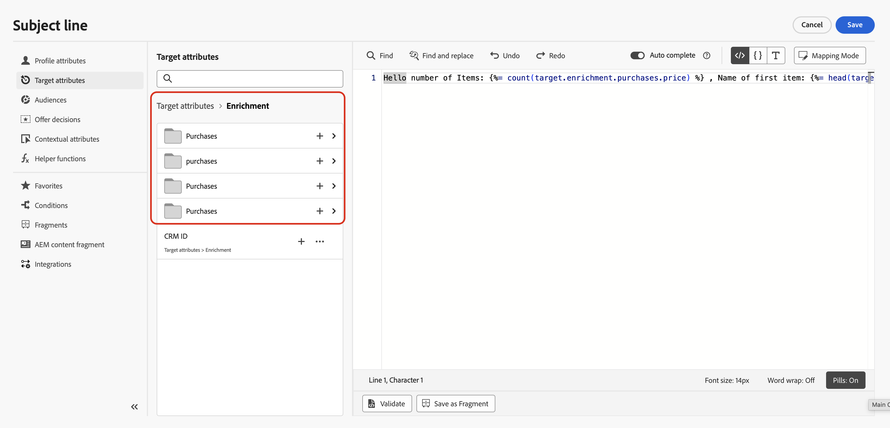

# Hinzufügen von Personalisierung in koordinierten Kampagnen {#add-personalization}

Nachdem Sie [Aktivitäten koordinieren](orchestrate-activities.md) auf der Arbeitsfläche ausgewählt und eine Kanalaktivität hinzugefügt haben, können Sie den Nachrichteninhalt in der E-Mail, SMS oder einem anderen Kanaleditor personalisieren.

Personalization in orchestrierten Kampagnen funktioniert ähnlich wie andere [!DNL Journey Optimizer] Kampagnen oder Journey-Kampagnen, mit Unterschieden in Bezug auf die **Arbeitstabelle**: Attribute, die durch Zielgruppenbestimmungs- und Anreicherungsaktivitäten auf der Arbeitsfläche berechnet werden, nicht nur Daten aus dem Profilspeicher.

## Zugriff auf den Personalisierungseditor {#access}

1. Öffnen Sie die orchestrierte Kampagne und fügen Sie eine Kanalaktivität hinzu. [Erfahren Sie, wie Sie eine Kanalaktivität hinzufügen](activities/channels.md#add)

1. Konfigurieren Sie die Kanalaktivität, öffnen Sie dann die Registerkarte **[!UICONTROL Inhalt]** und bearbeiten Sie die Nachricht.

1. Verwenden Sie im Nachrichteneditor den Personalisierungseditor, um Attribute in den Inhalt einzufügen.

Informationen zum Anzeigen einer Vorschau und Testen personalisierter Inhalte aus der Kanalaktivität finden Sie unter [Überprüfen und Testen von Inhalten](activities/channels.md#simulate-content-test-profiles).

## Profil- und Zielattribute {#attributes}

Beim Öffnen des Personalisierungseditors enthalten zwei Hauptordner Attribute, die für die Personalisierung verfügbar sind:

* **[!UICONTROL Profilattribute]**

  Profilbezogene Daten von [!DNL Adobe Experience Platform]: Name, E-Mail-Adresse, Ort und andere im Benutzerprofil erfasste Eigenschaften.

* **[!UICONTROL Zielattribute]** (nur orchestrierte Kampagnen)

  Auf der Kampagnen-Arbeitsfläche berechnete Attribute aus der Arbeitstabelle. Dieser Ordner enthält zwei Unterordner:

   * **`<Targeting dimension>`** (z. B. Empfänger oder Käufe) - Attribute, die sich auf die in der Kampagne ausgewählte Dimension beziehen.

   * **`Enrichment`** — Daten, die durch **[!UICONTROL Anreicherung]**-Aktivitäten hinzugefügt werden (relationale Links, erfasste Zeilen, Aggregate). Nach einer Anreicherung :N1 **[!UICONTROL Daten erfassen]** erhalten Sie sowohl nummerierte Zeilen als auch ein Sammlungs-Array. [Erfahren Sie, wie Sie mit Anreicherungserfassungsdaten arbeiten](#enrichment-collections)

Einen detaillierten Überblick über den Personalisierungseditor in [!DNL Journey Optimizer] finden Sie unter [Erste Schritte mit der Personalisierung](../personalization/personalize.md).

## Arbeiten mit Anreicherungserfassungsdaten {#enrichment-collections}

Wenn Sie eine Aktivität vom Typ **[!UICONTROL Anreicherung]** mit einer 1:N-Verknüpfung und **[!UICONTROL Daten erfassen]** konfigurieren, sind Anreicherungsattribute unter **[!UICONTROL Zielattribute] > [!UICONTROL Anreicherung]** in zwei Formen verfügbar:

* **Reduzierte Zeilen** - Ein Feld pro abgerufener Zeile (z. B. **Kauf 1**, **Kauf 2**, **Kauf 3**), jeweils mit den Attributen, die Sie für den Link ausgewählt haben (z. B. Preis oder Produkt). Verwenden Sie diese, wenn Sie separate, feste Steckplätze benötigen, z. B. `target.enrichment.purchase1.price`.

* **Sammlungs-Array** - Ein Array für alle gesammelten Zeilen, benannt aus der Link-Bezeichnung (z. B. **purchases**). Verwenden Sie diese Option, wenn Sie mit allen Datensätzen arbeiten müssen - mit [Array-Funktionen](#array-functions).



Um die reduzierten Zeilen aus dem Sammlungs-Array zu identifizieren, fügen Sie das Attribut in den Ausdruckseditor ein und lesen Sie den generierten Pfad. Das Sammlungs-Array ist der Eintrag, dessen Pfad **plural** lautet (z. B. `purchases`) und **keine Zeilennummer** hat (`purchase1`, `purchase2` usw.).

| Was Sie benötigen | Pfad im Ausdruckseditor |
| --- | --- |
| **Eine abgerufene Zeile** | **Nummeriert** — z. B. `target.enrichment.purchase1.price` |
| **Die vollständige Sammlung** | **Plural und unnummeriert** — z. B. `target.enrichment.purchases.price` |

Sie können dieselben Funktionen [Array und List](../personalization/functions/arrays-list.md), die an anderer Stelle in [!DNL Journey Optimizer] verwendet werden, auf eine Anreicherungssammlung anwenden und auf `target.enrichment.<label>` verweisen.

Beispiel: In einer Betreffzeile können Sie anzeigen, wie viele abgerufene Käufe vorhanden sind und wie hoch der Preis des ersten Artikels ist:

```sql
Hello number of Items:  , Name of first item: 
```

➡️ [Erfahren Sie, wie Sie die Anreicherung von Sammlungen auf der Arbeitsfläche konfigurieren](activities/enrichment.md#collection-personalization)
