# Erstellen Ihrer ersten Regel {#build-query}

Die Hauptschritte zur Erstellung von Regeln für Ihre orchestrierten Kampagnen lauten wie folgt:

1. **Hinzufügen von Bedingungen**: Erstellen Sie benutzerdefinierte Bedingungen zum Filtern Ihrer Abfrage, indem Sie Ihre eigene Bedingung mit Attributen aus der Datenbank und erweiterten Ausdrücken erstellen.
1. **Kombinieren von Bedingungen**: Ordnen Sie Bedingungen mithilfe von Gruppen und logischen Operatoren auf der Arbeitsfläche an.
1. **Überprüfen und Validieren der Regel**: Überprüfen Sie die resultierenden Daten Ihrer Regel, bevor Sie sie speichern.

## Hinzufügen einer Bedingung {#conditions}

>[!CONTEXTUALHELP]
>id="ajo_orchestration_querymodeler_customcondition"
>title="Benutzerdefinierte Bedingung"
>abstract="Bei benutzerdefinierten Bedingungen handelt es sich um Filterkomponenten zum Filtern einer Abfrage, mit der Sie Ihre eigene Bedingung mit Attributen aus der Datenbank und erweiterten Ausdrücken erstellen."

Gehen Sie wie folgt vor, um Ihrer Abfrage Bedingungen hinzuzufügen:

1. Greifen Sie über die Aktivität **[!UICONTROL Zielgruppe erstellen]** auf den Regel-Builder zu.

1. Klicken Sie auf die Schaltfläche **Bedingung hinzufügen**, um eine erste Bedingung für Ihre Abfrage zu erstellen.

   Sie können Ihre Abfrage auch mit einem vordefinierten Filter starten. Klicken Sie dazu auf die Schaltfläche **[!UICONTROL Filter auswählen oder speichern]** und wählen Sie **[!UICONTROL Vordefinierten Filter auswählen]**. Weitere Informationen finden Sie unter [Arbeiten mit vordefinierten Filtern](predefined-filters.md).

   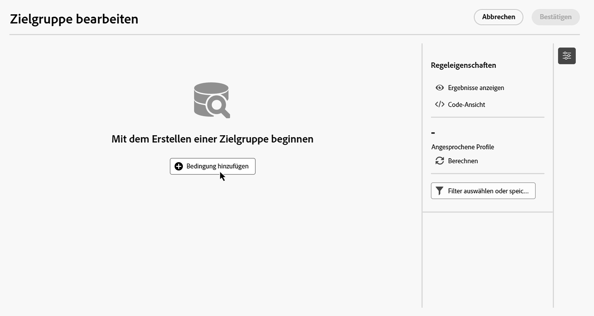

1. Identifizieren Sie das Attribut aus der Datenbank, das als Kriterium für Ihre Bedingung verwendet werden soll. Das Symbol „i“ neben einem Attribut gibt Auskunft über die Tabelle, in der das Attribut gespeichert ist, sowie über seinen Datentyp.

   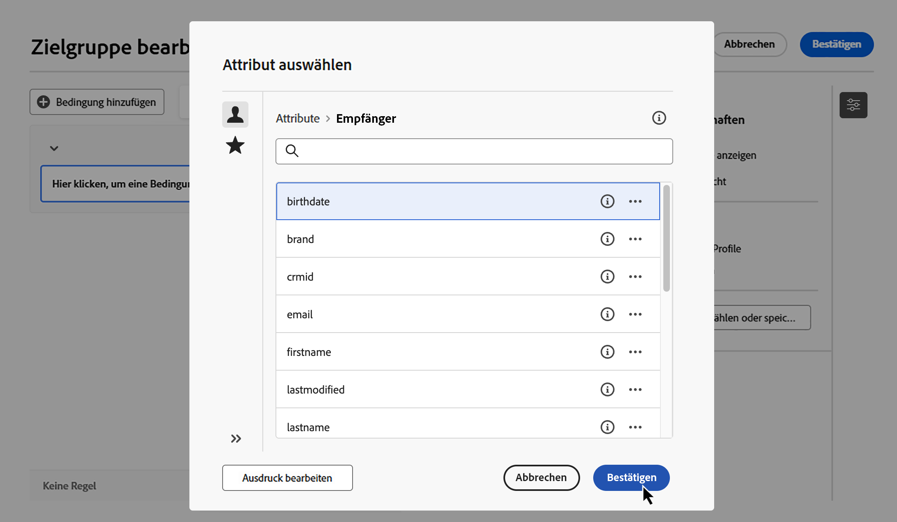

   >[!NOTE]
   >
   >Über die Schaltfläche **Ausdruck bearbeiten** können Sie den Ausdruckseditor starten, um einen Ausdruck manuell mithilfe von Feldern aus der Datenbank und Hilfsfunktionen zu definieren. [Erfahren Sie, wie Sie Ausdrücke bearbeiten](../orchestrated/edit-expressions.md)

1. Klicken Sie auf die Schaltfläche  neben einem Attribut, um auf folgende zusätzliche Optionen zuzugreifen:

   +++ Werteverteilung

   Durch die Werteverteilung können Sie erkennen, wie Werte in der Datenbank verwendet werden. Dies ist hilfreich, um die verfügbaren Werte, ihre Anzahl und Prozentsätze zu verstehen. Außerdem lassen sich Probleme wie inkonsistente Groß- und Kleinschreibung oder Schreibweisen beim Erstellen von Abfragen oder Ausdrücken vermeiden.

   Bei Attributen mit einer großen Anzahl von Werten zeigt das Tool nur die ersten zwanzig an. In solchen Fällen wird die Benachrichtigung **[!UICONTROL Teilweise geladen]** angezeigt, um auf diese Einschränkung hinzuweisen. Sie können erweiterte Filter anwenden, um die angezeigten Ergebnisse einzugrenzen und sich auf bestimmte Werte oder Teilmengen von Daten zu konzentrieren. 

   Um Ihre Bedingung schneller zu erstellen, wählen Sie einen Wert aus und klicken Sie auf **[!UICONTROL Attribut und Wert auswählen]**, um das Attribut und den Wert in der aktuellen Bedingung zu füllen.

   Sie können einen Wert auch mithilfe des Symbols  Zwischenablage kopieren, um ihn beispielsweise in den Ausdruckseditor einzufügen.

   

   +++

   +++ Zu Favoriten hinzufügen

   Durch das Hinzufügen von Attributen zum Favoritenmenü erhalten Sie schnellen Zugriff auf die am häufigsten verwendeten Attribute. Sie können bis zu 20 Attribute zu den Favoriten hinzufügen. Allen Benutzenden in einer Organisation werden bevorzugte und zuletzt verwendete Attribute zugeordnet, um die Barrierefreiheit auf verschiedenen Computern und ein nahtloses Erlebnis auf allen Geräten sicherzustellen.

   Um auf die von Ihnen zu den Favoriten hinzugefügten Attribute zuzugreifen, verwenden Sie das Menü **[!UICONTROL Favoriten und zuletzt ausgewertet]**. Als Favoriten markierte Attribute werden zuerst angezeigt, gefolgt von den zuletzt verwendeten Attributen, sodass die benötigten Attribute leicht gefunden werden können. Um ein Attribut aus den Favoriten zu entfernen, klicken Sie erneut auf das Sternsymbol.

   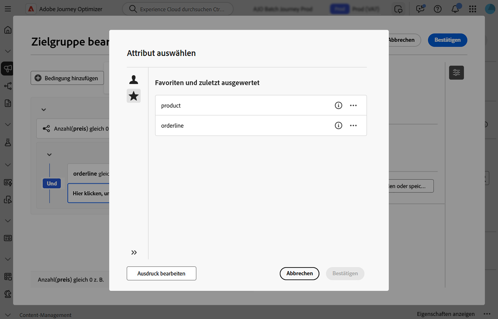

   +++

1. Klicken Sie auf **[!UICONTROL Bestätigen]**, um das ausgewählte Attribut zu Ihrer Bedingung hinzuzufügen.

1. Es wird ein Eigenschaftenbereich angezeigt, in dem Sie den gewünschten Wert für das Attribut konfigurieren können.

   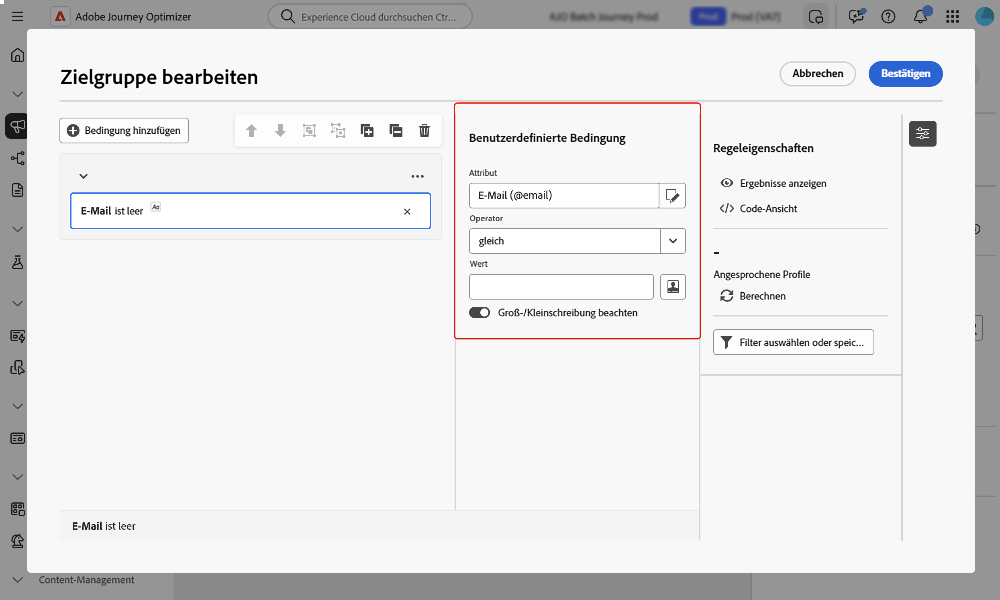

1. Wählen Sie in der Dropdown-Liste den anzuwendenden **[!UICONTROL Operator]** aus. Es stehen verschiedene Operatoren zur Verfügung. Die in der Dropdown-Liste verfügbaren Operatoren hängen vom Datentyp des Attributs ab.

   +++Liste der verfügbaren Operatoren

   | Operator | Zweck | Beispiel |
   |---|---|---|
   | Gleich | Die zurückgegebenen Daten stimmen vollständig mit dem in der zweiten Spalte angegebenen Wert überein. | „Nachname (@lastName) gleich ‚Müller‘“ gibt nur die Empfängerinnen und Empfänger mit dem Nachnamen „Müller“ unter Beachtung der genauen Schreibung aus. |
   | Ungleich | Die ausgegebenen Daten unterscheiden sich vom angegebenen Wert. | Sprache (@language) ungleich „Englisch“. |
   | Größer als | Die ausgegebenen Daten übersteigen den angegebenen Wert. | „Alter (@age) größer als 50“ gibt alle Werte von mehr als 50 Jahren aus (also „51“, „52“ usw.). |
   | Kleiner als | Der ausgegebene Wert unterschreitet den eingegebenen Wert. | „Erstellungsdatum (@created) kleiner als ‚DaysAgo(100)‘“ gibt alle Empfängerinnen und Empfänger aus, die vor weniger als 100 Tagen angelegt wurden. |
   | Größer oder gleich | Die ausgegebenen Daten sind identisch mit oder übersteigen den angegebenen Wert. | „Alter (@age) größer oder gleich ‚30‘“ gibt alle Empfängerinnen und Empfänger ab 30 Jahren aus. |
   | Kleiner oder gleich | Die ausgegebenen Daten sind identisch mit oder unterschreiten den angegebenen Wert. | „Alter (@age) kleiner oder gleich ‚60‘“ gibt alle Empfängerinnen und Empfänger bis 60 Jahren aus. |
   | Eingeschlossen in | Die ausgegebenen Daten sind in den angegebenen Werten enthalten. Die Werte müssen durch Kommata getrennt werden. | „Geburtsdatum (@birthDate) ist enthalten in ‚10.12.1979,10.12.1984‘“ gibt die Empfängerinnen und Empfänger aus, die zwischen diesen beiden Daten geboren wurden. |
   | Nicht enthalten | Negative Form des Operators „ist enthalten in“. Hier werden Empfängerinnen und Empfänger anhand der eingegebenen Werte ausgeschlossen. | Das Geburtsdatum (@birthDate) ist nicht in &#39;12/10/1979,12/10/1984&#39; enthalten. Empfängerinnen und Empfänger, die innerhalb dieses Datumsbereichs geboren wurden, werden nicht ausgegeben. |
   | Ist leer | Die ausgegebenen Daten stimmen mit einem leeren Wert in der zweiten Spalte überein. | „Mobiltelefon (@mobilePhone) ist leer“ gibt alle Empfängerinnen und Empfänger zurück, die keine Mobiltelefonnummer haben. |
   | Ist nicht leer | Negative Form des Operators „Ist leer“. Es ist nicht nötig, Daten in die zweite Wert-Spalte einzugeben. | E-Mail (@email) ist nicht leer. |
   | Beginnt mit | Die ausgegebenen Daten beginnen mit dem angegebenen Wert. | Kundennummer (@account) beginnt mit &#39;32010&#39;. |
   | Beginnt nicht mit | Die ausgegebenen Daten beginnen nicht mit dem angegebenen Wert. | Kundennummer (@account) beginnt nicht mit „20“. |
   | Enthält | Die ausgegebenen Daten enthalten den angegebenen Wert. | „E-Mail-Domain (@domain) enthält ‚mail‘“ gibt nur Domain-Namen aus, die den Wert „mail“, z. B. „gmail.com“, enthalten. |
   | Enthält nicht | Die ausgegebenen Daten enthalten den angegebenen Wert nicht. | E-Mail-Domain (@domain) enthält nicht „vo“. Domain-Namen, die „vo“ enthalten, z. B. „voila.fr“, werden nicht in den Ergebnissen angezeigt. |
   | Ist wie | Dieser Operator ähnelt „Enthält“ und erlaubt das Einfügen des Platzhalters „%“ im Wert. | Nachname (@lastName) ist wie &#39;Me%er&#39;. Das Platzhalterzeichen dient als „Joker“, um Namen wie „Meier“ zu finden. |
   | Ist nicht wie | Dieser Operator ähnelt „Enthält“ und erlaubt das Einfügen des Platzhalters „%“ im Wert. | Nachname (@lastName) nicht wie „Schmi%t“. Empfängerinnen und Empfänger, deren Nachname „Schmi%t“ lautet, also etwa „Schmidt“ oder „Schmitt“, werden nicht ausgegeben. |

   +++

1. Legen Sie im Feld **Wert** den erwarteten Wert fest. Sie können auch den Ausdruckseditor verwenden, um mithilfe von Feldern aus der Datenbank und Hilfsfunktionen manuell einen Ausdruck zu definieren. Klicken Sie dazu auf das Symbol . [Erfahren Sie, wie Sie Ausdrücke bearbeiten](../orchestrated/edit-expressions.md)

   Für Attribute vom Typ „Datum“ sind vordefinierte Werte bei Verwendung der Option **[!UICONTROL Voreinstellungen]** verfügbar.

   +++Siehe Beispiel

   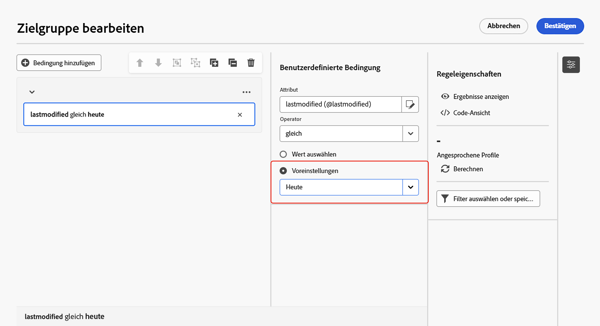

   +++

### Benutzerdefinierte Bedingungen für verknüpfte Tabellen (1:1- und 1:n-Relation){#links}

Mit benutzerdefinierten Bedingungen können Sie Tabellen abfragen, die mit der aktuell von Ihrer Regel verwendeten Tabelle verknüpft sind. Dazu gehören Tabellen mit einer 1:1-Relation oder Sammlungstabellen (1:n-Relation).

Navigieren Sie bei einer **1:1-Relation** zur verknüpften Tabelle, wählen Sie das gewünschte Attribut aus und definieren Sie den erwarteten Wert.

Sie können auch direkt eine Tabellenverknüpfung in der Auswahl **Wert** auswählen und bestätigen. In diesem Fall müssen die für die ausgewählte Tabelle verfügbaren Werte mit einer speziellen Auswahl ausgewählt werden, wie im folgenden Beispiel gezeigt.

+++Abfragebeispiel

Hier geht es bei der Abfrage um Marken mit der Bezeichnung „Laufen“.

1. Navigieren Sie durch die Tabelle **Marke** und wählen Sie das Attribut **Titel**.

   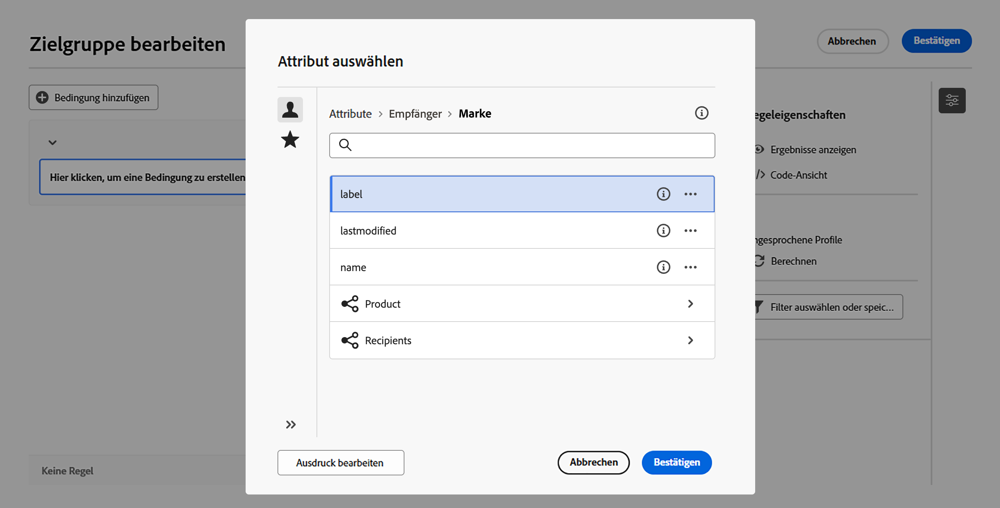

1. Definieren Sie den erwarteten Wert für das Attribut.

   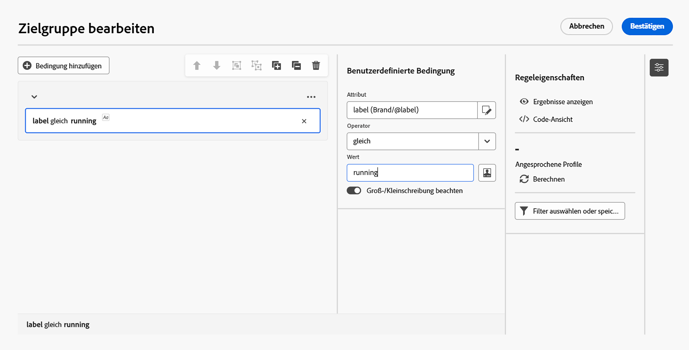

Hier ist ein Abfragebeispiel, bei dem eine Tabellenverknüpfung direkt ausgewählt wurde. Die verfügbaren Werte für diese Tabelle müssen über eine spezielle Auswahl ausgewählt werden.

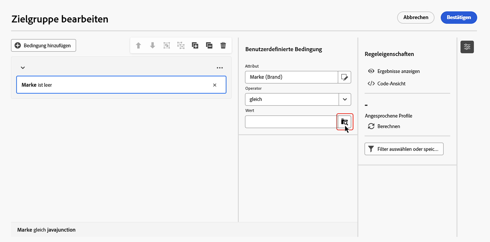

+++ 

Für eine **1:n-Relation** können Sie Unterbedingungen definieren, um Ihre Abfrage zu verfeinern, wie im folgenden Beispiel gezeigt.

+++Abfragebeispiel

Hier zielt die Abfrage auf Empfangende ab, die im Zusammenhang mit dem Brewmaster-Produkt Käufe in der Höhe von mindestens 100 $ getätigt haben.

1. Wählen Sie die Tabelle **Käufe** und bestätigen Sie.

1. Klicken Sie **[!UICONTROL Bedingung hinzufügen]**, um die Unterbedingungen zu definieren, die auf die ausgewählte Tabelle angewendet werden sollen.

   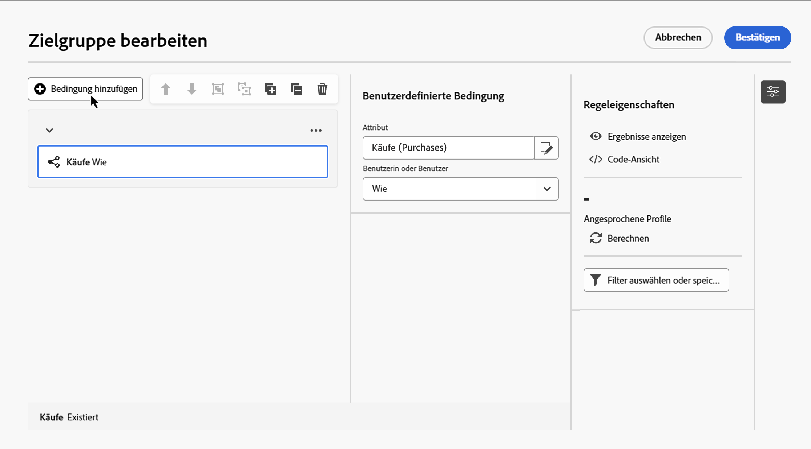

1. Fügen Sie Unterbedingungen hinzu, die Ihren Anforderungen entsprechen.

   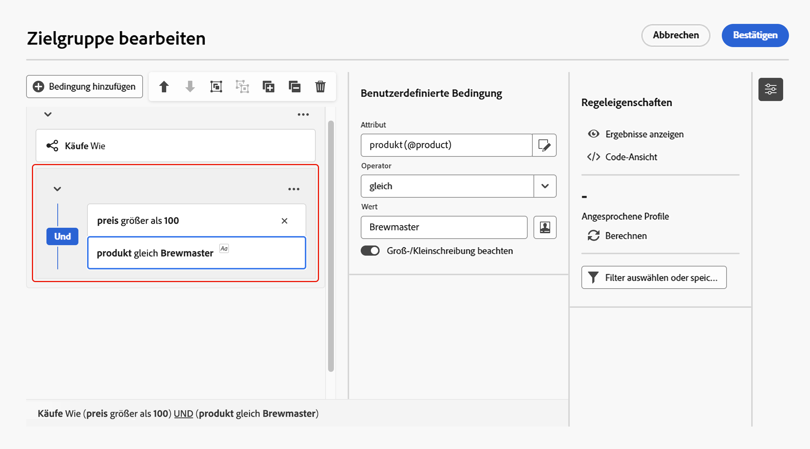

+++ 

### Benutzerdefinierte Bedingungen mit aggregierten Daten {#aggregate}

Mit benutzerdefinierten Bedingungen können Sie Aggregierungsvorgänge ausführen. Wählen Sie dazu direkt ein Attribut aus einer Sammlungstabelle aus:

1. Navigieren Sie durch die gewünschte Sammlungstabelle und wählen Sie das Attribut aus, für das Sie einen Aggregierungsvorgang durchführen möchten.

1. Aktivieren Sie im Eigenschaften-Fenster die Option **Daten aggregieren** und wählen Sie die gewünschte Aggregierungsfunktion aus.

   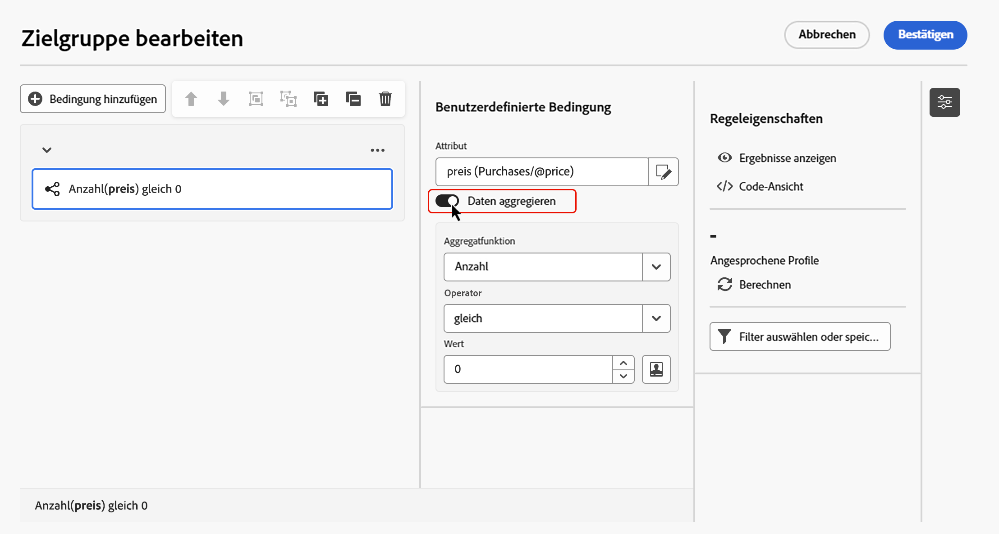

## Kombinieren von Bedingungen mithilfe von Operatoren {#operators}

Jedes Mal, wenn Sie Ihrer Regel eine neue Bedingung hinzufügen, wird diese automatisch durch einen **UND**-Operator mit der bestehenden Bedingung verknüpft. Dadurch werden die Ergebnisse der beiden Bedingungen kombiniert.

Um den Operator zwischen den Bedingungen zu ändern, klicken Sie darauf und wählen Sie den gewünschten Operator aus.

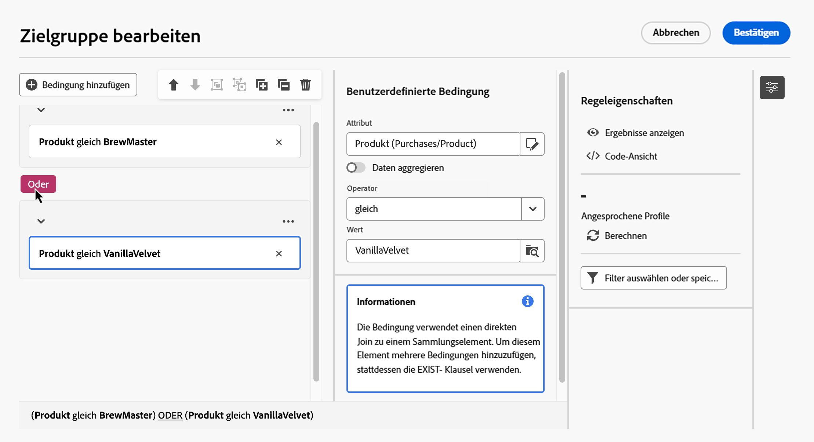

Die folgenden Operatoren sind verfügbar:

* **UND (Schnittmenge)**: Kombiniert Ergebnisse, die allen Filterkomponenten in den ausgehenden Transitionen entsprechen.
* **ODER (Vereinigung)**: Umfasst Ergebnisse, die mindestens einer der Filterkomponenten in den ausgehenden Transitionen entsprechen.
* **AUSSER (Ausschluss)**: Schließt Ergebnisse aus, die allen Filterkomponenten in der ausgehenden Transition entsprechen.

## Bearbeiten von Bedingungen {#manipulate}

Die Symbolleiste der Arbeitsfläche des Regel-Builders bietet Optionen zum einfachen Bearbeiten der Bedingungen innerhalb Ihrer Regel:

| Symbol auf Symbolleiste | Beschreibung |
|--- |--- |
|  | Verschiebt die Komponente eine Zeile nach oben. |
|  | Verschiebt die Komponente eine Zeile nach unten. |
|  | Fügt zwei Komponenten zu einer Gruppe zusammen. |
|  | Trennt die Komponenten einer einzelnen Gruppe. |
|  | Erweitert alle Gruppen. |
|  | Reduziert alle Gruppen. |
|  | Entfernt alle Gruppen und Komponenten. |

Abhängig von Ihren Anforderungen müssen Sie möglicherweise Zwischengruppen von Komponenten erstellen, indem Sie Komponenten zu einer Gruppe zusammenfassen und miteinander verknüpfen. 

* Um zwei vorhandene Bedingungen zu gruppieren, wählen Sie eine der beiden Bedingungen aus und klicken Sie auf die Schaltfläche  oder , um sie mit der Bedingung darüber oder darunter zu gruppieren.

* Um eine vorhandene Bedingung mit einer neuen zu gruppieren, wählen Sie die Bedingung aus, klicken Sie auf die Schaltfläche  und wählen Sie **[!UICONTROL Gruppe hinzufügen]**. Wählen Sie das neue Attribut aus, das der Gruppe hinzugefügt werden soll, und bestätigen Sie dann Ihre Auswahl.

  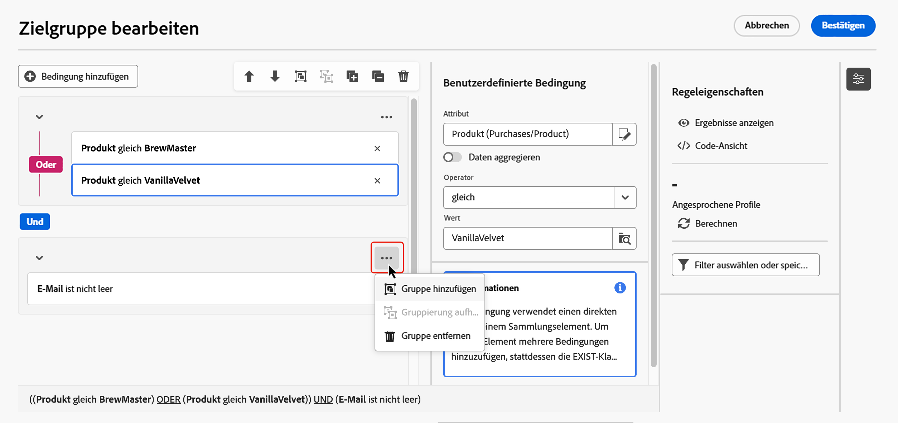

Im folgenden Beispiel haben wir eine Zwischengruppe erstellt, um Kundinnen und Kunden anzusprechen, die entweder das BrewMaster- oder das VanillaVelvet-Produkt gekauft haben.

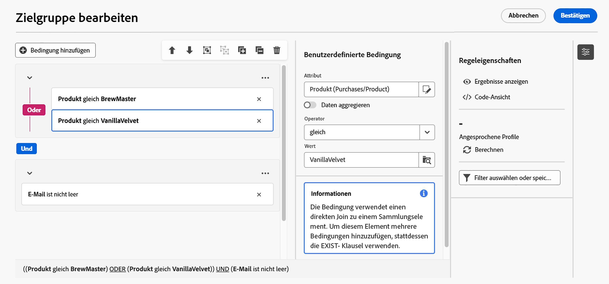

## Überprüfen und Validieren einer Abfrage

>[!CONTEXTUALHELP]
>id="ajo_orchestration_querymodeler_ruleproperties"
>title="Regeleigenschaften"
>abstract="Nachdem Sie Ihre Abfrage auf der Arbeitsfläche erstellt haben, können Sie sie rechts im Bereich **Regeleigenschaften** überprüfen. In diesem Bereich können Sie die resultierenden Daten anzeigen, eine SQL-Code-Version der Abfrage abrufen und die Anzahl der Zieleinträge überprüfen. Über die Schaltfläche **Filter auswählen oder speichern** können Sie Ihre Abfrage als vordefinierten Filter speichern oder den Arbeitsflächeninhalt durch einen vorhandenen Filter ersetzen."

Sobald Sie Ihre Abfrage auf der Arbeitsfläche erstellt haben, können Sie diese im Bereich **Regeleigenschaften** überprüfen. Verfügbare Vorgänge sind:

* **Ergebnisse anzeigen:** Zeigt die aus Ihrer Abfrage resultierenden Daten an.
* **Code-Ansicht**: Zeigt eine Code-basierte Version der Abfrage in SQL an.
* **Berechnen**: Aktualisiert die Anzahl der Einträge, auf die Ihre Regel abzielt, und zeigt diese an.
* **Filter auswählen oder speichern**: Wählen Sie einen vorhandenen vordefinierten Filter aus, um ihn in der Arbeitsfläche zu verwenden, oder speichern Sie Ihre Abfrage als neu vordefinierten Filter, um sie später erneut zu verwenden. Wenn der Filter Parameter enthält, geben Sie Werte an, bevor Sie ihn anwenden. Weitere Informationen finden Sie unter [Arbeiten mit vordefinierten Filtern](predefined-filters.md).

 

Wenn Ihre Regel fertig ist, klicken Sie auf die Schaltfläche **[!UICONTROL Bestätigen]**, um sie zu speichern.

>[!IMPORTANT]
>
>Wenn Sie im Bereich „Regeleigenschaften“ einen vordefinierten Filter auswählen, wird die Regel, die im Arbeitsfläche erstellt wurde, durch den ausgewählten Filter ersetzt.
