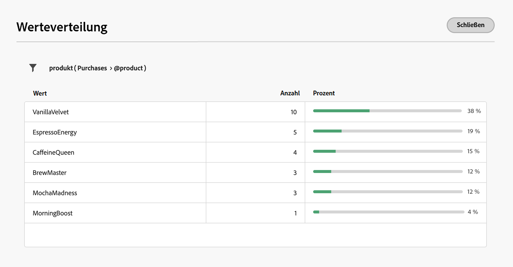

# Erste Regel erstellen {#build-query}

+++ Inhaltsverzeichnis

| Willkommen bei koordinierten Kampagnen | Starten Ihrer ersten orchestrierten Kampagne | Abfragen der Datenbank | Aktivitäten für orchestrierte Kampagnen |
|---|---|---|---|
| [Erste Schritte mit orchestrierten Kampagnen](gs-orchestrated-campaigns.md)  Erstellen und Verwalten von relationalen Schemata und Datensätzen:  <ul><li>[Erste Schritte mit Schemata und Datensätzen](gs-schemas.md)</li><li>[Manuelles Schema](manual-schema.md)</li><li>[Datei-Upload-Schema](file-upload-schema.md)</li><li>[Daten aufnehmen](ingest-data.md)</li></ul>[Zugriff und Verwaltung orchestrierter Kampagnen](access-manage-orchestrated-campaigns.md)  [Die wichtigsten Schritte zum Erstellen einer orchestrierten Kampagne](gs-campaign-creation.md) | [Erstellen und Planen der Kampagne](create-orchestrated-campaign.md)  [Orchestrieren von Aktivitäten](orchestrate-activities.md)  [ Starten und Überwachen der Kampagne](start-monitor-campaigns.md)  [Reporting](reporting-campaigns.md) | [Arbeiten mit dem Regel-Builder](orchestrated-rule-builder.md)  <b>[Erstellen der ersten Abfrage](build-query.md)</b>  [Ausdrücke bearbeiten](edit-expressions.md)  [Retargeting](retarget.md) | [Erste Schritte mit Aktivitäten](activities/about-activities.md)  Aktivitäten: [Und-Verknüpfung](activities/and-join.md) - [Zielgruppe aufbauen](activities/build-audience.md) - [Dimension ändern](activities/change-dimension.md) - [Kanalaktivitäten](activities/channels.md) - [Kombinieren](activities/combine.md) - [Anreicherung](activities/deduplication.md) - [Formulare](activities/enrichment.md) - [Abstimmung](activities/fork.md)    ->Zielgruppe speichern[ -AufspaltungWarten](activities/wait.md) |

{style="table-layout:fixed"}

+++

 

>[!BEGINSHADEBOX]

 

Der Inhalt dieser Seite ist nicht endgültig und kann geändert werden.

>[!ENDSHADEBOX]

Die wichtigsten Schritte zum Erstellen von Regeln für Ihre orchestrierten Kampagnen sind wie folgt:

1. **Bedingungen hinzufügen** - Erstellen Sie benutzerdefinierte Bedingungen, um Ihre Abfrage zu filtern, indem Sie Ihre eigene Bedingung mit Attributen aus der Datenbank und erweiterten Ausdrücken erstellen.
1. **Bedingungen kombinieren** - Ordnen Sie die Bedingungen auf der Arbeitsfläche mithilfe von Gruppen und logischen Operatoren an.
1. **Regel überprüfen und validieren** - Überprüfen Sie die resultierenden Daten Ihrer Regel, bevor Sie sie speichern.

## Bedingung hinzufügen {#conditions}

Gehen Sie wie folgt vor, um Bedingungen in Ihrer Abfrage hinzuzufügen:

1. Greifen Sie über die Aktivität **[!UICONTROL Zielgruppe aufbauen]** auf den Regel-Builder zu.

1. Klicken Sie auf **Schaltfläche „Bedingung hinzufügen**, um eine erste Bedingung für Ihre Abfrage zu erstellen.

   Sie können Ihre Abfrage auch mit einem vordefinierten Filter starten. Klicken Sie dazu auf die Schaltfläche **[!UICONTROL Filter auswählen oder speichern]** und wählen Sie **[!UICONTROL Vordefinierten Filter auswählen]**.

   

1. Identifizieren Sie das Attribut aus der Datenbank, das als Kriterium für Ihre Bedingung verwendet werden soll. Das Symbol „i“ neben einem Attribut zeigt Informationen über die Tabelle, in der es gespeichert ist, und seinen Datentyp an.

   

   >[!NOTE]
   >
   >Mit der Schaltfläche **Ausdruck bearbeiten** können Sie mit dem Ausdruckseditor einen Ausdruck manuell mithilfe von Feldern aus der Datenbank und Hilfsfunktionen definieren. [Erfahren Sie, wie Sie Ausdrücke bearbeiten](../orchestrated/edit-expressions.md)

1. Klicken Sie auf  neben einem Attribut, um auf diese zusätzlichen Optionen zuzugreifen:

+++ Werteverteilung

   Analysieren Sie die Verteilung der Werte für ein bestimmtes Attribut in der Tabelle. Diese Funktion ist nützlich, um die verfügbaren Werte, ihre Anzahl und Prozentsätze zu verstehen. Außerdem lassen sich Probleme wie inkonsistente Groß- und Kleinschreibung oder Schreibweisen beim Erstellen von Abfragen oder Ausdrücken vermeiden.

   Bei Attributen mit einer großen Anzahl von Werten zeigt das Tool nur die ersten zwanzig an. In solchen Fällen wird die Benachrichtigung **[!UICONTROL Teilweise geladen]** angezeigt, um auf diese Einschränkung hinzuweisen. Sie können erweiterte Filter anwenden, um die angezeigten Ergebnisse zu verfeinern und sich auf bestimmte Werte oder Teilmengen von Daten zu konzentrieren.

   

+++

+++ Zu Favoriten hinzufügen

   Durch das Hinzufügen von Attributen zum Favoritenmenü erhalten Sie schnellen Zugriff auf die am häufigsten verwendeten Attribute. Sie können bis zu 20 Attribute zu Favoriten hinzufügen. Allen Benutzenden in einer Organisation werden bevorzugte und zuletzt verwendete Attribute zugeordnet, um die Zugänglichkeit auf verschiedenen Computern und ein nahtloses Erlebnis auf allen Geräten sicherzustellen.

   Um auf die von Ihnen favorisierten Attribute zuzugreifen, verwenden Sie das Menü **[!UICONTROL Favoriten und Zuletzt verwendet]**. Favoritenattribute werden zuerst angezeigt, gefolgt von kürzlich verwendeten Attributen, damit Sie die erforderlichen Attribute leicht finden können. Um ein Attribut aus den Favoriten zu entfernen, klicken Sie erneut auf das Sternsymbol.

   

+++

1. Klicken Sie **[!UICONTROL Bestätigen]**, um das ausgewählte Attribut zu Ihrer Bedingung hinzuzufügen.

1. Es wird ein Eigenschaftenbereich angezeigt, in dem Sie den gewünschten Wert für das Attribut konfigurieren können.

   

1. Wählen Sie **[!UICONTROL Operator]** aus der Dropdown-Liste aus. Es stehen verschiedene Operatoren zur Verfügung. Die in der Dropdown-Liste verfügbaren Operatoren hängen vom Datentyp des Attributs ab.

   +++Liste der verfügbaren Operatoren

   | Operator | Zweck | Beispiel |
   |---|---|---|
   | Gleich | Die zurückgegebenen Daten stimmen vollständig mit dem in der zweiten Spalte angegebenen Wert überein. | „Nachname (@lastName) gleich ‚Müller‘“ gibt nur die Empfängerinnen und Empfänger mit dem Nachnamen „Müller“ unter Beachtung der genauen Schreibung aus. |
   | Ungleich | Die ausgegebenen Daten unterscheiden sich vom angegebenen Wert. | Sprache (@language) ungleich „Englisch“. |
   | Größer als | Die ausgegebenen Daten übersteigen den angegebenen Wert. | „Alter (@age) größer als 50“ gibt alle Werte von mehr als 50 Jahren aus (also „51“, „52“ usw.). |
   | Kleiner als | Der ausgegebene Wert unterschreitet den eingegebenen Wert. | „Erstellungsdatum (@created) kleiner als ‚DaysAgo(100)‘“ gibt alle Empfängerinnen und Empfänger aus, die vor weniger als 100 Tagen angelegt wurden. |
   | Größer oder gleich | Die ausgegebenen Daten sind identisch mit oder übersteigen den angegebenen Wert. | „Alter (@age) größer oder gleich ‚30‘“ gibt alle Empfängerinnen und Empfänger ab 30 Jahren aus. |
   | Kleiner oder gleich | Die ausgegebenen Daten sind identisch mit oder unterschreiten den angegebenen Wert. | „Alter (@age) kleiner oder gleich ‚60‘“ gibt alle Empfängerinnen und Empfänger bis 60 Jahren aus. |
   | Eingeschlossen in | Die ausgegebenen Daten sind in den angegebenen Werten enthalten. Die Werte müssen durch Kommata getrennt werden. | „Geburtsdatum (@birthDate) ist enthalten in ‚10.12.1979,10.12.1984‘“ gibt die Empfängerinnen und Empfänger aus, die zwischen diesen beiden Daten geboren wurden. |
   | Nicht enthalten | Negative Form des Operators „ist enthalten in“. Hier werden Empfängerinnen und Empfänger anhand der eingegebenen Werte ausgeschlossen. | Das Geburtsdatum (@birthDate) ist nicht in &#39;12/10/1979,12/10/1984&#39; enthalten. Empfängerinnen und Empfänger, die innerhalb dieses Datumsbereichs geboren wurden, werden nicht ausgegeben. |
   | Ist leer | Die ausgegebenen Daten stimmen mit einem leeren Wert in der zweiten Spalte überein. | „Mobiltelefon (@mobilePhone) ist leer“ gibt alle Empfängerinnen und Empfänger zurück, die keine Mobiltelefonnummer haben. |
   | Ist nicht leer | Negative Form des Operators „Ist leer“. Es ist nicht nötig, Daten in die zweite Wert-Spalte einzugeben. | E-Mail (@email) ist nicht leer. |
   | Beginnt mit | Die ausgegebenen Daten beginnen mit dem angegebenen Wert. | Kundennummer (@account) beginnt mit &#39;32010&#39;. |
   | Beginnt nicht mit | Die ausgegebenen Daten beginnen nicht mit dem angegebenen Wert. | Kundennummer (@account) beginnt nicht mit „20“. |
   | Enthält | Die ausgegebenen Daten enthalten den angegebenen Wert. | „E-Mail-Domain (@domain) enthält ‚mail‘“ gibt nur Domain-Namen aus, die den Wert „mail“, z. B. „gmail.com“, enthalten. |
   | Enthält nicht | Die ausgegebenen Daten enthalten den angegebenen Wert nicht. | E-Mail-Domain (@domain) enthält nicht „vo“. Domain-Namen, die „vo“ enthalten, z. B. „voila.fr“, werden nicht in den Ergebnissen angezeigt. |
   | Ist wie | Dieser Operator ähnelt „Enthält“ und erlaubt das Einfügen des Platzhalters „%“ im Wert. | Nachname (@lastName) ist wie &#39;Me%er&#39;. Das Platzhalterzeichen dient als „Joker“, um Namen wie „Meier“ zu finden. |
   | Ist nicht wie | Dieser Operator ähnelt „Enthält“ und erlaubt das Einfügen des Platzhalters „%“ im Wert. | Nachname (@lastName) nicht wie „Schmi%t“. Empfängerinnen und Empfänger, deren Nachname „Schmi%t“ lautet, also etwa „Schmidt“ oder „Schmitt“, werden nicht ausgegeben. |

+++

1. Legen Sie im Feld **Wert** den erwarteten Wert fest. Sie können den Ausdruckseditor auch verwenden, um einen Ausdruck manuell mithilfe von Feldern aus der Datenbank und Hilfsfunktionen zu definieren. Klicken Sie dazu auf das Symbol . [Erfahren Sie, wie Sie Ausdrücke bearbeiten](../orchestrated/edit-expressions.md)

   Für Attribute vom Typ „Datum“ sind vordefinierte Werte bei Verwendung der Option **[!UICONTROL Voreinstellungen]** verfügbar.

   +++Siehe Beispiel

   

+++

### Benutzerdefinierte Bedingungen für verknüpfte Tabellen (1:1- und 1:n-Relation){#links}

Mit benutzerdefinierten Bedingungen können Sie Tabellen abfragen, die mit der aktuell von Ihrer Regel verwendeten Tabelle verknüpft sind. Dazu gehören Tabellen mit einer 1:1-Relation oder Sammlungstabellen (1:n-Relation).

Navigieren Sie bei einer **1:1-Relation** zur verknüpften Tabelle, wählen Sie das gewünschte Attribut aus und definieren Sie den erwarteten Wert.

Sie können auch direkt eine Tabellenverknüpfung in der Auswahl **Wert** auswählen und bestätigen. In diesem Fall müssen die für die ausgewählte Tabelle verfügbaren Werte mit einer speziellen Auswahl ausgewählt werden, wie im folgenden Beispiel gezeigt.

+++Abfragebeispiel

Hier geht es bei der Abfrage um Marken mit der Bezeichnung „Laufen“.

1. Navigieren Sie durch die Tabelle **Marke** und wählen Sie das Attribut **Titel**.

   

1. Definieren Sie den erwarteten Wert für das Attribut.

   

Hier ist ein Abfragebeispiel, bei dem eine Tabellenverknüpfung direkt ausgewählt wurde. Die verfügbaren Werte für diese Tabelle müssen über eine spezielle Auswahl ausgewählt werden.

+++

Für eine **1:n-Relation** können Sie Unterbedingungen definieren, um Ihre Abfrage zu verfeinern, wie im folgenden Beispiel gezeigt.

+++Abfragebeispiel

Hier richtet sich die Abfrage an Empfängerinnen und Empfänger, die Käufe im Zusammenhang mit dem Brewmsaster-Produkt für mehr als 100 € getätigt haben.

1. Wählen Sie die Tabelle **Käufe** und bestätigen Sie.

1. Klicken Sie **[!UICONTROL Bedingung hinzufügen]**, um die Unterbedingungen zu definieren, die auf die ausgewählte Tabelle angewendet werden sollen.

   

1. Fügen Sie Ihren Anforderungen entsprechende Unterbedingungen hinzu.

   

+++

### Benutzerdefinierte Bedingungen mit aggregierten Daten {#aggregate}

Mit benutzerdefinierten Bedingungen können Sie Aggregierungsvorgänge ausführen. Wählen Sie dazu direkt ein Attribut aus einer Sammlungstabelle aus:

1. Navigieren Sie durch die gewünschte Sammlungstabelle und wählen Sie das Attribut aus, für das Sie einen Aggregierungsvorgang durchführen möchten.

1. Aktivieren Sie im Eigenschaften-Fenster die Option **Daten aggregieren** und wählen Sie die gewünschte Aggregierungsfunktion aus.

   

## Kombinieren von Bedingungen mithilfe von Operatoren {#operators}

Jedes Mal, wenn Sie Ihrer Regel eine neue Bedingung hinzufügen, wird sie durch einen AND-Operator automatisch mit **vorhandenen Bedingung**. Dies bedeutet, dass Ergebnisse aus den beiden Bedingungen kombiniert werden.

Um den Operator zwischen den Bedingungen zu wechseln, klicken Sie darauf und wählen Sie den gewünschten Operator aus.

Die folgenden Operatoren sind verfügbar:

* **UND (Schnittmenge)**: Kombiniert Ergebnisse, die allen Filterkomponenten in den ausgehenden Transitionen entsprechen.
* **ODER (Vereinigung)**: Umfasst Ergebnisse, die mindestens einer der Filterkomponenten in den ausgehenden Transitionen entsprechen.
* **AUSNAHME (Ausschluss)**: Schließt Ergebnisse aus, die mit allen Filterkomponenten in der ausgehenden Transition übereinstimmen.

## Bedingungen bearbeiten {#manipulate}

Die Symbolleiste der Arbeitsfläche des Regel-Builders bietet Optionen zum einfachen Bearbeiten der Bedingungen innerhalb Ihrer Regel:

| Symbolleistensymbol | Beschreibung |
|--- |--- |
|  | Verschieben Sie die Komponente in einer Zeile nach oben. |
|  | Verschieben der Komponente in einer Zeile nach unten. |
|  | Fügen Sie zwei Komponenten in eine Gruppe ein. |
|  | Trennen Sie die Komponenten einer einzelnen Gruppe. |
|  | Erweitern Sie alle Gruppen. |
|  | Alle Gruppen reduzieren. |
|  | Entfernen Sie alle Gruppen und Komponenten. |

Je nach Bedarf müssen Sie möglicherweise Zwischengruppen von Komponenten erstellen, indem Sie Komponenten zu einer Gruppe gruppieren und miteinander verknüpfen.

* Um zwei vorhandene Bedingungen zu gruppieren, wählen Sie eine der beiden Bedingungen aus und klicken Sie auf die Schaltfläche  oder , um sie mit der Bedingung oben oder unten zu gruppieren.

* Um eine vorhandene Bedingung mit einer neuen zu gruppieren, wählen Sie die Bedingung aus, klicken Sie auf die Schaltfläche  und wählen Sie **[!UICONTROL Gruppe hinzufügen]**. Wählen Sie das neue Attribut aus, das der Gruppe hinzugefügt werden soll, und bestätigen Sie dann Ihre Auswahl.

  

Im folgenden Beispiel haben wir eine Zwischengruppe erstellt, um Kunden anzusprechen, die entweder das BrewMaster- oder das VanillaVelvet-Produkt gekauft haben.

## Überprüfen und Validieren einer Abfrage

Nachdem Sie Ihre Abfrage auf der Arbeitsfläche erstellt haben, können Sie sie mit dem Bereich **Regeleigenschaften** überprüfen. Verfügbare Vorgänge sind:

* **Ergebnisse anzeigen:** Zeigt die aus Ihrer Abfrage resultierenden Daten an.
* **Code-Ansicht**: Zeigt eine Code-basierte Version der Abfrage in SQL an.
* **Berechnen**: Aktualisiert und zeigt die Anzahl der Datensätze an, auf die die Regel abzielt.
* **Filter auswählen oder speichern**: Wählen Sie einen vorhandenen vordefinierten Filter zur Verwendung in der Arbeitsfläche aus, oder speichern Sie Ihre Abfrage als vordefinierten Filter zur späteren Wiederverwendung ab. 

 

    >[!WICHTIG]
    >
    >Wählen Sie einen vordefinierten Filter aus dem Bereich Regeleigenschaften aus, um die auf der Arbeitsfläche erstellte Regel durch den ausgewählten Filter zu ersetzen.

Wenn Ihre Regel fertig ist, klicken Sie auf die Schaltfläche **[!UICONTROL Bestätigen]** im , um sie zu speichern.
