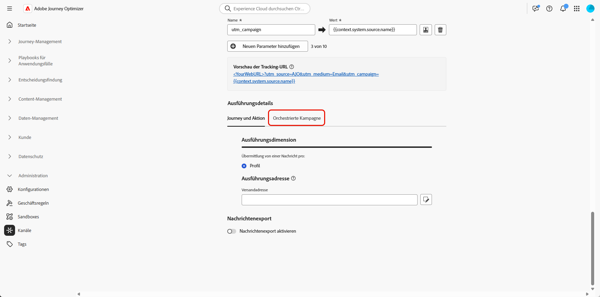
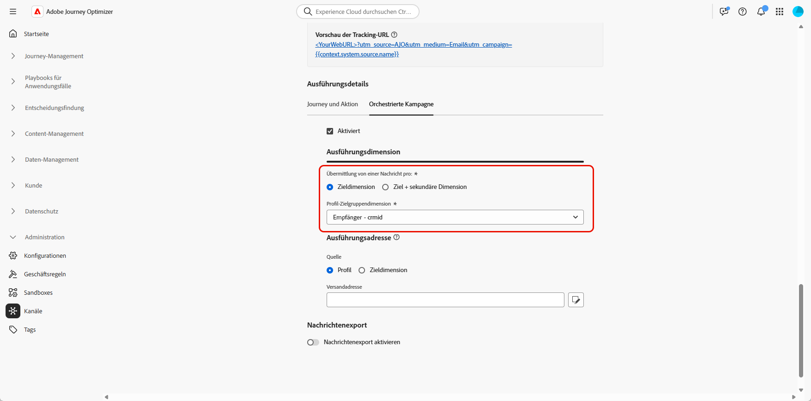

# Konfigurieren der Kanalkonfiguration {#channel-configuration}

Nach der Einrichtung Ihrer [Zieldimension](target-dimension.md) müssen Sie Ihre **[!UICONTROL Kanalkonfiguration]** konfigurieren und die entsprechenden **[!UICONTROL Ausführungsdetails]** definieren. Auf diese Weise können Sie Folgendes definieren:

* **Die Ebene des Nachrichtenversands**: z. B. eine Nachricht pro Empfängerin bzw. Empfänger (beispielsweise eine einzige E-Mail pro Kontakt).

* **Die Ausführungsadresse**: Das spezifische Kontaktfeld, das zum Senden verwendet werden soll, z. B. eine E-Mail-Adresse oder Telefonnummer.

So konfigurieren Sie die Kanalkonfiguration:

1. Erstellen und konfigurieren Sie zunächst Ihre **[!UICONTROL Kanalkonfiguration]**.

   Sie können auch eine vorhandene **[!UICONTROL Kanalkonfiguration]** überarbeiten.

   ➡️ [Befolgen Sie die auf dieser Seite beschriebenen Schritte](../email/surface-personalization.md)

1. Rufen Sie im Abschnitt **[!UICONTROL Ausführungsdetails]** Ihrer **[!UICONTROL Kanalkonfiguration]** die Registerkarte **[!UICONTROL Orchestrierte Kampagnen]** auf.

   

1. Klicken Sie auf **[!UICONTROL Aktiviert]**, um sie mit orchestrierten Kampagnen kompatibel zu machen.

1. Wählen Sie Ihre Versandmethode:

   * **[!UICONTROL Zieldimension]**: An die primäre Entität, z. B. die Empfängerin bzw. den Empfänger, senden.

   * **[!UICONTROL Ziel + sekundäre Dimension]**: Senden Sie Daten sowohl über primäre als auch sekundäre Entitäten, z. B. Empfängerin bzw. Empfänger + Vertrag.

1. Wählen Sie aus der Dropdown-Liste Ihre [zuvor erstellte Zieldimension](#targeting-dimension) aus.

   

1. Wenn Sie **[!UICONTROL Ziel + sekundäre Dimension]** als Versandmethode ausgewählt haben, wählen Sie eine **[!UICONTROL Sekundäre Dimension]**, um den Kontext für den Nachrichtenversand zu definieren.

1. Wählen Sie im Abschnitt **[!UICONTROL Ausführungsadresse]** aus, welche **[!UICONTROL Quelle]** zum Abrufen der Versandadresse verwendet werden soll, z. B. die E-Mail-Adresse oder Telefonnummer:

   * **[!UICONTROL Profil]**: Wählen Sie diese Option aus, wenn die Versandadresse, z. B. die E-Mail-Adresse, direkt im Hauptkundenprofil gespeichert ist.

     Das ist nützlich beim Senden von Nachrichten an die Hauptkundin bzw. den Hauptkunden, nicht an eine bestimmte zugehörige Entität.

   * **[!UICONTROL Zieldimension]**: Wählen Sie diese Option, wenn die Versandadresse in der Hauptentität, z. B. einer Empfängerin oder einem Empfänger, gespeichert ist.

     Dies ist nützlich, wenn jede Empfängerin und jeder Empfänger eine eigene Versandadresse hat, z. B. eine unterschiedliche E-Mail-Adresse oder Telefonnummer.

   * **[!UICONTROL Sekundäre Dimension]**: Wählen Sie bei Verwendung von **[!UICONTROL Ziel + sekundäre Dimension]** als Versandmethode die entsprechende **[!UICONTROL sekundäre Dimension]**, die Sie zuvor konfiguriert haben.

     Wenn die sekundäre Dimension beispielsweise eine Buchung oder ein Abonnement darstellt, kann die Ausführungsadresse, etwa eine E-Mail-Adresse, aus dieser Ebene übernommen werden. Dies ist nützlich, wenn Profile beim Buchen oder Abonnieren eines Service andere Kontaktdetails nutzen.

1. Klicken Sie im Feld **[!UICONTROL Versandadresse]** auf das Symbol , um das spezifische Feld auszuwählen, das für Ihren Nachrichtenversand verwendet werden soll.

   

1. Klicken Sie nach der Konfiguration auf **[!UICONTROL Speichern]**.

Ihr Kanal kann jetzt mit **orchestrierten Kampagnen** verwendet werden. Nachrichten werden dabei entsprechend der ausgewählten Zielgruppendimension versendet.

## URL-Tracking-Parameter {#url-tracking}

Bei der Konfiguration Ihrer Kanalkonfiguration können Sie URL-Tracking-Parameter definieren, um die Leistung Ihrer E-Mail-Kampagnen zu überwachen, indem Sie Metadaten an Ihre verfolgten Links anhängen - zu Analyse- und Berichtszwecken.

Dazu stehen kontextuelle Attribute, die für orchestrierte Kampagnen spezifisch sind, unter Verwendung der `{{context.system.source.*}}`-Syntax zur Verfügung:

* **`context.system.source.id`**: Orchestrierte Kampagnen-ID
* **`context.system.source.name`**: Name der orchestrierten Kampagne
* **`context.system.source.versionId`**: Orchestrierte Kampagnenversions-ID
* **`context.system.source.actionId`**: Kennung des Kanalaktionsknotens
* **`context.system.source.actionName`**: Knotenname der Kanalaktion
* **`context.system.source.channel`**: Kanaltyp (E-Mail, SMS, Push)
* **`context.system.IdentityNamespace`**: Verwendeter Identity-Namespace

Beispiel:

```
www.YourLandingURL.com?utm_source=AJO&utm_campaign={{context.system.source.id}}&utm_content={{context.system.source.actionName}}
```

Weitere Informationen zu URL-Tracking-Parametern finden [ in diesem Abschnitt](../email/url-tracking.md).
