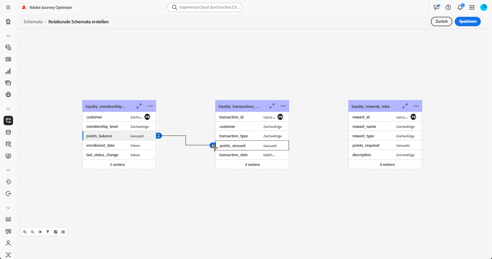
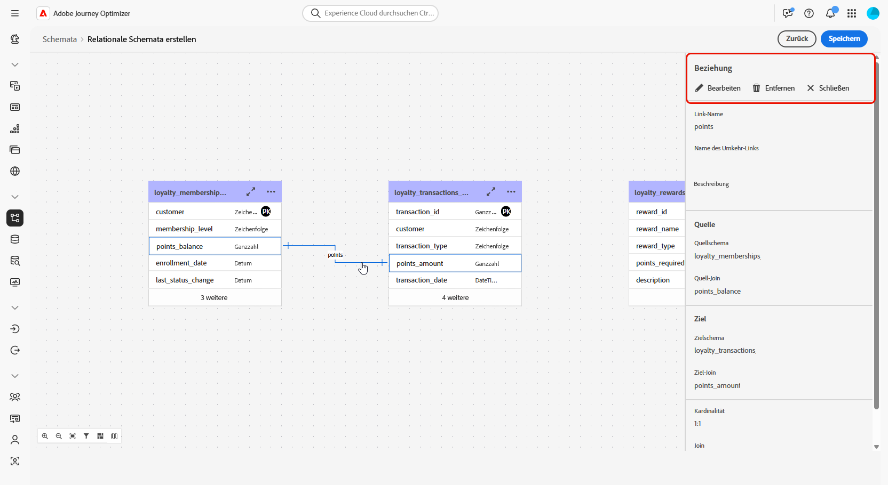
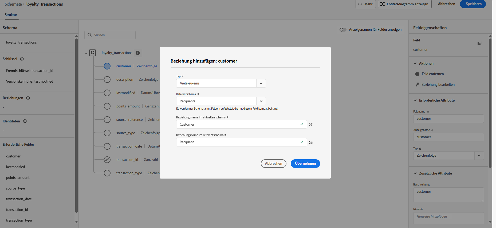
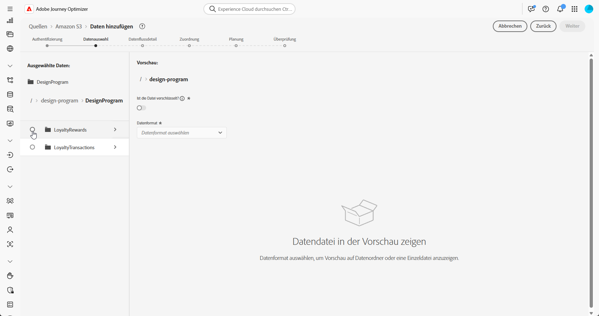
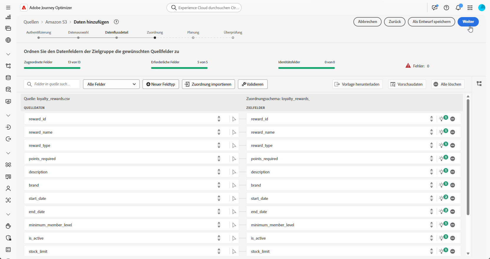

# Konfigurationsschritte {#configuration-steps}

+++ Inhaltsverzeichnis

| Willkommen bei koordinierten Kampagnen | Starten Ihrer ersten orchestrierten Kampagne | Abfragen der Datenbank | Aktivitäten für orchestrierte Kampagnen |
|---|---|---|---|
| [Erste Schritte mit orchestrierten Kampagnen](gs-orchestrated-campaigns.md)<br/><br/><b>[Konfigurationsschritte](configuration-steps.md)</b><br/><br/>[Zugreifen auf und Verwalten von orchestrierten Kampagnen](access-manage-orchestrated-campaigns.md) | [Wichtige Schritte für die orchestrierte Kampagnenerstellung](gs-campaign-creation.md)<br/><br/>[Erstellen und Planen der Kampagne](create-orchestrated-campaign.md)<br/><br/>[Orchestrieren von Aktivitäten](orchestrate-activities.md)<br/><br/>[Starten und Überwachen der Kampagne](start-monitor-campaigns.md)<br/><br/>[Reporting](reporting-campaigns.md) | [Arbeiten mit dem Regel-Builder](orchestrated-rule-builder.md)<br/><br/>[Erstellen Sie Ihre ersten ](build-query.md)<br/><br/>[-Bearbeitungsausdrücke](edit-expressions.md) | [Erste Schritte mit Aktivitäten](activities/about-activities.md)<br/><br/>Aktivitäten:<br/>[Und-Verknüpfung](activities/and-join.md) - [Zielgruppe aufbauen](activities/build-audience.md) - [Dimension ändern](activities/change-dimension.md) - [Kanalaktivitäten](channels.md) - [Kombinieren](activities/deduplication.md) - [Anreicherung](activities/enrichment.md) - [Verzweigung](activities/fork.md) - [Abstimmung](activities/reconciliation.md) [&#128279;](activities/split.md) [&#128279;](activities/wait.md) - Aufspaltung[&#128279;](activities/combine.md)Warten |

{style="table-layout:fixed"}

+++

</br>

>[!BEGINSHADEBOX]

Dokumentation in Bearbeitung

>[!ENDSHADEBOX]

Dieses Handbuch führt Sie durch den Prozess der Erstellung eines relationalen Schemas, der Konfiguration eines Datensatzes für orchestrierte Kampagnen, der Aufnahme von Daten über eine S3-Quelle und der Abfrage der aufgenommenen Daten in der AP-Plattform.

In diesem Beispiel umfasst die Einrichtung die Integration zweier wichtiger Entitäten, **Treuetransaktionen** und **Treueprämien** und deren Verknüpfung mit vorhandenen Kernentitäten **Empfänger** und **Marken**.


1. [DDL-Datei hochladen](#upload-ddl)

   Definieren Sie das relationale Datenmodell für orchestrierte Kampagnen, einschließlich der **Treuetransaktionen** und **Treueprämien**-Entitäten sowie der erforderlichen Schlüssel und Versionierungsattribute.

1. [Entitäten auswählen](#entities)

   Erstellen Sie aussagekräftige Beziehungen zwischen Tabellen in Ihrem Schema, um ein kohärentes und vernetztes Datenmodell zu erstellen.

1. [Verknüpfungsschema](#link-schema)

   Verknüpfen Sie die Entität **Treuetransaktionen** mit **Empfängern** und **Treueprämien** mit **Marken**, um ein verbundenes Datenmodell zu erstellen, das personalisierte Kunden-Journey unterstützt.

1. [Aufnehmen von Daten](#ingest)

   Importieren Sie Daten aus unterstützten Quellen wie SFTP, Cloud-Speicher oder Datenbanken in Adobe Experience Platform.

## DDL-Datei hochladen {#upload-ddl}

Dieser Abschnitt enthält eine schrittweise Anleitung zum Erstellen eines relationalen Schemas in Adobe Experience Platform durch Hochladen einer DDL-Datei (Data Definition Language). Durch die Verwendung einer DDL-Datei können Sie die Struktur Ihres Datenmodells vorab definieren, einschließlich Tabellen, Attributen, Schlüsseln und Beziehungen.

1. Melden Sie sich bei der API-Plattform an.

1. Navigieren Sie zu **Daten-Management** > **Schema**.

1. Klicken Sie auf **Schema erstellen**.

1. Sie werden aufgefordert, zwischen zwei Schematypen auszuwählen:

   * **Standard**
   * **Relational**, wird speziell für orchestrierte Kampagnen verwendet

   

1. Wählen Sie **DDL-Datei hochladen**, um ein Entitätsbeziehungsdiagramm zu definieren und Schemata zu erstellen.

   Die Tabellenstruktur muss Folgendes enthalten:
   * Mindestens ein Primärschlüssel
   * Eine Versionskennung, z. B. ein `lastmodified` Feld vom Typ `datetime` oder `number`.

1. Ziehen Sie Ihre DDL-Datei per Drag-and-Drop und klicken Sie auf **[!UICONTROL Weiter]**.

1. Geben Sie Ihren **[!UICONTROL Schemanamen]** ein.

1. Richten Sie jedes Schema und seine Spalten ein, wobei Sie sicherstellen, dass ein Primärschlüssel angegeben wird.

   Ein Attribut, z. B. `lastmodified`, muss als Versionsdeskriptor angegeben werden. Dieses Attribut, das normalerweise vom Typ `datetime`, `long` oder `int` ist, ist für Aufnahmeprozesse unverzichtbar, um sicherzustellen, dass der Datensatz mit der neuesten Datenversion aktualisiert wird.

   

1. Klicken Sie **[!UICONTROL Fertig]**, sobald Sie fertig sind.

Sie können jetzt die Tabellen- und Felddefinitionen auf der Arbeitsfläche überprüfen. [Weitere Informationen finden Sie im folgenden Abschnitt](#entities)

## Entitäten auswählen {#entities}

Gehen Sie wie folgt vor, um logische Verbindungen zwischen Tabellen innerhalb Ihres Schemas zu definieren.

1. Rufen Sie die Arbeitsfläche der Ansicht Ihres Datenmodells auf und wählen Sie die beiden Tabellen aus, die Sie verknüpfen möchten

1. Klicken Sie auf die Schaltfläche  neben dem Quellen-Join und ziehen Sie den Pfeil in Richtung Ziel-Join, um die Verbindung herzustellen.

   

1. Füllen Sie das angegebene Formular aus, um den Link zu definieren, und klicken Sie nach der Konfiguration auf **Anwenden**.

   

   **Kardinalität**

   * **1:N**: Eine Entität in der Quelltabelle kann mit mehreren Entitäten in der Zieltabelle in Beziehung stehen, aber eine Entität in der Zieltabelle kann nur maximal mit einer Entität in der Quelltabelle in Beziehung stehen.

   * **N:1**: Eine Entität in der Zieltabelle kann mit mehreren Entitäten in der Quelltabelle in Beziehung stehen, aber eine Entität in der Quelltabelle kann nur maximal mit einer Entität in der Zieltabelle in Beziehung stehen.

   * **1:1**: Eine Entität in der Quelltabelle kann maximal mit einer Entität in der Zieltabelle in Beziehung stehen.

1. Alle in Ihrem Datenmodell definierten Links werden in der Arbeitsflächenansicht als Pfeile dargestellt. Klicken Sie auf einen Pfeil zwischen zwei Tabellen, um je nach Bedarf Details anzuzeigen, Änderungen vorzunehmen oder den Link zu entfernen.

   

1. Verwenden Sie die Symbolleiste, um die Arbeitsfläche anzupassen.

   

   * **Vergrößern**: Vergrößert die Arbeitsfläche, um Details zu Ihrem Datenmodell deutlicher zu sehen.

   * **Verkleinern**: Verkleinert die Arbeitsfläche, um eine erweiterte Ansicht Ihres Datenmodells zu erhalten.

   * **Ansicht anpassen**: Passen Sie den Zoom an alle Schemata im sichtbaren Bereich an.

   * **Filter**: Wählen Sie aus, welches Schema auf der Arbeitsfläche angezeigt werden soll.

   * **Automatisches Layout erzwingen**: Automatische Anordnung von Schemata zur besseren Organisation.

   * **Zuordnung anzeigen**: Schalten Sie eine Minizuordnungsüberlagerung um, um durch große oder komplexe Schema-Layouts leichter zu navigieren.

1. Klicken **abschließend** Speichern“. Diese Aktion erstellt die Schemata und die zugehörigen Datensätze und ermöglicht die Verwendung des Datensatzes in orchestrierten Kampagnen.

1. Klicken Sie **[!UICONTROL Aufträge öffnen]**, um den Fortschritt des Erstellungsauftrags zu überwachen. Dieser Vorgang kann je nach der Anzahl der in der DDL-Datei definierten Tabellen mehrere Minuten dauern.

   

## Verknüpfungsschema {#link-schema}

Stellen Sie eine Beziehung zwischen dem Schema **Treuetransaktionen** und dem Schema **Empfänger** her, um jede Transaktion mit dem richtigen Kundendatensatz zu verknüpfen.

1. Navigieren Sie zu **[!UICONTROL Schemata]** und öffnen Sie Ihre zuvor erstellten **Treuetransaktionen**.

1. Klicken Sie **[!UICONTROL Beziehung hinzufügen]** in den „Kunden **[!UICONTROL Feldeigenschaften]**.

   

1. Wählen Sie **[!UICONTROL Viele-zu-eins]** als Beziehung **[!UICONTROL Typ]**.

1. Relation zum vorhandenen Schema **Empfänger**.

   

1. Geben Sie einen **[!UICONTROL Beziehungsnamen aus dem aktuellen Schema]** und **[!UICONTROL Beziehungsnamen aus dem Referenzschema]** ein.

1. Klicken Sie **[!UICONTROL Übernehmen]**, um Ihre Änderungen zu speichern.

Erstellen Sie dann eine Beziehung zwischen dem Schema **Treueprämien** und dem Schema **Marken**, um jeden Prämieneintrag mit der entsprechenden Marke zu verknüpfen.


## Aufnehmen von Daten {#ingest}

Adobe Experience Platform ermöglicht die Aufnahme von Daten aus externen Quellen und bietet Ihnen die Möglichkeit, die eingehenden Daten mithilfe von Experience Platform-Services zu strukturieren, zu kennzeichnen und anzureichern. Daten können aus verschiedensten Quellen aufgenommen werden, darunter etwa Adobe-Anwendungen, Cloud-basierte Datenspeicher und Datenbanken.

1. Rufen Sie **[!UICONTROL Menü]** Verbindungen“ das Menü **[!UICONTROL Quellen]** auf.

1. Wählen Sie die Kategorie **[!UICONTROL Cloud-]**) und dann Amazon S3 aus und klicken Sie auf **[!UICONTROL Daten hinzufügen]**.

   

1. Verbinden Sie Ihr S3-Konto:

   * Mit vorhandenem Konto

   * Mit einem neuen Konto

   [Weitere Informationen hierzu finden Sie in der Dokumentation zu Adobe Experience Platform](https://experienceleague.adobe.com/de/docs/experience-platform/destinations/catalog/cloud-storage/amazon-s3#connect).

   

1. Wählen Sie Ihren Ordner **[!UICONTROL Datenformat]**, **[!UICONTROL Trennzeichen]** und **[!UICONTROL Komprimierungstyp]**.

1. Navigieren Sie durch die verbundene S3-Quelle, bis Sie die beiden zuvor erstellten Ordner finden **d. h.** Treueprämien und **Treuetransaktionen**.

1. Wählen Sie den Ordner aus, der Ihre Daten enthält.

   Durch die Auswahl eines Ordners wird sichergestellt, dass alle aktuellen und zukünftigen Dateien mit derselben Struktur automatisch verarbeitet werden. Für die Auswahl einer einzelnen Datei muss jedoch jedes neue Dateninkrement manuell hochgeladen werden.

   

1. Wählen Sie Ihren Ordner **[!UICONTROL Datenformat]**, **[!UICONTROL Trennzeichen]** und **[!UICONTROL Komprimierungstyp]**. Überprüfen Sie Ihre Beispieldaten auf Genauigkeit und klicken Sie dann auf **[!UICONTROL Weiter]**.

   

1. Aktivieren **[!UICONTROL die Option &quot;]** ändern“, um aus Datensätzen auszuwählen, die relationalen Schemata zugeordnet sind und für die sowohl ein Primärschlüssel als auch ein Versionsdeskriptor definiert sind.

1. Wählen Sie [ zuvor erstellten Datensatz aus ](#entities) klicken Sie auf **[!UICONTROL Weiter]**.

   

1. Überprüfen Sie **[!UICONTROL Fenster]** Zuordnung“, ob jedes Quelldateiattribut den entsprechenden Feldern im Zielschema korrekt zugeordnet ist.

   Klicken **[!UICONTROL abschließend]** Weiter“.

   

1. Konfigurieren Sie den Datenfluss **[!UICONTROL Zeitplan]** basierend auf Ihrer gewünschten Häufigkeit.

1. Klicken Sie **[!UICONTROL Beenden]**, um den Datenfluss zu erstellen. Er wird automatisch nach dem festgelegten Zeitplan ausgeführt.

1. Wählen Sie im Menü **[!UICONTROL Verbindungen]** die Option **[!UICONTROL Quellen]** und greifen Sie auf die Registerkarte **[!UICONTROL Datenflüsse]** zu, um die Flussausführung zu verfolgen, aufgenommene Datensätze zu überprüfen und Fehler zu beheben.

   

<!--manual
## Create a relational schema manual


1. Log in to the AP Platform.
1. Navigate to the **Schema Management** section.
1. Click on **Create Schema**.

1. You will be prompted to select between two schema types:
    * **Standard**
    * **Relational** (used specifically for AGO campaigns)

1. Click on **Create Manual**.
1. Provide a **Schema Name** (e.g., `test_demo_ck001`).
1. Choose **Schema Type**:
    - **Record Type** (required for AGO campaigns)
    - **Time Series** (not applicable here)
1. Click **Finish** to proceed to the schema design canvas.

## Select entities and fields to import

1. In the canvas, add attributes (fields) to your schema.
1. Add a **Primary Key** (mandatory).
1. Add a **Version Descriptor** attribute (for CDC support):
    - This must be of type **DateTime** or **Numeric** (Integer, Long, Short, Byte).
    - Common example: `last_modified`

> **Why?** The **Primary Key** uniquely identifies each record, and the **Version Descriptor** tracks changes, supporting CDC (Change Data Capture) and data mirroring.

1. Mark the appropriate fields as **Primary Key** and **Version Descriptor**.
1. Click **Save**.

---


## 5. Creating a Dataset

1. Navigate to **Datasets**.
1. Click on **Create Dataset**.
1. Select the schema you just created.
1. Assign a **Dataset Name** (same as schema is fine).
1. Optionally, add tags (e.g., `AGO_campaigns`).
6. Ensure the checkbox **"Relational Schema"** is checked.
7. Click **Finish**.

> **Note:** Only one dataset can be created per relational schema.


## 6. Enabling the Dataset

1. Click **Enable** for the dataset.
1. Wait a few moments for the status to show **Enabled**.

> **Why?** Without enabling, the dataset cannot be used in orchestrated campaigns or ingest data.

## 7. Creating a Data Source (S3)

1. Navigate to **Sources**.
1. Click **Create Source**.
1. Choose the source type (e.g., **S3 Bucket**).
1. Provide connection details:
    - Bucket Path (optionally include subfolder path)
1. Save the source.

## 8. Preparing and Uploading Data

1. Prepare your CSV file with:
    - Column headers matching your schema attributes
    - `last_modified` column
    - `change_type` column (`U`/`DU` for upsert, `D` for delete)

> **Important:** `change_type` is required but does not need to be defined in the schema.

1. Save the file as `.csv`.

1. Upload the file to the specified folder in your S3 bucket.


## 9. Ingesting Data from S3

1. Go to **Sources** and find your S3 source.
1. Click **Add Data**.
1. Select the uploaded file.
1. Specify the file format as **CSV** and any compression type if applicable.
1. Review the data preview (ensure `change_type`, `last_modified`, and primary key are visible).
1. Click **Next**.

### Enable Change Data Capture (CDC)

- Check **Enable Change Data Capture**.
- Select the dataset enabled for AGO campaigns.

### Field Mapping

- Fields are auto-mapped (note that `change_type` is not mapped and that's expected).
- Click **Next**.

### Scheduling

- Schedule ingestion frequency (minute, hour, day, week).
- Set start time (immediate or future).
- Click **Finish** to create the data flow.

## 10. Monitoring Data Flow

1. Navigate back to **Sources > Data Flows**.
1. Wait 4–5 minutes for the first run (initial overhead).
1. Monitor:
    - Status (Started, Completed)
    - Number of records ingested
    - Errors (if any)

> **Tip:** Ingested data first lands in the **Data Lake**.

## 11. Data Replication to Data Store

The **Data Store** is updated:

- Every **15 minutes**, or

- If **Data Lake size exceeds 5MB**

This is a background replication process.


## 12. Querying the Dataset

1. Navigate to **Query Services**.
1. Click **Create Query**.
1. Example query:

   ```sql
   SELECT * FROM test_demo_ck001;
   ```

1. Run the query.

> **Note:** If ingestion is incomplete, query will return an error. Check data flow status.

-->