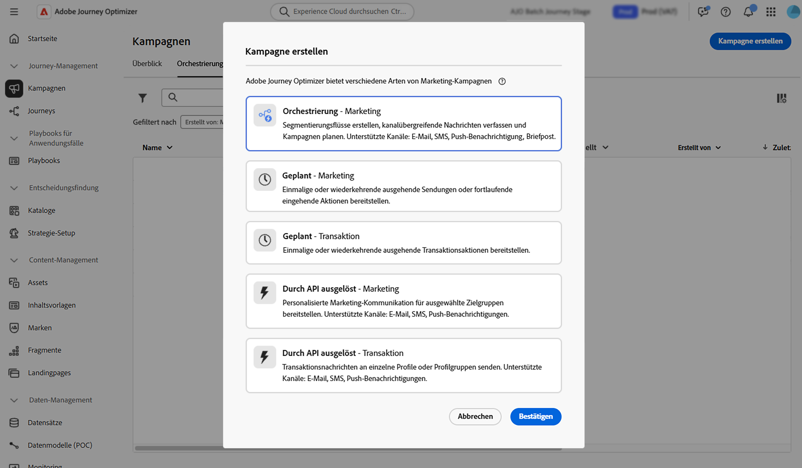

# Erstellen und Planen einer orchestrierten Kampagne {#create-first-campaign}

Erstellen Sie eine orchestrierte Kampagne in [!DNL Adobe Journey Optimizer] und konfigurieren Sie deren Ausführungsplanung, um den Zeitpunkt und die Häufigkeit des Starts zu steuern. Sie können die Kampagne entweder sofort, zu einem bestimmten Datum und zu einer bestimmten Uhrzeit oder wiederkehrend mit flexiblen Planungsoptionen wie täglich, wöchentlich oder monatlich starten.

## Erstellen der Kampagne {#create}

>[!CONTEXTUALHELP]
>id="ajo_campaign_creation_workflow"
>title="Liste der koordinierten Kampagnen"
>abstract="Auf **Registerkarte** Orchestrierung“ werden alle orchestrierten Kampagnen aufgelistet. Klicken Sie auf den Namen einer orchestrierten Kampagne, um sie zu bearbeiten. Verwenden Sie die Schaltfläche **Orchestrierte Kampagne erstellen**, um eine neue orchestrierte Kampagne hinzuzufügen."

Gehen Sie wie folgt vor, um eine orchestrierte Kampagne zu erstellen:

1. Navigieren Sie zum Menü **[!UICONTROL Kampagnen]** und wählen Sie die Registerkarte **[!UICONTROL Orchestrierung]** aus.

1. Klicken Sie auf **[!UICONTROL Schaltfläche]** erstellen und wählen Sie den Kampagnentyp **[!UICONTROL Orchestrierung - Marketing]** aus.

   

1. Definieren Sie die Kampagneneigenschaften. Klicken Sie dazu auf das Symbol  neben dem Namen der Kampagne.

   

   1. Geben Sie **[!UICONTROL Kampagne einen]** und **[!UICONTROL Beschreibung]** ein.

   1. Wählen Sie eine **[!UICONTROL Zusammenführungsrichtlinie]** für Ihre Kampagne aus.

      [!DNL Adobe Experience Platform] ist jede Zielgruppe an eine bestimmte Zusammenführungsrichtlinie gebunden, die definiert, wie Profilinformationen zu einem zusammengeführten Profil kombiniert werden. Wenn Sie in der Aktivität Zielgruppe lesen eine Zusammenführungsrichtlinie auswählen, sind nur Zielgruppen verfügbar, die auf derselben Zusammenführungsrichtlinie basieren. Standardmäßig verwendet das System die standardmäßige Zusammenführungsrichtlinie, Sie können sie jedoch bei Bedarf ändern. Weitere Informationen zu Zusammenführungsrichtlinien finden Sie in der [Dokumentation zu Adobe Experience Platform](https://experienceleague.adobe.com/de/docs/experience-platform/profile/merge-policies/overview){target="_blank"}.

   1. Verwenden Sie das Feld **[!UICONTROL Tags]**, um Ihrer Kampagne einheitliche Adobe Experience Platform-Tags zuzuweisen. Auf diese Weise können Sie sie einfach klassifizieren und die Suche in der Liste „Orchestrierte Kampagnen“ verbessern. [Erfahren Sie, wie Sie mit Tags arbeiten](../start/search-filter-categorize.md#tags).

   1. Klicken Sie auf **[!UICONTROL Speichern]**.

## Planen der Kampagne {#schedule}

>[!CONTEXTUALHELP]
>id="ajo_orchestration_scheduler"
>title="Planung"
>abstract="Als Kampagnen-Manager können Sie Kampagnen so planen, dass sie zu bestimmten Zeiten automatisch gestartet werden, was einen präzisen Zeitpunkt und genaue Zielgruppendaten für Marketing-Nachrichten ermöglicht."

>[!CONTEXTUALHELP]
>id="ajo_orchestration_schedule_validity"
>title="Gültigkeit der Planung"
>abstract="Sie können einen Gültigkeitszeitraum für die Planung definieren. Er kann dauerhaft sein (Standard) oder bis zu einem bestimmten Datum gültig sein."

>[!CONTEXTUALHELP]
>id="ajo_orchestration_schedule_options"
>title="Planungsoptionen"
>abstract="Definieren Sie die Häufigkeit der Planung. Er kann zu einem bestimmten Zeitpunkt, einmal oder mehrmals pro Tag, Woche oder Monat, ausgeführt werden."

Standardmäßig beginnen orchestrierte Kampagnen, wenn sie manuell aktiviert werden, und enden, sobald die zugehörigen Aktivitäten ausgeführt wurden. Wenn Sie es vorziehen, die Ausführung zu verzögern oder die Kampagne wiederkehrend auszuführen, können Sie einen Zeitplan für die Kampagne definieren.

Beachten Sie bei der Planung orchestrierter Kampagnen die folgenden Best Practices, um eine optimale Leistung und das erwartete Verhalten sicherzustellen:

* Planen Sie keine orchestrierte Kampagne, die öfter als alle 15 Minuten ausgeführt wird, da die Gesamtleistung des Systems beeinträchtigt werden kann und Blockierungen in der Datenbank entstehen können.
* Wenn Sie eine einmalige Nachricht in Ihrer orchestrierten Kampagne senden möchten, können Sie sie auf „Einmal **&quot;**.
* Wenn Sie in Ihrer orchestrierten Kampagne eine wiederkehrende Nachricht senden möchten, müssen Sie eine **Planung**-Option verwenden und die Ausführungsfrequenz festlegen. Die Aktivität „Wiederkehrender Versand“ ermöglicht keine Festlegung eines Zeitplans.

Gehen Sie wie folgt vor, um den Zeitplan der Kampagne zu konfigurieren:

1. Öffnen Sie die Kampagne und klicken Sie auf die Schaltfläche **[!UICONTROL So bald wie möglich]**.

   

1. Wählen Sie eine Ausführungshäufigkeit für die Kampagne aus und konfigurieren Sie dann die verfügbaren Optionen. Die Einstellungen variieren je nach ausgewählter Häufigkeit:

   +++Einmal

   Die Kampagne wird nur einmal zu einem bestimmten Datum und zu einer bestimmten Uhrzeit ausgeführt.

   * **[!UICONTROL Datum]**: Wählen Sie das Datum aus, an dem die Kampagne ausgeführt werden soll.
   * **[!UICONTROL Zeit]**: Wählen Sie den bestimmten Zeitpunkt aus, zu dem die Kampagne ausgeführt werden soll.

   +++

   +++Täglich

   Die Kampagne wird täglich oder an ausgewählten Tagen ausgeführt.

   * **[!UICONTROL Tägliche Wiederholung]**: Wählen Sie aus, wie oft die Kampagne ausgeführt werden soll:
      * **[!UICONTROL Jeden Tag]**: Die Kampagne wird an jedem Wochentag ausgeführt, einschließlich dem Wochenende.
      * **[!UICONTROL An Wochentagen]**: Die Kampagne wird nur von Montag bis Freitag ausgeführt.
      * **[!UICONTROL Über einen bestimmten Zeitraum]**: Die Kampagne wird täglich innerhalb eines definierten Datumsbereichs ausgeführt (z. B. vom 1. Juli bis zum 15. Juli). Die Kampagne wird nicht außerhalb dieses Zeitraums ausgeführt.
      * **[!UICONTROL An ausgewählten Wochentagen]**: Die Kampagne wird nur an den angegebenen Wochentagen ausgeführt (z. B. Montag, Mittwoch, Freitag).

   * **[!UICONTROL Startzeit]**: Definieren Sie die Zeit, zu der die Kampagne jeden Tag ausgeführt werden soll.

   +++

   +++Mehrmals pro Tag

   Die Kampagne wird mehrmals am selben Tag ausgeführt. Sie können bestimmte Zeiten auswählen oder eine periodische Häufigkeit festlegen.

   * **[!UICONTROL Ausgewählte Stunden]**: Wählen Sie die bestimmten Zeiten aus, zu denen die Kampagne ausgeführt werden soll, und konfigurieren Sie ihr tägliches Intervall (wird an jedem Wochentag oder an bestimmten Tagen ausgeführt).
   * **[!UICONTROL Periodisch]**: Wählen Sie diese Option, um die Kampagne alle n Minuten oder Stunden auszuführen. Sie können auch den Zeitraum an einem Tag definieren, an dem Ausführungen zulässig sind.

   +++

   +++Wöchentlich

   Die Kampagne wird wöchentlich ausgeführt, mit Optionen zur Einstellung bestimmter Tage.

   * **[!UICONTROL Häufigkeit]**: Wählen Sie aus, wie oft die Kampagne ausgeführt werden soll (z. B. jede Woche, alle 2 Wochen).
   * **[!UICONTROL Ab dem Datum]**: Wählen Sie das Datum aus, an dem das Intervall beginnen soll.
   * **[!UICONTROL Tägliche Wiederholung]**: Wählen Sie bestimmte Wochentage für die Ausführung aus (z. B. jeden Montag und Donnerstag).
   * **[!UICONTROL Startzeit]**: Legen Sie die Zeit fest, zu der die Kampagne an ausgewählten Tagen ausgeführt werden soll.

   +++

   +++Monatlich

   Die Kampagne wird monatlich ausgeführt, mit Optionen zur Einstellung bestimmter Tage.

   * **[!UICONTROL Monatliche Wiederholung]**: Wählen Sie aus, ob die Kampagne jeden Monat oder nur während bestimmter Monate ausgeführt werden soll.
   * **[!UICONTROL Tägliche Wiederholung]**:
      * **[!UICONTROL Jeden Tag]**: Die Kampagne wird an jedem Kalendertag im Monat ausgeführt, einschließlich an Wochenenden.
      * **[!UICONTROL Letzter Tag des Monats]**: Die Kampagne wird nur am letzten Kalendertag jedes Monats ausgeführt (z. B. am 31. Januar, 28./29. Februar).
      * **[!UICONTROL Spezifischer Tag des Monats (z. B. 15.)]**: Die Kampagne wird an einem bestimmten Tag ausgeführt (z. B. am 15. jedes Monats).
      * **[!UICONTROL Erster/letzter oder n-ter Tag der Woche]** (z. B. erster Montag): Die Kampagne wird an einem bestimmten Wochentag ausgeführt (z. B. am 15. jeder Woche).
      * **[!UICONTROL Ausgewählte Wochentage]**: Die Kampagne wird an einem bestimmten Tag ausgeführt.

   * **[!UICONTROL Startzeit]**: Legen Sie die Zeit fest, zu der die Kampagne ausgeführt werden soll.

   +++

1. Mit der Einstellung **[!UICONTROL Gültigkeit]** können Sie ein bestimmtes Start- und Enddatum definieren und die Ausführung der Kampagne auf ein begrenztes Zeitfenster beschränken.

1. Klicken Sie bei wiederkehrenden Zeitplänen auf die Schaltfläche **[!UICONTROL Startzeiten in der Vorschau]**, um basierend auf der aktuellen Konfiguration eine Vorschau der genauen bevorstehenden Ausführungsdaten und -zeiten anzuzeigen. Dadurch wird der Zeitplan vor der Aktivierung überprüft und es wird sichergestellt, dass die Kampagne wie erwartet ausgeführt wird.

>[!NOTE]
>
>Stellen Sie bei der Planung von Kampagnen in [!DNL Adobe Journey Optimizer] sicher, dass Ihr Startdatum und Ihre Startzeit mit dem gewünschten ersten Versand übereinstimmen. Wenn bei wiederkehrenden Kampagnen die anfängliche geplante Zeit bereits überschritten ist, werden die Kampagnen gemäß ihren Intervallregeln auf das nächste verfügbare Zeitfenster verschoben.

Im folgenden Beispiel wird die Aktivität so konfiguriert, dass die orchestrierte Kampagne zweimal täglich um 9 und 12 Uhr am Wochentag vom 1. Oktober 2025 bis zum 1. Januar 2026 ausgeführt wird.

{width="50%" align="left"}

## Nächste Schritte {#next}

Sobald Ihre Kampagneneinstellungen und der Zeitplan konfiguriert sind, können Sie mit der Orchestrierung der verschiedenen Aufgaben beginnen, die ausgeführt werden sollen. [Weitere Informationen zur Orchestrierung von Kampagnenaktivitäten](../orchestrated/orchestrate-activities.md)
