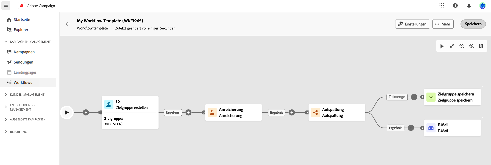

# Erstellen einer orchestrierten Kampagne {#create-first-campaign}

>[!CONTEXTUALHELP]
>id="ajo_campaign_creation_workflow"
>title="Liste der orchestrierten Kampagnen"
>abstract="Unter der Registerkarte **Mehrstufig** werden alle mehrstufigen Kampagnen aufgelistet. Klicken Sie auf den Namen einer orchestrierten Kampagne, um sie zu bearbeiten. Über die Schaltfläche **Orchestrierte Kampagne erstellen** können Sie eine neue orchestrierte Kampagne hinzufügen."

+++ Inhaltsverzeichnis

| Willkommen bei koordinierten Kampagnen | Starten der ersten orchestrierten Kampagne | Abfragen der Datenbank | Orchestrierte Kampagnenaktivitäten |
|---|---|---|---|
| [Erste Schritte mit orchestrierten Kampagnen](gs-orchestrated-campaigns.md)  [Konfigurationsschritte](configuration-steps.md)  [Schlüsselschritte für die orchestrierte Kampagnenerstellung](gs-campaign-creation.md) | [Orchestrierte Kampagne erstellen](create-orchestrated-campaign.md)  [Aktivitäten orchestrieren](orchestrate-activities.md)  [ Nachrichten mit orchestrierten Kampagnen senden](send-messages.md)  [Kampagne starten und überwachen](start-monitor-campaigns.md)  [Reporting](reporting-campaigns.md) | [Arbeiten mit dem Regel-Builder](orchestrated-rule-builder.md)  [Erstellen Sie Ihre ersten ](build-query.md)  [-Bearbeitungsausdrücke](edit-expressions.md) | [Erste Schritte mit Aktivitäten](activities/about-activities.md)  Aktivitäten: [Und-Verknüpfung](activities/and-join.md) - [Zielgruppe aufbauen](activities/build-audience.md) - [Dimensionsänderung](activities/change-dimension.md) - [Kombinieren](activities/combine.md) - [Deduplizierung](activities/enrichment.md) - [Verzweigung](activities/fork.md) - [Abstimmung](activities/reconciliation.md) - [Aufspaltung](activities/split.md) Warten](activities/deduplication.md) [ |

{style="table-layout:fixed"}

+++

 

## Erstellen der Kampagne

Gehen Sie wie folgt vor, um eine orchestrierte Kampagne zu erstellen:

1. Um eine **koordinierte Kampagne** zu erstellen, navigieren Sie zum Menü **Kampagnen**.

1. Klicken Sie auf **[!UICONTROL Orchestrierte Kampagne erstellen]** in der oberen rechten Ecke des Bildschirms.

1. Wählen Sie im Dialogfeld **Eigenschaften** die Vorlage aus, die zur Erstellung der orchestrierten Kampagne verwendet werden soll (Sie können auch die standardmäßige integrierte Vorlage verwenden). [Erfahren Sie mehr über orchestrierte Kampagnenvorlagen](#campaign-templates).

1. Geben Sie einen Titel für die orchestrierte Kampagne ein. Darüber hinaus empfehlen wir dringend, zu Ihrer orchestrierten Kampagne eine Beschreibung im entsprechenden Feld des Abschnitts „Zusätzliche **[!UICONTROL &quot;]** Bildschirms hinzuzufügen.

1. Erweitern Sie den Abschnitt **[!UICONTROL Zusätzliche Optionen]**, um weitere Einstellungen für die orchestrierte Kampagne zu konfigurieren.

1. Klicken Sie auf **[!UICONTROL Orchestrierte Kampagne erstellen]**, um die Erstellung Ihrer orchestrierten Kampagne zu bestätigen.

Ihre orchestrierte Kampagne wird jetzt erstellt und ist in der Liste der Workflows verfügbar. Sie können jetzt auf die visuelle Arbeitsfläche zugreifen und mit dem Hinzufügen, Konfigurieren und Orchestrieren der Aufgaben beginnen, die ausgeführt werden sollen. [Erfahren Sie, wie Sie orchestrierte Kampagnenaktivitäten ](orchestrate-activities.md).

## Kampagneneinstellungen konfigurieren

Überblick über neue Admin-Einstellungen > Schemata, Ausführungsfelder, Zusammenführungsrichtlinie. [Weitere Informationen](configuration-steps.md)

## Arbeiten mit Vorlagen für orchestrierte Kampagnen {#campaign-templates}

>[!CONTEXTUALHELP]
>id="ajo_workflow_template_for_campaign"
>title="Vorlagen für orchestrierte Kampagnen"
>abstract="Vorlagen für orchestrierte Kampagnen enthalten vorkonfigurierte Einstellungen und Aktivitäten, die zur Erstellung neuer orchestrierter Kampagnen wiederverwendet werden können."

>[!CONTEXTUALHELP]
>id="ajo_workflow_template_creation_properties"
>title="Eigenschaften orchestrierter Kampagnen"
>abstract="Vorlagen für orchestrierte Kampagnen enthalten vorkonfigurierte Einstellungen und Aktivitäten, die zur Erstellung neuer orchestrierter Kampagnen wiederverwendet werden können. Geben Sie in diesem Bildschirm das Label der Vorlage für orchestrierte Kampagnen ein und konfigurieren Sie die zugehörigen Einstellungen wie den internen Namen, den Ordner und die Ausführungsordner, die Zeitzone und die Gruppe der Verantwortlichen."

Vorlagen für orchestrierte Kampagnen enthalten vorkonfigurierte Einstellungen und Aktivitäten, die zur Erstellung neuer orchestrierter Kampagnen wiederverwendet werden können. Sie können bei der Erstellung einer orchestrierten Kampagne die Vorlage der orchestrierten Kampagne in den Eigenschaften der orchestrierten Kampagne auswählen. Standardmäßig wird eine leere Vorlage bereitgestellt.

Sie können eine Vorlage aus einer vorhandenen orchestrierten Kampagne erstellen oder eine neue Vorlage von Grund auf neu erstellen. Beide Methoden werden nachfolgend beschrieben.

>[!BEGINTABS]

>[!TAB Erstellen Sie eine Vorlage aus einer vorhandenen orchestrierten Kampagne]

Gehen Sie wie folgt vor, um eine orchestrierte Kampagnenvorlage aus einer vorhandenen orchestrierten Kampagne zu erstellen:

1. Öffnen Sie das Menü **Kampagne** und navigieren Sie zur orchestrierten Kampagne, um sie als Vorlage zu speichern.
1. Klicken Sie auf die drei Punkte rechts neben dem Namen der orchestrierten Kampagne und wählen Sie **Als Vorlage kopieren**.
1. Bestätigen Sie im Popup-Fenster die Vorlagenerstellung.
1. Markieren, fügen Sie die Aktivitäten auf der Arbeitsfläche der orchestrierten Kampagnenvorlage nach Bedarf hinzu und konfigurieren Sie sie.
1. Navigieren Sie über die Schaltfläche **Einstellungen** zum Namen der orchestrierten Kampagnenvorlage und geben Sie eine Beschreibung ein.
1. Wählen Sie den **Ordner** und den **Ausführungsordner** der Vorlage aus. Der Ordner ist der Speicherort, an dem die orchestrierte Kampagnenvorlage gespeichert wird. Der Ausführungsordner ist der Ordner, in dem die auf dieser Vorlage basierenden orchestrierten Kampagnen gespeichert werden.
1. Speichern Sie Ihre Änderungen.

Die orchestrierte Kampagnenvorlage ist jetzt in der Vorlagenliste verfügbar. Sie können eine auf dieser Vorlage basierende orchestrierte Kampagne erstellen. Diese orchestrierte Kampagne wird mit den in der Vorlage definierten Einstellungen und Aktivitäten vorkonfiguriert.

>[!TAB Erstellen einer Vorlage von Grund auf]

Gehen Sie wie folgt vor, um eine neue orchestrierte Kampagnenvorlage zu erstellen:

1. Öffnen Sie das Menü **Kampagne** und navigieren Sie zur Registerkarte **Vorlagen**. Eine Liste der verfügbaren orchestrierten Kampagnenvorlagen wird angezeigt.
1. Klicken Sie auf **[!UICONTROL Vorlage erstellen]** in der rechten oberen Ecke des Bildschirms.
1. Geben Sie den Titel ein und öffnen Sie die zusätzlichen Optionen, um eine Beschreibung Ihrer orchestrierten Kampagnenvorlage einzugeben.
1. Wählen Sie den Ordner und den Ausführungsordner der Vorlage aus. Der Ordner ist der Speicherort, an dem die orchestrierte Kampagnenvorlage gespeichert wird. Der Ausführungsordner ist der Ordner, in dem die auf dieser Vorlage basierenden orchestrierten Kampagnen gespeichert werden.
1. Klicken Sie anschließend auf die Schaltfläche **Erstellen**, um Ihre Einstellungen zu bestätigen.
1. Fügen Sie auf der Arbeitsfläche für orchestrierte Kampagnenvorlagen die Aktivitäten nach Bedarf hinzu und konfigurieren Sie sie.

   {zoomable="yes"}

1. Speichern Sie Ihre Änderungen.

Die orchestrierte Kampagnenvorlage ist jetzt in der Vorlagenliste verfügbar. Sie können eine auf dieser Vorlage basierende orchestrierte Kampagne erstellen. Diese orchestrierte Kampagne wird mit den in der Vorlage definierten Einstellungen und Aktivitäten vorkonfiguriert.

>[!ENDTABS]
