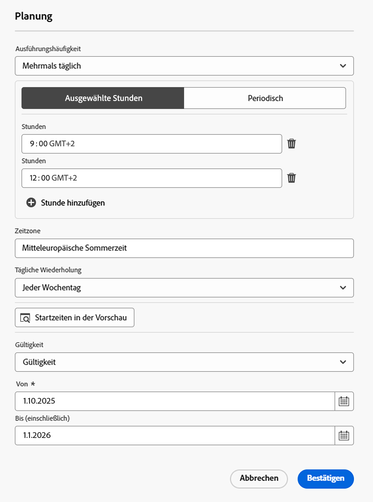

# Erstellen und Planen einer orchestrierten Kampagne {#create-first-campaign}

+++ Inhaltsverzeichnis

| Willkommen bei koordinierten Kampagnen | Starten Ihrer ersten orchestrierten Kampagne | Abfragen der Datenbank | Aktivitäten für orchestrierte Kampagnen |
|---|---|---|---|
| [Erste Schritte mit orchestrierten Kampagnen](gs-orchestrated-campaigns.md)  Erstellen und Verwalten von relationalen Schemata und Datensätzen:  <ul><li>[Erste Schritte mit Schemata und Datensätzen](gs-schemas.md)</li><li>[Manuelles Schema](manual-schema.md)</li><li>[Datei-Upload-Schema](file-upload-schema.md)</li><li>[Daten aufnehmen](ingest-data.md)</li></ul>[Zugriff und Verwaltung orchestrierter Kampagnen](access-manage-orchestrated-campaigns.md)  [Die wichtigsten Schritte zum Erstellen einer orchestrierten Kampagne](gs-campaign-creation.md) | <b>[Erstellen und Planen der Kampagne](create-orchestrated-campaign.md)</b>  [Orchestrieren von Aktivitäten](orchestrate-activities.md)  [ Starten und Überwachen der Kampagne](start-monitor-campaigns.md)  [Reporting](reporting-campaigns.md) | [Arbeiten mit dem Regel-Builder](orchestrated-rule-builder.md)  [Erstellen der ersten Abfrage](build-query.md)  [Ausdrücke bearbeiten](edit-expressions.md)  [Retargeting](retarget.md) | [Erste Schritte mit Aktivitäten](activities/about-activities.md)  Aktivitäten: [Und-Verknüpfung](activities/and-join.md) - [Zielgruppe aufbauen](activities/build-audience.md) - [Dimension ändern](activities/change-dimension.md) - [Kanalaktivitäten](activities/channels.md) - [Kombinieren](activities/combine.md) - [Anreicherung](activities/deduplication.md) - [Formulare](activities/enrichment.md) - [Abstimmung](activities/fork.md) [&#128279;](activities/reconciliation.md) [&#128279;](activities/save-audience.md) [&#128279;](activities/split.md) ->Zielgruppe speichern[ -AufspaltungWarten](activities/wait.md) |

{style="table-layout:fixed"}

+++
 

>[!BEGINSHADEBOX]

 

Der Inhalt dieser Seite ist nicht endgültig und kann geändert werden.

>[!ENDSHADEBOX]

Erstellen Sie eine orchestrierte Kampagne in [!DNL Adobe Journey Optimizer] und konfigurieren Sie die Ausführungsplanung, um den Start und die Ausführungsdauer zu steuern. Wählen Sie diese Option, um die Kampagne sofort, zu einem bestimmten Datum und zu einer bestimmten Uhrzeit oder wiederkehrend mit flexiblen Planungsoptionen wie täglich, wöchentlich oder monatlich zu starten.

## Erstellen der Kampagne {#create}

>[!CONTEXTUALHELP]
>id="ajo_campaign_creation_workflow"
>title="Liste der orchestrierten Kampagnen"
>abstract="Auf der Registerkarte **Orchestrierung** werden alle orchestrierten Kampagnen aufgelistet. Klicken Sie auf den Namen einer orchestrierten Kampagne, um sie zu bearbeiten. Über die Schaltfläche **Orchestrierte Kampagne erstellen** können Sie eine neue orchestrierte Kampagne hinzufügen."

Gehen Sie wie folgt vor, um eine orchestrierte Kampagne zu erstellen:

1. Gehen Sie zum Menü **[!UICONTROL Kampagnen]**, wählen Sie die Registerkarte **[!UICONTROL Orchestrierung]** und klicken Sie auf **[!UICONTROL Kampagne erstellen]**.

   

1. Geben Sie einen Namen und eine Beschreibung für die Kampagne ein.

1. *(optional)* Verwenden Sie das Feld **[!UICONTROL Tags]**, um Ihrer Kampagne einheitliche Adobe Experience Platform-Tags zuzuweisen. Auf diese Weise können Sie sie einfach klassifizieren und die Suche über die Liste der orchestrierten Kampagnen verbessern. [Erfahren Sie, wie Sie mit Tags arbeiten](../start/search-filter-categorize.md#tags).

1. Klicken Sie auf **[!UICONTROL Erstellen]**.

Ihre orchestrierte Kampagne wird jetzt erstellt und in der Liste „orchestrierte Kampagnen“ angezeigt. Sie können diese Eigenschaften jederzeit aktualisieren, indem Sie auf das Symbol  auf der Kampagnenarbeitsfläche klicken.

## Planen der Kampagne {#schedule}

>[!CONTEXTUALHELP]
>id="ajo_orchestration_scheduler"
>title="Planung"
>abstract="Als Kampagnen-Manager können Sie Kampagnen so planen, dass sie zu bestimmten Zeiten automatisch gestartet werden, was einen präzisen Zeitpunkt und genaue Zielgruppendaten für Marketing-Nachrichten ermöglicht."

>[!CONTEXTUALHELP]
>id="ajo_orchestration_schedule_validity"
>title="Gültigkeit der Planung"
>abstract="Sie können einen Gültigkeitszeitraum für die Planung definieren. Er kann dauerhaft sein (Standard) oder bis zu einem bestimmten Datum gültig sein."

>[!CONTEXTUALHELP]
>id="ajo_orchestration_schedule_options"
>title="Planungsoptionen"
>abstract="Definieren Sie die Häufigkeit der Planung. Er kann zu einem bestimmten Zeitpunkt, einmal oder mehrmals pro Tag, Woche oder Monat, ausgeführt werden."

Standardmäßig beginnen orchestrierte Kampagnen, wenn sie manuell aktiviert werden, und enden, sobald die zugehörigen Aktivitäten ausgeführt wurden. Wenn Sie es vorziehen, die Ausführung zu verzögern oder die Kampagne wiederkehrend auszuführen, können Sie einen Zeitplan für die Kampagne definieren.

Beachten Sie bei der Planung orchestrierter Kampagnen die folgenden Best Practices, um eine optimale Leistung und das erwartete Verhalten sicherzustellen:

* Planen Sie keine orchestrierte Kampagne, die öfter als alle 15 Minuten ausgeführt wird, da die Gesamtleistung des Systems beeinträchtigt werden kann und Blockierungen in der Datenbank entstehen können.
* Wenn Sie eine einmalige Nachricht in Ihrer orchestrierten Kampagne senden möchten, können Sie sie auf „Einmal **&quot;**.
* Wenn Sie in einer orchestrierten Kampagne eine wiederkehrende Nachricht senden möchten, müssen Sie eine **Planung**-Option verwenden und die Ausführungsfrequenz festlegen. Die Aktivität „Wiederkehrender Versand“ ermöglicht keine Festlegung eines Zeitplans.

Gehen Sie wie folgt vor, um den Kampagnenzeitplan zu konfigurieren:

1. Öffnen Sie die Kampagne und klicken Sie auf die **[!UICONTROL So bald wie möglich]**.

   

1. Wählen Sie eine Ausführungshäufigkeit für die Kampagne aus und konfigurieren Sie dann die verfügbaren Optionen. Die Einstellungen variieren je nach ausgewählter Häufigkeit:

   +++Einmal

   Die Kampagne nur einmal zu einem bestimmten Datum und zu einer bestimmten Uhrzeit ausführen.

   * **[!UICONTROL Datum]**: Wählen Sie das Datum aus, an dem die Kampagne ausgeführt werden soll.
   * **[!UICONTROL Time]**: Wählen Sie den Zeitpunkt aus, zu dem die Kampagne ausgeführt werden soll.

   +++

   +++täglich

   Die Kampagne wird täglich oder an ausgewählten Tagen ausgeführt.

   * **[!UICONTROL Tägliche Wiederholung]**: Wählen Sie aus, wie oft die Kampagne ausgeführt werden soll:
      * **[!UICONTROL Täglich]**: Führt die Kampagne an jedem Wochentag aus, einschließlich am Wochenende.
      * **[!UICONTROL An Wochentagen]**: Führt die Kampagne nur von Montag bis Freitag aus.
      * **[!UICONTROL Über einen bestimmten Zeitraum]**: Führt die Kampagne täglich innerhalb eines definierten Datumsbereichs aus (z. B. vom 1. Juli bis zum 15. Juli). Die Kampagne wird nicht außerhalb dieses Bereichs ausgeführt.
      * **[!UICONTROL An ausgewählten Wochentagen]**: Führt die Kampagne nur an den angegebenen Wochentagen aus (z. B. Montag, Mittwoch, Freitag).

   * **[!UICONTROL Startzeit]**: Definieren Sie die Zeit, zu der die Kampagne jeden Tag ausgeführt werden soll.

   +++

   +++Mehrmals täglich

   Führen Sie die Kampagne am selben Tag mehrmals aus. Sie können bestimmte Zeiten auswählen oder eine periodische Häufigkeit festlegen.

   * **[!UICONTROL Ausgewählte Stunden]**: Wählen Sie die spezifischen Zeiten aus, zu denen die Kampagne ausgeführt werden soll, und konfigurieren Sie ihre tägliche Wiederholung (wird an jedem Wochentag oder an bestimmten Tagen ausgeführt).
   * **[!UICONTROL Periodisch]** Wählen Sie diese Option, um die Kampagne alle n Minuten oder Stunden auszuführen. Sie können auch den Zeitraum innerhalb des Tages definieren, an dem Ausführungen zulässig sind.

   +++

   +++Wöchentlich

   Die Kampagne wird wöchentlich ausgeführt, mit Optionen für bestimmte Tage.

   * **[!UICONTROL Häufigkeit]**: Wählen Sie aus, wie oft die Kampagne ausgeführt werden soll (z. B. jede Woche, alle 2 Wochen).
   * **[!UICONTROL Ab Datum]**: Wählen Sie das Datum aus, an dem die Wiederholung beginnen soll.
   * **[!UICONTROL Tägliche Wiederholung]**: Wählen Sie bestimmte Wochentage für die Ausführung aus (z. B. jeden Montag und Donnerstag).
   * **[!UICONTROL Startzeit]** Legen Sie die Zeit fest, zu der die Kampagne an ausgewählten Tagen ausgeführt werden soll.

   +++

   +++Monatlich

   Die Kampagne wird monatlich mit Optionen für bestimmte Tage ausgeführt.

   * **[!UICONTROL Monatliches Intervall]**: Wählen Sie aus, ob die Kampagne jeden Monat oder nur während bestimmter Monate ausgeführt wird.
   * **[!UICONTROL Tägliche Wiederholung]**:
      * **[!UICONTROL Täglich]**: Führt die Kampagne an jedem Kalendertag im Monat aus, einschließlich an Wochenenden.
      * **[!UICONTROL Letzter Tag des Monats]**: Führt die Kampagne nur am letzten Kalendertag jedes Monats aus (z. B. 31. Januar, 28. Februar 29).
      * **[!UICONTROL Bestimmter Tag des Monats (z. B. 15.)]**: Führt die Kampagne an einem bestimmten Tag aus (z. B. am 15. jedes Monats).
      * **[!UICONTROL Erster/letzter oder n-ter Tag der Woche]** (z. B. erster Montag):      Führt die Kampagne an einem bestimmten Wochentag aus (z. B. am 15. jeder Woche).
      * **[!UICONTROL Ausgewählte Wochentage:]** die Kampagne an einem bestimmten Tag aus.

   * **[!UICONTROL Startzeit]**: Legen Sie die Zeit fest, zu der die Kampagne ausgeführt werden soll.

   +++

1. Mit der Einstellung **[!UICONTROL Gültigkeitszeitraum]** können Sie ein bestimmtes Start- und Enddatum definieren und die Ausführung der Kampagne auf ein begrenztes Zeitfenster beschränken.

1. Klicken Sie bei wiederkehrenden Zeitplänen auf die Schaltfläche **[!UICONTROL Startzeiten in der Vorschau anzeigen]**, um basierend auf der aktuellen Konfiguration eine Vorschau der genauen bevorstehenden Ausführungsdaten und -zeiten anzuzeigen. Dadurch wird der Zeitplan vor der Aktivierung überprüft und sichergestellt, dass die Kampagne wie erwartet ausgeführt wird.

>[!NOTE]
>
>Stellen Sie bei der Planung von Kampagnen in [!DNL Adobe Journey Optimizer] sicher, dass Ihr Startdatum und Ihre Startzeit mit dem gewünschten ersten Versand übereinstimmen. Wenn bei wiederkehrenden Kampagnen die anfängliche geplante Zeit bereits überschritten ist, werden die Kampagnen gemäß ihren Intervallregeln auf das nächste verfügbare Zeitfenster verschoben.

Im folgenden Beispiel wird die Aktivität so konfiguriert, dass die orchestrierte Kampagne zweimal täglich um 9 Uhr und um 12 Uhr täglich zwischen dem 1. Oktober 2025 und dem 1. Januar 2026 ausgeführt wird.

{width="50%" align="left"}

## Nächste Schritte {#next}

Sobald Ihre Kampagneneinstellungen und der Zeitplan konfiguriert sind, können Sie mit der Orchestrierung der verschiedenen Aufgaben beginnen, die sie ausführen soll. [Erfahren Sie, wie Sie Kampagnenaktivitäten orchestrieren](../orchestrated/orchestrate-activities.md)
