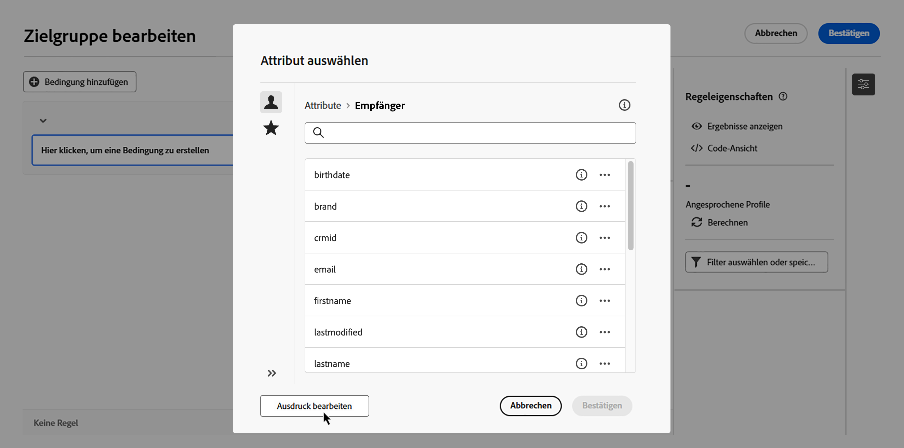
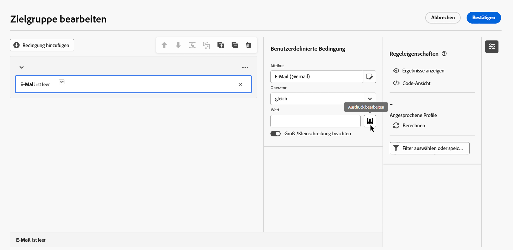
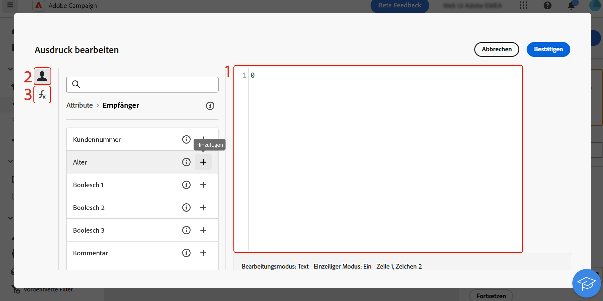

# Bearbeiten von Ausdrücken {#edit-expressions}

+++ Inhaltsverzeichnis

| Willkommen bei koordinierten Kampagnen | Starten Ihrer ersten orchestrierten Kampagne | Abfragen der Datenbank | Aktivitäten für orchestrierte Kampagnen |
|---|---|---|---|
| [Erste Schritte mit orchestrierten Kampagnen](gs-orchestrated-campaigns.md)  [Konfigurationsschritte](configuration-steps.md)  [Zugreifen auf und Verwalten von orchestrierten Kampagnen](access-manage-orchestrated-campaigns.md) | [Wichtige Schritte für die orchestrierte Kampagnenerstellung](gs-campaign-creation.md)  [Erstellen und Planen der Kampagne](create-orchestrated-campaign.md)  [Orchestrieren von Aktivitäten](orchestrate-activities.md)  [Starten und Überwachen der Kampagne](start-monitor-campaigns.md)  [Reporting](reporting-campaigns.md) | [Arbeiten mit dem Regel-Builder](orchestrated-rule-builder.md)  [Erstellen der ersten Abfrage](build-query.md)  <b>[Ausdrücke bearbeiten](edit-expressions.md)</b>  [Retargeting](retarget.md) | [Erste Schritte mit Aktivitäten](activities/about-activities.md)  Aktivitäten: [Und-Verknüpfung](activities/and-join.md) - [Zielgruppe aufbauen](activities/build-audience.md) - [Dimension ändern](activities/change-dimension.md) - [Kanalaktivitäten](activities/channels.md) - [Kombinieren](activities/combine.md) - [Anreicherung](activities/deduplication.md) - [Formulare](activities/enrichment.md) - [Abstimmung](activities/fork.md) [&#128279;](activities/reconciliation.md) [&#128279;](activities/save-audience.md) [&#128279;](activities/split.md) ->Zielgruppe speichern[ -AufspaltungWarten](activities/wait.md) |

{style="table-layout:fixed"}

+++
 

>[!NOTE]
>
>Im folgenden Abschnitt finden Sie Informationen zum Erstellen von Regeln mit dem Ausdruckseditor. Beachten Sie, dass sich die zum Erstellen von Regeln verwendete Syntax von der für die Personalisierung verwendeten unterscheidet.

## Arbeiten mit dem Ausdruckseditor {#edit}

Die Bearbeitung von Ausdrücken erfolgt durch die manuelle Eingabe von Bedingungen, die in ihrer Gesamtheit eine Regel bilden. Dieser Modus bietet erweiterte Funktionen, mit denen Sie die Werte zur Durchführung bestimmter Abfragen ändern können, z. B. Bearbeitung von Daten, Strings, numerischen Feldern und Sortierungen.

Der Ausdruckseditor ist über die Schaltfläche „Ausdruck bearbeiten **[!UICONTROL des Regel-Builders verfügbar]** die beim Konfigurieren einer benutzerdefinierten Bedingung für die Felder **[!UICONTROL Attribut]** und **[!UICONTROL Wert]** verfügbar ist.

| Zugriff über das Feld **Attribut** | Zugriff über das Feld **Wert** |
| --- | --- |
| {zoomable="yes"}{width="200" align="center" zoomable="yes"} | {zoomable="yes"}{width="200" align="center" zoomable="yes"} |

Der Ausdruckseditor bietet Folgendes:

* ein **Eingabefeld (1)**, in dem der Ausdruck definiert wird,
* eine Liste der verfügbaren **Felder (2)**, die im Ausdruck verwendet werden können und die der Zielgruppendimension der Abfrage entsprechen,
* **Hilfsfunktionen (3)**, sortiert nach Kategorie.

Bearbeiten Sie den Ausdruck, indem Sie ihn direkt in das Eingabefeld eingeben. Um ein Feld oder eine Hilfsfunktion hinzuzufügen, gehen Sie mit dem Cursor zu dem Ausdruck, zu dem Sie es/sie hinzufügen möchten, und klicken Sie auf die Schaltfläche „+“.

{zoomable="yes"}

## Hilfsfunktionen

Der Abfrageeditor bietet fortgeschrittene Funktionen zur Erstellung komplexer Filter, je nach den gewünschten Ergebnissen und der Art der bearbeiteten Daten. Folgende Funktionen stehen zur Verfügung:

### Aggregat

Aggregatfunktionen führen Berechnungen für eine Reihe von Werten durch.

<table>
<tbody>
<tr>
<td><strong>Name</strong></td>
<td><strong>Beschreibung</strong></td>
<td><strong>Syntax</strong></td>
</tr>
<tr>
<td><strong>Avg</strong></td>
<td>Gibt den Durchschnittswert einer Spalte vom Typ Zahl aus</td>
<td>Avg(&lt;Wert&gt;)</td>
</tr>
<tr>
<td><strong>Anzahl</strong></td>
<td>Zählt die Werte ungleich null einer Spalte</td>
<td>Count(&lt;Wert&gt;)</td>
</tr>
<tr>
<td><strong>CountAll</strong></td>
<td>Zählt die ausgegebenen Werte (alle Felder)</td>
<td>CountAll()</td>
</tr>
<tr>
<td><strong>Countdistinct</strong></td>
<td>Zählt die unterschiedlichen Werte ungleich null einer Spalte</td>
<td>Countdistinct(&lt;Wert&gt;)</td>
</tr>
<tr>
<td><strong>Max</strong></td>
<td>Gibt den Höchstwert einer Spalte vom Typ Zahl, String oder Datum aus</td>
<td>Max(&lt;Wert&gt;)</td>
</tr>
<tr>
<td><strong>Min</strong></td>
<td>Gibt den Mindestwert einer Spalte vom Typ Zahl, String oder Datum aus</td>
<td>Min(&lt;Wert&gt;)</td>
</tr>
<tr>
<td><strong>StdDev</strong></td>
<td>Gibt die Standardabweichung einer Spalte vom Typ Zahl, String oder Datum aus</td>
<td>StdDev(&lt;Wert&gt;)</td>
</tr>
<tr>
<td><strong>StringAgg</strong></td>
<td>Gibt die Konkatenation der Werte einer Spalte vom String-Typ zurück, getrennt durch das Zeichen im zweiten Argument.</td>
<td>StringAgg(&lt;Wert&gt;, &lt;String&gt;)</td>
</tr>
<tr>
<td><strong>Summe</strong></td>
<td>Gibt die Summe der Werte einer Spalte vom Typ Zahl, String oder Datum aus</td>
<td>Sum(&lt;Wert&gt;)</td>
</tr>
</tbody>
</table>

### Datum

Datumsfunktionen dienen zur Bearbeitung von Datums- oder Zeitwerten.

<table>
<tbody>
<tr>
<td><strong>Name</strong></td>
<td><strong>Beschreibung</strong></td>
<td><strong>Syntax</strong></td>
</tr>
<tr>
<td><strong>AddDays</strong></td>
<td>Fügt einem Datum eine Anzahl von Tagen hinzu</td>
<td>AddDays(&lt;date&gt;, &lt;number&gt;)</td>
</tr>
<tr>
<td><strong>AddHours</strong></td>
<td>Fügt einem Datum mehrere Stunden hinzu</td>
<td>AddHours(&lt;date&gt;, &lt;number&gt;)</td>
</tr>
<tr>
<td><strong>AddMinutes</strong></td>
<td>Fügt einem Datum eine Anzahl von Minuten hinzu</td>
<td>AddMinutes(&lt;date&gt;, &lt;number&gt;)</td>
</tr>
<tr>
<td><strong>AddMonths</strong></td>
<td>Fügt einem Datum eine Anzahl von Monaten hinzu</td>
<td>AddMonths(&lt;date&gt;, &lt;number&gt;)</td>
</tr>
<tr>
<td><strong>AddSeconds</strong></td>
<td>Fügt einem Datum eine Anzahl von Sekunden hinzu</td>
<td>AddSeconds(&lt;date&gt;, &lt;number&gt;)</td>
</tr>
<tr>
<td><strong>AddYears</strong></td>
<td>Fügt einem Datum mehrere Jahre hinzu</td>
<td>AddYears(&lt;date&gt;, &lt;number&gt;)</td>
</tr>
<tr>
<td><strong>ConvertNTZ</strong></td>
<td>Konvertiert NTZ-Zeitstempel (Zeitstempel ohne Zeitzone) in TZ (Zeitstempel mit Zeitzone) unter Anwendung der definierten Sitzungszeitzone</td>
<td>ConvertNTZ(&lt;Datum+Zeit&gt;)</td>
</tr>
<tr>
<td><strong>DateCmp</strong></td>
<td>Vergleicht zwei Daten</td>
<td>DateCmp(&lt;Datum&gt;, &lt;Datum&gt;)</td>
</tr>
<tr>
<td><strong>DateOnly</strong></td>
<td>Gibt nur das Datum zurück (mit der Zeit um 00:00 Uhr)</td>
<td>DateOnly(&lt;date&gt;)</td>
</tr>
<tr>
<td><strong>Tag</strong></td>
<td>Gibt die Zahl zurück, die den Tag des Datums darstellt</td>
<td>Tag(&lt;date&gt;)</td>
</tr>
<tr>
<td><strong>DayOfYear</strong></td>
<td>Gibt die Zahl des Tages im Jahr des angegebenen Datums aus</td>
<td>DayOfYear(&lt;Datum&gt;)</td>
</tr>
<tr>
<td><strong>DaysAgo</strong></td>
<td>Gibt das Datum aus, das dem aktuellen Datum abzüglich n Tage entspricht</td>
<td>DaysAgo(&lt;Zahl&gt;)</td>
</tr>
<tr>
<td><strong>DaysAgoInt</strong></td>
<td>Gibt das Datum (Integer JJJJMMTT) aus, das dem aktuellen Datum abzüglich n Tage entspricht</td>
<td>DaysAgoInt(&lt;Zahl&gt;)</td>
</tr>
<tr>
<td><strong>DaysDiff</strong></td>
<td>Gibt die Anzahl von Tagen zwischen zwei Daten aus</td>
<td>DaysDiff(&lt;Enddatum&gt;, &lt;Startdatum&gt;)</td>
</tr>
<tr>
<td><strong>DaysOld</strong></td>
<td>Gibt das Alter in Tagen eines Datums zurück.</td>
<td>DaysOld(&lt;date&gt;)</td>
</tr>
<tr>
<td><strong>GetDate</strong></td>
<td>Gibt das aktuelle Systemdatum des Servers aus</td>
<td>GetDate()</td>
</tr>
<tr>
<td><strong>Stunde</strong></td>
<td>Gibt die Stunde des Datums zurück.</td>
<td>HOUR(&lt;date&gt;)</td>
</tr>
<tr>
<td><strong>HoursDiff</strong></td>
<td>Gibt die Anzahl der Stunden zwischen zwei Datumsangaben zurück.</td>
<td>HoursDiff(&lt;end date&gt;, &lt;start date&gt;)</td>
</tr>
<tr>
<td><strong>Minute</strong></td>
<td>Gibt die Minuten des Datums zurück.</td>
<td>Minute(&lt;date&gt;)</td>
</tr>
<tr>
<td><strong>MinutesDiff</strong></td>
<td>Gibt die Anzahl von Minuten zwischen zwei Datumsangaben zurück.</td>
<td>MinutesDiff(&lt;end date&gt;, &lt;start date&gt;)</td>
</tr>
<tr>
<td><strong>Monat</strong></td>
<td>Gibt die Zahl für den Monat des Datums zurück.</td>
<td>MONTH(&lt;date&gt;)</td>
</tr>
<tr>
<td><strong>MonthsAgo</strong></td>
<td>Gibt das Datum zurück, das dem aktuellen Datum abzüglich n Monaten entspricht.</td>
<td>Vor Monaten(&lt;number&gt;)</td>
</tr>
<tr>
<td><strong>MonthsDiff</strong></td>
<td>Gibt die Anzahl der Monate zwischen zwei Datumsangaben zurück.</td>
<td>MonthsDiff(&lt;end date&gt;, &lt;start date&gt;)</td>
</tr>
<tr>
<td><strong>MonthsOld</strong></td>
<td>Gibt das Alter in Monaten eines Datums zurück.</td>
<td>monthsOld(&lt;date&gt;)</td>
</tr>
<tr>
<td><strong>Oldest</strong></td>
<td>Gibt das älteste Datum in einem Bereich zurück</td>
<td>Oldest(&lt;Datum, Datum&gt;)</td>
</tr>
<tr>
<td><strong>Second</strong></td>
<td>Gibt die Sekunden des Datums zurück.</td>
<td>Second(&lt;date&gt;)</td>
</tr>
<tr>
<td><strong>SecondsDiff</strong></td>
<td>Gibt die Anzahl der Sekunden zwischen zwei Datumsangaben zurück.</td>
<td>SecondsDiff(&lt;end date&gt;, &lt;start date&gt;)</td>
</tr>
<tr>
<td><strong>SubDays</strong></td>
<td>Subtrahiert eine Anzahl von Tagen von einem Datum.</td>
<td>SubDays(&lt;date&gt;, &lt;number&gt;)</td>
</tr>
<tr>
<td><strong>SubHours</strong></td>
<td>Subtrahiert eine Anzahl von Stunden von einem Datum</td>
<td>SubHours(&lt;date&gt;, &lt;number&gt;)</td>
</tr>
<tr>
<td><strong>SubMinutes</strong></td>
<td>Subtrahiert eine Anzahl von Minuten von einem Datum.</td>
<td>SubMinutes(&lt;date&gt;, &lt;number&gt;)</td>
</tr>
<tr>
<td><strong>SubMonths</strong></td>
<td>Zieht eine Anzahl von Monaten von einem Datum ab</td>
<td>SubMonths(&lt;date&gt;, &lt;number&gt;)</td>
</tr>
<tr>
<td><strong>SubSeconds</strong></td>
<td>Subtrahiert eine Anzahl von Sekunden von einem Datum</td>
<td>SubSeconds(&lt;date&gt;, &lt;number&gt;)</td>
</tr>
<tr>
<td><strong>SubYears</strong></td>
<td>Zieht eine Anzahl von Jahren von einem Datum ab</td>
<td>SubYears(&lt;date&gt;, &lt;number&gt;)</td>
</tr>
<tr>
<td><strong>ToDate</strong></td>
<td>Konvertiert ein Datum + die Uhrzeit in ein Datum</td>
<td>ToDate(&lt;date + time&gt;)</td>
</tr>
<tr>
<td><strong>ToDateTime</strong></td>
<td>Konvertiert eine Zeichenfolge in Datum + Uhrzeit</td>
<td>ToDateTime(&lt;string&gt;)</td>
</tr>
<tr>
<td><strong>ToTimestamp</strong></td>
<td>Konvertiert einen String in einen Zeitstempel</td>
<td>ToTimestamp(&lt;String&gt;)</td>
</tr>
<tr>
<td><strong>ToTimeZone</strong></td>
<td>Konvertiert Datum und Uhrzeit in eine Zeitzone</td>
<td>ToTimeZone(&lt;Datum&gt;, &lt;time zone&gt;)</td>
</tr>
<tr>
<td><strong>TruncDate</strong></td>
<td>Kürzt die Angabe des Datums und der Uhrzeit auf Sekunden</td>
<td>TruncDate(@lastModified, &lt;Anzahl Sekunden&gt;)</td>
</tr>
<tr>
<td><strong>TruncDateTZ</strong></td>
<td>Rundet ein Datum + eine Uhrzeit auf eine bestimmte Genauigkeit, ausgedrückt in Sekunden</td>
<td>TruncDateTZ(&lt;date&gt;, &lt;number of seconds&gt;, &lt;time zone&gt;)</td>
</tr>
<tr>
<td><strong>TruncQuarter</strong></td>
<td>Rundet ein Datum auf das Quartal ab</td>
<td>truncQuarter(&lt;date&gt;)</td>
</tr>
<tr>
<td><strong>TruncTime</strong></td>
<td>Rundet den Zeitanteil auf die nächste Sekunde auf.</td>
<td>TruncTime(&lt;date&gt;, &lt;number of seconds&gt;)</td>
</tr>
<tr>
<td><strong>TruncWeek</strong></td>
<td>Rundet ein Datum auf die Woche ab</td>
<td>truncWeek(&lt;date&gt;)</td>
</tr>
<tr>
<td><strong>TruncYear</strong></td>
<td>Rundet ein Datum + die Uhrzeit auf den 1. Januar des Jahres auf.</td>
<td>truncYear(&lt;date&gt;)</td>
</tr>
<tr>
<td><strong>WeekDay</strong></td>
<td>Gibt die Zahl des Wochentages in Bezug auf das Datum aus (0=Montag, 6=Sonntag).</td>
<td>WeekDay(&lt;Datum&gt;)</td>
</tr>
<tr>
<td><strong>Jahr</strong></td>
<td>Gibt die Zahl zurück, die das Jahr des Datums darstellt</td>
<td>Jahr(&lt;date&gt;)</td>
</tr>
<tr>
<td><strong>YearAndMonth</strong></td>
<td>Gibt die Zahl zurück, die das Jahr und den Monat des Datums darstellt</td>
<td>YearAndMonth(&lt;date&gt;)</td>
</tr>
<tr>
<td><strong>YearsAgo</strong></td>
<td>Gibt die Anzahl von Jahren zwischen einem bestimmten Datum und dem aktuellen Datum aus</td>
<td>YearsAgo(&lt;Datum&gt;)</td>
</tr>
<tr>
<td><strong>YearsDiff</strong></td>
<td>Gibt die Anzahl von Jahren zwischen zwei Daten aus</td>
<td>YearsDiff(&lt;Enddatum&gt;, &lt;Startdatum&gt;)</td>
</tr>
<tr>
<td><strong>YearsOld</strong></td>
<td>Gibt das Alter in Jahren eines Datums zurück.</td>
<td>YearsOld(&lt;date&gt;)</td>
</tr>
</tbody>
</table>

>[!NOTE]
>
>Beachten Sie, dass die Funktion **DateOnly** nicht die Zeitzone der bzw. des Benutzenden, sondern des Servers verwendet.

### Geomarketing

Die Geomarketing-Funktionen dienen der Manipulation von geografischen Werten.

<table> 
 <tbody> 
  <tr> 
   <td> <strong>Name</strong>  </td> 
   <td> <strong>Beschreibung</strong>  </td> 
   <td> <strong>Syntax</strong>  </td> 
  </tr> 
  <tr> 
   <td> <strong>Distance</strong>  </td> 
   <td> Gibt die Entfernung zwischen zwei durch Längen- und Breitengrad bezeichneten Punkten aus (in Grad).  </td> 
   <td> Distance(&lt;Längengrad A&gt;, &lt;Breitengrad A&gt;, &lt;Längengrad B&gt;, &lt;Breitengrad B&gt;)  </td>  
  </tr> 
 </tbody> 
</table>

### Numerisch

Die numerischen Funktionen dienen der Konversion von Text in Zahlen.

<table> 
 <tbody> 
  <tr> 
   <td> <strong>Name</strong>  </td> 
   <td> <strong>Beschreibung</strong>  </td> 
   <td> <strong>Syntax</strong>  </td> 
  </tr> 
  <tr> 
   <td> <strong>Abs</strong>  </td> 
   <td> Gibt den absoluten Wert einer Zahl aus  </td> 
   <td> Abs(&lt;Zahl&gt;)  </td>  
  </tr> 
  <tr> 
   <td> <strong>Ceil</strong>  </td> 
   <td> Gibt die kleinste ganze Zahl aus, die größer oder gleich der angegebenen Zahl ist  </td> 
   <td> Ceil(&lt;Zahl&gt;)  </td>  
  </tr> 
  <tr> 
   <td> <strong>Floor</strong>  </td> 
   <td> Gibt die größte ganze Zahl aus, die kleiner oder gleich der angegebenen Zahl ist  </td> 
   <td> Floor(&lt;Zahl&gt;)  </td>  
  </tr> 
  <tr> 
   <td> <strong>Greatest</strong>  </td> 
   <td> Gibt die größere von zwei Zahlen aus  </td> 
   <td> Greatest(&lt;Zahl 1&gt;, &lt;Zahl 2&gt;)  </td>  
  </tr> 
  <tr> 
   <td> <strong>Least</strong>  </td> 
   <td> Gibt die kleinere von zwei Zahlen aus  </td> 
   <td> Least(&lt;Zahl 1&gt;, &lt;Zahl 2&gt;)  </td>  
  </tr> 
  <tr> 
   <td> <strong>Mod</strong>  </td> 
   <td> Gibt den Rest der ganzzahligen Division von n1 durch n2 aus  </td> 
   <td> Mod(&lt;Zahl 1&gt;, &lt;Zahl 2&gt;)  </td>  
  </tr> 
  <tr> 
   <td> <strong>Percent</strong>  </td> 
   <td> Gibt das Verhältnis zwischen zwei Werten in Prozent aus  </td> 
   <td> Percent(&lt;Zahl 1&gt;, &lt;Zahl 2&gt;)  </td>  
  </tr> 
  <tr> 
   <td> <strong>Random</strong>  </td> 
   <td> Gibt einen Zufallswert aus  </td> 
   <td> Random()  </td> 
  </tr> 
  <tr> 
   <td> <strong>Round</strong>  </td> 
   <td> Rundet eine Zahl auf n Dezimalstellen  </td> 
   <td> Round(&lt;Zahl&gt;, &lt;Anzahl Dezimalstellen&gt;)  </td>  
  </tr> 
  <tr> 
   <td> <strong>Sign</strong>  </td> 
   <td> Gibt das Vorzeichen einer Zahl aus  </td> 
   <td> Sign(&lt;Zahl&gt;)  </td>  
  </tr> 
  <tr> 
   <td> <strong>ToDouble</strong>  </td> 
   <td> Konvertiert einen Integer in einen Real  </td> 
   <td> ToDouble(&lt;Zahl&gt;)  </td>  
  </tr> 
  <tr> 
   <td> <strong>ToInt64</strong>  </td> 
   <td> Konvertiert einen Real in einen 64-Bit-Integer  </td> 
   <td> ToInt64(&lt;Zahl&gt;)  </td>  
  </tr> 
  <tr> 
   <td> <strong>ToInteger</strong>  </td> 
   <td> Konvertiert einen Real in einen Integer  </td> 
   <td> ToInteger(&lt;Zahl&gt;)  </td>  
  </tr> 
  <tr> 
   <td> <strong>Trunc</strong>  </td> 
   <td> Kürzt n1 auf n2 Dezimalstellen  </td> 
   <td> Trunc(&lt;n1&gt;, &lt;n2&gt;)  </td>  
  </tr> 
 </tbody> 
</table>

### Sonstige

In dieser Tabelle sind die restlichen verfügbaren Funktionen enthalten.

<table> 
 <tbody> 
  <tr> 
   <td> <strong>Name</strong>  </td> 
   <td> <strong>Beschreibung</strong>  </td> 
   <td> <strong>Syntax</strong>  </td> 
  </tr> 
  <tr> 
   <td> <strong>AESEncrypt</strong>  </td> 
   <td> Verschlüsselt den im Argument angegebenen String  </td> 
   <td> AESEncrypt(&lt;Wert&gt;)  </td> 
  </tr>
  <tr> 
   <td> <strong>Case</strong>  </td> 
   <td> Gibt Wert 1 zurück, wenn die Bedingung zutrifft. Wenn nicht, wird Wert 2 zurückgegeben.  </td> 
   <td> Case(When(&lt;Bedingung&gt;, &lt;Wert 1&gt;), Else(&lt;Wert 2&gt;))  </td> 
  </tr> 
  <tr> 
   <td> <strong>ClearBit</strong>  </td> 
   <td> Löscht das Flag aus dem Wert  </td> 
   <td> ClearBit(&lt;Kennung&gt;, &lt;Flag&gt;)  </td>  
  </tr> 
  <tr> 
   <td> <strong>Coalesce</strong>  </td> 
   <td> Gibt den Wert 2 aus, wenn der Wert 1 gleich null oder leer ist, sonst den Wert 1  </td> 
   <td> Coalesce(&lt;Wert 1&gt;, &lt;Wert 2&gt;)  </td>  
  </tr> 
  <tr> 
   <td> <strong>Decode</strong>  </td> 
   <td> Gibt Wert 3 zurück, wenn Wert 1 = Wert 2 ist. Wenn nicht, wird Wert 4 zurückgegeben.  </td> 
   <td> Decode(&lt;Wert 1&gt;, &lt;Wert 2&gt;, &lt;Wert 3&gt;, &lt;Wert 4&gt;)  </td>  
  </tr>

<tr> 
   <td> <strong>Else</strong>  </td> 
   <td> Gibt den Wert 1 aus (kann nur als Parameter der 'Case'-Funktion verwendet werden)  </td> 
   <td> Else(&lt;Wert 1&gt;, &lt;Wert 2&gt;)  </td>  
  </tr> 
  <tr> 
   <td> <strong>GetEmailDomain</strong>  </td> 
   <td> Extrahiert die Domain einer E-Mail-Adresse  </td> 
   <td> GetEmailDomain(&lt;Wert&gt;)  </td>  
  </tr> 
  <tr> 
   <td> <strong>GetMirrorURL</strong>  </td> 
   <td> Ruft die URL des Mirrorseiten-Servers ab  </td> 
   <td> GetMirrorURL(&lt;Wert&gt;)  </td>  
  </tr> 
  <tr> 
   <td> <strong>Iif</strong>  </td> 
   <td> Gibt Wert 1 aus, wenn die Bedingung zutrifft. Wenn nicht, wird Wert 2 zurückgegeben  </td> 
   <td> Iif(&lt;Bedingung&gt;, &lt;Wert 1&gt;, &lt;Wert 2&gt;)  </td>  
  </tr> 
  <tr> 
   <td> <strong>IsBitSet</strong>  </td> 
   <td> Gibt an, ob das Flag im Wert vorkommt  </td> 
   <td> IsBitSet(&lt;Kennung&gt;, &lt;Flag&gt;)  </td>  
  </tr> 
  <tr> 
   <td> <strong>IsEmptyString</strong>  </td> 
   <td> Gibt den Wert 2 aus, wenn der String 1 leer ist, sonst den Wert 3  </td> 
   <td> IsEmptyString(&lt;Wert 1&gt;, &lt;Wert 2&gt;, &lt;Wert 3&gt;)  </td>  
  </tr> 
  <tr> 
   <td> <strong>NewUUID</strong>  </td> 
   <td> Gibt eine eindeutige ID zurück  </td> 
   <td> NewUUID()  </td>  
  </tr> 
  <tr> 
   <td> <strong>NoNull</strong>  </td> 
   <td> Gibt einen Leerstring aus, wenn das Argument gleich null ist  </td> 
   <td> NoNull(&lt;Wert&gt;)  </td>   
  </tr> 
  <tr> 
   <td> <strong>RowId</strong>  </td> 
   <td> Gibt die Zeilennummer aus  </td> 
   <td> RowId  </td> 
  </tr> 
  <tr> 
   <td> <strong>SetBit</strong>  </td> 
   <td> Setzt das Flag im Wert  </td> 
   <td> SetBit(&lt;Kennung&gt;, &lt;Flag&gt;)  </td>  
  </tr> 
  <tr> 
   <td> <strong>ToBoolean</strong>  </td> 
   <td> Konvertiert eine Zahl in einen booleschen Wert  </td> 
   <td> ToBoolean(&lt;Zahl&gt;)  </td>   
  </tr> 
  <tr> 
   <td> <strong>When</strong>  </td> 
   <td> Gibt Wert 1 aus, wenn die Bedingung zutrifft. Falls nicht, wird Wert 2 zurückgegeben (kann nur als Parameter der Case-Funktion verwendet werden)  </td> 
   <td> When(&lt;Bedingung&gt;, &lt;Wert 1&gt;)  </td>  
  </tr> 
 </tbody> 
</table>

### String

Die String-Funktionen dienen der Manipulation einer Reihe von Strings.

<table> 
 <tbody> 
  <tr> 
   <td> <strong>Name</strong>  </td> 
   <td> <strong>Beschreibung</strong>  </td> 
   <td> <strong>Syntax</strong>  </td> 
  </tr> 
  <tr> 
   <td> <strong>AllNonNull2</strong>  </td> 
   <td> Gibt an, ob alle Parameter ungleich null und nicht leer sind  </td> 
   <td> AllNonNull2(&lt;String&gt;, &lt;String&gt;) </td> 
  </tr> 
  <tr> 
   <td> <strong>AllNonNull3</strong>  </td> 
   <td> Gibt an, ob alle Parameter ungleich null und nicht leer sind  </td> 
   <td> AllNonNull3(&lt;String&gt;, &lt;String&gt;, &lt;String&gt;) </td> 
  </tr> 
  <tr> 
   <td> <strong>Ascii</strong>  </td> 
   <td> Gibt den ASCII-Wert des ersten Zeichens des Strings aus.  </td> 
   <td> Ascii(&lt;String&gt;) </td> 
  </tr> 
  <tr> 
   <td> <strong>Char</strong>  </td> 
   <td> Gibt das ASCII-Code-Zeichen 'n' aus  </td> 
   <td> Char(&lt;Zahl&gt;) </td>  
  </tr> 
  <tr> 
   <td> <strong>Charindex</strong>  </td> 
   <td> Gibt die Position von Zeichenfolge 2 in Zeichenfolge 1 zurück.  </td> 
   <td> Charindex(&lt;string&gt;, &lt;string&gt;) </td> 
  </tr> 
  <tr> 
   <td> <strong>dataLength</strong>  </td> 
   <td> Gibt die Größe der Zeichenfolge in Bytes zurück  </td> 
   <td> dataLength(&lt;string&gt;) </td> 
  </tr> 
  <tr> 
   <td> <strong>GetLine</strong>  </td> 
   <td> Gibt die n-te Zeile (beginnend bei 1) des Strings aus  </td> 
   <td> GetLine(&lt;String&gt;) </td> 
  </tr> 
  <tr> 
   <td> <strong>IfEquals</strong>  </td> 
   <td> Gibt den dritten Parameter zurück, wenn die ersten beiden Parameter identisch sind. Wenn nicht, wird der letzte Parameter zurückgegeben  </td> 
   <td> IfEquals(&lt;String&gt;, &lt;String&gt;, &lt;String&gt;, &lt;String&gt;) </td> 
  </tr> 
  <tr> 
   <td> <strong>IsMemoNull</strong>  </td> 
   <td> Gibt an, ob das als Parameter ausgegebene Memo gleich null ist  </td> 
   <td> IsMemoNull(&lt;Memo&gt;) </td> 
  </tr> 
  <tr> 
   <td> <strong>JuxtWords</strong>  </td> 
   <td> Verkettet die zwei als Parameter übergebenen Zeichenfolgen. Fügt bei Bedarf Leerzeichen zwischen den Zeichenfolgen hinzu.  </td> 
   <td> JuxtWords(&lt;String&gt;, &lt;String&gt;) </td> 
  </tr> 
  <tr> 
   <td> <strong>JuxtWords3</strong>  </td> 
   <td> Verkettet die zwei als Parameter übergebenen Zeichenfolgen. Fügt bei Bedarf Leerzeichen zwischen den Zeichenfolgen hinzu  </td> 
   <td> JuxtWords3(&lt;string&gt;, &lt;string&gt;, &lt;string&gt;) </td>  
  </tr> 
  <tr> 
   <td> <strong>Left</strong>  </td> 
   <td> Gibt die n ersten Zeichen des Strings aus  </td> 
   <td> Left(&lt;String&gt;, &lt;Zahl&gt;) </td> 
  </tr> 
  <tr> 
   <td> <strong>Length</strong>  </td> 
   <td> Gibt die Länge des Strings aus  </td> 
   <td> Length(&lt;String&gt;) </td> 
  </tr> 
  <tr> 
   <td> <strong>Zeile</strong>  </td> 
   <td> Extrahiert Zeile n aus dem String  </td> 
   <td> Line(&lt;String&gt;,&lt;Zahl&gt;) </td> 
  </tr>
  <tr> 
   <td> <strong>Lower</strong>  </td> 
   <td> Gibt den String in Kleinbuchstaben aus  </td> 
   <td> Lower(&lt;String&gt;) </td> 
  </tr> 
  <tr> 
   <td> <strong>LPad</strong>  </td> 
   <td> Gibt den String linksseitig aufgefüllt aus  </td> 
   <td> LPad (&lt;String&gt;, &lt;Number&gt;, &lt;Char&gt;) </td> 
  </tr> 
  <tr> 
   <td> <strong>Ltrim</strong>  </td> 
   <td> Löscht die Leerstellen links vom String  </td> 
   <td> Ltrim(&lt;String&gt;) </td> 
  </tr> 
  <tr> 
   <td> <strong>Md5Digest</strong>  </td> 
   <td> Gibt eine hexadezimale Darstellung des MD5-Schlüssels eines Strings aus  </td> 
   <td> Md5Digest(&lt;String&gt;) </td> 
  </tr> 
  <tr> 
   <td> <strong>MemoContains</strong>  </td> 
   <td> Gibt an, ob das Memo den als Parameter übergebenen String enthält  </td> 
   <td> MemoContains(&lt;Memo&gt;, &lt;String&gt;) </td> 
  </tr> 
  <tr> 
   <td> <strong>NodeValue</strong>  </td> 
   <td> Extrahiert den Wert eines XML-Felds aus seinem XPath und den Felddaten  </td> 
   <td> NodeValue (&lt;String&gt;, &lt;String&gt;) </td> 
  </tr> 
  <tr> 
   <td> <strong>Replace</strong>  </td> 
   <td> Ersetzt alle Vorkommen eines angegebenen String-Werts durch einen anderen String-Wert.  </td> 
   <td> Replace(&lt;String&gt;,&lt;String&gt;,&lt;String&gt;) </td> 
  </tr> 
  <tr> 
   <td> <strong>Right</strong>  </td> 
   <td> Gibt die n letzten Zeichen des Strings aus  </td> 
   <td> Right(&lt;String&gt;)  </td> 
  </tr> 
  <tr> 
   <td> <strong>RPad</strong>  </td> 
   <td> Gibt den String rechtsseitig aufgefüllt aus  </td> 
   <td> RPad(&lt;String&gt;, &lt;Zahl&gt;, &lt;Zeichen&gt;) </td> 
  </tr> 
  <tr> 
   <td> <strong>Rtrim</strong>  </td> 
   <td> Löscht die Leerstellen rechts vom String  </td> 
   <td> Rtrim(&lt;String&gt;)  </td> 
  </tr> 
  <tr> 
   <td> <strong>Sha256Digest</strong>  </td> 
   <td> Hexadezimale Darstellung des SHA256-Schlüssels einer Zeichenfolge.  </td> 
   <td> Sha256Digest (&lt;String&gt;)  </td> 
  </tr> 
  <tr> 
   <td> <strong>Sha512Digest</strong>  </td> 
   <td> Hexadezimale Darstellung des SHA512-Schlüssels einer Zeichenfolge.  </td> 
   <td> Sha512Digest (&lt;String&gt;)  </td> 
  </tr> 
  <tr> 
   <td> <strong>Smart</strong>  </td> 
   <td> Gibt jedes Wort des Strings beginnend mit einem Großbuchstaben aus  </td> 
   <td> Smart(&lt;String&gt;)  </td> 
  </tr> 
  <tr> 
   <td> <strong>Substring</strong>  </td> 
   <td> Extrahiert aus dem String den Teilstring, der mit dem Zeichen n1 beginnt und die Länge n2 aufweist  </td> 
   <td> Substring(&lt;String&gt;, &lt;Start&gt;, &lt;Länge&gt;)  </td>  
  </tr> 
  <tr> 
   <td> <strong>ToString</strong>  </td> 
   <td> Konvertiert eine Zahl in einen String  </td> 
   <td> ToString(&lt;Zahl&gt;, &lt;Zahl&gt;)  </td>  
  </tr> 
  <tr> 
   <td> <strong>Upper</strong>  </td> 
   <td> Gibt den String in Großbuchstaben aus  </td> 
   <td> Upper(&lt;String&gt;)  </td>  
  </tr> 
  <tr> 
   <td> <strong>VirtualLink</strong>  </td> 
   <td> Gibt den Fremdschlüssel einer als erster Parameter übergebenen Relation aus, wenn die beiden anderen Parameter identisch sind  </td> 
   <td> VirtualLink(&lt;Zahl&gt;, &lt;Zahl&gt;, &lt;Zahl&gt;)  </td>  
  </tr> 
  <tr> 
   <td> <strong>VirtualLinkStr</strong>  </td> 
   <td> Gibt den Fremdschlüssel (Text) einer als erster Parameter übergebenen Relation aus, wenn die beiden anderen Parameter identisch sind  </td> 
   <td> VirtualLinkStr(&lt;String&gt;, &lt;Zahl&gt;, &lt;Zahl&gt;)  </td>  
  </tr> 
 </tbody> 
</table>

### Fenster

<table> 
 <tbody> 
  <tr> 
   <td> <strong>Name</strong>  </td> 
   <td> <strong>Beschreibung</strong>  </td> 
   <td> <strong>Syntax</strong>  </td> 
  </tr> 
  <tr> 
   <td> <strong>_Over__</strong>  </td> 
   <td> Ruft die als ersten Parameter eingegebene SQL-Funktion über die als zweiten Parameter eingegebenen Felder „Partition“ oder „Anordnen nach“ aus  </td> 
   <td> _Over_ (&lt;Value&gt;, &lt;Value&gt;)  </td>  
  </tr> 
  <tr> 
   <td> <strong>Desc</strong>  </td> 
   <td> Absteigende Sortierung  </td> 
   <td> Desc(&lt;Wert 1&gt;)  </td>  
  </tr> 
  <tr> 
   <td> <strong>OrderBy</strong>  </td> 
   <td> Sortiert das Ergebnis innerhalb der Partition  </td> 
   <td> OrderBy(&lt;Wert 1&gt;)  </td>  
  </tr> 
  <tr> 
   <td> <strong>PartitionBy</strong>  </td> 
   <td> Partitioniert das Ergebnis einer Abfrage  </td> 
   <td> PartitionBy(&lt;Wert 1&gt;)  </td>  
  </tr> 
  <tr> 
   <td> <strong>RowNum</strong>  </td> 
   <td> Erzeugt eine Zeilennummer in Abhängigkeit von der Tabellenpartition und der Sortierreihenfolge  </td> 
   <td> RowNum(PartitionBy(&lt;Wert 1&gt;), OrderBy(&lt;Wert 1&gt;))  </td> 
  </tr> 
 </tbody> 
</table>
