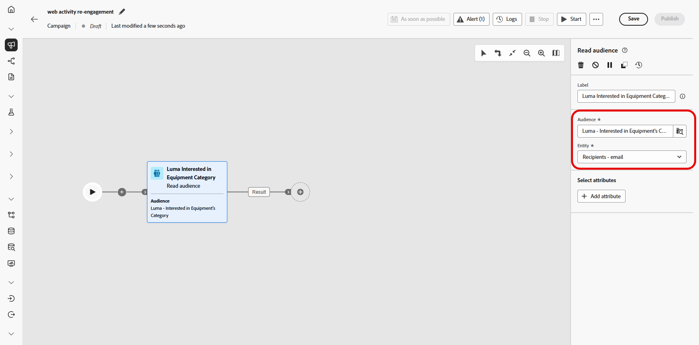
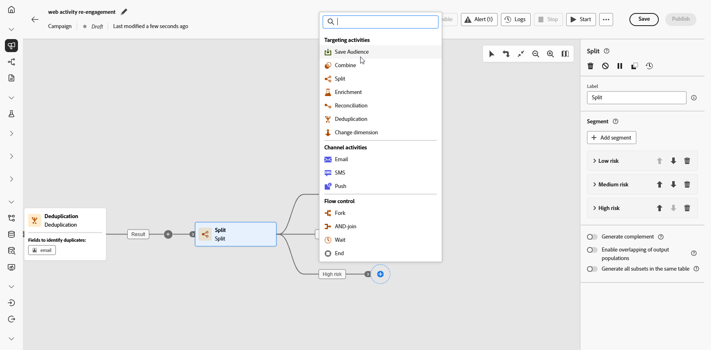
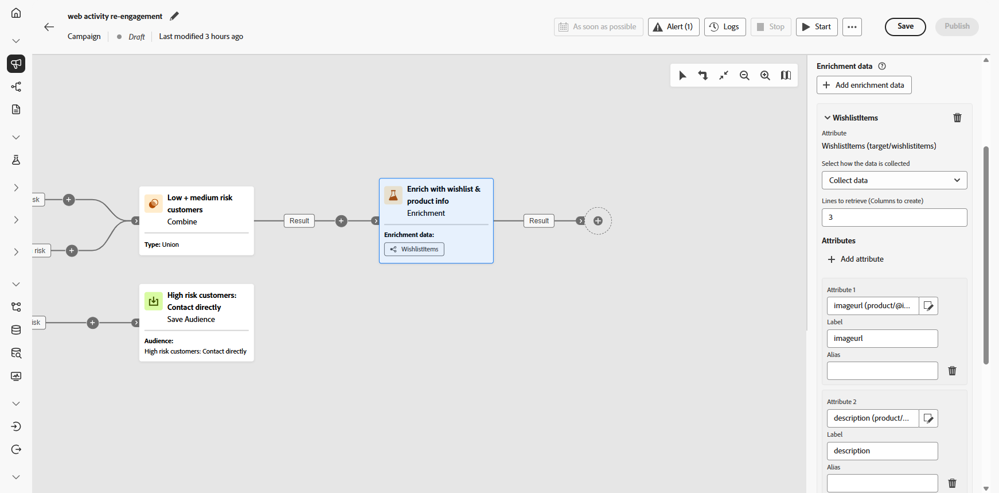
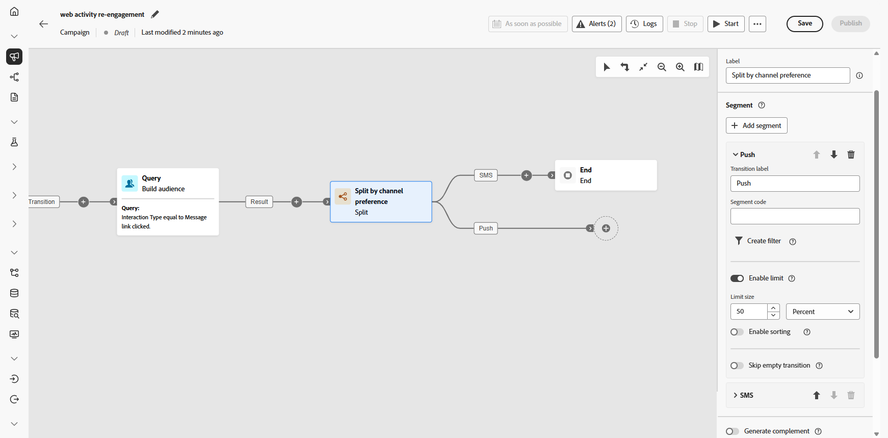
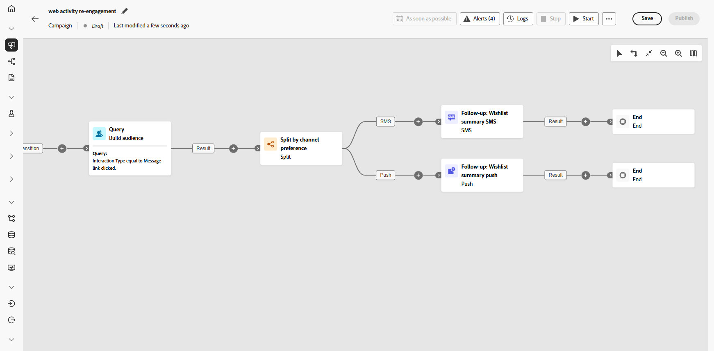

# Interagieren mit Kundinnen und Kunden nach Suchaktivität {#engage-customers-uc}

>[!BEGINSHADEBOX]

Beachten Sie, dass dieser Anwendungsfall mit einer Zielgruppe beginnt, die bereits in Experience Platform vorhanden ist, insbesondere einer Zielgruppe zu Web-Verhalten in Echtzeit, bei der Suchaktivitäten erfasst werden, während sie auftreten. [Weitere Informationen zu Adobe Experience Platform](https://experienceleague.adobe.com/de/docs/experience-platform/rtcdp/intro/rtcdp-intro/get-started#audiences)

**Für diesen Anwendungsfall erforderliche Schemata:**

* **Empfangende:** wird als Zielgruppendimension verwendet, mit Feldern: `email`, `churnprop`
* **Wunschliste:** mit Feldern: `description`, `priceref`, `imageurl`

➡️ [Erfahren Sie, wie Sie relationale Schemata konfigurieren](gs-schemas.md)

>[!ENDSHADEBOX]

{zoomable="yes"}

Diese Kampagne richtet sich an Kundinnen und Kunden, die die Kategorie „Trainingsgeräte“ durchsucht haben. Die Zielgruppe wird dedupliziert und nach Abwanderungsrisiko segmentiert, d. h. wie wahrscheinlich es ist, dass eine Person aufhört, zu interagieren oder Einkäufe zu tätigen.

Kundinnen und Kunden mit hohem Risiko werden in einer separaten neuen Zielgruppe zusammengefasst, die später für eine bestimmte Kommunikation verwendet wird, während Kundinnen und Kunden mit niedrigem und mittlerem Risiko eine mehrstufige Journey mit personalisierten E-Mails und Folgenachrichten durchlaufen.

1. Richten Sie zunächst eine neue Kampagne ein, die speziell auf **Wunschlisten-Rückgewinnung** abzielt. Dadurch wird sichergestellt, dass sich Ihre Werbebotschaft auf Kundschaft konzentriert, die bereits ihre Kaufabsicht gezeigt hat, indem sie Produkte auf ihrer Wunschliste gespeichert hat.

   {zoomable="yes"}

1. Geben Sie Ihre **[!UICONTROL Kampagneneinstellungen]** wie Kampagnenname, Beschreibung, Start- und Enddatum sowie relevante Tags ein.

1. Fügen Sie eine Aktivität des Typs **[!UICONTROL Zielgruppe lesen]** hinzu, um eine vordefinierte Zielgruppe aus Adobe Experience Platform auszuwählen, d. h. Kundinnen und Kunden, die die Kategorie „Trainingsgeräte“ auf Ihrer Website durchsucht haben.

   Die Empfängerinnen und Empfänger werden mit ihren E-Mail-Adressen identifiziert, die aus dem Feld **[!UICONTROL Entität]** ausgewählt wurden.

   {zoomable="yes"}

1. Fügen Sie eine Aktivität des Typs **[!UICONTROL Deduplizierung]** hinzu, um doppelte E-Mail-Adressen aus Ihrer Zielgruppe zu entfernen, sodass jede Person nur eine Nachricht erhält.

1. Klicken Sie auf **[!UICONTROL Attribut hinzufügen]** und wählen Sie „E-Mail“ als Attribut für die Deduplizierung aus.

   {zoomable="yes"}

1. Als Nächstes fügen Sie eine Aktivität des Typs **[!UICONTROL Aufspaltung]** hinzu, um Kundinnen und Kunden nach ihrer Abwanderungswahrscheinlichkeit zu segmentieren, sodass Sie personalisierte Erlebnisse bereitstellen können, die auf jede Kundengruppe zugeschnitten sind.

   {zoomable="yes"}

1. Klicken Sie auf **[!UICONTROL Segment hinzufügen]**, um drei Gruppen zu erstellen:

   * Geringes Risiko

   * Mittleres Risiko

   * Hohes Risiko

   {zoomable="yes"}

1. Klicken Sie auf **[!UICONTROL Filter erstellen]**, um die Abwanderungswahrscheinlichkeit für jede Gruppe zu definieren.

   Verwenden Sie den **Bedingungseditor**, um die spezifischen Werte festzulegen, die das Abwanderungsrisiko jeder Person bestimmen.

   {zoomable="yes"}

1. Jedes Segment wird anders gehandhabt:

   * [Geringes/mittleres Risiko](#low-medium-risk)
   * [Hohes Risiko](#high-risk)

1. Sobald Ihre Kampagne getestet wurde und bereit ist, klicken Sie auf **[!UICONTROL Veröffentlichen]**, um sie live zu schalten.

Nachdem die Kampagne ausgeführt wurde, können Sie das Reporting-Dashboard erkunden, um Leistungsmetriken und wichtige Erkenntnisse zu prüfen.

➡️ [Weitere Informationen zum Reporting](../reports/campaign-global-report-cja.md)

## Segmente mit hohem Risiko {#high-risk}

Erstellen Sie ein dediziertes Zielgruppensegment für Kundinnen und Kunden, bei denen ein hohes Abwanderungsrisiko besteht. Diese Zielgruppe wird später für eine separate, zielgerichtete Kommunikation verwendet.

1. Fügen Sie eine Aktivität des Typs **[!UICONTROL Zielgruppe speichern]** hinzu.

   {zoomable="yes"}

1. Fügen Sie der Zielgruppe ein **[!UICONTROL Label]** hinzu und wählen Sie das **[!UICONTROL Profil-Mapping-Feld]**, in diesem Beispiel **recipients-email**.

   {zoomable="yes"}

Diese Zielgruppe wird dann in Experience Cloud gespeichert, wo sie später für eine bestimmte zielgerichtete Kampagne verwendet werden kann.

## Segmente mit niedrigem/mittlerem Risiko {#low-medium-risk}

Richten Sie für Kundinnen und Kunden mit niedrigem und mittlerem Abwanderungsrisiko eine mehrstufige Kampagne ein, die darauf abzielt, die Interaktion zu stärken:

1. Kombinieren Sie Segmente mit niedrigem und mittlerem Risiko mit einer Aktivität des Typs **[!UICONTROL Vereinigung]**.

   {zoomable="yes"}

1. Fügen Sie eine Aktivität des Typs **[!UICONTROL Anreicherung]** hinzu, um die Kampagne mit Wunschliste und Produktinformationen zu personalisieren.

1. Klicken Sie auf **[!UICONTROL Attribut hinzufügen]** und erstellen Sie die folgenden drei Attribute:

   * `Wishlist > description`
   * `Wishlist > priceref`
   * `Wishlist > imageurl`

   Dadurch wird die Nachricht mit detaillierten Informationen zur Wunschliste angereichert.

   {zoomable="yes"}

1. Erstellen Sie eine neue Zielgruppe für das Retargeting basierend auf der Interaktion mit E-Mails.

   Hier erstellen wir eine Zielgruppe basierend auf E-Mail-Klickereignissen, um alle Personen erneut anzusprechen, die mit einer zuvor gesendeten E-Mail interagiert haben und auf einen Link in dieser Nachricht geklickt haben.

   {zoomable="yes"}

1. Teilen Sie die Interaktion gleichmäßig auf, um eine Folgenachricht über SMS oder Push-Benachrichtigungen zu senden und so Konversionen zu fördern.

   {zoomable="yes"}

1. Erstellen Sie den Nachrichteninhalt für jeden Kanal einschließlich Profilattributen, z. B. den Namen der Empfängerin bzw. des Empfängers, zusammen mit Anreicherungsdaten wie Wunschlistenelementen, um jede Nachricht zu personalisieren.

   {zoomable="yes"}
