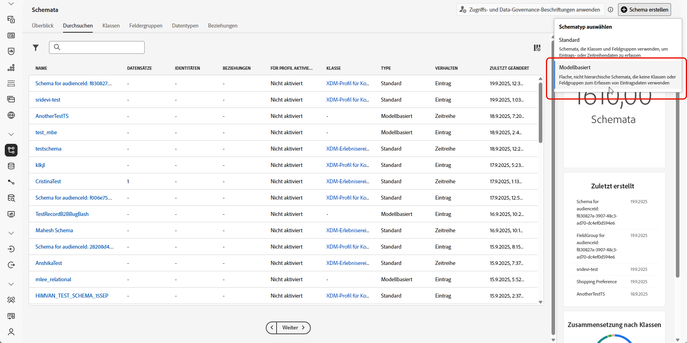
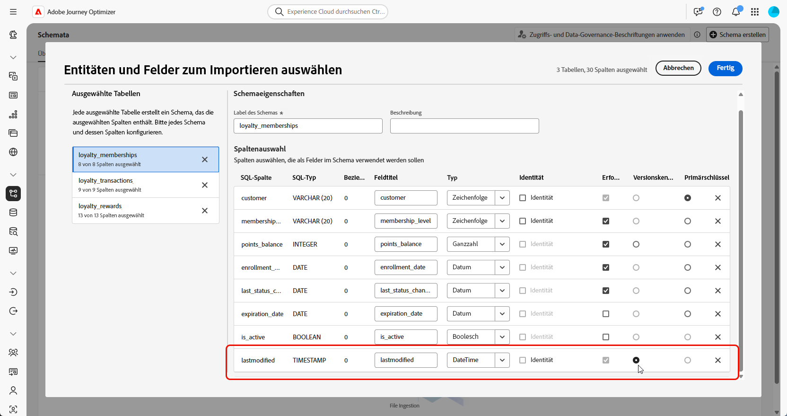
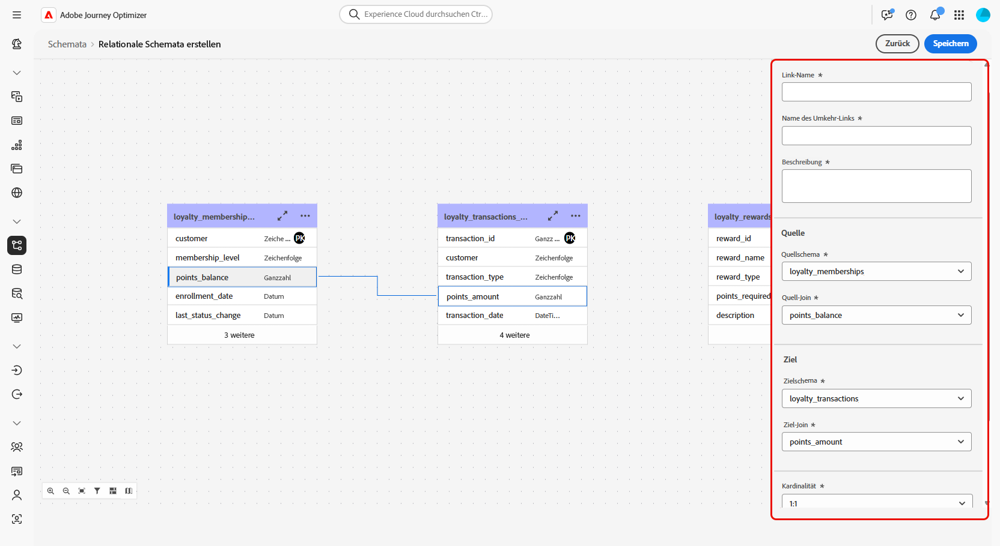
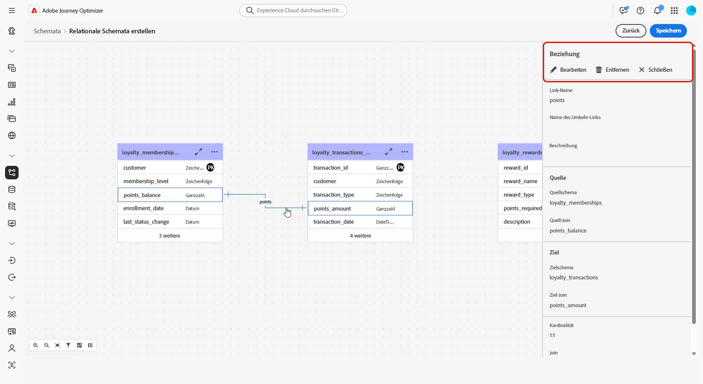
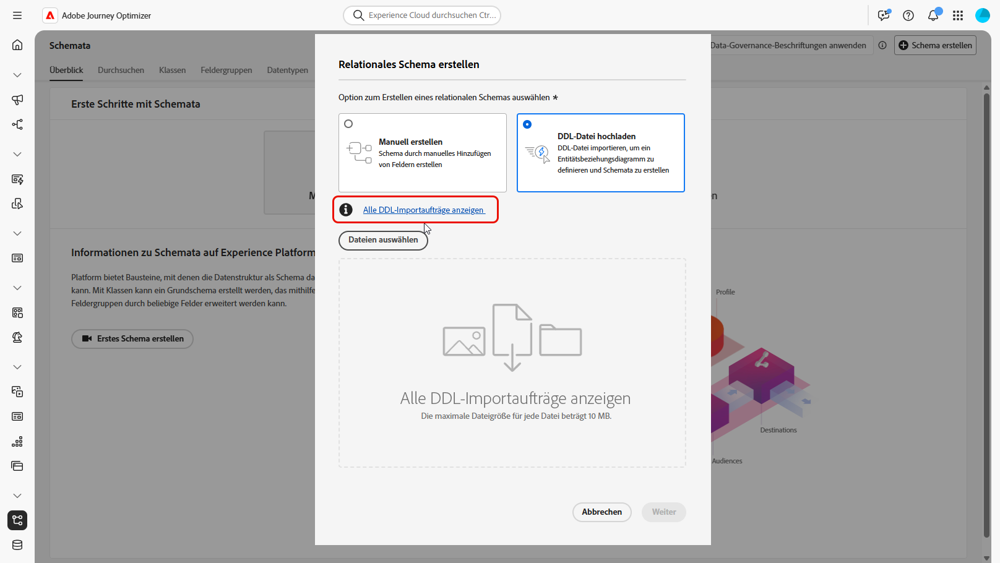
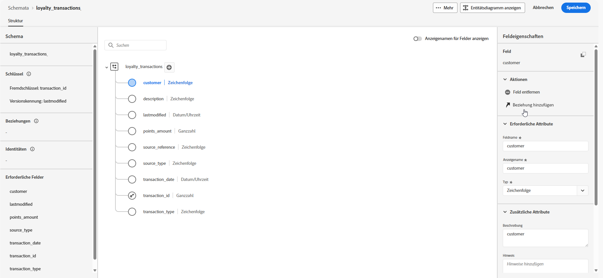
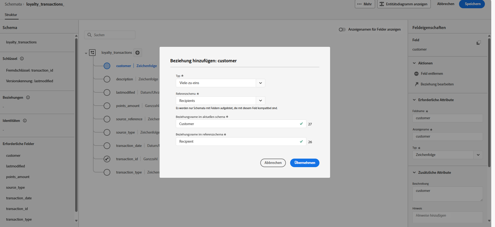
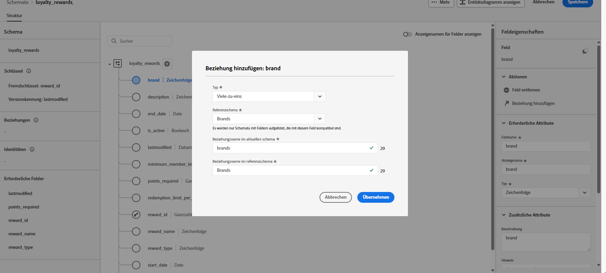

# Erstellen relationaler Schemata mithilfe einer DDL-Datei {#file-upload-schema}

Definieren Sie das relationale Datenmodell, das für orchestrierte Kampagnen erforderlich ist, indem Sie Schemata wie **Zugehörigkeiten zu Treueprogrammen**, **Treuetransaktionen** und **Treueprämien** erstellen. Jedes Schema muss einen Primärschlüssel, ein Versionierungsattribut und geeignete Beziehungen zu Referenzentitäten wie **Empfängerinnen und Empfänger** oder **Marken** umfassen.

Schemata können über die Benutzeroberfläche manuell erstellt oder mithilfe einer DDL-Datei massenweise importiert werden.

In diesem Abschnitt wird Schritt für Schritt erklärt, wie ein relationales Schema in Adobe Experience Platform durch Hochladen einer DDL-Datei (Data Definition Language) erstellt wird. Durch die Verwendung einer DDL-Datei können Sie die Struktur Ihres Datenmodells vorab definieren, einschließlich Tabellen, Attributen, Schlüsseln und Beziehungen.

1. [Laden Sie eine DDL-Datei hoch](#ddl-upload), um relationale Schemata zu erstellen und ihre Struktur zu definieren.

1. [Definieren Sie Beziehungen](#relationships) zwischen Tabellen in Ihrem Datenmodell.

1. [Verknüpfen Sie Schemata](#link-schema), um Ihre relationalen Daten mit vorhandenen Profilentitäten wie Empfängerinnen und Empfängern oder Marken zu verbinden.

1. [Nehmen Sie Daten](ingest-data.md) aus unterstützten Quellen in Ihren Datensatz auf.

➡️ [Weitere Informationen zu modellbasierten Schemata finden Sie in der Dokumentation zu Adobe Experience Platform](https://experienceleague.adobe.com/de/docs/experience-platform/xdm/schema/relational)

## Hochladen einer DDL-Datei{#ddl-upload}

Durch die Verwendung einer DDL-Datei können Sie die Struktur Ihres Datenmodells vorab definieren, einschließlich Tabellen, Attributen, Schlüsseln und Beziehungen.

Uploads von Excel-basierten Schemadateien werden unterstützt. Laden Sie die [bereitgestellte Vorlage](assets/template.zip) herunter, um Ihre Schemadefinitionen bequem vorzubereiten.

+++Beim Erstellen relationaler Schemata in Adobe Experience Platform werden die folgenden Funktionen unterstützt

* **ENUM**\
  ENUM-Felder werden sowohl bei der DDL-basierten als auch bei der manuellen Schemaerstellung unterstützt, sodass Sie Attribute mit einem festen Satz zulässiger Werte definieren können.
Siehe folgendes Beispiel:

  ```
  CREATE TABLE orders (
  order_id     INT NOT NULL,
  product_id   INT NOT NULL,
  order_date   DATE NOT NULL,
  customer_id  INT NOT NULL,
  quantity     INT NOT NULL,
  order_status enum ('PENDING', 'SHIPPED', 'DELIVERED', 'CANCELLED'),
  PRIMARY KEY (order_id, product_id)
  );
  ```

* **Schema-Label für Data Governance**\
  Label werden auf der Ebene der Schemafelder unterstützt, um Data-Governance-Richtlinien wie Zugriffskontrolle und Nutzungsbeschränkungen durchzusetzen. Weitere Informationen sind in der [Dokumentation zu Adobe Experience Platform](https://experienceleague.adobe.com/docs/experience-platform/xdm/home.html?lang=de) verfügbar.

+++

1. Melden Sie sich bei Adobe Experience Platform an.

1. Navigieren Sie zum Menü **Daten-Management** > **Schema**.

1. Klicken Sie auf **Schema erstellen**.

1. Wählen Sie **[!UICONTROL Relational]** als **Schematyp** aus.

   

1. Wählen Sie **[!UICONTROL Hochladen einer DDL-Datei]** aus, um ein Entitätsbeziehungsdiagramm zu definieren und Schemata zu erstellen.

   Die Tabellenstruktur muss Folgendes enthalten:
   * Mindestens einen Primärschlüssel,
   * eine Versionskennung, z. B. ein `lastmodified`-Feld vom Typ `datetime` oder `number`.
   * Bei der Aufnahme mit Change Data Capture (CDC) gibt eine spezielle Spalte mit dem Namen `_change_request_type` vom Typ `String`, die den Typ der Datenänderung angibt (z. B. Einfügen, Aktualisieren, Löschen) und eine inkrementelle Verarbeitung ermöglicht.
   * Die DDL-Datei darf nicht mehr als 200 Tabellen definieren.


   >[!IMPORTANT]
   >
   > Jedes für das Targeting verwendete Schema muss mindestens ein Identitätsfeld vom Typ `String` mit einem zugehörigen **Identity-Namespace** enthalten.\
   >Dadurch wird die Kompatibilität mit den Targeting- und Identitätsauflösungsfunktionen von Adobe Journey Optimizer sichergestellt.

1. Ziehen Sie Ihre DDL-Datei per Drag-and-Drop und klicken Sie auf **[!UICONTROL Weiter]**.

   Beachten Sie, dass die unterstützte Größe für eine DDL-Datei maximal 10 MB beträgt.

1. Geben Sie Ihren **[!UICONTROL Schemanamen]** ein.

1. Richten Sie jedes Schema und seine Spalten ein und stellen Sie dabei sicher, dass ein Primärschlüssel und ein Versionsdeskriptor angegeben wird.

   Ein Attribut, z. B. `lastmodified`, muss als Versionsdeskriptor (Typ `datetime`, `long` oder `int`) angegeben werden, um dafür zu sorgen, dass Datensätze mit den neuesten Daten aktualisiert werden. Benutzende können den Versionsdeskriptor ändern, der nach dem Festlegen obligatorisch wird. Ein Attribut kann nicht gleichzeitig ein Primärschlüssel (PK) und ein Versionsdeskriptor sein.

   

1. Markieren Sie ein Attribut als `identity` und ordnen Sie es einem definierten Identity-Namespace zu.

1. Sie können jede Tabelle umbenennen, löschen oder um eine Beschreibung ergänzen.

1. Klicken Sie auf **[!UICONTROL Fertig]**, sobald Sie fertig sind.

Sie können jetzt die Tabellen- und Felddefinitionen auf der Arbeitsfläche überprüfen. [Weitere Informationen finden Sie im nachfolgenden Abschnitt](#entities)

## Definieren von Beziehungen {#relationships}

Sie können beim Erstellen Ihres Schemas Beziehungen direkt in der DDL-Datei angeben. Wenn Sie Beziehungen lieber außerhalb der Datei definieren möchten, können Sie dies in der Benutzeroberfläche tun, indem Sie die folgenden Schritte ausführen.

1. Rufen Sie die Arbeitsflächenansicht Ihres Datenmodells auf und wählen Sie die beiden Tabellen aus, die Sie verknüpfen möchten.

1. Klicken Sie auf die Schaltfläche  neben dem Quellen-Join und ziehen Sie den Pfeil in Richtung Ziel-Join, um die Verbindung herzustellen.

   >[!NOTE]
   >
   >Zusammengesetzte Schlüssel werden unterstützt, wenn sie in der DDL-Datei definiert sind.

   

1. Füllen Sie das angegebene Formular aus, um den Link zu definieren, und klicken Sie nach der Konfiguration auf **Anwenden**.

   

   **Kardinalität**:

   * **1:N**: Eine Entität in der Quelltabelle kann mit mehreren Entitäten in der Zieltabelle in Beziehung stehen, aber eine Entität in der Zieltabelle kann nur maximal mit einer Entität in der Quelltabelle in Beziehung stehen.

   * **N:1**: Eine Entität in der Zieltabelle kann mit mehreren Entitäten in der Quelltabelle in Beziehung stehen, aber eine Entität in der Quelltabelle kann nur maximal mit einer Entität in der Zieltabelle in Beziehung stehen.

   * **1:1**: Eine Entität in der Quelltabelle kann maximal mit einer Entität in der Zieltabelle in Beziehung stehen.

1. Alle in Ihrem Datenmodell definierten Links werden in der Arbeitsflächenansicht als Pfeile dargestellt. Klicken Sie auf einen Pfeil zwischen zwei Tabellen, um je nach Bedarf Details anzuzeigen, Änderungen vorzunehmen oder den Link zu entfernen.

   

1. Verwenden Sie die Symbolleiste, um die Arbeitsfläche anzupassen.

   

   * **Vergrößern**: Vergrößert die Arbeitsfläche, um Details zu Ihrem Datenmodell deutlicher zu sehen.

   * **Verkleinern**: Verkleinert die Arbeitsfläche, um eine erweiterte Ansicht Ihres Datenmodells zu erhalten.

   * **Ansicht anpassen**: Passt den Zoom so an, dass alle Schemata im sichtbaren Bereich angezeigt werden.

   * **Filter**: Wählen Sie aus, welches Schema auf der Arbeitsfläche angezeigt werden soll.

   * **Automatisches Layout erzwingen**: Lassen Sie Schemata zur besseren Organisation automatisch anordnen.

   * **Zuordnung anzeigen**: Schalten Sie eine Miniatur-Zuordnungsüberlagerung ein, um leichter durch große oder komplexe Schema-Layouts zu navigieren.

   * **Alle erweitern/alle reduzieren**: Erweitern oder reduzieren Sie alle Schemaknoten schnell, um ihre Attribute ein- oder auszublenden.

   * **Download**: Laden Sie das ER-Diagramm als .png-Datei herunter.

1. Klicken Sie auf **Speichern**, sobald Sie fertig sind. Diese Aktion erstellt die Schemata und die zugehörigen Datensätze und ermöglicht die Verwendung des Datensatzes in orchestrierten Kampagnen.

1. Klicken Sie **[!UICONTROL Aufträge öffnen]**, um den Fortschritt des Erstellungsauftrags zu überwachen. Dieser Prozess kann je nach der Anzahl der in der DDL-Datei definierten Tabellen mehrere Minuten dauern.

   Sie können auf Ihre DDL-Importaufträge auch zugreifen, indem Sie das Fenster **[!UICONTROL DDL-Datei hochladen]** öffnen und **[!UICONTROL Alle DDL-Importaufträge anzeigen]** auswählen.

   

## Verknüpfen von Schemata {#link-schema}

>[!IMPORTANT]
>
> Das System erkennt nur Beziehungen, die in der DDL-Datei explizit definiert sind. Alle Entitätsbeziehungen, die nicht in der DDL-Datei erwähnt werden, werden ignoriert und nicht verarbeitet.

Stellen Sie eine Beziehung zwischen dem Schema **Treuetransaktionen** und dem Schema **Empfängerinnen und Empfänger** her, um jede Transaktion mit dem richtigen Kundeneintrag zu verknüpfen.

1. Navigieren Sie zu **[!UICONTROL Schemata]** und öffnen Sie Ihre zuvor erstellten **Treuetransaktionen**.

1. Klicken Sie auf **[!UICONTROL Beziehung hinzufügen]** in den **[!UICONTROL Feldeigenschaften]** der Kundinnen und Kunden.

   

1. Wählen Sie als **[!UICONTROL Typ]** der Beziehung **[!UICONTROL Viele-zu-eins]**.

1. Verknüpfen Sie das vorhandene Schema **Empfängerinnen und Empfänger**.

   

1. Geben Sie einen **[!UICONTROL Beziehungsnamen im aktuellen Schema]** und einen **[!UICONTROL Beziehungsnamen im Referenzschema]** ein.

1. Klicken Sie auf **[!UICONTROL Übernehmen]**, um die Änderungen zu speichern.

Erstellen Sie dann eine Beziehung zwischen dem Schema **Treueprämien** und dem Schema **Marken**, um jeden Prämieneintrag mit der entsprechenden Marke zu verknüpfen.


