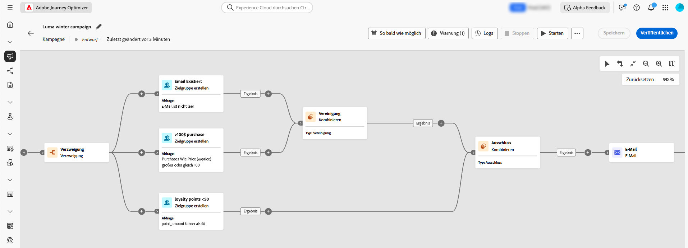
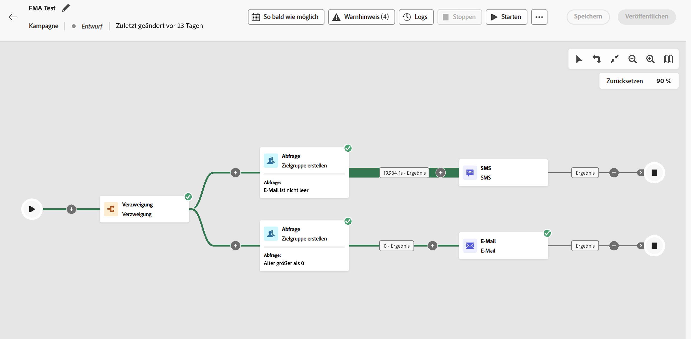

# Erste Schritte mit orchestrierten Kampagnen {#orchestrated-camp}

>[!CONTEXTUALHELP]
>id="campaigns_overview_orchestrated"
>title="campaigns_overview_orchestrated"
>abstract="<b>Kampagnenorchestrierung</b> Aufteilen, Kombinieren, Anreichern und Bearbeiten von relationalen Datensätzen zur Definition der Zielgruppe   <b>Nutzen von Daten mehrerer Entitäten</b> Erfahren Sie, wie Sie mit orchestrierten Kampagnen relationale Datensätze nutzen können, um Daten für die Segmentierung und Personalisierung anzureichern  <b>Ad-hoc-Segmentierung und exakten Zählungen</b> Erstellen eines Segments Schritt für Schritt mit exakten Zählungen  <b>Verfügbare Kanäle</b> E-Mail, SMS, Push-Benachrichtigungen"

Die Kampagnenorchestrierung in [!DNL Adobe Journey Optimizer] ermöglicht kanalübergreifend anspruchsvolle, markeninitiierte Marketing-Kampagnen und hilft Ihnen so, die Interaktion, den Umsatz und die Kundentreue im gewünschten Umfang zu fördern.

>[!IMPORTANT]
>
>Für einen Zugriff auf die Kampagnenorchestrierung muss die Lizenz entweder das Paket **Journey Optimizer – Kampagnen und Journeys** oder das Paket **Journey Optimizer – Kampagnen** enthalten. Wenden Sie sich an den Adobe-Support, um Ihre Lizenz zu bestätigen und bei Bedarf zu aktualisieren.

Kanalübergreifendes Marketing ist unerlässlich, und orchestrierte Kampagnen machen es nahtlos. Auf einer visuellen Drag-and-Drop-Oberfläche können Sie komplexe Marketing-Workflows, von der Segmentierung bis hin zum Nachrichtenversand, über mehrere Kanäle hinweg entwerfen und automatisieren. Alles geschieht in einer intuitiven Umgebung, die auf Geschwindigkeit, Kontrolle und Effizienz ausgelegt ist.

{zoomable="yes"}

➡️ [Orchestrierte Kampagnen im Video kennenlernen](#video-oc)

## Kernfunktionen

Die Kampagnenorchestrierung basiert auf vier zentralen Säulen:

<table style="table-layout:auto">
<tr style="border: 0;">
<td></a></td><td><b>On-Demand-Zielgruppen</b> : Führen Sie sofort Abfragen für mehrere Datensätze durch, um Zielgruppensegmente mithilfe einer beliebigen Kombination von Datentypen und Dimensionen zu erstellen.</td></tr>
<tr style="border: 0;">
<td></a></td><td><b>Segmentierung und Versand mehrerer Entitäten</b> : Gehen Sie über personenbasierte Kampagnen hinaus – nutzen Sie für präzises Targeting Entitäten wie Produktkataloge, Speicherorte oder Service-Daten.  
Unterstützt den Versand auf mehreren Ebenen, bei dem pro Profil und zugehöriger sekundärer Entität eine Nachricht gesendet wird. Zu diesen sekundären Entitäten können Kontaktadressen, Buchungen, Abonnements, Verträge oder andere verknüpfte Daten gehören. Dies ermöglicht beispielsweise den Versand von Kampagnen an alle bekannten Adressen eines Profils oder für jede mit dem betreffenden Profil verknüpfte Buchung.</td></tr>
<tr style="border: 0;">
<td></a></td><td><b>Sichtbarkeit und Präzision vor dem Versand</b> : Erhalten Sie vor dem Start exakte Segmentierungszahlen und den vollständigen Kampagnenumfang, um Genauigkeit und Konfidenz sicherzustellen.</td></tr>
<tr style="border: 0;">
<td></a></td><td><b>Mehrstufige Kampagnen-Workflows</b> : Entwerfen Sie mehrstufige Kampagnen, von täglichen Nachrichten bis hin zu komplexen Kampagnen wie saisonalen Werbeaktionen oder umfangreichen Produkteinführungen.</td></tr>
</table>

>[!NOTE]
>
>Weitere Informationen zu den unterstützten Kanälen finden Sie in der Tabelle in diesem Abschnitt: [Kanäle in Journeys und Kampagnen](../channels/gs-channels.md#channels).
>
>Die verfügbaren Kanäle variieren je nach Ihrem Lizenzierungsmodell und Ihren Add-ons.

## Orchestrierte Kampagnen und Journeys

Obwohl die Visualisierung in „Orchestrierte Kampagnen“ mit der von Journey-Kampagnen vergleichbar ist, werden damit verschiedene Zwecke verfolgt und Anwendungsfälle gelöst:

* **Journeys** – 1-zu-1-Arbeitsfläche, wobei jedes Profil die verschiedenen Schritte in seinem eigenen Tempo durchläuft. Der Status jeder Kundin und jedes Kunden wird innerhalb seines Kontexts beibehalten, was das Auslösen von Echtzeit-Aktionen ermöglicht.

* **Orchestrierte Kampagnen** – Im Gegensatz zu Journeys nutzen orchestrierte Kampagnen eine Batch-Arbeitsfläche, die Segmente berechnet. Alle Profile werden gleichzeitig verarbeitet.

Beide Arbeitsflächen sind für ihre jeweiligen Anwendungsfälle optimiert: Die Journey-Arbeitsfläche veröffentlicht Journeys, die in der Regel länger existieren, während die Campaign-Arbeitsfläche für iterative und inkrementelle Ausführungen einer Batch-Kampagne entwickelt wurde.

## Inhalt einer orchestrierten Kampagne {#gs-ms-campaign-inside}

Die Arbeitsfläche für orchestrierte Kampagnen zeigt, was passieren soll. Sie beschreibt die verschiedenen Aufgaben, die ausgeführt und miteinander verknüpft werden sollen.

Jede orchestrierte Kampagne enthält:

* **Aktivitäten**: Eine Aktivität ist eine Aufgabe, die ausgeführt werden soll. Die [verschiedenen Aktivitäten](activities/about-activities.md) werden auf der Arbeitsfläche durch Symbole dargestellt. Jede Aktivität verfügt über bestimmte Eigenschaften sowie andere Eigenschaften, die für alle Aktivitäten gelten.

  In einer Arbeitsfläche für eine orchestrierte Kampagne kann eine bestimmte Aktivität mehrere Aufgaben erzeugen, insbesondere wenn es sich um eine Schleife oder wiederkehrende Aktionen handelt.

* **Transitionen**: Transitionen verknüpfen eine Quellaktivität mit einer Zielaktivität und definieren deren Sequenz.

* **Arbeitstabellen**: Die Arbeitstabelle enthält alle von der Transition übermittelten Informationen. Jede orchestrierte Kampagne nutzt mehrere Arbeitstabellen. Die in diesen Tabellen enthaltenen Daten können während des gesamten Lebenszyklus der orchestrierten Kampagne verwendet werden.

## Einführungsvideo {#video-oc}

Lernen Sie die wichtigsten Konzepte und Funktionen kennen, die bei orchestrierten Kampagnen verfügbar sind.

>[!VIDEO](https://video.tv.adobe.com/v/3471538/?learn=on&enablevpops)

## Tauchen wir tiefer in die Materie ein

Jetzt, da Sie über Grundkenntnisse zu orchestrierten Kampagnen verfügen, ist es an der Zeit, diese Dokumentationsabschnitte zu vertiefen und mit der Funktion zu arbeiten.

<table><tr style="border: 0; text-align: center;">
<td>

<a href="gs-campaign-creation.md"><strong>Konfigurationsschritte</strong></a>

</td>
<td>

<a href="create-orchestrated-campaign.md"><strong>Erstellen einer orchestrierten Kampagne</strong>

</td>
<td>

<a href="activities/about-activities.md"><strong>Arbeiten mit Aktivitäten</strong></a>

</td>
</tr></table>

## Weitere Ressourcen

* **[Erstellen einer ersten Regel](build-query.md)** – Machen Sie sich mit dem Regel-Builder vertraut, um zielgerichtete Abfragen zu erstellen und Ihre Zielgruppen mithilfe relationaler Daten präzise zu segmentieren.
* **[Erstellen relationaler Schemata](gs-schemas.md)** – Erfahren Sie, wie Sie relationale Schemata einrichten und konfigurieren können, um Daten mit mehreren Entitäten in Ihren Kampagnen zu nutzen.
* **[Berichte für orchestrierte Kampagnen](reporting-campaigns.md)** – Verfolgen und analysieren Sie Ihre Kampagnenleistung mit detaillierten Berichtsmetriken und Erkenntnissen.
* **[Starten und Überwachen von Kampagnen](start-monitor-campaigns.md)** – Erfahren Sie mehr über Best Practices für den Start von Kampagnen und die Überwachung ihrer Ausführung in Echtzeit.
* **[Leitlinien und Einschränkungen](guardrails.md)** – Überprüfen Sie wichtige Leitlinien, Einschränkungen und Best Practices, um eine optimale Kampagnenleistung sicherzustellen.
* **[Häufig gestellte Fragen](orchestrated-campaigns-faq.md)** – Hier finden Sie Antworten auf häufig gestellte Fragen zu den Funktionen und Anwendungsfällen von orchestrierten Kampagnen.
* **[Tutorials zu orchestrierten Kampagnen](https://experienceleague.adobe.com/de/docs/journey-optimizer-learn/tutorials/create-campaigns/orchestrated-campaigns/introduction-to-orchestrated-campaigns){target="_blank"}** – Sehen Sie sich detaillierte Video-Tutorials zu Funktionen und Best Practices an.
