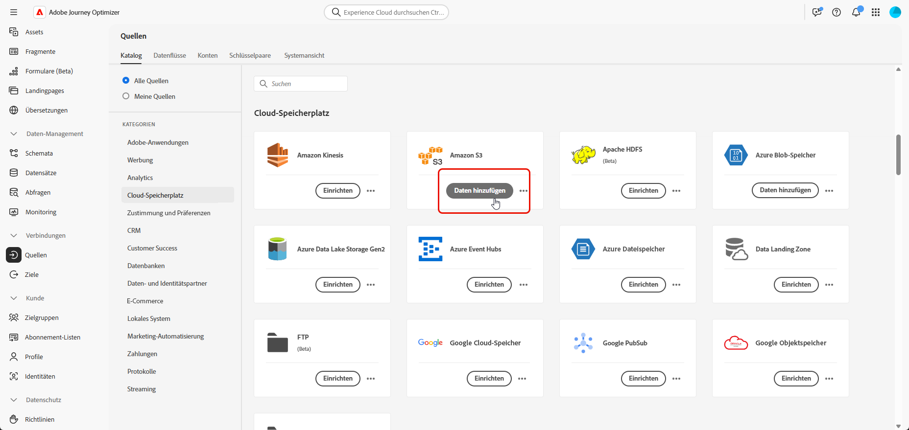
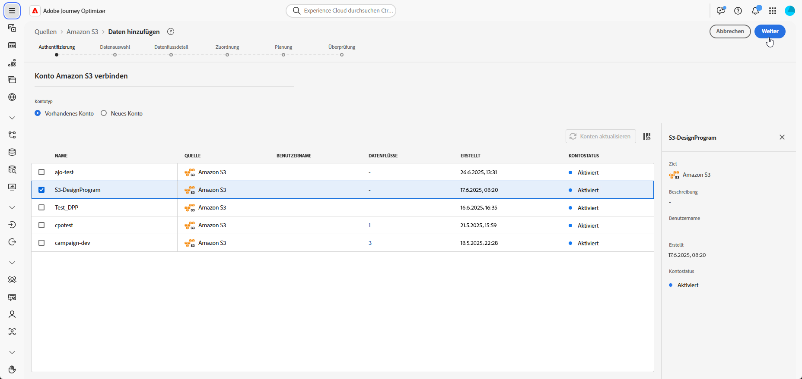
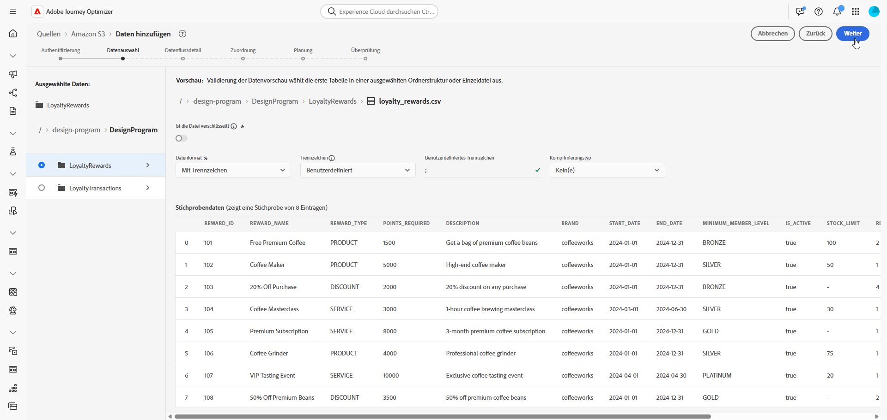
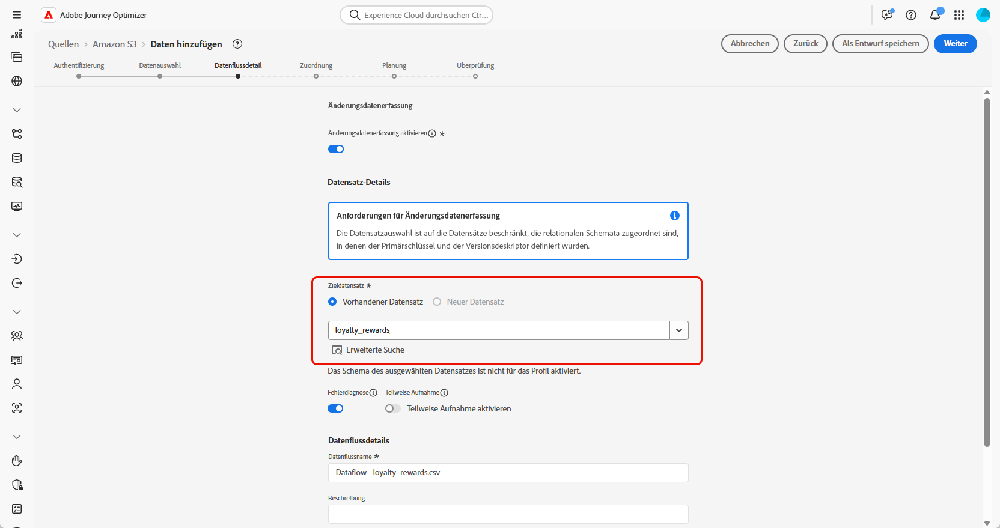
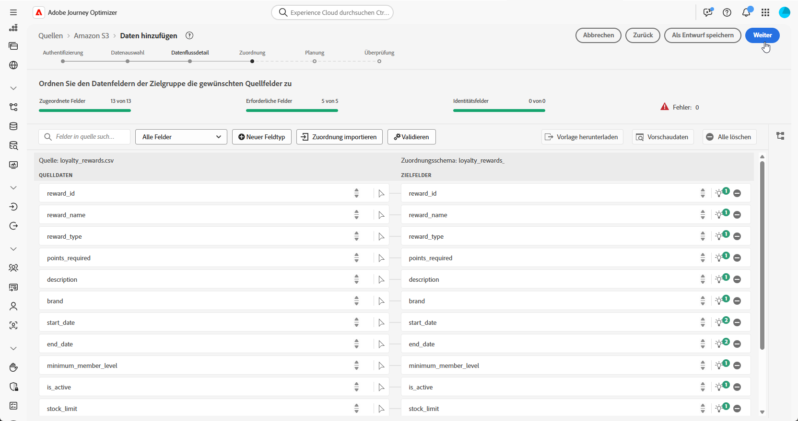
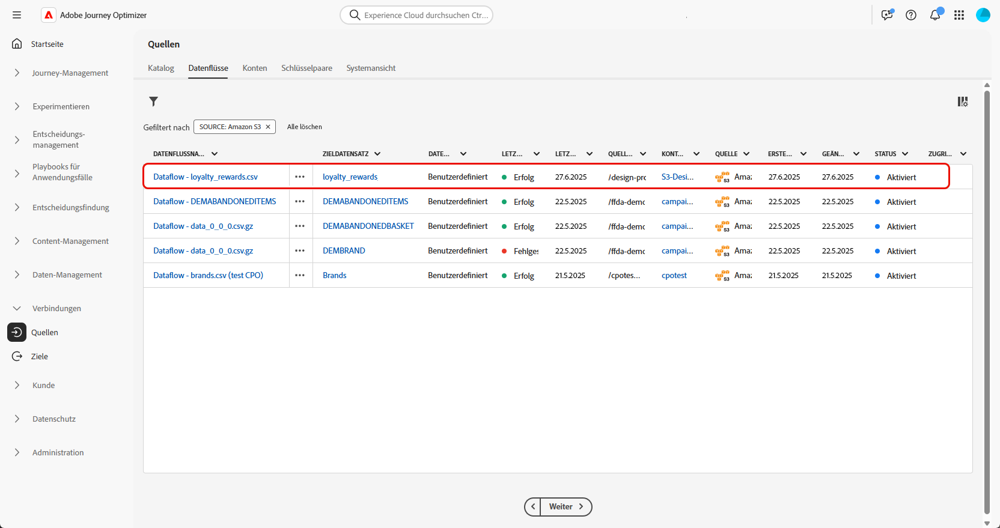

# Aufnehmen von Daten {#ingest-data}

+++ Inhaltsverzeichnis

| Willkommen bei koordinierten Kampagnen | Starten Ihrer ersten orchestrierten Kampagne | Abfragen der Datenbank | Aktivitäten für orchestrierte Kampagnen |
|---|---|---|---|
| [Erste Schritte mit orchestrierten Kampagnen](gs-orchestrated-campaigns.md)  Erstellen und Verwalten von relationalen Schemata und Datensätzen  <ul><li>[Erste Schritte mit Schemata und Datensätzen](gs-schemas.md)</li><li>[Manuelles Schema](manual-schema.md)</li><li>[Datei-Upload-Schema](file-upload-schema.md)</li><li>[Daten aufnehmen](ingest-data.md)</li></ul>[Zugriff und Verwaltung orchestrierter Kampagnen](access-manage-orchestrated-campaigns.md)  [Die wichtigsten Schritte zum Erstellen einer orchestrierten Kampagne](gs-campaign-creation.md) | [Erstellen und Planen der Kampagne](create-orchestrated-campaign.md)  [Orchestrieren von Aktivitäten](orchestrate-activities.md)  [ Starten und Überwachen der Kampagne](start-monitor-campaigns.md)  [Reporting](reporting-campaigns.md) | [Arbeiten mit dem Regel-Builder](orchestrated-rule-builder.md)  [Erstellen der ersten Abfrage](build-query.md)  [Ausdrücke bearbeiten](edit-expressions.md)  [Retargeting](retarget.md) | [Erste Schritte mit Aktivitäten](activities/about-activities.md)  Aktivitäten: [Und-Verknüpfung](activities/and-join.md) - [Zielgruppe aufbauen](activities/build-audience.md) - [Dimension ändern](activities/change-dimension.md) - [Kanalaktivitäten](activities/channels.md) - [Kombinieren](activities/combine.md) - [Anreicherung](activities/deduplication.md) - [Formulare](activities/enrichment.md) - [Abstimmung](activities/fork.md)    ->Zielgruppe speichern[ -AufspaltungWarten](activities/wait.md) |

{style="table-layout:fixed"}

+++

 

>[!BEGINSHADEBOX]

 

Der Inhalt

Der Inhalt dieser Seite ist nicht endgültig und kann geändert werden.

>[!ENDSHADEBOX]

Adobe Experience Platform ermöglicht die Aufnahme von Daten aus externen Quellen und bietet Ihnen die Möglichkeit, die eingehenden Daten mithilfe von Experience Platform-Services zu strukturieren, zu kennzeichnen und anzureichern. Daten können aus verschiedensten Quellen aufgenommen werden, darunter etwa Adobe-Anwendungen, Cloud-basierte Datenspeicher und Datenbanken.

## Mit Cloud-Speicher {#ingest}

<!--
>[!IMPORTANT]
>
>Each dataset in Adobe Experience Platform supports only one active dataflow at a time. For detailed setup guidance on how to switch data sources, refer to this [section](#cdc-ingestion).
-->

Sie können einen Datenfluss konfigurieren, um Daten aus einer Amazon S3-Quelle in Adobe Experience Platform aufzunehmen. Nach der Konfiguration ermöglicht der Datenfluss die automatisierte, geplante Aufnahme strukturierter Daten und unterstützt Echtzeit-Aktualisierungen.

1. Rufen Sie **[!UICONTROL Menü]** Verbindungen“ das Menü **[!UICONTROL Quellen]** auf.

1. Wählen Sie die Kategorie **[!UICONTROL Cloud-]**) und dann Amazon S3 aus und klicken Sie auf **[!UICONTROL Daten hinzufügen]**.

   

1. Verbinden Sie Ihr S3-Konto:

   * Mit vorhandenem Konto

   * Mit einem neuen Konto

   [Weitere Informationen hierzu finden Sie in der Dokumentation zu Adobe Experience Platform](https://experienceleague.adobe.com/en/docs/experience-platform/destinations/catalog/cloud-storage/amazon-s3#connect).

   

1. Wählen Sie Ihren Ordner **[!UICONTROL Datenformat]**, **[!UICONTROL Trennzeichen]** und **[!UICONTROL Komprimierungstyp]**.

1. Navigieren Sie durch die verbundene S3-Quelle, bis Sie die beiden zuvor erstellten Ordner finden **d. h.** Treueprämien und **Treuetransaktionen**.

1. Wählen Sie den Ordner aus, der Ihre Daten enthält.

   Durch die Auswahl eines Ordners wird sichergestellt, dass alle aktuellen und zukünftigen Dateien mit derselben Struktur automatisch verarbeitet werden. Für die Auswahl einer einzelnen Datei muss jedoch jedes neue Dateninkrement manuell hochgeladen werden.

   

1. Wählen Sie Ihren Ordner **[!UICONTROL Datenformat]**, **[!UICONTROL Trennzeichen]** und **[!UICONTROL Komprimierungstyp]**. Überprüfen Sie Ihre Beispieldaten auf Genauigkeit und klicken Sie dann auf **[!UICONTROL Weiter]**.

   

1. Aktivieren **[!UICONTROL die Option &quot;]** ändern“, um aus Datensätzen auszuwählen, die relationalen Schemata zugeordnet sind und für die sowohl ein Primärschlüssel als auch ein Versionsdeskriptor definiert sind.

1. Wählen Sie [ zuvor erstellten Datensatz aus ](#entities) klicken Sie auf **[!UICONTROL Weiter]**.

   

1. Überprüfen Sie **[!UICONTROL Fenster]** Zuordnung“, ob jedes Quelldateiattribut den entsprechenden Feldern im Zielschema korrekt zugeordnet ist.

   Klicken **[!UICONTROL abschließend]** Weiter“.

   

1. Konfigurieren Sie den Datenfluss **[!UICONTROL Zeitplan]** basierend auf Ihrer gewünschten Häufigkeit.

1. Klicken Sie **[!UICONTROL Beenden]**, um den Datenfluss zu erstellen. Er wird automatisch nach dem festgelegten Zeitplan ausgeführt.

1. Wählen Sie im Menü **[!UICONTROL Verbindungen]** die Option **[!UICONTROL Quellen]** und greifen Sie auf die Registerkarte **[!UICONTROL Datenflüsse]** zu, um die Flussausführung zu verfolgen, aufgenommene Datensätze zu überprüfen und Fehler zu beheben.

   

<!--### Setting Up Change data capture ingestion {#cdc-ingestion}

If you need to change the data source, you must delete the existing dataflow and create a new one pointing to the same dataset with the new source.

When using Change Data Capture (CDC), it is essential that the source and dataset remain in sync to ensure accurate incremental updates. Follow the steps below:

1. **Schema Requirements**
   - Your schema must include:
     - A **primary key** (e.g., `transaction_id`)
     - A **versioning field** (e.g., `lastmodified` or an incrementing `version_id`)
   - Enable the dataset for **Orchestrated Campaigns** if needed.

2. **CDC Dataflow Setup**
   - During dataflow creation, after choosing your source and files:
     - **Enable the CDC option**
     - Select your CDC-ready dataset
     - Confirm field mappings (especially version field)

3. **Keep Source and Target in Sync**
   - The source system must consistently update the version field so the platform can detect changes accurately.

Once set up, the platform will automatically ingest **only changed or new records** each time the flow runs.
-->