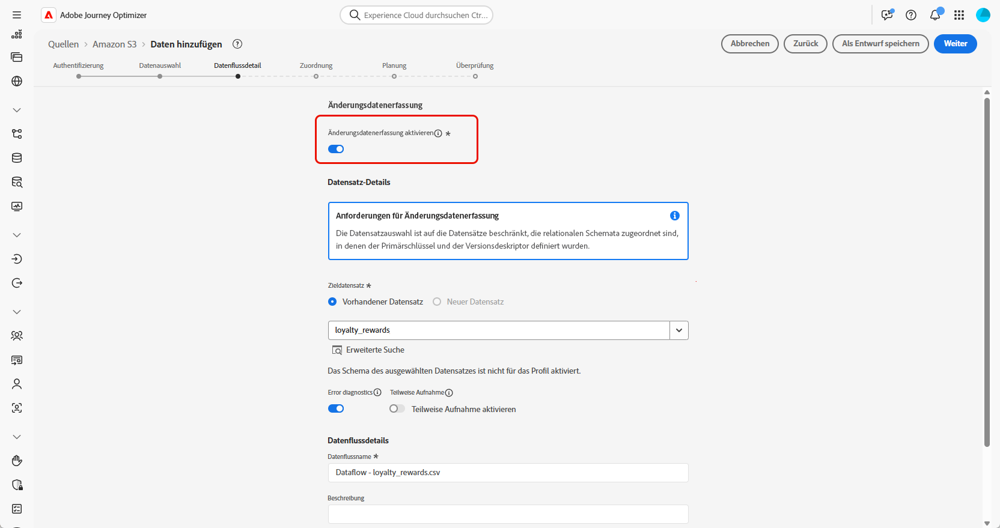

# Aufnehmen von Daten {#ingest-data}

>[!IMPORTANT]
>
>Um die Datenquelle für einen Datensatz zu ändern, müssen Sie zunächst den vorhandenen Datenfluss löschen, bevor Sie einen neuen erstellen, der auf denselben Datensatz und die neue Quelle verweist.
>
>Adobe Experience Platform erzwingt eine strikte Eins-zu-eins-Beziehung zwischen Datenflüssen und Datensätzen. So können Sie die Synchronisierung zwischen Quelle und Datensatz für eine genaue inkrementelle Aufnahme aufrechterhalten.

Adobe Experience Platform ermöglicht die Aufnahme von Daten aus externen Quellen und bietet spezielle Experience Platform-Services, mittels derer Sie eingehende Daten strukturieren, beschriften und erweitern können. Daten können aus verschiedensten Quellen aufgenommen werden, darunter etwa Adobe-Anwendungen, Cloud-basierte Datenspeicher und Datenbanken.

Ein Datensatz ist ein Konstrukt zur Speicherung und Verwaltung einer Sammlung von Daten, in der Regel eine Tabelle, die ein Schema (Spalten) und Felder (Zeilen) enthält. Daten, die erfolgreich in Experience Platform aufgenommen wurden, werden im Data Lake als Datensätze gespeichert.

## Unterstützte Quellen für orchestrierte Kampagnen {#supported}

Die folgenden Quellen werden für die Verwendung mit orchestrierten Kampagnen unterstützt:

<table>
  <thead>
    <tr>
      <th>Typ</th>
      <th>Quelle</th>
    </tr>
  </thead>
  <tbody>
    <tr>
      <td rowspan="3">Cloud-Speicherplatz</td>
      <td><a href="https://experienceleague.adobe.com/de/docs/experience-platform/sources/ui-tutorials/create/cloud-storage/s3">Amazon S3</a></td>
    </tr>
    <tr>
      <td><a href="https://experienceleague.adobe.com/de/docs/experience-platform/sources/ui-tutorials/create/cloud-storage/google-cloud-storage">Google Cloud Storage</a></td>
    </tr>
    <tr>
      <td><a href="https://experienceleague.adobe.com/de/docs/experience-platform/sources/ui-tutorials/create/cloud-storage/sftp">SFTP</a></td>
    </tr>
      <td rowspan="4">Cloud-Data Warehouses</td>
      <td><a href="https://experienceleague.adobe.com/de/docs/experience-platform/sources/ui-tutorials/create/databases/snowflake">Snowflake</a></td>
    </tr>
    <tr>
      <td><a href="https://experienceleague.adobe.com/de/docs/experience-platform/sources/ui-tutorials/create/databases/bigquery">Google BigQuery</a></td>
    </tr>
    <tr>
      <td><a href="https://experienceleague.adobe.com/de/docs/experience-platform/sources/ui-tutorials/create/cloud-storage/data-landing-zone">Data Landing Zone<a></td>
    </tr>
    <tr>
      <td><a href="https://experienceleague.adobe.com/de/docs/experience-platform/sources/ui-tutorials/create/databases/databricks">Azure Databricks</a></td>
    </tr>
    <tr>
      <td rowspan="3">Dateibasierte Uploads</td>
      <td><a href="https://experienceleague.adobe.com/de/docs/experience-platform/sources/ui-tutorials/create/local-system/local-file-upload">Hochladen einer lokalen Datei<a></td>
    </tr>

</tbody>
</table>

## Richtlinien für die Datenhygiene bei relationalen Schemata {#cdc}

Bei Datensätzen, bei denen **[!UICONTROL Änderungsdatenerfassung]** aktiviert ist, werden alle Datenänderungen, einschließlich Löschungen, automatisch vom Quellsystem in Adobe Experience Platform gespiegelt.

Da für Adobe Journey Optimizer-Kampagnen alle integrierten Datensätze mit der **[!UICONTROL Änderungsdatenerfassung]** aktiviert werden müssen, ist die Kundin oder der Kunde dafür verantwortlich, Löschungen an der Quelle zu verwalten. Jeder aus dem Quellsystem gelöschte Eintrag wird automatisch aus dem entsprechenden Datensatz in Adobe Experience Platform entfernt.

Um Einträge über die dateibasierte Aufnahme zu löschen, sollte in der Datendatei der Kundin bzw. des Kunden der Eintrag mit einem `D`-Wert im Feld `Change Request Type` markiert werden. Dies bedeutet, dass der Eintrag in Adobe Experience Platform gelöscht werden sollte, sodass das Quellsystem gespiegelt wird.

Wenn die Kundin bzw. der Kunde nur Einträge aus Adobe Experience Platform löschen möchte, ohne die ursprünglichen Quelldaten zu beeinflussen, stehen die folgenden Optionen zur Verfügung:

* **Proxy oder bereinigte Tabelle für die Replikation der Änderungsdatenerfassung**

  Die Kundin bzw. der Kunde kann einen Proxy oder eine bereinigte Quelltabelle erstellen, um zu steuern, welche Einträge in Adobe Experience Platform repliziert werden sollen. Löschungen können dann selektiv in dieser Zwischentabelle verwaltet werden.

* **Löschen über Data Distiller**

  Sofern lizenziert, kann **Data Distiller** verwendet werden, um Löschvorgänge direkt in Adobe Experience Platform zu unterstützen, und zwar unabhängig vom Quellsystem.

  [Weitere Informationen zu Data Distiller](https://experienceleague.adobe.com/de/docs/experience-platform/query/data-distiller/overview)

## Konfigurieren eines Datenflusses

Dieses Beispiel zeigt, wie sich ein Datenfluss konfigurieren lässt, der strukturierte Daten in Adobe Experience Platform aufnimmt. Der konfigurierte Datenfluss unterstützt eine automatisierte, geplante Aufnahme und ermöglicht Echtzeit-Aktualisierungen.

1. Greifen Sie über das Menü **[!UICONTROL Verbindungen]** auf das Menü **[!UICONTROL Quellen]** zu.

1. Wählen Sie Ihre Quelle abhängig von den [unterstützten Quellen für orchestrierte Kampagnen](#supported).

   

1. Verbinden Sie Ihr Cloud-Speicher- oder Google Cloud-Speicher-Konto, falls Sie sich für Cloud-basierte Quellen entschieden haben.

   

1. Wählen Sie die Daten aus, die Sie in Adobe Experience Platform aufnehmen möchten.

   

1. Aktivieren Sie auf der Seite **[!UICONTROL Datensatzdetails]** die Option **[!UICONTROL Änderungsdatenerfassung aktivieren]**, um nur Datensätze anzuzeigen, die relationalen Schemata zugeordnet sind und sowohl einen Primärschlüssel als auch einen Versionsdeskriptor aufweisen.

[Weitere Informationen zu Richtlinien für relationale Schemata und Datenhygiene](#cdc)

   >[!IMPORTANT]
   >
   > **Nur dateibasierten Quellen**: Jede Zeile in der Datendatei muss eine Spalte `_change_request_type` mit den Werten `U` (upsert) oder `D` (delete) enthalten. Ohne diese Spalte erkennt das System nicht, dass die Daten die Änderungsverfolgung unterstützen, und der Umschalter für „orchestrierte Kampagne“ wird nicht angezeigt, sodass der Datensatz nicht für die Zielgruppenbestimmung ausgewählt werden kann.

   

1. Wählen Sie Ihren zuvor erstellten Datensatz aus und klicken Sie auf **[!UICONTROL Weiter]**.

   

1. Wenn Sie nur dateibasierte Quellen verwenden, laden Sie über das Fenster **[!UICONTROL Daten auswählen]** Ihre lokalen Dateien hoch und zeigen Sie eine Vorschau ihrer Struktur und Inhalte an.

   Beachten Sie, dass die unterstützte Größe maximal 100 MB beträgt.

1. Überprüfen Sie im Fenster **[!UICONTROL Zuordnung]**, ob jedes Quelldateiattribut korrekt den entsprechenden Feldern im Zielschema zugeordnet ist. [Erfahren Sie mehr über Zielgruppendimensionen](target-dimension.md)

   Klicken Sie auf **[!UICONTROL Weiter]**, sobald Sie fertig sind.

   

1. Konfigurieren Sie den Datenfluss **[!UICONTROL Zeitplan]** basierend auf der von Ihnen gewünschten Häufigkeit.

1. Klicken Sie auf **[!UICONTROL Beenden]**, um den Datenfluss zu erstellen. Er wird automatisch nach dem festgelegten Zeitplan ausgeführt.

1. Wählen Sie im Menü **[!UICONTROL Verbindungen]** die Option **[!UICONTROL Quellen]** aus und greifen Sie auf die Registerkarte **[!UICONTROL Datenflüsse]** zu, um die Flussausführung zu verfolgen, aufgenommene Einträge zu überprüfen und Fehler zu beheben.

   

