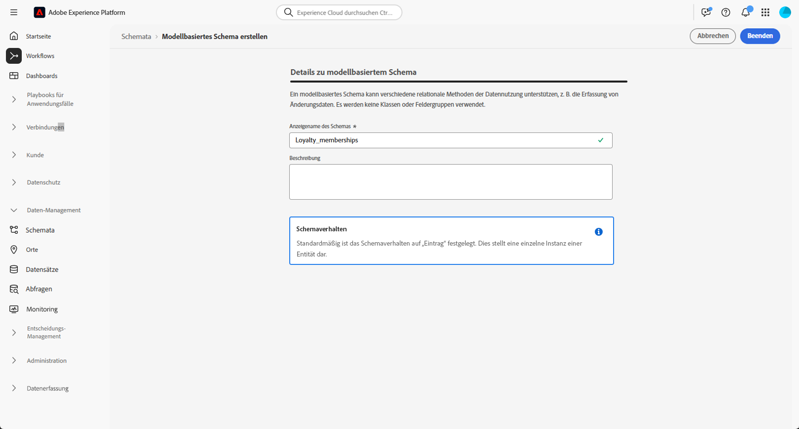
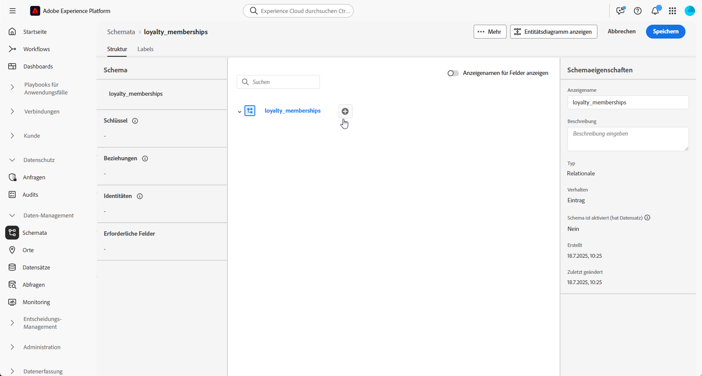
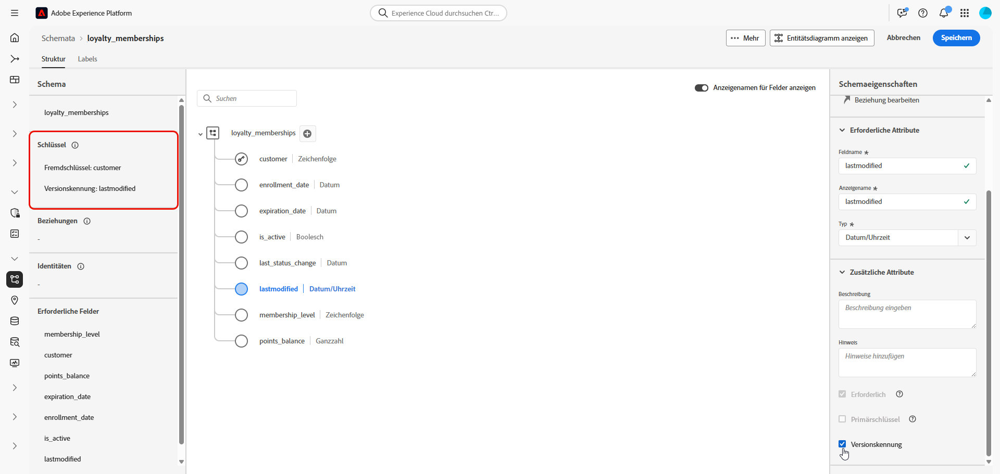
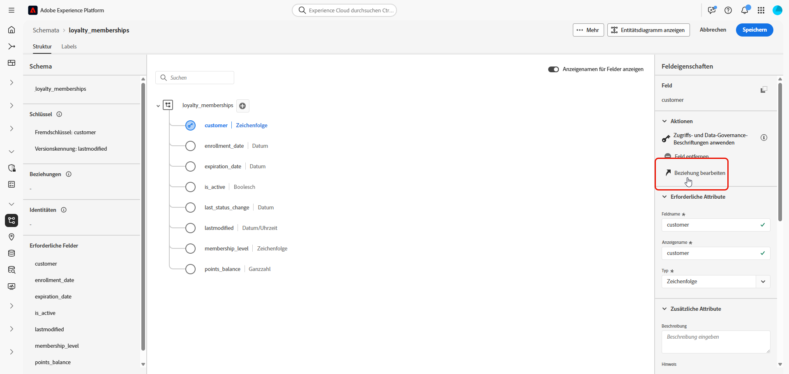
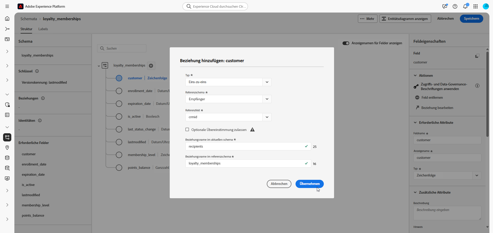
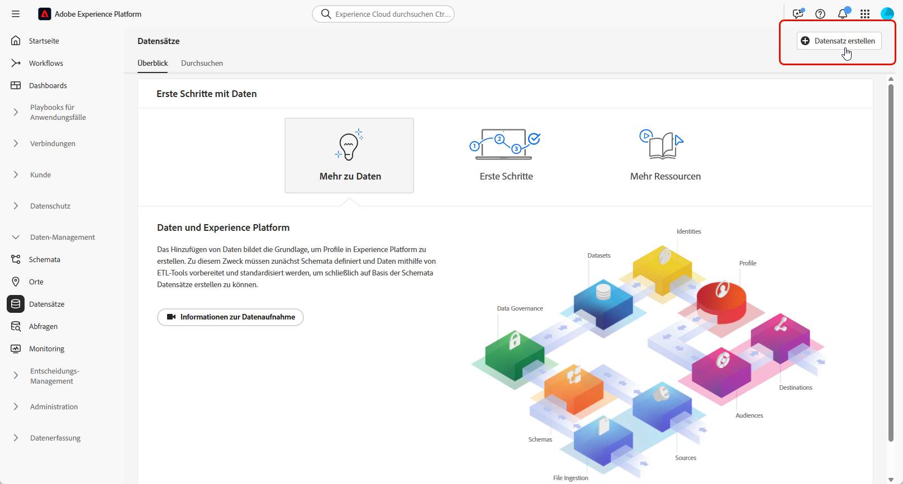
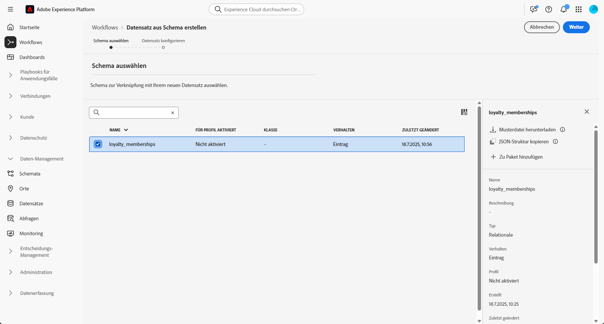
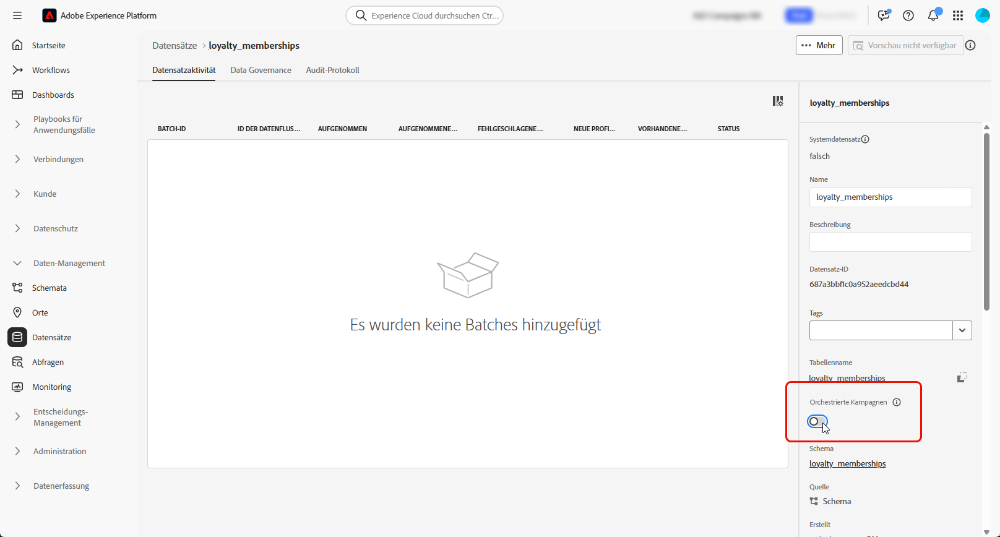

# Manuelles Einrichten eines relationalen Schemas {#manual-schema}

Relationale Schemata können direkt über die Benutzeroberfläche erstellt werden, was eine detaillierte Konfiguration von Attributen, Primärschlüsseln, Versionierungsfeldern und Beziehungen ermöglicht.

Im folgenden Beispiel wird das Schema **Mitgliedschaft in Treueprogramm** manuell definiert, um die erforderliche Struktur für orchestrierte Kampagnen zu veranschaulichen.

1. [Erstellen Sie manuell ein relationales Schema](#schema) mithilfe der Adobe Experience Platform-Oberfläche.

1. [Fügen Sie Attribute](#schema-attributes) wie Kunden-ID, Mitgliedschaftsstufe und Statusfelder hinzu.

1. [Verknüpfen Sie Ihr Schema](#link-schema) mit integrierten Schemata, wie z. B. Empfängerinnen und Empfänger für Kampagnen-Targeting.

1. [Erstellen Sie einen Datensatz](#dataset) basierend auf Ihrem Schema und aktivieren Sie ihn für die Verwendung in orchestrierten Kampagnen.

1. [Nehmen Sie Daten](ingest-data.md) aus unterstützten Quellen in Ihren Datensatz auf.

➡️ [Weitere Informationen zu manuellen relationalen Schemata finden Sie in der Dokumentation zu Adobe Experience Platform.](https://experienceleague.adobe.com/de/docs/experience-platform/xdm/ui/resources/schemas#create-manually)

## Erstellen Ihres Schemas {#schema}

Erstellen Sie zunächst manuell ein neues relationales Schema in Adobe Experience Platform. Dabei können Sie die Schemastruktur von Grund auf neu definieren, einschließlich des Namens und Verhaltens.

1. Melden Sie sich bei Adobe Experience Platform an.

1. Navigieren Sie zum Menü **[!UICONTROL Daten-Management]** > **[!UICONTROL Schema]**.

1. Klicken Sie auf **[!UICONTROL Schema erstellen]**.

1. Wählen Sie **[!UICONTROL Relational]** als **Schematyp** aus.

   {zoomable="yes"}

1. Wählen Sie **[!UICONTROL Manuell erstellen]**, um durch manuelles Hinzufügen von Feldern ein Schema zu erstellen.

1. Geben Sie Ihren **[!UICONTROL Anzeigenamen für das Schema]** ein.

   {zoomable="yes"}

1. Klicken Sie auf **Beenden**, um mit der Schemaerstellung fortzufahren.

Sie können jetzt mit dem Hinzufügen von Attributen zu Ihrem Schema beginnen, um dessen Struktur zu definieren.

## Hinzufügen von Attributen zu Ihrem Schema {#schema-attributes}

Fügen Sie als Nächstes Attribute hinzu, um die Struktur Ihres Schemas zu definieren. Diese Felder stellen die wichtigsten Datenpunkte dar, die in orchestrierten Kampagnen verwendet werden, z. B. Kundenkennungen, Mitgliedschaftsdetails und Aktivitätsdaten. Durch genaues Definieren dieser Datenpunkte wird eine zuverlässige Personalisierung, Segmentierung und Nachverfolgung sichergestellt.

Jedes Schema, das für die Zielgruppenbestimmung verwendet wird, muss mindestens ein Identitätsfeld des Typs `String` mit einem zugehörigen Identity-Namespace enthalten. Dadurch wird die Kompatibilität mit den Targeting- und Identitätsauflösungsfunktionen von Adobe Journey Optimizer sichergestellt.

+++Beim Erstellen relationaler Schemata in Adobe Experience Platform werden die folgenden Funktionen unterstützt

* **ENUM**\
  ENUM-Felder werden sowohl bei der DDL-basierten als auch bei der manuellen Schemaerstellung unterstützt, sodass Sie Attribute mit einem festen Satz zulässiger Werte definieren können.

* **Schema-Label für Data Governance**\
  Label werden auf der Ebene der Schemafelder unterstützt, um Data-Governance-Richtlinien wie Zugriffskontrolle und Nutzungsbeschränkungen durchzusetzen. Weitere Informationen sind in der [Dokumentation zu Adobe Experience Platform](https://experienceleague.adobe.com/docs/experience-platform/xdm/home.html?lang=de) verfügbar.

* **Zusammengesetzter Schlüssel**\
  In Definitionen von relationalen Schemata werden zusammengesetzte Primärschlüssel unterstützt, sodass sich mehrere Felder zusammen verwenden lassen, um Einträge eindeutig zu identifizieren.

+++

1. Klicken Sie auf der Arbeitsfläche auf  neben Ihrem **Schemanamen**, um Attribute hinzuzufügen.

   {zoomable="yes"}

1. Geben Sie für Ihr Attribut **[!UICONTROL Feldnamen]**, **[!UICONTROL Anzeigenamen]** und **[!UICONTROL Typ]** ein.

   In diesem Beispiel haben wir die in der folgenden Tabelle beschriebenen Attribute zum Schema **Mitgliedschaften in Treueprogramm** hinzugefügt.

   +++ Beispiele für Attribute

   | Attributname | Datentyp | Zusätzliche Attribute |
   |-|-|-|
   | Kundin bzw. Kunde | STRING | Primärschlüssel |
   | membership_level | STRING | Erforderlich |
   | points_balance | INTEGER | Erforderlich |
   | enrollment_date | DATE | Erforderlich |
   | last_status_change | DATE | Erforderlich |
   | expiration_date | DATE | – |
   | is_active | BOOLEAN | Erforderlich |
   | lastModified | DATETIME | Erforderlich |

   +++ 

1. Weisen Sie die entsprechenden Felder als **[!UICONTROL primären Schlüssel]** und **[!UICONTROL Versionsdeskriptor]** zu.

   Sorgen Sie beim Erstellen eines manuellen Schemas dafür, dass die folgenden wichtigen Felder enthalten sind:

   * Mindestens einen Primärschlüssel,
   * eine Versionskennung, z. B. ein `lastmodified`-Feld vom Typ `datetime` oder `number`.
   * Bei einer Aufnahme mit Änderungsdatenerfassung (Change Data Capture, CDC) gibt es eine spezielle Spalte mit dem Namen `_change_request_type` vom Typ `String`, die den Typ der Datenänderung angibt (z. B. Einfügen, Aktualisieren, Löschen) und eine inkrementelle Verarbeitung ermöglicht. Beachten Sie, dass `_change_request_type` nicht Teil des Tabellenschemas sein, sondern erst während der Aufnahme zur Datendatei hinzugefügt werden sollte.

   {zoomable="yes"}

1. Klicken Sie auf **[!UICONTROL Speichern]**.

Nachdem Sie Attribute erstellt und gespeichert haben, können Sie das Schema durch Definieren von Beziehungen mit anderen relationalen Schemata verknüpfen.

➡️ [Weitere Informationen zu modellbasierten Schemata finden Sie in der Dokumentation zu Adobe Experience Platform](https://experienceleague.adobe.com/de/docs/experience-platform/xdm/schema/relational#how-relational-schemas-differ-from-standard-xdm-schemas)

## Verknüpfen von Schemata {#link-schema}

Beim Erstellen einer Beziehung zwischen zwei Schemata können Sie Ihre orchestrierten Kampagnen mit Daten erweitern, die außerhalb des primären Profilschemas gespeichert sind.

1. Wählen Sie in Ihrem neu erstellten Schema das Attribut aus, das Sie als Link verwenden möchten, und klicken Sie auf **[!UICONTROL Beziehung hinzufügen]**.

   {zoomable="yes"}

1. Wählen Sie das **[!UICONTROL Referenzschema]** und **[!UICONTROL Referenzfeld]** aus, mit denen die Beziehung hergestellt werden soll.

   In diesem Beispiel wird das Attribut `customer` mit dem Schema `recipients` verknüpft.

   {zoomable="yes"}

1. Geben Sie einen Beziehungsnamen im aktuellen Schema und einen im Referenzschema ein.

1. Klicken Sie nach der Konfiguration auf **[!UICONTROL Übernehmen]**.

## Erstellen eines Datensatzes für das Schema {#dataset}

Nachdem Sie Ihr Schema definiert haben, können Sie nun basierend darauf einen Datensatz erstellen. Der Datensatz speichert Ihre aufgenommenen Daten und muss für orchestrierte Kampagnen aktiviert sein, damit darauf zugegriffen werden kann.

1. Navigieren Sie zu **[!UICONTROL Daten-Management]** > **[!UICONTROL Datensätze]** und wählen Sie **[!UICONTROL Datensatz erstellen]** aus.

   {zoomable="yes"}

1. Wählen Sie **[!UICONTROL Datensatz aus Schema erstellen]** aus.

1. Wählen Sie Ihr zuvor erstelltes Schema (hier **Mitgliedschaften in Treueprogramm**) und klicken Sie auf **[!UICONTROL Weiter]**.

   {zoomable="yes"}

1. Geben Sie einen **[!UICONTROL Namen]** für Ihren **[!UICONTROL Datensatz]** ein und klicken Sie auf **[!UICONTROL Beenden]**.

Jetzt müssen Sie Ihren Datensatz für orchestrierte Kampagnen aktivieren.

## Aktivieren eines Datensatzes für orchestrierte Kampagnen {#enable}

>[!CONTEXTUALHELP]
>id="ajo_oc_enable_dataset_for_oc"
>title="Orchestrierte Kampagnen"
>abstract="Nachdem Sie Ihren Datensatz erstellt haben, müssen Sie ihn explizit für orchestrierte Kampagnen aktivieren. Dadurch wird sichergestellt, dass Ihr Datensatz in Adobe Journey Optimizer für Echtzeit-Orchestrierung und -Personalisierung verfügbar ist."

Nachdem Sie Ihren Datensatz erstellt haben, müssen Sie ihn explizit für orchestrierte Kampagnen aktivieren. Dadurch wird sichergestellt, dass Ihr Datensatz in Adobe Journey Optimizer für Echtzeit-Orchestrierung und -Personalisierung verfügbar ist.

Informationen zur Validierung oder Aktivierung der Erweiterung für orchestrierte Kampagnen im Datensatz finden Sie in der [Adobe Developer-Dokumentation](https://developer.adobe.com/journey-optimizer-apis/references/orchestrated-campaign-dataset/#tag/DatasetEnablement).

1. Suchen Sie Ihren Datensatz in der Liste **[!UICONTROL Datensätze]**.

1. Aktivieren Sie in den Einstellungen für **[!UICONTROL Datensätze]** die Option **Orchestrierte Kampagnen**, um den Datensatz für die Verwendung in Ihren orchestrierten Kampagnen verfügbar zu machen.

   {zoomable="yes"}

1. Warten Sie einige Minuten, bis der Aktivierungsprozess abgeschlossen ist. Beachten Sie, dass Datenaufnahme und Nutzung in Kampagnen erst möglich sind, wenn diese Einstellung vollständig aktiviert ist.

Sie können jetzt mit der Aufnahme von Daten in Ihr Schema beginnen, indem Sie eine Quelle Ihrer Wahl verwenden.

➡️ [Wie Sie Daten aufnehmen](ingest-data.md)
