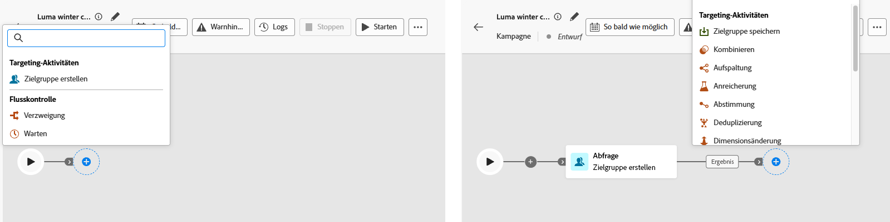
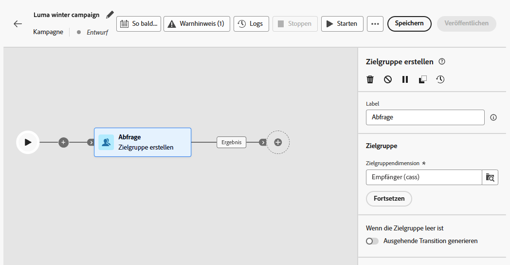
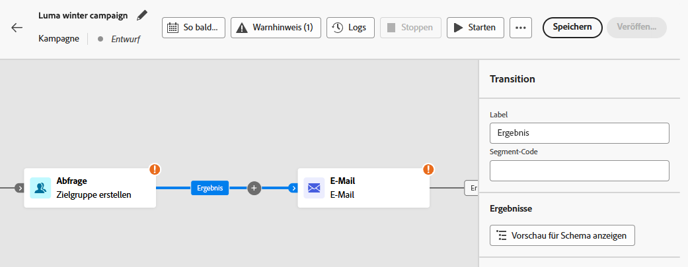
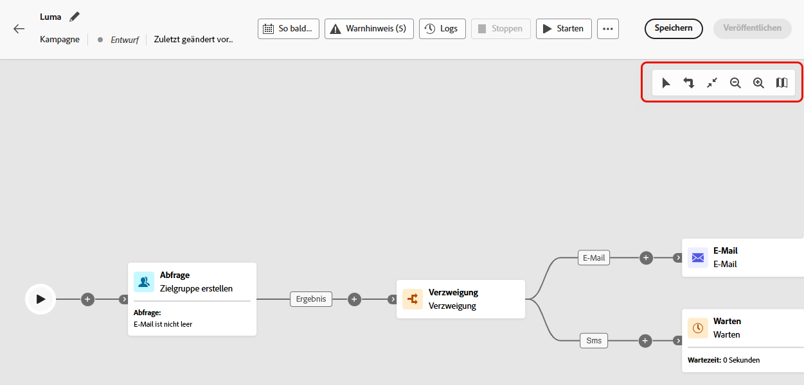
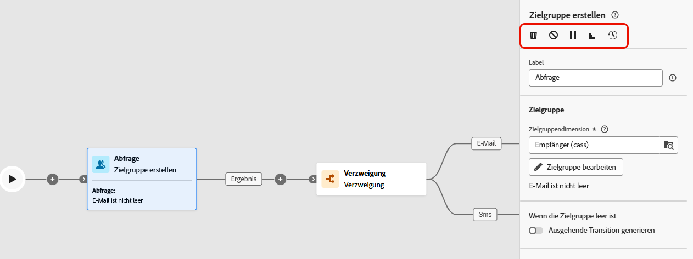
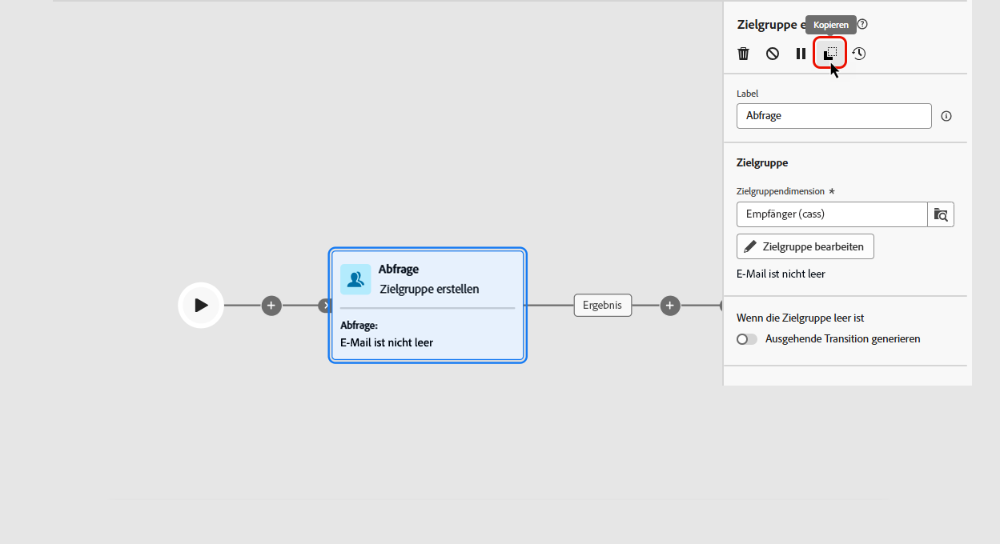
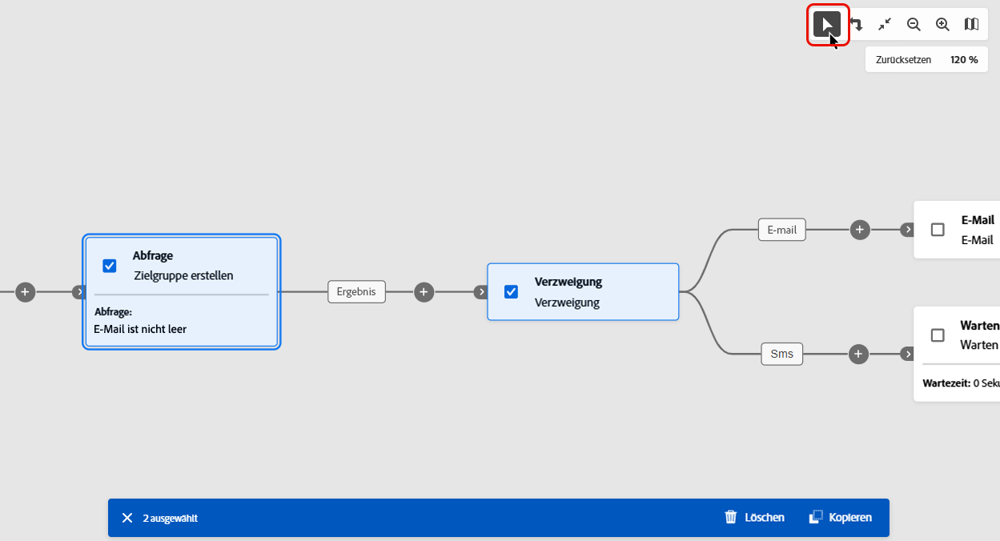
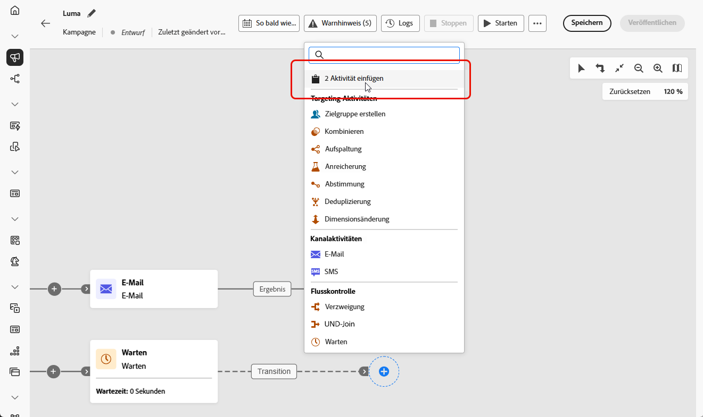

# Orchestrieren von Kampagnenaktivitäten {#orchestrate}

Nachdem Sie [eine orchestrierte Kampagne erstellt haben](gs-campaign-creation.md), können Sie mit der Orchestrierung der verschiedenen Aufgaben beginnen, die ausgeführt werden sollen. Zu diesem Zweck steht Ihnen eine visuelle Arbeitsfläche zur Verfügung, auf der Sie eine Arbeitsfläche für orchestrierte Kampagnen erstellen können. Innerhalb dieser Arbeitsfläche können Sie verschiedene Aktivitäten hinzufügen und sie in einer sequenziellen Reihenfolge verbinden.

## Hinzufügen von Aktivitäten {#add}

In dieser Phase der Konfiguration wird die Arbeitsfläche „Orchestrierte Kampagne“ mit einem Start-Symbol angezeigt, das den Beginn Ihrer orchestrierten Kampagne darstellt. Um Ihre erste Aktivität hinzuzufügen, klicken Sie auf die Schaltfläche **+**, die mit dem Startsymbol verbunden ist.

Es wird eine Liste der Aktivitäten angezeigt, die zur Arbeitsfläche „Orchestrierte Kampagne“ hinzugefügt werden können. Welche Aktivitäten verfügbar sind, hängt von Ihrer Position innerhalb der Arbeitsfläche „Orchestrierte Kampagne“ ab. Wenn Sie Ihre erste Aktivität hinzufügen, können Sie Ihre orchestrierte Kampagne starten, indem Sie beispielsweise eine Zielgruppe ansprechen, den Pfad Ihrer orchestrierten Kampagne aufspalten oder eine Aktivität vom Typ **Warten** zum Verzögern der Ausführung der orchestrierten Kampagne festlegen. Andererseits können Sie nach der Aktivität **Zielgruppe erstellen** Ihre Zielgruppe mit Targeting-Aktivitäten verfeinern, einen Versand an Ihre Zielgruppe mit Kanalaktivitäten durchführen oder den Prozess der orchestrierten Kampagne mit Flusskontrollaktivitäten organisieren.

{zoomable="yes"}

Sobald eine Aktivität zur Arbeitsfläche hinzugefügt wurde, erscheint rechts ein Bereich, in dem Sie die Aktivität mit spezifischen Einstellungen konfigurieren können. Detaillierte Informationen über die Konfiguration jeder Aktivität finden Sie in [diesem Abschnitt](activities/about-activities.md).

{zoomable="yes"}

Wiederholen Sie diesen Vorgang, um beliebig viele Aktivitäten hinzuzufügen, je nach den Aufgaben, die Ihre orchestrierte Kampagne ausführen soll. Beachten Sie, dass Sie auch eine neue Aktivität zwischen zwei Aktivitäten einfügen können. Klicken Sie dazu auf die Schaltfläche **+** an der Transition zwischen den Aktivitäten, wählen Sie die gewünschte Aktivität aus und konfigurieren Sie sie im rechten Bereich.

Sie haben die Möglichkeit, die Namen der Transitionen zwischen den einzelnen Aktivitäten zu personalisieren. Wählen Sie dazu eine Transition aus und ändern Sie das Label im rechten Bereich.

### Die Arbeitsflächensymbolleiste {#toolbar}

Die Symbolleiste der Arbeitsfläche bietet Optionen zum einfachen Bearbeiten der Aktivitäten und zum Navigieren auf der Arbeitsfläche:

 Wählen Sie mehrere Aktivitäten aus, um sie alle gleichzeitig zu löschen oder zu kopieren und einzufügen. [Weitere Informationen zum Kopieren und Einfügen von Aktivitäten](#copy)

 Spiegelt die Arbeitsfläche vertikal.

 Passt die Größe der Arbeitsfläche an Ihren Bildschirm an.

/: Verkleinert bzw. vergrößert die Arbeitsfläche.

: Öffnet eine Momentaufnahme der Arbeitsfläche, auf der Sie sich befinden.

### Verwalten von Aktivitäten {#manage}

Beim Hinzufügen von Aktivitäten sind im Eigenschattenbereich Aktionsschaltflächen verfügbar, mit denen Sie mehrere Vorgänge ausführen können. 

 Löscht die Aktivität von der Arbeitsfläche aus.

  Deaktiviert bzw. aktiviert die Aktivität. Wenn die orchestrierte Kampagne ausgeführt wird, werden deaktivierte Aktivitäten und die auf demselben Pfad folgenden Aktivitäten nicht ausgeführt und die orchestrierte Kampagne wird gestoppt.

  Pausiert die Aktivität bzw. setzt sie fort. Wenn die orchestrierte Kampagne ausgeführt wird, wird sie bei der pausierten Aktivität pausiert. Die entsprechende Aufgabe und alle ihr im gleichen Pfad folgenden Aufgaben werden nicht ausgeführt.

Sie können jede Aktivität auf der Arbeitsfläche als Bruchpunkt verwenden, um die Kampagnenausführung anzuhalten. Das bedeutet, dass die Kampagne nur bis zu dieser Aktivität ausgeführt wird und die Ausführung dann angehalten wird. Beim Anhalten der Ausführung hält die Segmentierungs-Engine temporäre Daten für Sie zur Vorschau bereit. Sie können die eingehende Transition direkt vor der pausierten Aktivität auswählen, um die übertragenen Daten anzuzeigen. Weitere Informationen finden Sie im Abschnitt [Visuelle Flussüberwachung](../orchestrated/start-monitor-campaigns.md#flow).

 Kopiert die Aktivität. [Weitere Informationen zum Kopieren und Einfügen von Aktivitäten](#copy)

 Greifen Sie auf die Protokolle und Aufgaben der Aktivität zu.

Bei mehreren **Zielgruppenbestimmungsaktivitäten**, z. B. **Kombinieren** oder **Deduplizierung**, können Sie die verbleibende Population verarbeiten und in eine zusätzliche ausgehende Transition einschließen. Wenn Sie beispielsweise eine Aktivität des Typs **Aufspaltung** verwenden, besteht das Komplement aus der Population, die keiner der zuvor definierten Teilmengen entsprochen hat. Um diese Funktion zu verwenden, aktivieren Sie die Option **[!UICONTROL Komplement erzeugen]**.

### Kopieren und Einfügen von Aktivitäten {#copy}

Sie können Aktivitäten kopieren und in eine beliebige Arbeitsfläche für orchestrierte Kampagnen einfügen. Die Zielkampagne kann sich auf einem anderen Browser-Tab befinden.

* Um eine Aktivität zu kopieren, klicken Sie auf die Schaltfläche  im Bereich mit den Eigenschaften der Aktivität.
* Um mehrere Aktivitäten zu kopieren, klicken Sie auf das Symbol  in der Symbolleiste der Arbeitsfläche.

| Kopieren einer Aktivität | Kopieren mehrerer Aktivitäten |
|  ---  |  ---  |
| {width="200" align="center" zoomable="yes"} | {width="200" align="center" zoomable="yes"} |

Um die kopierten Aktivitäten einzufügen, klicken Sie auf die Schaltfläche **+** auf einer Transition und wählen Sie „Aktivität x einfügen“ aus.

{zoomable="yes"}{width="50%"}

## Beispiel einer Arbeitsfläche {#example}

Im Folgenden finden Sie ein Beispiel für eine orchestrierte Kampagne, die eine E-Mail an alle Kundinnen und Kunden senden soll, die einen Kauf in der Höhe von mindestens 100 $ getätigt haben. Gleichzeitig werden alle Kundinnen und Kunden ausgeschlossen, die über weniger als 50 Treuepunkte verfügen.

{zoomable="yes"}

Um dies zu bewerkstelligen, wurden die folgenden Aktivitäten hinzugefügt:

* Eine Aktivität des Typs **[!UICONTROL Verzweigung]** unterteilt die orchestrierte Kampagne in drei Pfade.
* Aktivitäten des Typs **[!UICONTROL Zielgruppe erstellen]** sprechen die drei Kundengruppen an:

   * Kundinnen und Kunden mit einer E-Mail-Adresse,
   * Kundinnen und Kunden, die einen Kauf in der Höhe von mindestens 100 $ getätigt haben,
   * Kundinnen und Kunden mit weniger als 50 Treuepunkten.

* Eine Aktivität des Typs **[!UICONTROL Kombinieren]** gruppiert Kundinnen und Kunden mit einer E-Mail und Kundinnen und Kunden, die einen Kauf in der Höhe von mindestens 100 $ getätigt haben.
* Eine Aktivität des Typs **[!UICONTROL Kombinieren]** schließt Kundinnen und Kunden mit weniger als 50 Treuepunkten aus.
* Eine Aktivität des Typs **[!UICONTROL E-Mail-Versand]** sendet eine E-Mail an die resultierenden Kundinnen und Kunden.

## Nächste Schritte {#next}

Nachdem Sie die Arbeitsfläche der orchestrierten Kampagne erfolgreich entworfen haben, können Sie die orchestrierte Kampagne ausführen und den Fortschritt der verschiedenen Aufgaben verfolgen. [Weitere Informationen zum Start einer orchestrierten Kampagne und zur Überwachung ihrer Ausführung](start-monitor-campaigns.md)
