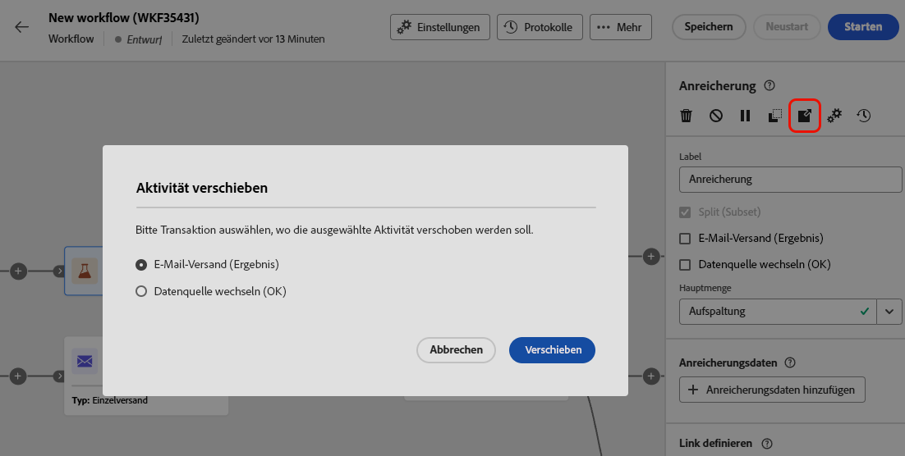
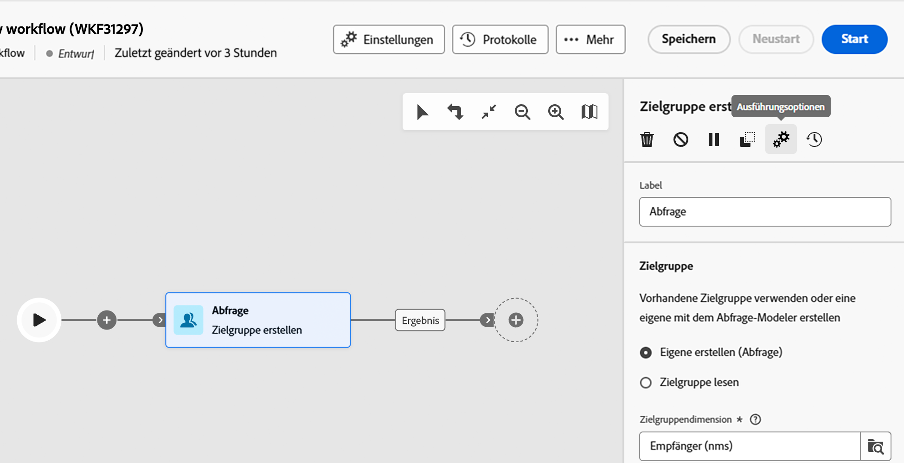

# Orchestrieren von orchestrierten Kampagnenaktivitäten {#orchestrate}

+++ Inhaltsverzeichnis

| Willkommen bei koordinierten Kampagnen | Starten der ersten orchestrierten Kampagne | Abfragen der Datenbank | Orchestrierte Kampagnenaktivitäten |
|---|---|---|---|
| [Erste Schritte mit orchestrierten Kampagnen](gs-orchestrated-campaigns.md)  [Konfigurationsschritte](configuration-steps.md)  [Zugreifen auf und Verwalten von orchestrierten Kampagnen](access-manage-orchestrated-campaigns.md) | [Wichtige Schritte für die orchestrierte Kampagnenerstellung](gs-campaign-creation.md)  [Erstellen und konfigurieren Sie die ](create-orchestrated-campaign.md)  <b>[-Aktivitäten](orchestrate-activities.md)</b>  [ Senden Sie Nachrichten mit orchestrierten Kampagnen](send-messages.md)  [Starten und überwachen Sie die Kampagne](start-monitor-campaigns.md)  [Reporting](reporting-campaigns.md) | [Arbeiten mit dem Regel-Builder](orchestrated-rule-builder.md)  [Erstellen Sie Ihre ersten ](build-query.md)  [-Bearbeitungsausdrücke](edit-expressions.md) | [Erste Schritte mit Aktivitäten](activities/about-activities.md)  Aktivitäten: [Und-Verknüpfung](activities/and-join.md) - [Zielgruppe aufbauen](activities/build-audience.md) - [Dimensionsänderung](activities/change-dimension.md) - [Kombinieren](activities/combine.md) - [Deduplizierung](activities/enrichment.md) - [Verzweigung](activities/fork.md) - [Abstimmung](activities/reconciliation.md) - [Aufspaltung](activities/split.md) Warten](activities/deduplication.md) [ |

{style="table-layout:fixed"}

+++

 

Sobald Sie [eine koordinierte Kampagne erstellt haben](gs-campaign-creation.md) sei es über das orchestrierte Kampagnenmenü oder innerhalb einer Kampagne, können Sie mit der Orchestrierung der verschiedenen Aufgaben beginnen, die sie ausführen soll. Dazu wird eine visuelle Arbeitsfläche bereitgestellt, mit der Sie ein orchestriertes Kampagnendiagramm erstellen können. Innerhalb dieses Diagramms können Sie verschiedene Aktivitäten hinzufügen und sie in einer sequentiellen Reihenfolge verbinden.

## Hinzufügen von Aktivitäten {#add}

In diesem Schritt der Konfiguration wird das Diagramm mit einem Startsymbol angezeigt, das den Anfang Ihrer orchestrierten Kampagne darstellt. Um Ihre erste Aktivität hinzuzufügen, klicken Sie auf die Schaltfläche **+**, die mit dem Startsymbol verbunden ist.

Es erscheint eine Liste von Aktivitäten, die dem Diagramm hinzugefügt werden können. Die verfügbaren Aktivitäten hängen von Ihrer Position im orchestrierten Kampagnendiagramm ab. Wenn Sie Ihre erste Aktivität hinzufügen, können Sie Ihre orchestrierte Kampagne starten, indem Sie beispielsweise eine Audience ansprechen, den orchestrierten Kampagnenpfad aufteilen oder eine **Warten**-Aktivität festlegen, um die orchestrierte Kampagnenausführung zu verzögern. Andererseits können Sie nach einer Aktivität **Zielgruppe aufbauen** Ihre Zielgruppe mit Zielgruppenbestimmungsaktivitäten verfeinern, einen Versand an Ihre Zielgruppe mit Kanalaktivitäten durchführen oder den orchestrierten Kampagnenprozess mit Flusssteuerungsaktivitäten organisieren.

{zoomable="yes"}

Sobald eine Aktivität zum Diagramm hinzugefügt wurde, erscheint rechts ein Bereich, in dem Sie die neu hinzugefügte Aktivität mit spezifischen Einstellungen konfigurieren können. Detaillierte Informationen über die Konfiguration jeder Aktivität finden Sie in [diesem Abschnitt](activities/about-activities.md).

{zoomable="yes"}

Wiederholen Sie diesen Vorgang, um beliebig viele Aktivitäten hinzuzufügen, je nach den Aufgaben, die Ihre koordinierte Kampagne ausführen soll. Beachten Sie, dass Sie auch eine neue Aktivität zwischen zwei Aktivitäten einfügen können. Klicken Sie dazu auf die Schaltfläche **+** an der Transition zwischen den Aktivitäten, wählen Sie die gewünschte Aktivität aus und konfigurieren Sie sie im rechten Bereich.

Um eine Aktivität zu entfernen, wählen Sie sie auf der Arbeitsfläche aus und klicken in den Eigenschaften der Aktivität auf das Symbol **Löschen**.

>[!TIP]
>
>Sie haben die Möglichkeit, den Namen der Transitionen zwischen den einzelnen Aktivitäten zu personalisieren. Wählen Sie dazu die Transition aus und ändern Sie das Label im rechten Bereich.

## Die Symbolleiste {#toolbar}

Die Symbolleiste oben rechts in der Arbeitsfläche bietet Optionen zum einfachen Bearbeiten der Aktivitäten und Navigieren auf der Arbeitsfläche:

* **Mehrfachauswahl-Modus**: Wählen Sie mehrere Aktivitäten aus, um sie alle gleichzeitig zu löschen oder zu kopieren/einzufügen. Weitere Informationen finden Sie in [diesem Abschnitt](#copy).
* **Drehen**: Dreht die Arbeitsfläche vertikal.
* **An Bildschirm anpassen**: Passt die Vergrößerung der Arbeitsfläche an Ihren Bildschirm an.
* **Verkleinern**/**Vergrößern**: Verkleinert bzw. vergrößert die Arbeitsfläche.
* **Karte anzeigen**: Öffnet einen Snapshot der Arbeitsfläche, in der Sie sich befinden.

{zoomable="yes"}{width="50%"}

## Verwalten von Aktivitäten {#manage}

Beim Hinzufügen von Aktivitäten sind im Eigenschattenbereich Aktionsschaltflächen verfügbar, mit denen Sie mehrere Vorgänge ausführen können. 

{zoomable="yes"}

Sie haben folgende Möglichkeiten:

* **Löschen** der Aktivität von der Arbeitsfläche aus.
* **Deaktivieren/Aktivieren** der Aktivität. Wenn die orchestrierte Kampagne ausgeführt wird, werden deaktivierte Aktivitäten und die folgenden Aktivitäten auf demselben Pfad nicht ausgeführt und die orchestrierte Kampagne wird gestoppt.
* **Anhalten/Fortsetzen** der Aktivität. Wenn die orchestrierte Kampagne ausgeführt wird, wird sie bei der angehaltenen Aktivität angehalten. Die entsprechende Aufgabe und alle ihr im gleichen Pfad folgenden Aufgaben werden nicht ausgeführt.
* **Kopieren** der Aktivität. Weitere Informationen finden Sie in [diesem Abschnitt](#copy).
* Greifen Sie auf die **Protokolle und Aufgaben** der Aktivität zu.

Bei mehreren **Zielgruppenbestimmungsaktivitäten**, z. B. **Kombinieren** oder **Deduplizierung**, können Sie die verbleibende Population verarbeiten und in eine zusätzliche ausgehende Transition einschließen. Wenn Sie beispielsweise die Aktivität **Aufspaltung** verwenden, besteht das Komplement aus der Population, die keiner der zuvor definierten Teilmengen entsprochen hat. Um diese Funktion zu verwenden, aktivieren Sie die Option **Komplement erzeugen**.

## Verschieben oder Kopieren von Aktivitäten {#move-copy}

### Kopieren und Einfügen von Aktivitäten {#copy}

Sie können orchestrierte Kampagnenaktivitäten kopieren und in einen beliebigen Workflow einfügen. Die orchestrierte Zielkampagne kann sich auf einer anderen Browser-Registerkarte befinden.

Zum Kopieren von Aktivitäten haben Sie zwei Möglichkeiten:

* Kopieren Sie eine Aktivität mithilfe der Aktionsschaltfläche.

  {zoomable="yes"}{width="70%"}

* Kopieren Sie mehrere Aktivitäten mithilfe der Symbolleistenschaltfläche.

  {zoomable="yes"}{width="70%"}

Um die kopierten Aktivitäten einzufügen, klicken Sie auf die Schaltfläche **+** auf einer Transition und wählen Sie „Aktivität X einfügen“ aus.

{zoomable="yes"}{width="50%"}

<!--
### Move activities and their child nodes {#move}

Journey Optimizer allows you to move an activity, along with the entire content of its child nodes (including all transitions and activities within it) to the end of another transition within the same orchestrated campaign.

This process disconnects the activity and everything in its outbound transition from the initial location, moving it to the new target transition.

To move an activity:

1. Select the activity you wish to move.
1. In the activity's properties pane, click the **Move** button.
1. Select the transition where you want to place the activity and its outbound transition, then confirm.

## Execution options {#execution}

All activities allow you to manage their execution options. Select an activity and click on the **Execution options** button. This lets you define the activity's execution mode and behavior in case of errors.

{zoomable="yes"}{width="70%"}

### Properties

The **Execution** field allows you to define the action to be carried out when the task is started.

The **Maximum execution duration** field allows you to specify a duration such as "30s" or "1h". If the activity is not finished after the duration specified has been elapsed, an alert is triggered. This has no impact on how the orchestrated campaign functions.

The **Time zone** field allows you to select the time zone of the activity. Adobe Journey Optimizer allows you to manage the time differences between multiple countries on the same instance. The setting applied is configured when the instance is created.

**The Affinity** field allows you to force an orchestrated campaign or an orchestrated campaign activity to execute on a particular machine. To do this, you must specify one or several affinities for the orchestrated campaign or activity in question.

The **Behavior** field allows you to define the procedure to follow if asynchronous tasks are used.

### Error management

The **In case of error** field allows you to specify the action to be carried out should the activity encounter an error.

### Initialization script

The **Initialization script** lets you initialize variables or modify activity properties. Click the **Edit code** button and type the snippet of code to execute. The script is called when the activity executes. 

## Example {#example}

Here is an orchestrated campaign example designed to send an email to all customers (other than VIP customers) with an email who are interested in coffee machines.

{zoomable="yes"}{zoomable="yes"}

To achieve this, activities below have been added:

* A **[!UICONTROL Fork]** activity that divides the orchestrated campaign into three paths (one for each set of customer),
* **[!UICONTROL Build audience]** activities to target the three sets of customers:

    * Customers with an email,
    * Customers belonging to the pre-existing "Interrested in Coffee Machine(s)" audience,
    * Customers belonging to the pre-existing "VIP ro reward" audience.

* A **[!UICONTROL Combine]** activity that groups together customers with an email and those interested in coffee machines,
* A **[!UICONTROL Combine]** activity that excludes VIP customers,
* An **[!UICONTROL Email delivery]** activity that sends an email to the resulting customers. 

Once you have completed the orchestrated campaign, add en **[!UICONTROL End]** activity at the end of the diagram. This activity allow you to visually mark the end of a workflow and has no functional impact.

After successfully designing the orchestrated campaign diagram, you can execute the orchestrated campaign and track the progress of its various tasks. [Learn how to start an orchestrated campaign and monitor its execution](start-monitor-campaigns.md)
-->