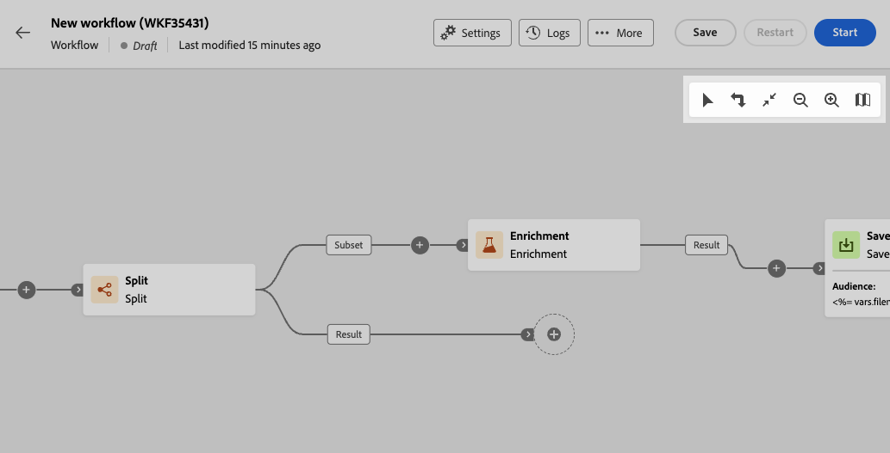

# Orchestrieren von orchestrierten Kampagnenaktivitäten {#orchestrate}

+++ Inhaltsverzeichnis

| Willkommen bei koordinierten Kampagnen | Starten der ersten orchestrierten Kampagne | Abfragen der Datenbank | Orchestrierte Kampagnenaktivitäten |
|---|---|---|---|
| [Erste Schritte mit orchestrierten Kampagnen](gs-orchestrated-campaigns.md)  [Konfigurationsschritte](configuration-steps.md)  [Schlüsselschritte für die orchestrierte Kampagnenerstellung](gs-campaign-creation.md) | [Orchestrierte Kampagne erstellen](create-orchestrated-campaign.md)  [Aktivitäten orchestrieren](orchestrate-activities.md)  [ Nachrichten mit orchestrierten Kampagnen senden](send-messages.md)  [Kampagne starten und überwachen](start-monitor-campaigns.md)  [Reporting](reporting-campaigns.md) | [Arbeiten mit der Abfrage Modeler](orchestrated-query-modeler.md)  [Erstellen Sie Ihre ersten ](build-query.md)  [-Bearbeitungsausdrücke](edit-expressions.md) | [Erste Schritte mit Aktivitäten](activities/about-activities.md)  Aktivitäten: [Und-Verknüpfung](activities/and-join.md) - [Zielgruppe aufbauen](activities/build-audience.md) - [Dimensionsänderung](activities/change-dimension.md) - [Kombinieren](activities/combine.md) - [Deduplizierung](activities/enrichment.md) - [Verzweigung](activities/fork.md) - [Abstimmung](activities/reconciliation.md) - [Aufspaltung](activities/split.md) [&#128279;](activities/wait.md) Warten[&#128279;](activities/deduplication.md)  |

{style="table-layout:fixed"}

+++

 

Sobald Sie [eine koordinierte Kampagne erstellt haben](gs-campaign-creation.md) sei es über das orchestrierte Kampagnenmenü oder innerhalb einer Kampagne, können Sie mit der Orchestrierung der verschiedenen Aufgaben beginnen, die sie ausführen soll. Dazu wird eine visuelle Arbeitsfläche bereitgestellt, mit der Sie ein orchestriertes Kampagnendiagramm erstellen können. Innerhalb dieses Diagramms können Sie verschiedene Aktivitäten hinzufügen und sie in einer sequentiellen Reihenfolge verbinden.

## Hinzufügen von Aktivitäten {#add}

In diesem Schritt der Konfiguration wird das Diagramm mit einem Startsymbol angezeigt, das den Anfang Ihrer orchestrierten Kampagne darstellt. Um Ihre erste Aktivität hinzuzufügen, klicken Sie auf die Schaltfläche **+**, die mit dem Startsymbol verbunden ist.

Es erscheint eine Liste von Aktivitäten, die dem Diagramm hinzugefügt werden können. Die verfügbaren Aktivitäten hängen von Ihrer Position im orchestrierten Kampagnendiagramm ab. Wenn Sie Ihre erste Aktivität hinzufügen, können Sie Ihre orchestrierte Kampagne starten, indem Sie beispielsweise eine Audience ansprechen, den orchestrierten Kampagnenpfad aufteilen oder eine **Warten**-Aktivität festlegen, um die orchestrierte Kampagnenausführung zu verzögern. Andererseits können Sie nach einer Aktivität **Zielgruppe aufbauen** Ihre Zielgruppe mit Zielgruppenbestimmungsaktivitäten verfeinern, einen Versand an Ihre Zielgruppe mit Kanalaktivitäten durchführen oder den orchestrierten Kampagnenprozess mit Flusssteuerungsaktivitäten organisieren.

{zoomable="yes"}

Sobald eine Aktivität zum Diagramm hinzugefügt wurde, erscheint rechts ein Bereich, in dem Sie die neu hinzugefügte Aktivität mit spezifischen Einstellungen konfigurieren können. Detaillierte Informationen über die Konfiguration jeder Aktivität finden Sie in [diesem Abschnitt](activities/about-activities.md).

{zoomable="yes"}

Wiederholen Sie diesen Vorgang, um beliebig viele Aktivitäten hinzuzufügen, je nach den Aufgaben, die Ihre koordinierte Kampagne ausführen soll. Beachten Sie, dass Sie auch eine neue Aktivität zwischen zwei Aktivitäten einfügen können. Klicken Sie dazu auf die Schaltfläche **+** an der Transition zwischen den Aktivitäten, wählen Sie die gewünschte Aktivität aus und konfigurieren Sie sie im rechten Bereich.

Um eine Aktivität zu entfernen, wählen Sie sie auf der Arbeitsfläche aus und klicken in den Eigenschaften der Aktivität auf das Symbol **Löschen**.

>[!TIP]
>
>Sie haben die Möglichkeit, den Namen der Transitionen zwischen den einzelnen Aktivitäten zu personalisieren. Wählen Sie dazu die Transition aus und ändern Sie das Label im rechten Bereich.

## Die Symbolleiste {#toolbar}

Die Symbolleiste oben rechts in der Arbeitsfläche bietet Optionen zum einfachen Bearbeiten der Aktivitäten und Navigieren auf der Arbeitsfläche:

* **Mehrfachauswahl-Modus**: Wählen Sie mehrere Aktivitäten aus, um sie alle gleichzeitig zu löschen oder zu kopieren/einzufügen. Weitere Informationen finden Sie in [diesem Abschnitt](#copy).
* **Drehen**: Dreht die Arbeitsfläche vertikal.
* **An Bildschirm anpassen**: Passt die Vergrößerung der Arbeitsfläche an Ihren Bildschirm an.
* **Verkleinern**/**Vergrößern**: Verkleinert bzw. vergrößert die Arbeitsfläche.
* **Karte anzeigen**: Öffnet einen Snapshot der Arbeitsfläche, in der Sie sich befinden.

{zoomable="yes"}{width="50%"}

## Verwalten von Aktivitäten {#manage}

Beim Hinzufügen von Aktivitäten sind im Eigenschattenbereich Aktionsschaltflächen verfügbar, mit denen Sie mehrere Vorgänge ausführen können. 

{zoomable="yes"}

Sie haben folgende Möglichkeiten:

* **Löschen** der Aktivität von der Arbeitsfläche aus.
* **Deaktivieren/Aktivieren** der Aktivität. Wenn die orchestrierte Kampagne ausgeführt wird, werden deaktivierte Aktivitäten und die folgenden Aktivitäten auf demselben Pfad nicht ausgeführt und die orchestrierte Kampagne wird gestoppt.
* **Anhalten/Fortsetzen** der Aktivität. Wenn die orchestrierte Kampagne ausgeführt wird, wird sie bei der angehaltenen Aktivität angehalten. Die entsprechende Aufgabe und alle ihr im gleichen Pfad folgenden Aufgaben werden nicht ausgeführt.
* **Kopieren** der Aktivität. Weitere Informationen finden Sie in [diesem Abschnitt](#copy).
* **Verschieben** Sie eine Aktivität und alle untergeordneten Knoten in eine andere Transition. Weiterführende Informationen finden Sie in diesem [Abschnitt](#move).
* Rufen Sie die **Ausführungsoptionen** der Aktivität auf.
* Greifen Sie auf die **Protokolle und Aufgaben** der Aktivität zu.

Bei mehreren **Zielgruppenbestimmungsaktivitäten**, z. B. **Kombinieren** oder **Deduplizierung**, können Sie die verbleibende Population verarbeiten und in eine zusätzliche ausgehende Transition einschließen. Wenn Sie beispielsweise die Aktivität **Aufspaltung** verwenden, besteht das Komplement aus der Population, die keiner der zuvor definierten Teilmengen entsprochen hat. Um diese Funktion zu verwenden, aktivieren Sie die Option **Komplement erzeugen**.

## Verschieben oder Kopieren von Aktivitäten {#move-copy}

### Kopieren und Einfügen von Aktivitäten {#copy}

Sie können orchestrierte Kampagnenaktivitäten kopieren und in einen beliebigen Workflow einfügen. Die orchestrierte Zielkampagne kann sich auf einer anderen Browser-Registerkarte befinden.

Zum Kopieren von Aktivitäten haben Sie zwei Möglichkeiten:

* Kopieren Sie eine Aktivität mithilfe der Aktionsschaltfläche.

  {zoomable="yes"}{width="70%"}

* Kopieren Sie mehrere Aktivitäten mithilfe der Symbolleistenschaltfläche.

  {zoomable="yes"}{width="70%"}

Um die kopierten Aktivitäten einzufügen, klicken Sie auf die Schaltfläche **+** auf einer Transition und wählen Sie „Aktivität X einfügen“ aus.

{zoomable="yes"}{width="50%"}

### Verschieben von Aktivitäten und ihren untergeordneten Knoten {#move}

Mit Journey Optimizer können Sie eine Aktivität zusammen mit dem gesamten Inhalt ihrer untergeordneten Knoten (einschließlich aller darin enthaltenen Transitionen und Aktivitäten) an das Ende einer anderen Transition innerhalb derselben orchestrierten Kampagne verschieben.

Dieser Prozess trennt die Aktivität und alles, was sich in ihrer ausgehenden Transition befindet, vom ursprünglichen Speicherort und verschiebt sie zur neuen Zieltransition.

So verschieben Sie eine Aktivität:

1. Wählen Sie die Aktivität aus, die verschoben werden soll.
1. Klicken Sie im Bereich mit den Eigenschaften der Aktivität auf die Schaltfläche **Verschieben**.
1. Wählen Sie die Transition, in der die Aktivität platziert werden soll, und die ausgehende Transition aus, und bestätigen Sie dann die Auswahl.

## Ausführungsoptionen {#execution}

Sie können die Ausführungsoptionen aller Aktivitäten verwalten.  Wählen Sie eine Aktivität aus und klicken Sie auf die Schaltfläche **Ausführungsoptionen**. Auf diese Weise können Sie den Ausführungsmodus und das Verhalten der Aktivität im Falle eines Fehlers definieren.

{zoomable="yes"}{width="70%"}

### Properties

Im Feld **Ausführung** können Sie die Aktion definieren, die beim Starten der Aufgabe ausgelöst werden soll.

Im Feld **Max. Ausführungsdauer** können Sie eine maximale Dauer festlegen, z. B. „30s“ oder „1h“. Wenn die Aktivität nach Ablauf der angegebenen Dauer nicht abgeschlossen ist, wird ein Warnhinweis ausgelöst. Dies hat keine Auswirkungen auf die Funktionsweise der orchestrierten Kampagne.

Im Feld **Zeitzone** können Sie der Aktivität eine bestimmte Zeitzone zuweisen. Mit Adobe Journey Optimizer können Sie die Zeitunterschiede zwischen mehreren Ländern auf derselben Instanz verwalten. Die angewendete Einstellung wird beim Erstellen der Instanz konfiguriert.

**Affinität** können Sie die Ausführung einer orchestrierten Kampagne oder einer orchestrierten Kampagnenaktivität auf einem bestimmten Computer erzwingen. Dazu müssen Sie eine oder mehrere Affinitäten für die betreffende orchestrierte Kampagne oder Aktivität angeben.

Im Feld **Verhalten** können Sie das Verhalten des Workflows im Fall von asynchronen Aufgaben bestimmen.

### Umgang mit Fehlern

Im Feld **Bei Fehler** lassen sich mögliche Reaktionen bei Auftreten eines Fehlers bestimmen.

### Initialisierungsskript

Mit dem **Initialisierungsskript** können Sie Variablen initialisieren oder Aktivitätseigenschaften ändern. Klicken Sie auf die Schaltfläche **Code bearbeiten** und geben Sie den auszuführenden Code-Ausschnitt ein. Das Skript wird aufgerufen, wenn die Aktivität ausgeführt wird. 

## Beispiel {#example}

Im Folgenden finden Sie ein Beispiel für eine orchestrierte Kampagne, die entwickelt wurde, um eine E-Mail an alle Kundinnen und Kunden (außer VIP-Kundinnen und Kunden) zu senden, die an Kaffeemaschinen interessiert sind.

{zoomable="yes"}{zoomable="yes"}

Um dies zu bewerkstelligen, wurden die folgenden Aktivitäten hinzugefügt:

* Eine Aktivität **[!UICONTROL Verzweigung]** die die orchestrierte Kampagne in drei Pfade unterteilt (einen für jede Kundengruppe),
* Aktivitäten **[!UICONTROL Zielgruppe aufbauen]**, um die drei Kundengruppen anzusprechen:

   * Kundinnen und Kunden mit einer E-Mail-Adresse,
   * Kundinnen und Kunden, die zu der bereits bestehenden Zielgruppe „Interessiert an Kaffeemaschinen“ gehören,
   * Kundinnen und Kunden, die zur bereits bestehenden Zielgruppe „VIP oder Belohnung“ gehören.

* Eine Aktivität **[!UICONTROL Kombinieren]**, die Kundinnen und Kunden mit einer E-Mail-Adresse und solche, die sich für Kaffeemaschinen interessieren, zusammenfasst,
* Eine Aktivität **[!UICONTROL Kombinieren]**, die VIP-Kundinnen und -Kunden ausschließt,
* Eine Aktivität **[!UICONTROL E-Mail-Versand]**, die eine E-Mail an die resultierenden Kundinnen und Kunden sendet.

Fügen Sie nach Abschluss der orchestrierten Kampagne die Aktivität **[!UICONTROL Ende]** am Ende des Diagramms hinzu. Diese Aktivität ermöglicht es Ihnen, das Ende eines Workflows visuell zu markieren, und hat keine funktionalen Auswirkungen.

Nachdem Sie das Diagramm für die orchestrierte Kampagne erfolgreich erstellt haben, können Sie die orchestrierte Kampagne ausführen und den Fortschritt der verschiedenen Aufgaben verfolgen. [Erfahren Sie, wie Sie eine orchestrierte Kampagne starten und ihre Ausführung überwachen](start-monitor-campaigns.md)
