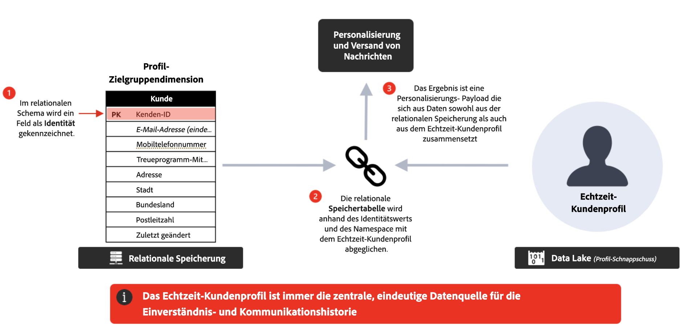

# Häufig gestellte Fragen {#faq-oc}

Im Folgenden finden Sie häufig gestellte Fragen zu mit Adobe Journey Optimizer orchestrierten Kampagnen.

Sie würden gerne mehr erfahren? Verwenden Sie die Feedback-Optionen unten auf dieser Seite, um Ihre Frage zu stellen, oder vernetzen Sie sich mit der [Adobe Journey Optimizer-Community](https://experienceleaguecommunities.adobe.com/t5/adobe-journey-optimizer/ct-p/journey-optimizer?profile.language=de){target="_blank"}.

+++ Was ist Kampagnenorchestrierung?

Kampagnenorchestrierung ist eine Funktion von Journey Optimizer, die ein- oder mehrstufige Workflows unterstützt, die den relationalen Datenspeicher nutzen, um Zielgruppen für die Batch-Interaktion zu erstellen und zu segmentieren.

Damit steht Journey Optimizer ein neuer Kampagnentyp zur Verfügung: **Orchestrierte Kampagnen**. Mithilfe von orchestrierten Kampagnen können Marken komplexe, 1:n-Marketing-Kampagnen im benötigten Umfang durchführen. Sie sind für markenbezogene Interaktionen konzipiert, z. B. für Werbeaktionen, saisonale Kampagnen oder kontobasierte Kommunikation.

Verglichen mit Einzelversand-/Aktionskampagnen ermöglichen sie **Orchestrierung und Sequenzierung** für ausgehendes Marketing: Zielgruppen durchlaufen einen mehrstufigen Workflow gemeinsam, anstatt einen einmaligen Blast zu erhalten.

**Weitere Informationen**

* [Erste Schritte mit orchestrierten Kampagnen](gs-orchestrated-campaigns.md)
* [Erstellen Ihrer ersten orchestrierten Kampagne](gs-campaign-creation.md)

+++

+++ Was kann ich mit orchestrierten Kampagnen tun?

Die wichtigsten Funktionen ermöglichen Folgendes:

* **On-Demand-Zielgruppen**: Sofortiges Erstellen und Verfeinern von Zielgruppen mithilfe von relationalen Abfragen.
* **Segmentierung für mehrere Entitäten**: Erstellen präziser Zielgruppen durch die Verknüpfung von Kundendaten mit zugehörigen Entitäten (z. B. Konten, Käufe, Buchungen).
* **Sichtbarkeit vor dem Versand**: Anzeigen der genauen Zielgruppenzahlen vor dem Start, um das Targeting zu optimieren.
* **Mehrstufige Workflows**: Durchführung von sequenziellen Kampagnen wie saisonalen Werbeaktionen, Produkteinführungen oder Treueangeboten.

**Best Practices**

* Definieren Sie ein **klares Kampagnenziel**, bevor Sie Workflows entwerfen.
* Beginnen Sie mit einer **Pilotzielgruppe**, um Zähler und Logik vor der Skalierung zu überprüfen.
* Halten Sie Segmentierungsregeln **so einfach wie möglich**, um die Leistung und Transparenz zu erhöhen.
* Verwenden Sie **konsistente Benennungskonventionen** für Zielgruppen und Kampagnen, um die Verwaltung zu vereinfachen.

**Weitere Informationen**

* [Erstellen einer orchestrierten Kampagne](create-orchestrated-campaign.md)
* [Arbeiten mit Kampagnenaktivitäten](activities/about-activities.md)
* [Erstellen einer Regel mithilfe des Abfrage-Modelers](build-query.md)

+++

+++ Wie greife ich auf die Kampagnenorchestrierung zu?

Für einen Zugriff auf die Kampagnenorchestrierung muss die Lizenz entweder das Paket **Journey Optimizer – Kampagnen und Journeys** oder das Paket **Journey Optimizer – Kampagnen** enthalten. Wenden Sie sich an den Adobe-Support, um Ihre Lizenz zu bestätigen und bei Bedarf zu aktualisieren.

**Weitere Informationen**

* [Erste Schritte mit orchestrierten Kampagnen](gs-orchestrated-campaigns.md)
* [Produktbeschreibung von Adobe Journey Optimizer](https://helpx.adobe.com/de/legal/product-descriptions/adobe-journey-optimizer.html){target="_blank"}

+++

+++ Wie unterscheiden sich orchestrierte Kampagnen von Journeys?

* **Orchestrierte Kampagnen**: Optimiert für **Batch-Kampagnen, 1:n-Kampagnen**. Zielgruppen schreiten in großen Mengen nach einem Zeitplan fort.
* **Journeys**: Am besten geeignet für **Echtzeit-1:1-Interaktion**. Jede Person durchläuft die Customer Journey in ihrem eigenen Tempo, ausgelöst durch ihr Verhalten oder bestimmte Ereignisse.

**Best Practice**: Verwenden Sie sie zusammen – Journeys für ausgelöste, reaktive Erlebnisse und orchestrierte Kampagnen für geplante, kalenderbasierte Initiativen.

**Weitere Informationen**

* [Erste Schritte mit orchestrierten Kampagnen](gs-orchestrated-campaigns.md)
* [Erstellen Ihrer ersten Journey](../building-journeys/journey-gs.md)
* [Erste Schritte mit Kampagnen](../campaigns/get-started-with-campaigns.md)

+++

+++ Was ist Segmentierung mit mehreren Entitäten?

Die Kampagnenorchestrierung in Adobe Journey Optimizer verwendet eine relationale Datenbank. Dieser Typ von Datenmodell verfügt über separate Datenschemata, die über 1:1- oder 1:many-Beziehungen verbunden sind. Dadurch können Benutzende eine Abfrage für ein beliebiges Schema starten – nicht nur auf Empfängerebene – und dann hin und her zu anderen zugehörigen Schemata wechseln (z. B. Käufe, Produkte, Buchungen oder Empfängerdetails), was große Flexibilität bei der Erstellung und Verfeinerung von Segmenten und Zielgruppen bietet.

**Beispiel** – Sprechen Sie alle Empfängerinnen und Empfänger an, deren Abonnements in den nächsten 30 Tagen ablaufen. In der Kampagnenorchestrierung kann die Abfrage mit dem Abonnementschema beginnen, nur die Spalte mit dem Ablaufdatum dieses Schemas durchsuchen und alle abgelaufenen Abonnements zurückgeben. Anschließend kann ein Rollup zu den Empfängerdaten durchgeführt werden, die mit diesen spezifischen Abonnement-IDs verknüpft sind. So erhalten Sie schneller und effizienter Ergebnisse als bei Datenmodellen, die jede Abfrage auf Empfängerebene starten.

**Weitere Informationen**

* [Erste Schritte mit Schemata und Datensätzen](gs-schemas.md)
* [Konfigurieren einer Zielgruppendimension](target-dimension.md)
* [Erstellen einer Regel mithilfe des Abfrage-Modelers](build-query.md)

+++

+++ Wie funktioniert das Datenmodell?

Kampagnen verwenden eine **relationale Datenbank**. Auf diese Weise können Sie Abfragen über verschiedene Datensätze hinweg durchführen (z. B. Kundschaft, Produkte, Abonnements) und sie flexibel verbinden, um erweiterte Segmentierung zu ermöglichen.

**Best Practices**

* Organisieren Sie Datensätze so, dass **Beziehungen (Joins)** Geschäftslogik widerspiegeln.
* Vermeiden Sie unnötige Joins, um die Leistung von Abfragen zu erhalten.
* Validieren Sie Beispielergebnisse, bevor Sie groß angelegte Extraktionen durchführen.

**Weitere Informationen**

* [Erste Schritte mit Schemata und Datensätzen](gs-schemas.md)
* [Manuelles Erstellen eines Schemas](manual-schema.md)
* [Aufnehmen von Daten](ingest-data.md)

+++

+++ Kann ich Nachrichten mit relationalen Daten personalisieren?

Ja. In der Kampagnenorchestrierung kann ein als „Personenentität“ bekanntes Empfängerprofil aktualisiert werden und diese Daten können für die Personalisierung verwendet werden. Darüber hinaus können angereicherte Daten aus verknüpften Entitäten in der relationalen Datenbank ebenfalls für die Personalisierung verwendet werden. Sie können Kundenprofile zusammen mit verknüpften Daten (wie etwa Käufen oder Abonnements) verwenden, um Inhalte über alle unterstützten Kanäle hinweg zu personalisieren.

**Recommendations**

* Nutzen Sie **Transaktions- und Verhaltensdaten**, um Angebote relevant zu machen.
* Kombinieren Sie **statische Attribute** (z. B. Treuestufe) mit **dynamischen Attributen** (z. B. Datum des letzten Kaufs).
* Personalisierung kurz halten – Das Überladen von Nachrichten mit Daten kann die Lesbarkeit beeinträchtigen.

**Weitere Informationen**

* [Verwenden der Aktivität „Anreicherung“](activities/enrichment.md)
* [Hinzufügen einer Kanalaktivität in einer orchestrierten Kampagne](activities/channels.md)

+++

<!--
## Do Orchestrated campaigns integrate with other Adobe solutions? {#integrations}

Yes. Campaign orchestration is natively integrated with:

* **Customer Journey Analytics**: Campaign orchestration reports are available.  
* **Real-Time CDP**: Audiences built in Campaigns can be read in Real-Time CDP.  
* **Federated Audience Composition (FAC)**: Available as an add-on.  -->

+++ Welche Kanäle werden unterstützt?

Sie können orchestrierte Kampagnen erstellen, um **E-Mails**, **SMS**, **Push-Benachrichtigungen** und **Briefpost**.

**Weitere Informationen**

* [Hinzufügen einer Kanalaktivität in einer orchestrierten Kampagne](activities/channels.md)
* [Arbeiten mit Kampagnenaktivitäten](activities/about-activities.md)

+++

+++ Können verschiedene Kommunikationen und verschiedene Kanäle innerhalb derselben orchestrierten Kampagne gestartet werden?

Ja, orchestrierte Kampagnen unterstützen kanalübergreifende Orchestrierung. Sie können E-Mail-, SMS- und Push-Benachrichtigungsaktivitäten in einer Arbeitsfläche für mehrstufige Kampagnen kombinieren, um umfassende Kundenerlebnisse zu schaffen.

**Weitere Informationen**

* [Hinzufügen einer Kanalaktivität in einer orchestrierten Kampagne](activities/channels.md)
* [Arbeiten mit Kampagnenaktivitäten](activities/about-activities.md)

+++

+++ Gibt es Vorlagen für orchestrierte Kampagnen?

Nein, Sie können keine Kampagnenvorlagen definieren oder verwenden. Sie können jedoch Inhaltsvorlagen für Ihre Kommunikation nutzen.

**Weitere Informationen**

* [Hinzufügen einer Kanalaktivität in einer orchestrierten Kampagne](activities/channels.md)
* [Erstellen einer orchestrierten Kampagne](create-orchestrated-campaign.md)

+++

+++ Ist der Content-Designer für Nachrichten spezifisch für orchestrierte Kampagnen?

Nein, der Content-Designer einschließlich E-Mail-Designer ist in allen Funktionen von Journey Optimizer gleich.

**Weitere Informationen**

* [Hinzufügen einer Kanalaktivität in einer orchestrierten Kampagne](activities/channels.md)
* [Verwenden der Aktivität „Anreicherung“](activities/enrichment.md)

+++

+++ Wie sind die verschiedenen Kanäle in orchestrierten Kampagnen verbunden?

Die Kanalkomponente und die Laufzeit sind in allen Journey Optimizer-Kampagnen vorhanden. Die unterstützten Kanäle variieren jedoch. Orchestrierte Kampagnen unterstützen E-Mail, SMS und Push-Benachrichtigungen.

**Weitere Informationen**

* [Hinzufügen einer Kanalaktivität in einer orchestrierten Kampagne](activities/channels.md)
* [Leitlinien und Einschränkungen](guardrails.md)

+++

+++ Können sich orchestrierte Kampagnen mit Outbound-Kanälen (Web, InApp) verbinden?

Nein, Inbound-Kanäle wie Web und In-App werden in orchestrierten Kampagnen nicht unterstützt. Es werden ausschließlich Outbound-Kanäle unterstützt (E-Mail, SMS und Push-Benachrichtigungen).

**Weitere Informationen**

* [Leitlinien und Einschränkungen](guardrails.md)
* [Hinzufügen einer Kanalaktivität in einer orchestrierten Kampagne](activities/channels.md)

+++

+++ Was ist mit Berechtigungen und Einverständnis?

Berechtigungen und Einverständnis für orchestrierte Kampagnen und Journeys werden in Adobe Experience Platform zentral verwaltet. Diese Einstellungen werden vor dem Versand für beide Lösungen auf jede Empfängerin und jeden Empfänger angewendet.

**Best Practices**

* Wenden Sie **zentralisierte Governance** an – und vermeiden Sie die separate Einverständnisverwaltung auf Kampagnenebene.
* Prüfen Sie Einverständnisdaten regelmäßig, um Inkonsistenzen zu erkennen.
* Respektieren Sie **kanalspezifische Opt-outs** – gehen Sie nicht davon aus, dass globales Einverständnis alle Kanäle abdeckt.

**Weitere Informationen**

* [Erste Schritte mit orchestrierten Kampagnen](gs-orchestrated-campaigns.md)
* [Leitlinien und Einschränkungen](guardrails.md)

+++

+++ Kann ich in orchestrierten Kampagnen Ad-hoc-Segmentierung durchführen?

In der Kampagnenorchestrierung wird Ad-hoc-Segmentierung als „Live-Segmentierung“ bezeichnet, bei der Sie in Echtzeit auf alle im relationalen Speicher verfügbaren Daten zugreifen, eine komplexe Abfrage darauf erstellen und das Ergebnis für eine sofortige Aktivierung über ausgehende Kanäle erhalten können (z. B. E-Mail + SMS).

**Tipps**

* Verwenden Sie Ad-hoc-Segmentierung für **zeitkritische Anforderungen** (z. B. Flash-Werbeaktionen).
* Speichern und dokumentieren Sie nützliche Abfragen, damit sie in zukünftigen Kampagnen wiederverwendet werden können.
* Überprüfen Sie vor der Aktivierung die Zielgruppengröße, um zu verhindern, dass der Versand zu groß oder zu klein ausfällt.

**Weitere Informationen**

* [Erstellen einer Regel mithilfe des Abfrage-Modelers](build-query.md)
* [Verwenden der Aktivität „Zielgruppe erstellen“](activities/build-audience.md)
* [Konfigurieren einer Zielgruppendimension](target-dimension.md)

+++

+++ Greift die Kampagnenorchestrierung nur auf Daten zu, die per Batch geladen werden, oder kann sie auch aktualisierte Echtzeit-Tabellen (wie Analytics-Daten) abfragen?

Die Kampagnenorchestrierung von Journey Optimizer kann Ad-hoc-Abfragen auf der Grundlage von relationalen Schemata erstellen. Relationale Schemata unterstützen derzeit nur Batch-Quellen. Darüber hinaus werden Aktivitäten vom Typ „Zielgruppe lesen“ aus jeder Art von Adobe Experience Platform-Zielgruppe unterstützt.

**Weitere Informationen**

* [Erste Schritte mit Schemata und Datensätzen](gs-schemas.md)
* [Aufnehmen von Daten](ingest-data.md)
* [Verwenden der Aktivität „Zielgruppe lesen“](activities/read-audience.md)

+++

+++ Unterstützen orchestrierte Kampagnen die Entscheidungsfindung?

Nein, orchestrierte Kampagnen unterstützen keine Entscheidungsfindungsfunktionen. Nutzen Sie für Entscheidungsfindungsfunktionen stattdessen standardmäßige Journey Optimizer-Journeys oder Aktionskampagnen.

**Weitere Informationen**

* [Erste Schritte mit der Erlebnis-Entscheidung](../experience-decisioning/gs-experience-decisioning.md)
* [Erstellen Ihrer ersten Journey](../building-journeys/journey-gs.md)
* [Erste Schritte mit Kampagnen](../campaigns/get-started-with-campaigns.md)

+++

+++ Wie funktioniert die Bereitstellung in allen Umgebungen?

Objekte, die in orchestrierten Kampagnen erstellt werden (z. B. Zielgruppen, Workflows), sind an die Sandbox gebunden, in der sie erstellt werden. Standardmäßige Verpackungs- und Bereitstellungs-Workflows in Umgebungen (Entwicklung, Staging, Produktion) sind für orchestrierte Kampagnen derzeit nicht verfügbar.

**Best Practices**

* Pflegen Sie **separate Sandboxes** für Experimente, Qualitätssicherung und Produktion.
* Dokumentieren Sie Konfigurationen sorgfältig, um bei Bedarf eine manuelle Replikation zu ermöglichen.
* Stimmen Sie sich mit Governance-Teams ab, um Konfigurationsabweichungen zwischen Umgebungen zu reduzieren

**Weitere Informationen**

* [Erste Schritte mit orchestrierten Kampagnen](gs-orchestrated-campaigns.md)
* [Leitlinien und Einschränkungen](guardrails.md)

+++

<!--
## Are there recommended practices for running campaigns at scale? {#scale}

Yes, follow the best practices below:  

* **Plan campaigns around business calendars** (product launches, seasonal peaks) to align volume and resources.  
* Use **audience pre-views** before sending to confirm the expected size and avoid surprises.  
* Where possible, **stagger send times** to avoid overwhelming downstream systems (e.g., call centers, websites).  
* Establish a **monitoring routine**—track delivery logs, error rates, and opt-outs after each send.  
* Run **post-campaign analysis** in Customer Journey Analytics to refine targeting and orchestration for the next cycle.  
-->

+++ Welche Beziehung besteht zwischen Empfänger- und Profilentitäten?

Segmentierung wird für Empfängerinnen und Empfänger beim Versand über das Adobe Experience Platform-Profil durchgeführt. Die Zielgruppendimension „Empfängerin bzw. Empfänger“ erweitert das einheitliche Profil um zusätzliche Daten, die für die Segmentierung in orchestrierten Kampagnen verwendet werden, während „Empfängerin bzw. Empfänger“ zur Laufzeit mit dem Profil abgeglichen wird, um Nachrichten zu senden und die Einverständnisrichtlinie und die Geschäftsregeln zu überprüfen. Diese Abstimmung ist nützlich, um Geschäftsregeln und Einverständnisanwendung auf Profilebene zu vereinheitlichen.

**Weitere Informationen**

* [Konfigurieren einer Zielgruppendimension](target-dimension.md)
* [Erste Schritte mit Schemata und Datensätzen](gs-schemas.md)
* [Erstellen einer Regel mithilfe des Abfrage-Modelers](build-query.md)

+++

+++ In welchen Fällen wird die Verwendung von Empfänger- und Profilentitäten empfohlen?

Wenn Sie mit „Ja“ antworten, wird der beste Datenspeicher vorgeschlagen. Bestätigen Sie jedoch immer den besten Ansatz basierend auf Ihrem Anwendungsfall und Einschränkungen mit Ihrem Adobe-Support-Mitarbeiter.

| Relationaler Speicher | Echtzeit-Kundenprofil |
|---------|----------|
| Ist die Quelle der Daten bereits relational? | Und die Quelle des Daten-Streamings? |
| Beabsichtigen Sie, Daten direkt für Marketing-Anwendungsfälle zu erfassen? | Ist Aktualität von Daten eine wichtige Anforderung? |
| Gibt es eine große Menge an historischen Daten (`>` 2 Monate), die für Anwendungsfälle mit Marketing-Aktivierung benötigt werden? | Gibt es Szenarien, in denen jeweils aktuelle Aktionen oder Entscheidungen Daten erfordern? |
| Gibt es Ad-hoc-Anforderungen für die Erstellung, Auswertung und Aktivierung von Zielgruppen? | Können die Verhaltensdaten mithilfe vorberechneter Aggregate auf `<` 90 Tage beschränkt werden? |
|  | Sind Daten erforderlich, um Nachrichten in Echtzeit zu personalisieren? |

**Weitere Informationen**

* [Konfigurieren einer Zielgruppendimension](target-dimension.md)
* [Erste Schritte mit Schemata und Datensätzen](gs-schemas.md)
* [Erstellen einer Regel mithilfe des Abfrage-Modelers](build-query.md)

+++

+++ Wie viele Aktivitäten sind pro orchestrierter Kampagne maximal zulässig?

Die Anzahl der Aktivitäten in einer orchestrierten Kampagne ist auf maximal 500 begrenzt. 

**Weitere Informationen**

* [Leitlinien und Einschränkungen](guardrails.md)
* [Arbeiten mit Kampagnenaktivitäten](activities/about-activities.md)

+++

+++ Ist es möglich, Anreicherungen durchzuführen, um zusätzliche Daten hinzuzufügen?

Ja, Sie können Daten aus dem relationalen Speicher und aus Adobe Experience Platform-Zielgruppen anreichern. Verwenden Sie die Aktivität „Anreicherung“, um Ihre Zielgruppendaten um zusätzliche Attribute aus verwandten Schemata zu erweitern.

**Weitere Informationen**

* [Verwenden der Aktivität „Anreicherung“](activities/enrichment.md)
* [Verwenden der Aktivität „Abstimmung“](activities/reconciliation.md)

+++

+++ Müssen alle Filter über Zielgruppen definiert werden, oder kann ein bestimmter Filtertyp konfiguriert werden?

Orchestrierte Kampagnen unterstützen vordefinierte Filter: Sie können eine Abfrage definieren und als Filter speichern, zu Ihren Favoriten hinzufügen und sie für weitere Segmentierungsaufgaben wiederverwenden. Vordefinierte Filter können Parameter enthalten, damit Sie Werte zum Zeitpunkt der Verwendung eingeben können. [Erfahren Sie, wie Sie mit vordefinierten Filtern arbeiten](predefined-filters.md).

**Weitere Informationen**

* [Erstellen einer Regel mithilfe des Abfrage-Modelers](build-query.md)
* [Verwenden der Aktivität „Zielgruppe erstellen“](activities/build-audience.md)
* [Arbeiten mit vordefinierten Filtern](orchestrated-rule-builder.md)

+++

## Weitere Ressourcen

Detailliertere Informationen und Updates finden Sie in den folgenden Ressourcen:

* [Leitlinien und Einschränkungen bei orchestrierten Kampagnen](guardrails.md)
* [Erste Schritte mit Schemata und Datensätzen in orchestrierten Kampagnen](gs-schemas.md)
* [Erstellen Ihrer ersten orchestrierten Kampagne](gs-campaign-creation.md)
* [Produktbeschreibung zu Journey Optimizer](https://helpx.adobe.com/de/legal/product-descriptions/adobe-journey-optimizer.html){target="_blank"}
