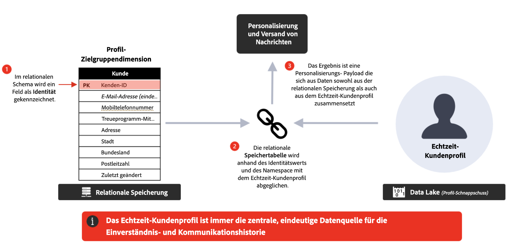

# Häufig gestellte Fragen {#faq-oc}

>[!BEGINSHADEBOX]

**Auf dieser Seite** finden Sie Antworten auf häufig gestellte Fragen zu orchestrierten Kampagnen, einschließlich Datenmodellen, Kanälen, Aktivitäten, Veröffentlichung und Einverständnis.

>[!ENDSHADEBOX]

Im Folgenden finden Sie häufig gestellte Fragen zu mit Adobe Journey Optimizer orchestrierten Kampagnen.

Sie würden gerne mehr erfahren? Verwenden Sie die Feedback-Optionen unten auf dieser Seite, um Ihre Frage zu stellen, oder vernetzen Sie sich mit der [Adobe Journey Optimizer-Community](https://experienceleaguecommunities.adobe.com/t5/adobe-journey-optimizer/ct-p/journey-optimizer?profile.language=de){target="_blank"}.

+++ Was ist Kampagnenorchestrierung?

Kampagnenorchestrierung ist eine Funktion von Journey Optimizer, die ein- oder mehrstufige Workflows unterstützt, die den relationalen Datenspeicher nutzen, um Zielgruppen für die Batch-Interaktion zu erstellen und zu segmentieren.

Damit steht Journey Optimizer ein neuer Kampagnentyp zur Verfügung: **Orchestrierte Kampagnen**. Mithilfe von orchestrierten Kampagnen können Marken komplexe, 1:n-Marketing-Kampagnen im benötigten Umfang durchführen. Sie sind für markenbezogene Interaktionen konzipiert, z. B. für Werbeaktionen, saisonale Kampagnen oder kontobasierte Kommunikation.

Verglichen mit Einzelversand-/Aktionskampagnen ermöglichen sie **Orchestrierung und Sequenzierung** für ausgehendes Marketing: Zielgruppen durchlaufen einen mehrstufigen Workflow gemeinsam, anstatt einen einmaligen Blast zu erhalten.

**Weitere Informationen**

* [Erste Schritte mit orchestrierten Kampagnen](gs-orchestrated-campaigns.md)
* [Erstellen Ihrer ersten orchestrierten Kampagne](gs-campaign-creation.md)

+++

+++ Was kann ich mit orchestrierten Kampagnen tun?

Die wichtigsten Funktionen ermöglichen Folgendes:

* **On-Demand-Zielgruppen**: Sofortiges Erstellen und Verfeinern von Zielgruppen mithilfe von relationalen Abfragen.
* **Segmentierung für mehrere Entitäten**: Erstellen präziser Zielgruppen durch die Verknüpfung von Kundendaten mit zugehörigen Entitäten (z. B. Konten, Käufe, Buchungen).
* **Sichtbarkeit vor dem Versand**: Anzeigen der genauen Zielgruppenzahlen vor dem Start, um das Targeting zu optimieren.
* **Mehrstufige Workflows**: Durchführung von sequenziellen Kampagnen wie saisonalen Werbeaktionen, Produkteinführungen oder Treueangeboten.

**Best Practices**

* Definieren Sie ein **klares Kampagnenziel**, bevor Sie Workflows entwerfen.
* Beginnen Sie mit einer **Pilotzielgruppe**, um Zähler und Logik vor der Skalierung zu überprüfen.
* Halten Sie Segmentierungsregeln **so einfach wie möglich**, um die Leistung und Transparenz zu erhöhen.
* Verwenden Sie **konsistente Benennungskonventionen** für Zielgruppen und Kampagnen, um die Verwaltung zu vereinfachen.

**Weitere Informationen**

* [Erstellen einer orchestrierten Kampagne](create-orchestrated-campaign.md)
* [Arbeiten mit Kampagnenaktivitäten](activities/about-activities.md)
* [Erstellen einer Regel mithilfe des Abfrage-Modelers](build-query.md)

+++

+++ Wie greife ich auf die Kampagnenorchestrierung zu?

Für einen Zugriff auf die Kampagnenorchestrierung muss die Lizenz entweder das Paket **Journey Optimizer – Kampagnen und Journeys** oder das Paket **Journey Optimizer – Kampagnen** enthalten. Wenden Sie sich an den Adobe-Support, um Ihre Lizenz zu bestätigen und bei Bedarf zu aktualisieren.

**Weitere Informationen**

* [Erste Schritte mit orchestrierten Kampagnen](gs-orchestrated-campaigns.md)
* [Adobe Journey Optimizer-Produktbeschreibung](https://helpx.adobe.com/de/legal/product-descriptions/adobe-journey-optimizer.html){target="_blank"}

+++

+++ Wie unterscheiden sich orchestrierte Kampagnen von Journeys?

* **Orchestrierte Kampagnen**: Optimiert für **Batch-Kampagnen, 1:n-Kampagnen**. Zielgruppen schreiten in großen Mengen nach einem Zeitplan fort.
* **Journeys**: Am besten geeignet für **Echtzeit-1:1-Interaktion**. Jede Person durchläuft die Customer Journey in ihrem eigenen Tempo, ausgelöst durch ihr Verhalten oder bestimmte Ereignisse.

**Best Practice**: Verwenden Sie sie zusammen - Journey für ausgelöste, reaktive Erlebnisse und koordinierte Kampagnen für geplante, kalenderbasierte Initiativen.

**Weitere Informationen**

* [Erste Schritte mit orchestrierten Kampagnen](gs-orchestrated-campaigns.md)
* [Erstellen Ihrer ersten Journey](../building-journeys/journey-gs.md)
* [Erste Schritte mit Kampagnen](../campaigns/get-started-with-campaigns.md)

+++

+++ Was ist Segmentierung mit mehreren Entitäten?

Die Kampagnenorchestrierung in Adobe Journey Optimizer verwendet eine relationale Datenbank. Dieser Typ von Datenmodell verfügt über separate Datenschemata, die über 1:1- oder 1:many-Beziehungen verbunden sind. Dadurch können Benutzende eine Abfrage für ein beliebiges Schema starten – nicht nur auf Empfängerebene – und dann hin und her zu anderen zugehörigen Schemata wechseln (z. B. Käufe, Produkte, Buchungen oder Empfängerdetails), was große Flexibilität bei der Erstellung und Verfeinerung von Segmenten und Zielgruppen bietet.

**Beispiel** – Sprechen Sie alle Empfängerinnen und Empfänger an, deren Abonnements in den nächsten 30 Tagen ablaufen. In der Kampagnenorchestrierung kann die Abfrage mit dem Abonnementschema beginnen, nur die Spalte mit dem Ablaufdatum dieses Schemas durchsuchen und alle abgelaufenen Abonnements zurückgeben. Anschließend kann ein Rollup zu den Empfängerdaten durchgeführt werden, die mit diesen spezifischen Abonnement-IDs verknüpft sind. So erhalten Sie schneller und effizienter Ergebnisse als bei Datenmodellen, die jede Abfrage auf Empfängerebene starten.

**Weitere Informationen**

* [Erste Schritte mit Schemata und Datensätzen](gs-schemas.md)
* [Konfigurieren einer Zielgruppendimension](target-dimension.md)
* [Erstellen einer Regel mithilfe des Abfrage-Modelers](build-query.md)

+++

+++ Wie funktioniert das Datenmodell?

Kampagnen verwenden eine **relationale Datenbank**. Auf diese Weise können Sie Abfragen über verschiedene Datensätze hinweg durchführen (z. B. Kundschaft, Produkte, Abonnements) und sie flexibel verbinden, um erweiterte Segmentierung zu ermöglichen.

**Best Practices**

* Organisieren Sie Datensätze so, dass **Beziehungen (Joins)** Geschäftslogik widerspiegeln.
* Vermeiden Sie unnötige Joins, um die Leistung von Abfragen zu erhalten.
* Validieren Sie Beispielergebnisse, bevor Sie groß angelegte Extraktionen durchführen.

**Weitere Informationen**

* [Erste Schritte mit Schemata und Datensätzen](gs-schemas.md)
* [Manuelles Erstellen eines Schemas](manual-schema.md)
* [Aufnehmen von Daten](ingest-data.md)

+++

+++ Kann ich Nachrichten mit relationalen Daten personalisieren?

Ja. In der Kampagnenorchestrierung kann ein als „Personenentität“ bekanntes Empfängerprofil aktualisiert werden und diese Daten können für die Personalisierung verwendet werden. Darüber hinaus können angereicherte Daten aus verknüpften Entitäten in der relationalen Datenbank ebenfalls für die Personalisierung verwendet werden. Sie können Kundenprofile zusammen mit verknüpften Daten (wie etwa Käufen oder Abonnements) verwenden, um Inhalte über alle unterstützten Kanäle hinweg zu personalisieren.

**Recommendations**

* Nutzen Sie **Transaktions- und Verhaltensdaten**, um Angebote relevant zu machen.
* Kombinieren Sie **statische Attribute** (z. B. Treuestufe) mit **dynamischen Attributen** (z. B. Datum des letzten Kaufs).
* Personalisierung kurz halten – Das Überladen von Nachrichten mit Daten kann die Lesbarkeit beeinträchtigen.

**Weitere Informationen**

* [Verwenden der Aktivität „Anreicherung“](activities/enrichment.md)
* [Hinzufügen einer Kanalaktivität in einer orchestrierten Kampagne](activities/channels.md)

+++

<!--
## Do Orchestrated campaigns integrate with other Adobe solutions? {#integrations}

Yes. Campaign orchestration is natively integrated with:

* **Customer Journey Analytics**: Campaign orchestration reports are available.  
* **Real-Time CDP**: Audiences built in Campaigns can be read in Real-Time CDP.  
* **Federated Audience Composition (FAC)**: Available as an add-on.  
-->

+++ Wie kann ich eine signalgesteuerte orchestrierte Kampagne vor der Veröffentlichung testen?

Während sich die Kampagne in **Entwurf** befindet, können Sie sie testen, indem Sie **Parameter** im Zeitplan definieren und **Testwerte** für jede Kampagne angeben. Starten Sie den Workflow und rufen Sie dann die Trigger-API auf (mithilfe der Beispielanfrage aus der Zeitplankonfiguration oder Ihrer eigenen Anfrage mit demselben Endpunkt), um die Kampagne mit diesen Testwerten auszuführen. [Erfahren Sie, wie Sie eine signalgesteuerte Kampagne abschließen und testen](trigger-orchestrated-campaign.md#build-and-test).

+++

+++ Kann ich eine orchestrierte Live-Kampagne wieder auf den Entwurf zurücksetzen?

Ja, in bestimmten Situationen. Die Option **[!UICONTROL Zurück zum Entwurf]** ist als Wiederherstellungsmechanismus zum Rückgängigmachen der Veröffentlichung und Zurücksetzen einer Kampagne in den Entwurfsstatus konzipiert.

Diese Option ist für geplante Kampagnen, die auf ihre Ausführung warten, oder für Live-Kampagnen mit Ausführungsfehlern verfügbar. [Erfahren Sie, wie Sie eine Live-Kampagne wieder auf den Entwurf zurücksetzen können](start-monitor-campaigns.md#back-to-draft)

+++

+++ Was passiert intern, wenn ich eine orchestrierte Kampagne veröffentliche?

Wenn Sie auf **[!UICONTROL Veröffentlichen]** klicken, tritt die folgende Sequenz auf:

1. **Planeraktivierung** - Wenn ein Zeitplan konfiguriert ist, wird der Planer gestartet und die Trigger werden zum definierten Zeitpunkt ausgeführt.
1. **Audience-Aktivitäten speichern werden zuerst ausgeführt** — Alle Audience-Aktivitäten speichern werden ausgeführt, bevor die Nachrichtenaktivitäten angezeigt werden. Die Audience Shell wird im Audience Portal erstellt und qualifizierte Profile beginnen mit der Aufnahme.
1. **Nachrichtenausführung beginnt** - Kanalaktivitäten beginnen mit der Verarbeitung der ersten Nachrichtenaktivität im Workflow.
1. **Suche nach Profilschnappschüssen** - Profildaten werden anhand eines Schnappschusses aufgelöst, der zum Zeitpunkt der Veröffentlichung erstellt wurde, nicht anhand des Echtzeit-Profils. Dies gewährleistet die Konsistenz über die gesamte Ausführung hinweg.
1. **Einverständnisbewertung** - Das Einverständnis wird direkt aus dem Profildatensatz berücksichtigt und zum Versandzeitpunkt nicht erneut ausgewertet.
1. **Profilabstimmung** - Die Empfänger und Empfängerinnen werden zum Versandzeitpunkt mit den Adobe Experience Platform-Profilen abgeglichen.
1. **Erstellung von Versandlogs** - Versandereignisse werden im `ajo_message_feedback_event` Datensatz aufgezeichnet.

**Weitere Informationen**

* [Ausführungssequenz zur Veröffentlichungszeit](start-monitor-campaigns.md#publication-sequence)
* [Starten und Überwachen von orchestrierten Kampagnen](start-monitor-campaigns.md)

+++

+++ Warum werden meine Nachrichten nach der Veröffentlichung der Kampagne nicht gesendet?

In verschiedenen Situationen kann das Senden von Nachrichten nach der Veröffentlichung verhindert werden. Überprüfen Sie Folgendes in der richtigen Reihenfolge:

1. **Bestätigungsversand ausstehend (am häufigsten)** - Bei nicht wiederkehrenden Kampagnen wird der Nachrichtenversand standardmäßig angehalten, bis Sie den Versand im Eigenschaftenbereich der Kanalaktivität explizit bestätigen. Die Kampagne wird als **Live** angezeigt, es werden jedoch erst dann Nachrichten ausgegeben, wenn diese bestätigt wurden. [Weitere Informationen](start-monitor-campaigns.md#confirm-sending)

1. **Kampagne ist für einen späteren Zeitpunkt geplant** - Wenn ein Zeitplan konfiguriert ist, ist die Kampagne live, aber die Ausführung wurde noch nicht gestartet. Überprüfen Sie die Zeitplaneinstellungen und warten Sie auf die konfigurierte Startzeit. [Weitere Informationen](create-orchestrated-campaign.md#schedule)

1. **Zielgruppenaktivitäten speichern, die noch aufgenommen werden** — Zielgruppenaktivitäten speichern, die vor den Nachrichtenaktivitäten zum Zeitpunkt der Veröffentlichung ausgeführt werden. Wenn die Aufnahme der Zielgruppe noch in Bearbeitung ist, wurde die Ausführung der Nachricht noch nicht gestartet. Überwachen Sie die Aktivitätsstatusindikatoren auf der Arbeitsfläche. [Weitere Informationen](start-monitor-campaigns.md#activities)

1. **Zielgruppe ist leer** - Die Zielgruppenbestimmungsabfrage hat null Profile zurückgegeben. Überprüfen Sie Ihre Segmentierungsregeln und validieren Sie die Zielgruppengröße vor der erneuten Veröffentlichung.

1. **Alle Profile abgemeldet** - Das Einverständnis wird zum Sendezeitpunkt für jedes Profil ausgewertet. Wenn alle Zielgruppenprofile sich im entsprechenden Kanal abgemeldet haben, werden keine Nachrichten gesendet. [Weitere Informationen](../action/consent.md)

1. **Kanalaktivität im Fehlerstatus** - Eine orangefarbene oder rote Statusanzeige auf der Kanalaktivität signalisiert ein Sperrproblem. Öffnen Sie **[!UICONTROL Protokolle]**, um Details zum Fehler und zu seiner Behebung anzuzeigen. [Weitere Informationen](start-monitor-campaigns.md#logs-tasks)

1. **Drosselung des Versands durch die Ratensteuerung** - Wenn die Ratensteuerung für die Kanalaktivität aktiviert ist, kann der Versand langsamer als erwartet sein. Überprüfen Sie die Einstellungen für die Ratensteuerung im Bereich Kanalaktivität . [Weitere Informationen](activities/channels.md#rate-control)

**Weitere Informationen**

* [Starten und Überwachen von orchestrierten Kampagnen](start-monitor-campaigns.md)
* [Hinzufügen einer Kanalaktivität in einer orchestrierten Kampagne](activities/channels.md)

+++

+++ Verwendet die Veröffentlichung das Echtzeit-Profil oder einen Schnappschuss?

Zum Zeitpunkt der Veröffentlichung werden Profildaten anhand eines **Snapshots, der zum Zeitpunkt der Veröffentlichung erstellt wurde** aufgelöst, nicht anhand des Echtzeit-Profils. Dadurch wird die Konsistenz über die gesamte Kampagnenausführung hinweg sichergestellt - alle Aktivitäten verarbeiten denselben Profilstatus, unabhängig davon, wie lange die Kampagne läuft.

Das Einverständnis wird jedoch immer aus dem aktuellen Profildatensatz berücksichtigt und zum Versandzeitpunkt nicht erneut ausgewertet.

Beachten Sie, dass die Segmentierung in orchestrierten Kampagnen für Empfänger (relativer Store) durchgeführt wird, während der Nachrichtenversand und die Einverständnisprüfung für das Adobe Experience Platform-Profil aufgelöst werden.

**Weitere Informationen**

* [Ausführungssequenz zur Veröffentlichungszeit](start-monitor-campaigns.md#publication-sequence)
* [Welche Beziehung besteht zwischen Empfänger- und Profilentitäten?](#faq-oc)
* [Arbeiten mit Einverständnisrichtlinien](../action/consent.md)

+++

+++ Welche Kanäle werden unterstützt?

Sie können orchestrierte Kampagnen erstellen, um **E-Mails**, **SMS**, **Push-Benachrichtigungen** und **Briefpost**.

**Weitere Informationen**

* [Hinzufügen einer Kanalaktivität in einer orchestrierten Kampagne](activities/channels.md)
* [Arbeiten mit Kampagnenaktivitäten](activities/about-activities.md)

+++

+++ Können verschiedene Kommunikationen und verschiedene Kanäle innerhalb derselben orchestrierten Kampagne gestartet werden?

Ja, orchestrierte Kampagnen unterstützen kanalübergreifende Orchestrierung. Sie können Aktivitäten aus E-Mail, SMS, Push-Benachrichtigungen und Briefpost in einer mehrstufigen Kampagnen-Arbeitsfläche kombinieren, um umfassende Kundenerlebnisse zu schaffen.

**Weitere Informationen**

* [Hinzufügen einer Kanalaktivität in einer orchestrierten Kampagne](activities/channels.md)
* [Arbeiten mit Kampagnenaktivitäten](activities/about-activities.md)

+++

+++ Gibt es Vorlagen für orchestrierte Kampagnen?

Nein, Sie können keine Kampagnenvorlagen definieren oder verwenden. Sie können jedoch Inhaltsvorlagen für Ihre Kommunikation nutzen.

**Weitere Informationen**

* [Hinzufügen einer Kanalaktivität in einer orchestrierten Kampagne](activities/channels.md)
* [Erstellen einer orchestrierten Kampagne](create-orchestrated-campaign.md)

+++

+++ Ist der Content-Designer für Nachrichten spezifisch für orchestrierte Kampagnen?

Nein, der Content-Designer einschließlich E-Mail-Designer ist in allen Funktionen von Journey Optimizer gleich.

**Weitere Informationen**

* [Hinzufügen einer Kanalaktivität in einer orchestrierten Kampagne](activities/channels.md)
* [Verwenden der Aktivität „Anreicherung“](activities/enrichment.md)

+++

+++ Wie sind die verschiedenen Kanäle in orchestrierten Kampagnen verbunden?

Die Kanalkomponente und die Laufzeit sind in allen Journey Optimizer-Kampagnen vorhanden. Die unterstützten Kanäle variieren jedoch. Orchestrierte Kampagnen unterstützen E-Mail, SMS, Push-Benachrichtigungen und Briefpost.

**Weitere Informationen**

* [Hinzufügen einer Kanalaktivität in einer orchestrierten Kampagne](activities/channels.md)
* [Leitlinien und Einschränkungen](guardrails.md)

+++

+++ Können sich orchestrierte Kampagnen mit Outbound-Kanälen (Web, InApp) verbinden?

Nein, Inbound-Kanäle wie Web und In-App werden in orchestrierten Kampagnen nicht unterstützt. Es werden nur ausgehende Kanäle (E-Mail, SMS, Push-Benachrichtigungen und Briefpost) unterstützt.

**Weitere Informationen**

* [Leitlinien und Einschränkungen](guardrails.md)
* [Hinzufügen einer Kanalaktivität in einer orchestrierten Kampagne](activities/channels.md)

+++

+++ Was ist mit Berechtigungen und Einverständnis?

Berechtigungen und Einverständnis für orchestrierte Kampagnen und Journeys werden in Adobe Experience Platform zentral verwaltet. Diese Einstellungen werden vor dem Versand für beide Lösungen auf jede Empfängerin und jeden Empfänger angewendet.

**Best Practices**

* Wenden Sie **zentralisierte Governance** an – und vermeiden Sie die separate Einverständnisverwaltung auf Kampagnenebene.
* Prüfen Sie Einverständnisdaten regelmäßig, um Inkonsistenzen zu erkennen.
* Respektieren Sie **kanalspezifische Opt-outs** – gehen Sie nicht davon aus, dass globales Einverständnis alle Kanäle abdeckt.

**Weitere Informationen**

* [Erste Schritte mit orchestrierten Kampagnen](gs-orchestrated-campaigns.md)
* [Leitlinien und Einschränkungen](guardrails.md)

+++

+++ Kann ich in orchestrierten Kampagnen Ad-hoc-Segmentierung durchführen?

In der Kampagnenorchestrierung wird Ad-hoc-Segmentierung als „Live-Segmentierung“ bezeichnet, bei der Sie in Echtzeit auf alle im relationalen Speicher verfügbaren Daten zugreifen, eine komplexe Abfrage darauf erstellen und das Ergebnis für eine sofortige Aktivierung über ausgehende Kanäle erhalten können (z. B. E-Mail + SMS).

**Tipps**

* Verwenden Sie Ad-hoc-Segmentierung für **zeitkritische Anforderungen** (z. B. Flash-Werbeaktionen).
* Speichern und dokumentieren Sie nützliche Abfragen, damit sie in zukünftigen Kampagnen wiederverwendet werden können.
* Überprüfen Sie vor der Aktivierung die Zielgruppengröße, um zu verhindern, dass der Versand zu groß oder zu klein ausfällt.

**Weitere Informationen**

* [Erstellen einer Regel mithilfe des Abfrage-Modelers](build-query.md)
* [Verwenden der Aktivität „Zielgruppe erstellen“](activities/build-audience.md)
* [Konfigurieren einer Zielgruppendimension](target-dimension.md)

+++

+++ Greift die Kampagnenorchestrierung nur auf Daten zu, die per Batch geladen werden, oder kann sie auch aktualisierte Echtzeit-Tabellen (wie Analytics-Daten) abfragen?

Die Kampagnenorchestrierung von Journey Optimizer kann Ad-hoc-Abfragen auf der Grundlage von relationalen Schemata erstellen. Relationale Schemata unterstützen derzeit nur Batch-Quellen. Darüber hinaus werden Aktivitäten vom Typ „Zielgruppe lesen“ aus jeder Art von Adobe Experience Platform-Zielgruppe unterstützt.

**Weitere Informationen**

* [Erste Schritte mit Schemata und Datensätzen](gs-schemas.md)
* [Aufnehmen von Daten](ingest-data.md)
* [Verwenden der Aktivität „Zielgruppe lesen“](activities/read-audience.md)

+++

+++ Unterstützen orchestrierte Kampagnen die Entscheidungsfindung?

Nein, orchestrierte Kampagnen unterstützen keine Entscheidungsfindungsfunktionen. Nutzen Sie für Entscheidungsfindungsfunktionen stattdessen standardmäßige Journey Optimizer-Journeys oder Aktionskampagnen.

**Weitere Informationen**

* [Erste Schritte mit der Erlebnis-Entscheidung](../experience-decisioning/gs-experience-decisioning.md)
* [Erstellen Ihrer ersten Journey](../building-journeys/journey-gs.md)
* [Erste Schritte mit Kampagnen](../campaigns/get-started-with-campaigns.md)

+++

+++ Wie funktioniert die Bereitstellung in allen Umgebungen?

In orchestrierten Kampagnen erstellte Objekte (z. B. Zielgruppen und Workflows) gehören zur Sandbox, in der sie erstellt wurden. Um eine orchestrierte Kampagne in einer anderen Sandbox (z. B. Entwicklung, Staging oder Produktion) wiederzuverwenden, kopieren Sie sie mit **Sandbox-Tools**: Fügen Sie die Kampagne einem Paket hinzu, veröffentlichen Sie das Paket und importieren Sie es in die Ziel-Sandbox. Die importierte Kopie wird in &quot;**&quot; erstellt** und **erneute Importieren desselben Pakets wird eine neue Kampagne erstellt** anstatt eine vorhandene zu aktualisieren. Eine vollständige Verschiebung erfordert oft **mehr als einen Schritt**: Sie müssen möglicherweise **Kanalkonfigurationen** (übereinstimmende Namen in der Zielgruppe), **Schemata** und **Datensätze** durch dasselbe Paket oder zusätzliche Paketimporte ausrichten. Kanalkonfigurationen werden nicht mit der Kampagne kopiert. In der Benutzeroberfläche gibt es keine vollständige Checkliste für den Pre-Export. Verwenden Sie den Zuordnungsfluss des Imports und **Warnungen nach dem Import** um die Einrichtung abzuschließen. Weitere Informationen und Einschränkungen finden Sie unter [Kopieren von Journey Optimizer-Objekten zwischen Sandboxes](../configuration/copy-objects-to-sandbox.md).

**Best Practices**

* Pflegen Sie **separate Sandboxes** für Experimente, Qualitätssicherung und Produktion.
* Direkt nach dem Import [Duplizieren Sie die Kampagne](../campaigns/manage-campaigns.md#duplicate-a-campaign) und arbeiten Sie mit dem Duplikat, damit die Berichte Feedback- und Tracking-Daten korrekt anzeigen.
* Validieren Sie nach jedem Import die Kampagnendurchgänge in der Ziel-Sandbox, bevor Sie die Veröffentlichung durchführen.
* Dokumentieren von Konfigurationen und Abstimmung mit Governance-Teams, um Konfigurationsabweichungen zwischen Umgebungen zu reduzieren.

**Weitere Informationen**

* [Kopieren von Journey Optimizer-Objekten zwischen Sandboxes](../configuration/copy-objects-to-sandbox.md)
* [Erste Schritte mit orchestrierten Kampagnen](gs-orchestrated-campaigns.md)
* [Leitlinien und Einschränkungen](guardrails.md)

+++

<!--
## Are there recommended practices for running campaigns at scale? {#scale}

Yes, follow the best practices below:  

* **Plan campaigns around business calendars** (product launches, seasonal peaks) to align volume and resources.  
* Use **audience pre-views** before sending to confirm the expected size and avoid surprises.  
* Where possible, **stagger send times** to avoid overwhelming downstream systems (e.g., call centers, websites).  
* Establish a **monitoring routine**—track delivery logs, error rates, and opt-outs after each send.  
* Run **post-campaign analysis** in Customer Journey Analytics to refine targeting and orchestration for the next cycle.  
-->

+++ Welche Beziehung besteht zwischen Empfänger- und Profilentitäten?

Segmentierung wird für Empfängerinnen und Empfänger beim Versand über das Adobe Experience Platform-Profil durchgeführt. Die Zielgruppendimension „Empfängerin bzw. Empfänger“ erweitert das einheitliche Profil um zusätzliche Daten, die für die Segmentierung in orchestrierten Kampagnen verwendet werden, während „Empfängerin bzw. Empfänger“ zur Laufzeit mit dem Profil abgeglichen wird, um Nachrichten zu senden und die Einverständnisrichtlinie und die Geschäftsregeln zu überprüfen. Diese Abstimmung ist nützlich, um Geschäftsregeln und Einverständnisanwendung auf Profilebene zu vereinheitlichen.

**Weitere Informationen**

* [Konfigurieren einer Zielgruppendimension](target-dimension.md)
* [Erste Schritte mit Schemata und Datensätzen](gs-schemas.md)
* [Erstellen einer Regel mithilfe des Abfrage-Modelers](build-query.md)

+++

+++ In welchen Fällen wird die Verwendung von Empfänger- und Profilentitäten empfohlen?

Wenn Sie mit „Ja“ antworten, wird der beste Datenspeicher vorgeschlagen. Bestätigen Sie jedoch immer den besten Ansatz basierend auf Ihrem Anwendungsfall und Einschränkungen mit Ihrem Adobe-Support-Mitarbeiter.

| Relationaler Speicher | Echtzeit-Kundenprofil |
|---------|----------|
| Ist die Quelle der Daten bereits relational? | Und die Quelle des Daten-Streamings? |
| Beabsichtigen Sie, Daten direkt für Marketing-Anwendungsfälle zu erfassen? | Ist Aktualität von Daten eine wichtige Anforderung? |
| Gibt es eine große Menge an historischen Daten (`>` 2 Monate), die für Anwendungsfälle mit Marketing-Aktivierung benötigt werden? | Gibt es Szenarien, in denen jeweils aktuelle Aktionen oder Entscheidungen Daten erfordern? |
| Gibt es Ad-hoc-Anforderungen für die Erstellung, Auswertung und Aktivierung von Zielgruppen? | Können die Verhaltensdaten mithilfe vorberechneter Aggregate auf `<` 90 Tage beschränkt werden? |
|  | Sind Daten erforderlich, um Nachrichten in Echtzeit zu personalisieren? |

**Weitere Informationen**

* [Konfigurieren einer Zielgruppendimension](target-dimension.md)
* [Erste Schritte mit Schemata und Datensätzen](gs-schemas.md)
* [Erstellen einer Regel mithilfe des Abfrage-Modelers](build-query.md)

+++

+++ Wie viele Aktivitäten sind pro orchestrierter Kampagne maximal zulässig?

Es gelten zwei getrennte Grenzen:

* **Kanalaktivitäten** - Maximal 10 Kanalaktivitäten pro orchestrierter Kampagne (E-Mail, SMS, Push oder Briefpost). Zielgruppenbestimmungs- und Flusssteuerungsaktivitäten werden nicht gezählt. Beim Überschreiten dieser Grenze beim Speichern oder Veröffentlichen schlägt der Vorgang fehl.

* **Arbeitsfläche** - Bis zu **500 Aktivitäten** auf der Arbeitsfläche. Behalten Sie zur Wartung Workflows in der Praxis unter **100** bei.

**Weitere Informationen**

* [Leitlinien und Einschränkungen](guardrails.md)
* [Arbeiten mit Kampagnenaktivitäten](activities/about-activities.md)

+++

+++ Ist es möglich, Anreicherungen durchzuführen, um zusätzliche Daten hinzuzufügen?

Ja, Sie können Daten aus dem relationalen Speicher und aus Adobe Experience Platform-Zielgruppen anreichern. Verwenden Sie die Aktivität „Anreicherung“, um Ihre Zielgruppendaten um zusätzliche Attribute aus verwandten Schemata zu erweitern.

**Weitere Informationen**

* [Verwenden der Aktivität „Anreicherung“](activities/enrichment.md)
* [Verwenden der Aktivität „Abstimmung“](activities/reconciliation.md)

+++

+++ Müssen alle Filter über Zielgruppen definiert werden, oder kann ein bestimmter Filtertyp konfiguriert werden?

Orchestrierte Kampagnen unterstützen vordefinierte Filter: Sie können eine Abfrage definieren und als Filter speichern, zu Ihren Favoriten hinzufügen und sie für weitere Segmentierungsaufgaben wiederverwenden. Vordefinierte Filter können Parameter enthalten, damit Sie Werte zum Zeitpunkt der Verwendung eingeben können. [Erfahren Sie, wie Sie mit vordefinierten Filtern arbeiten](predefined-filters.md).

**Weitere Informationen**

* [Erstellen einer Regel mithilfe des Abfrage-Modelers](build-query.md)
* [Verwenden der Aktivität „Zielgruppe erstellen“](activities/build-audience.md)
* [Arbeiten mit vordefinierten Filtern](orchestrated-rule-builder.md)

+++

## Weitere Ressourcen

Detailliertere Informationen und Updates finden Sie in den folgenden Ressourcen:

* [Leitlinien und Einschränkungen bei orchestrierten Kampagnen](guardrails.md)
* [Erste Schritte mit Schemata und Datensätzen in orchestrierten Kampagnen](gs-schemas.md)
* [Erstellen Ihrer ersten orchestrierten Kampagne](gs-campaign-creation.md)
* [Journey Optimizer-Produktbeschreibung](https://helpx.adobe.com/de/legal/product-descriptions/adobe-journey-optimizer.html){target="_blank"}
