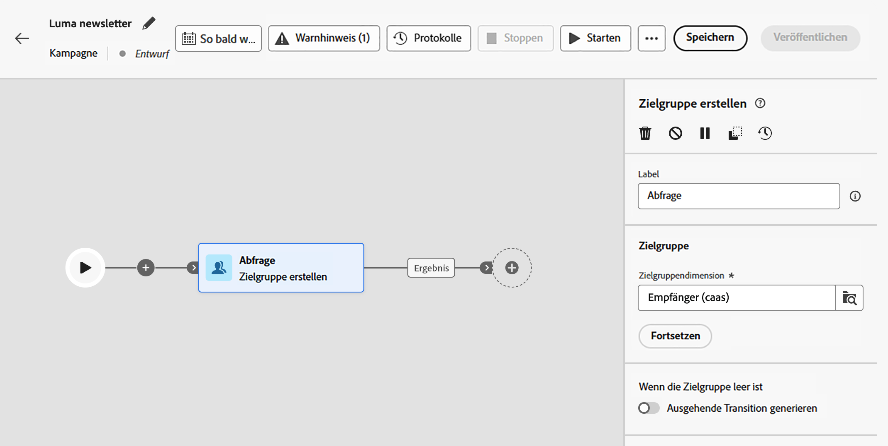
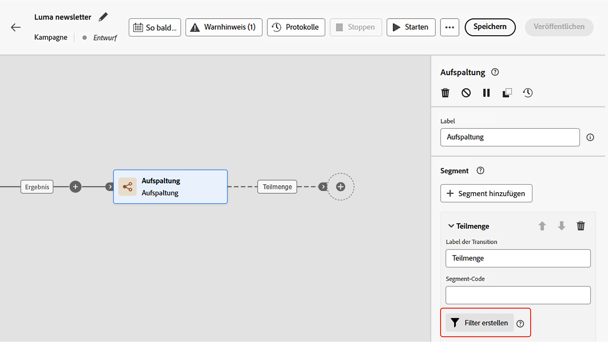
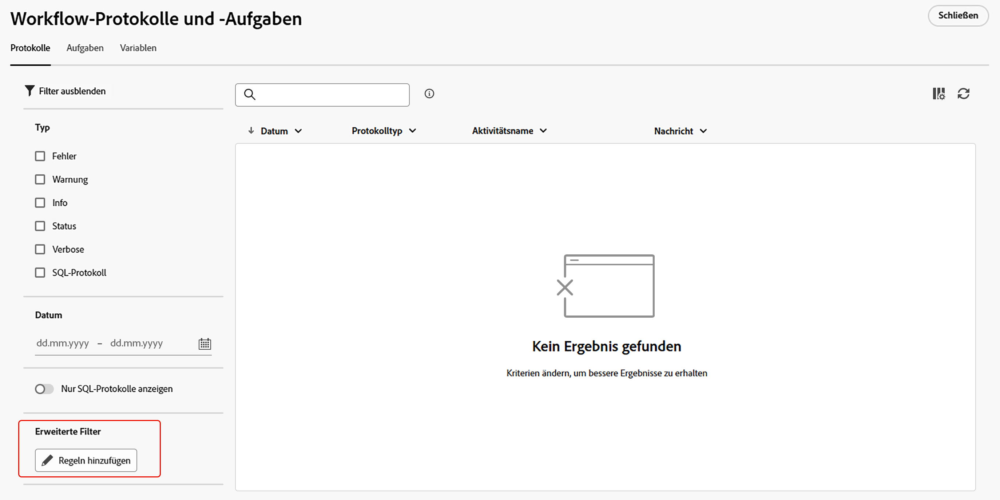
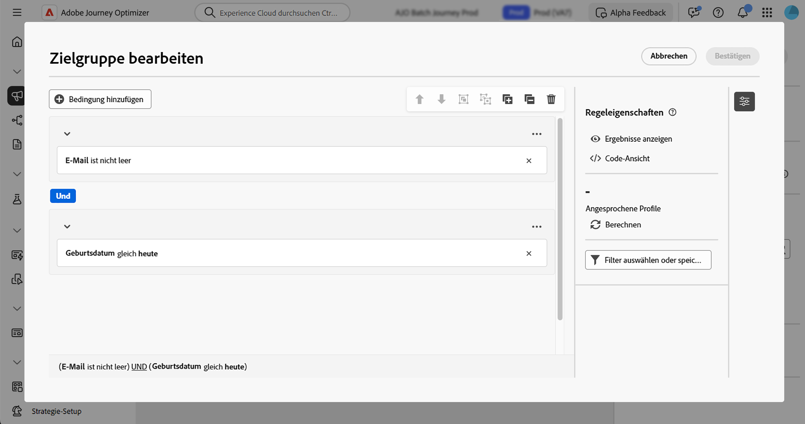

# Arbeiten mit dem Regel-Builder {#orchestrated-rule-builder}

Orchestrierte Kampagnen enthalten einen Regel-Builder, der den Prozess der Filterung der Datenbank anhand verschiedener Kriterien vereinfacht. Der Regel-Builder verwaltet sehr komplexe und lange Abfragen effizient und bietet dabei erhöhte Flexibilität und Genauigkeit. 

Außerdem unterstützt er vordefinierte Filter in Bedingungen, sodass Sie Ihre Abfragen mühelos präzisieren und gleichzeitig erweiterte Ausdrücke und Operatoren für umfassende Zielgruppen-Targeting- und Segmentierungsstrategien nutzen können.

## Zugreifen auf den Regel-Builder {#access}

Der Regel-Builder ist in jedem Kontext verfügbar, in dem Sie Regeln zum Filtern von Daten definieren müssen.

| Nutzung | Beispiel |
|  ---  |  ---  |
| **Erstellen von Zielgruppen**: Geben Sie mithilfe einer Aktivität des Typs **[!UICONTROL Zielgruppe erstellen]** die Population an, die Sie in Ihren orchestrierten Kampagnen ansprechen möchten, und erstellen Sie mühelos neue Zielgruppen, die auf Ihre Anforderungen zugeschnitten sind. [Weitere Informationen zum Erstellen von Zielgruppen](../orchestrated/activities/build-audience.md) | {width="200" align="center" zoomable="yes"} |
| **Erstellen einer Bedingung auf der Kampagnenarbeitsfläche**: Wenden Sie auf der Kampagnenarbeitsfläche mithilfe einer Aktivität des Typs **[!UICONTROL Aufspaltung]** Regeln an, um Anpassungen an Ihre bestimmten Anforderungen vorzunehmen. [Weitere Informationen zur Verwendung der Aktivität „Aufspaltung“](../orchestrated/activities/split.md) | {width="200" align="center" zoomable="yes"} |
| **Erstellen erweiterter Filter**: Erstellen Sie Regeln, um die in Listen angezeigten Daten wie Kampagnenprotokolle oder Zielgruppendimensionen zu filtern. | {width="200" align="center" zoomable="yes"} |

## Oberfläche des Regel-Builders {#interface}

Der Regel-Builder bietet eine zentrale Arbeitsfläche zum Erstellen Ihrer Abfrage sowie einen Eigenschaftenbereich mit Informationen zu Ihrer Regel.

* Auf der **zentralen Arbeitsfläche** können Sie verschiedenen Komponenten zum Erstellen Ihrer Regel hinzufügen und kombinieren. [Weitere Informationen zur Erstellung einer Regel](../orchestrated/build-query.md)

* Der Bereich **[!UICONTROL Regeleigenschaften]** enthält Informationen zu Ihrer Regel. Hier können Sie verschiedene Vorgänge ausführen, um Ihre Regel zu überprüfen und sicherzustellen, dass sie Ihren Anforderungen entspricht.

  Dieser Bereich wird angezeigt, wenn Sie eine Abfrage zum Erstellen einer Zielgruppe erstellen. [So überprüfen und validieren Sie Ihre Abfrage](build-query.md#check-and-validate-your-query)

## Arbeiten mit vordefinierten Filtern

Vordefinierte Filter ermöglichen die Wiederverwendung gespeicherter Abfragen im Regel-Builder, einschließlich Versionen mit Parametern. Eine ausführliche Anleitung zum Speichern, Anwenden und Verwalten vordefinierter Filter finden Sie unter [Arbeiten mit vordefinierten Filtern](predefined-filters.md).
