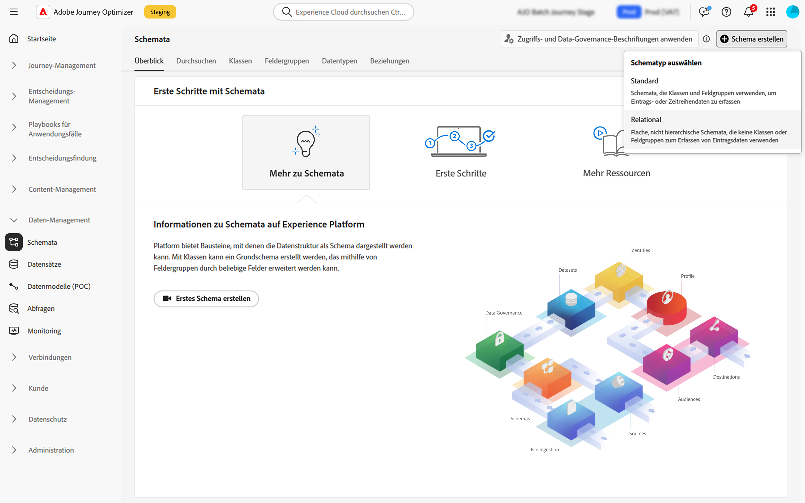

# Erstellen relationaler Schemata {#orchestrated-schemas}

+++ Inhaltsverzeichnis

| Willkommen bei koordinierten Kampagnen | Starten Ihrer ersten orchestrierten Kampagne | Abfragen der Datenbank | Aktivitäten für orchestrierte Kampagnen |
|---|---|---|---|
| [Erste Schritte mit orchestrierten Kampagnen](gs-orchestrated-campaigns.md)  Erstellen und Verwalten von relationalen Schemata und Datensätzen:  <ul><li>[Manuelles Schema](manual-schema.md)</li><li>[Datei-Upload-Schema](file-upload-schema.md)</li><li>[Daten aufnehmen](ingest-data.md)</li></ul>  [Zugriff und Verwaltung orchestrierter Kampagnen](access-manage-orchestrated-campaigns.md)  [Die wichtigsten Schritte zum Erstellen einer orchestrierten Kampagne](gs-campaign-creation.md) | [Erstellen und Planen der Kampagne](create-orchestrated-campaign.md)  [Orchestrieren von Aktivitäten](orchestrate-activities.md)  [ Starten und Überwachen der Kampagne](start-monitor-campaigns.md)  [Reporting](reporting-campaigns.md) | [Arbeiten mit dem Regel-Builder](orchestrated-rule-builder.md)  [Erstellen der ersten Abfrage](build-query.md)  [Ausdrücke bearbeiten](edit-expressions.md)  [Retargeting](retarget.md) | [Erste Schritte mit Aktivitäten](activities/about-activities.md)  Aktivitäten: [Und-Verknüpfung](activities/and-join.md) - [Zielgruppe aufbauen](activities/build-audience.md) - [Dimension ändern](activities/change-dimension.md) - [Kanalaktivitäten](activities/channels.md) - [Kombinieren](activities/combine.md) - [Anreicherung](activities/deduplication.md) - [Formulare](activities/enrichment.md) - [Abstimmung](activities/fork.md)    ->Zielgruppe speichern[ -AufspaltungWarten](activities/wait.md) |

{style="table-layout:fixed"}

+++

 

>[!BEGINSHADEBOX]

Der Inhalt dieser Seite ist nicht endgültig und kann geändert werden.

>[!ENDSHADEBOX]

Ein Schema stellt die Struktur und das Format von Daten dar und validiert sie. Es bietet eine abstrakte Definition eines realen Objekts (z. B. einer Person) und beschreibt, welche Daten in jeder Instanz dieses Objekts enthalten sein sollen (z. B. Name, Geburtstag usw.).

