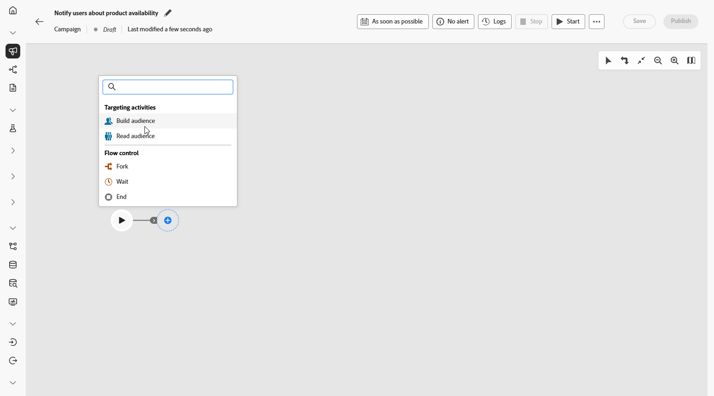
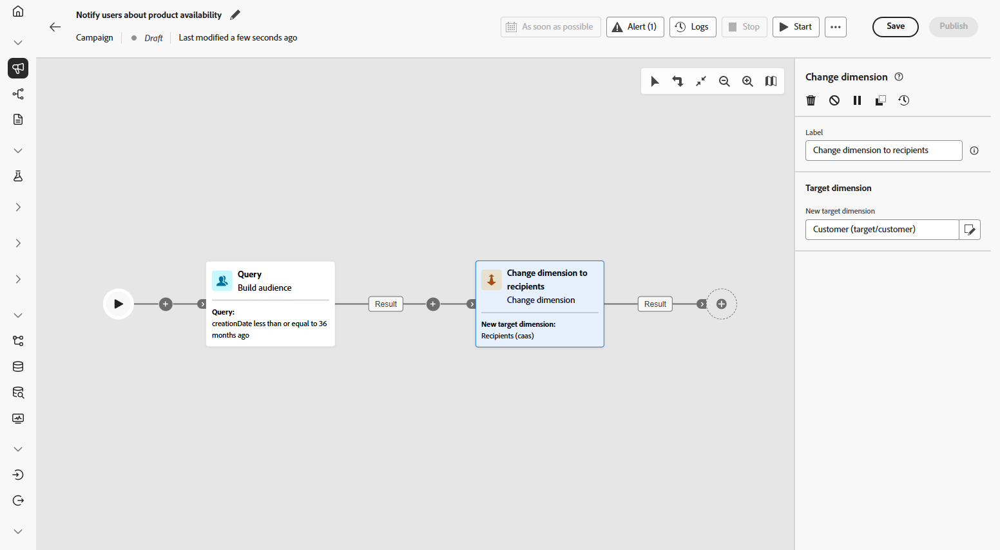
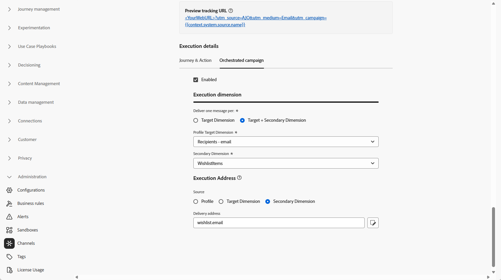

# Benachrichtigen von Benutzenden über Produktverfügbarkeit {#product-availability-uc}

>[!BEGINSHADEBOX]

Dieser Anwendungsfall zeigt den mehrstufigen Versand: Für jedes Wunschlistenelement wird eine eigene E-Mail generiert, indem die mit dem einzelnen Element gespeicherte E-Mail-Adresse verwendet wird und nicht die mit dem Empfängereintrag gespeicherte. Dadurch können Kundinnen und Kunden für jedes Produkt auf ihrer Wunschliste separate Benachrichtigungen erhalten, auch wenn sie für verschiedene Artikel unterschiedliche E-Mail-Adressen verwenden.

>[!ENDSHADEBOX]

{zoomable="yes"}

Erstellen Sie eine Benachrichtigung zu Aktualisierungen des Bestands, um Kundinnen und Kunden zu informieren, wenn Artikel von ihrer Wunschliste wieder verfügbar sind. Diese Nachricht hilft dabei, interessierte Kundinnen und Kunden zurückzugewinnen, und ermutigt sie, ihren Kauf abzuschließen, während der Bestand wieder aufgefüllt wird.

1. Richten Sie zunächst eine neue Kampagne ein, die speziell auf die Rückgewinnung basierend auf Wunschlisten ausgerichtet ist. Dadurch wird sichergestellt, dass sich Ihre Werbebotschaft auf Kundschaft konzentriert, die bereits ihre Kaufabsicht gezeigt hat, indem sie Produkte auf ihrer Wunschliste gespeichert hat.

   {zoomable="yes"}

1. Geben Sie Ihre **[!UICONTROL Kampagneneinstellungen]** wie den Kampagnennamen, die Beschreibung, das Start- und Enddatum und relevante Tags ein.

1. Fügen Sie die Aktivität **[!UICONTROL Zielgruppe erstellen]** mit „Wunschliste“ als **[!UICONTROL Zielgruppendimension]** hinzu.

   {zoomable="yes"}

1. Fügen Sie Ihre Bedingung hinzu, um nur Wunschlisten einzuschließen, die in den letzten 36 Monaten erstellt wurden.

   {zoomable="yes"}

1. Fügen Sie eine Aktivität des Typs **[!UICONTROL Dimensionsänderung]** hinzu, um von Wunschlisten zurück zum entsprechenden Kundensatz für das Targeting zu wechseln.

   {zoomable="yes"}

1. Nach dem Starten des Entwurfsmodus können Sie eine Vorschau der Zielgruppe mit Details zur Wunschliste anzeigen. Um detaillierter Erkenntnisse zu erhalten, klicken Sie auf ein Ausgabeergebnis und wählen Sie **[!UICONTROL Vorschau der Ergebnisse]** aus.

   Hier zeigen die Daten sowohl Empfangende als auch deren Wunschlistenelemente an. Einige Kundinnen und Kunden verfügen über mehrere Wunschlistenelemente und erhalten durch mehrstufigen Versand für jeden Artikel eine separate E-Mail. In einigen Fällen verwenden Kundinnen und Kunden unterschiedliche E-Mail-Adressen für separate Anfragen zur Verfügbarkeit von Produkten.

   {zoomable="yes"}

1. Um für jedes Element eine separate E-Mail senden zu können, stellen Sie sicher, dass für [Ihre E-Mail-Konfiguration](../orchestrated/target-dimension.md) `Recipients - email` als **[!UICONTROL Profilzieldimension]** und `Wishlistitems` als **[!UICONTROL Sekundäre Dimension]** festgelegt ist.

   Wählen Sie dann im Menü **[!UICONTROL Ausführungsadresse]** die Option `wishlist.email` als **[!UICONTROL Sekundäre Dimension]** aus. Für jeden Artikel auf der Wunschliste wird eine separate E-Mail ausgelöst, wobei die in den Wunschlistendaten gespeicherte E-Mail-Adresse als sekundäre Dimension verwendet wird.

   {zoomable="yes"}

1. Fügen Sie eine **[!UICONTROL E-Mail]**-Aktivität hinzu, um eine Produktverfügbarkeitsnachricht zu erstellen. Klicken Sie auf **[!UICONTROL Inhalt bearbeiten]**, um mit der Inhaltserstellung zu beginnen.

   ➡️ [Weitere Informationen zu E-Mail-Personalisierung](../email/content-from-scratch.md)

   {zoomable="yes"}

1. Sobald Ihre Kampagne getestet wurde und bereit ist, klicken Sie auf **[!UICONTROL Veröffentlichen]**, um sie live zu schalten.

Mit dieser orchestrierten Kampagne erhält die Kundin bzw. der Kunde eine separate E-Mail für jedes Wunschlistenelement. Jede Nachricht wird an die spezifische E-Mail-Adresse gesendet, die mit dieser Wunschliste verknüpft ist, wobei der personalisierte Inhalt aus den Details dieses bestimmten Wunschlistenelements abgerufen wird.
