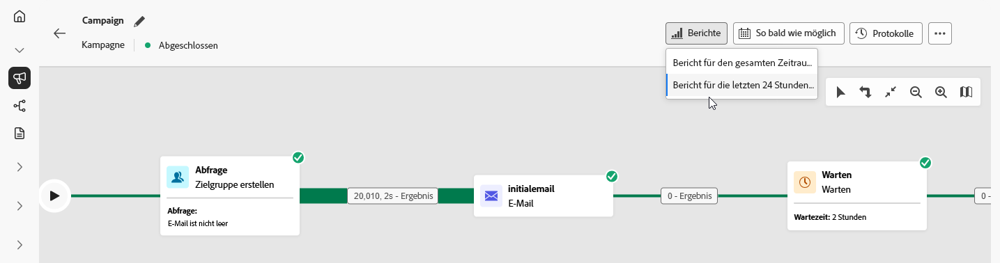

# Berichte über orchestrierte Kampagnen {#report-campaigns}

Orchestrierte Kampagnen bieten Ihnen durch ihre zuverlässigen Reporting-Funktionen verwertbare Erkenntnisse. Diese Erkenntnisse helfen Ihnen, das Zielgruppenverhalten besser zu verstehen, die Leistung der einzelnen Schritte in Ihrer Customer Journey zu messen und datengestützte Entscheidungen zur Optimierung zukünftiger Kampagnen zu treffen. Mit detaillierten Metriken und Visualisierungen können Sie die Interaktion verfolgen und Ihre Targeting-Strategien so anpassen, dass sie maximale Wirkung erzielen.

## Berichtstypen {#reporting-types}

<table style="table-layout:auto; width: 100%; border-collapse: collapse;">
  <tbody>
    <tr>
      <td></td>
      <td>
        Verwenden Sie den <b>Live-Bericht</b>, um in einem integrierten Dashboard die Wirkung und Leistung Ihrer orchestrierten Kampagnen in Echtzeit zu messen und zu visualisieren. Die Daten sind im <b>Live-Bericht</b> über das Menü <b>Bericht für letzte 24 Stunden anzeigen</b> verfügbar, sobald Ihre orchestrierte Kampagne ausgeführt wird. Weitere Informationen zu Live-Berichten sind in <a href="../reports/live-report.md">diesem Abschnitt</a> verfügbar.
      </td>
         
    </tr>
    <tr style="background-color: #FFFFFF;">
      <td></td>
      <td>
        Der <b>Bericht für die gesamte Zeit</b> ist vollständig mit Customer Journey Analytics-Funktionen integriert, wodurch das Reporting plattformübergreifend standardisiert wird und Datenkonsistenz und -zuverlässigkeit verbessert werden. Weitere Informationen zu Berichten für die gesamte Zeit sind <a href="../reports/report-gs-cja.md">in diesem Abschnitt</a> verfügbar.
      </td>
    </tr>
  </tbody>
</table>

## Einblick in Kanalberichte

<table style="table-layout:fixed"><tr style="border: 0; text-align: center;" >
<td> <a href="../reports/campaign-global-report-cja-email.md"><strong>E-Mail-Bericht</strong></a></td>
<td> <a href="../reports/campaign-global-report-cja-sms.md"><strong>SMS-Bericht</strong></a></td>
<td><a href="../reports/campaign-global-report-cja-push.md"><strong>Push-Bericht</strong></a></td><td><a href="../reports/campaign-global-report-cja-direct.md"><strong>Briefpostbericht</strong></a></td>
</tr></table>

