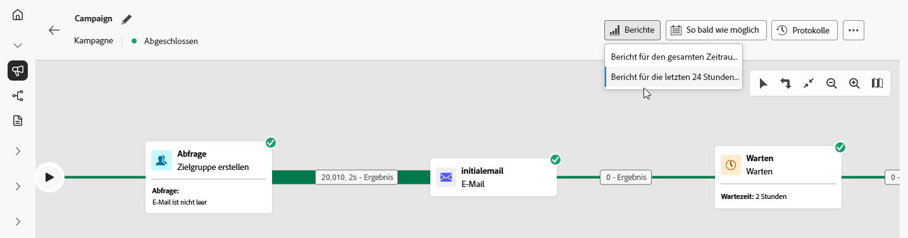

# Berichte über orchestrierte Kampagnen {#report-campaigns}

>[!BEGINSHADEBOX]

**Auf dieser Seite** Entdecken Sie die Live- und Echtzeitberichte, die für orchestrierte Kampagnen in Adobe Journey Optimizer verfügbar sind, und erfahren Sie, wie Sie die Interaktion und die Kanalleistung für E-Mail, SMS, Push und Briefpost messen können.

>[!ENDSHADEBOX]

Orchestrierte Kampagnen bieten Ihnen durch ihre zuverlässigen Reporting-Funktionen verwertbare Erkenntnisse. Diese Erkenntnisse helfen Ihnen, das Zielgruppenverhalten besser zu verstehen, die Leistung der einzelnen Schritte in Ihrer Customer Journey zu messen und datengestützte Entscheidungen zur Optimierung zukünftiger Kampagnen zu treffen. Mit detaillierten Metriken und Visualisierungen können Sie die Interaktion verfolgen und Ihre Targeting-Strategien so anpassen, dass sie maximale Wirkung erzielen.

## Berichtstypen {#reporting-types}

<table style="table-layout:auto; width: 100%; border-collapse: collapse;">
  <tbody>
    <tr>
      <td></td>
      <td>
        Verwenden Sie den <b>Live-</b>), um die Wirkung und Leistung Ihrer orchestrierten Kampagnen in Echtzeit in einem integrierten Dashboard zu messen und zu visualisieren. Die Daten sind im <b>Live-Bericht</b> verfügbar, sobald Ihre orchestrierte Kampagne im Menü <b>Letzte 24-Stunden-Bericht anzeigen</b> ausgeführt wird. Weitere Informationen zu Live-Berichten <a href="../reports/live-report.md">in diesem Abschnitt</a>.
      </td>
         
    </tr>
    <tr style="background-color: #FFFFFF;">
      <td></td>
      <td>
        <b>All Time Report</b> ist vollständig in die Funktionen von Customer Journey Analytics integriert, wodurch das Reporting auf beiden Plattformen standardisiert und die Konsistenz und Zuverlässigkeit der Daten verbessert wird. Weitere Informationen zu allen Zeitberichten finden Sie <a href="../reports/report-gs-cja.md">in diesem Abschnitt</a>.
      </td>
    </tr>
  </tbody>
</table>

## Einblick in Kanalberichte

<table style="table-layout:fixed"><tr style="border: 0; text-align: center;" >
<td> <a href="../reports/campaign-global-report-cja-email.md"><strong>E-Mail-Bericht</strong></a></td>
<td> <a href="../reports/campaign-global-report-cja-sms.md"><strong>SMS-Bericht</strong></a></td>
<td><a href="../reports/campaign-global-report-cja-push.md"><strong>Push-Bericht</strong></a></td><td><a href="../reports/campaign-global-report-cja-direct.md"><strong>Briefpostbericht</strong></a></td>
</tr></table>

