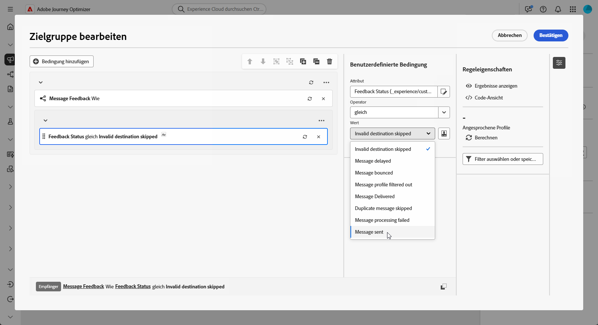

# Erstellen von Retargeting-Abfragen {#retarget}

Beim Retargeting können Sie Empfängerinnen und Empfänger je nachdem ansprechen, wie sie auf eine frühere orchestrierte Kampagne reagiert haben. Sie können beispielsweise eine zweite E-Mail an die Personen senden, die die erste zwar erhalten, aber nicht angeklickt haben.

Eine **[!UICONTROL orchestrierte Kampagne]** bietet hierfür zwei Hauptattribute:

* **[!UICONTROL Nachrichten-Feedback]**: Erfasst Ereignisse im Zusammenhang mit dem Versand, z. B. gesendete, geöffnete, zurückgewiesene Nachricht (Bounce) usw.
* **[!UICONTROL E-Mail-Tracking]**: Erfasst Benutzeraktionen, z. B. Klicks und Öffnungen.

{zoomable="yes"}

## Erstellen einer Feedback-basierten Retargeting-Regel {#feedback-retarget}

Eine Feedback-basierte Retargeting-Regel ermöglicht ein erneutes Ansprechen von Empfängerinnen und Empfängern auf der Grundlage von Nachrichtenversand-Ereignissen, die im Attribut **[!UICONTROL Nachrichten-Feedback]** erfasst wurden. Zu diesen Ereignissen gehören Ergebnisse wie das Senden, Öffnen, Zurückweisen oder Kennzeichnen von Nachrichten als Spam.

Mithilfe dieser Daten können Sie Regeln definieren, um Empfängerinnen und Empfänger zu identifizieren, die eine frühere Nachricht erhalten haben. Dies erlaubt eine Folgekommunikation basierend auf bestimmten Versandstatus.

1. Erstellen Sie eine neue **[!UICONTROL orchestrierte Kampagne]**.

1. Fügen Sie eine Aktivität **[!UICONTROL Zielgruppe erstellen]** hinzu und legen Sie für die Zielgruppendimension **[!UICONTROL Empfänger (caas)]** fest.

1. Klicken Sie im **[!UICONTROL Regel-Builder]** auf **[!UICONTROL Bedingung hinzufügen]** und wählen Sie in der **[!UICONTROL Attributauswahl]** die Option **[!UICONTROL Nachrichten-Feedback]**. Klicken Sie auf **[!UICONTROL Bestätigen]**, um eine Bedingung vom Typ **Nachrichten-Feedback ist vorhanden, z. B.** zu erstellen.

   {zoomable="yes"}

1. Wählen Sie das Attribut **[!UICONTROL Feedback-Status]** aus, um Versandereignisse für Nachrichten auszuwählen.

   +++ Detaillierte schrittweise Anleitungen

   1. Fügen Sie eine weitere mit dem Attribut **[!UICONTROL Nachrichten-Feedback]** verknüpfte Bedingung hinzu.

   1. Suchen Sie nach dem Attribut **[!UICONTROL Feedback-Status]** und klicken Sie auf **[!UICONTROL Bestätigen]**.

      {zoomable="yes"}

   1. Wählen Sie im Menü **[!UICONTROL Benutzerdefinierte Bedingung]** in der Dropdown-Liste **[!UICONTROL Wert]** den zu verfolgenden Versandstatus aus.

      {zoomable="yes"}

   +++

1. Wählen Sie das Attribut **[!UICONTROL Name der orchestrierten Kampagne]**, um eine bestimmte orchestrierte Kampagne auszuwählen.

   +++ Detaillierte schrittweise Anleitungen

   1. Fügen Sie eine weitere mit dem Attribut **[!UICONTROL Nachrichten-Feedback]** verknüpfte Bedingung hinzu, suchen Sie nach **[!UICONTROL Entität]** und navigieren Sie zu

      `_experience > CustomerJourneyManagement > Entities > AJO Orchestrated Campaign entity`.

   1. Wählen Sie **[!UICONTROL Name der orchestrierten Kampagne]** aus.

      {zoomable="yes"}

   1. Geben Sie im Menü **[!UICONTROL Benutzerdefinierte Bedingung]** den Namen der Kampagne im Feld **[!UICONTROL Wert]** an.

   +++

1. Wählen Sie das Attribut **[!UICONTROL Name der orchestrierten Kampagnenaktion]**, um eine bestimmte Nachricht oder Aktivität in einer orchestrierten Kampagne auszuwählen.

   +++ Detaillierte schrittweise Anleitungen

   1. Fügen Sie eine weitere mit dem Attribut **[!UICONTROL Nachrichten-Feedback]** verknüpfte Bedingung hinzu, suchen Sie nach **[!UICONTROL Entität]** und navigieren Sie zu

      `_experience > CustomerJourneyManagement > Entities > AJO Orchestrated Campaign entity`.

   1. Wählen Sie **[!UICONTROL Name der orchestrierten Kampagnenaktion]** aus.

      {zoomable="yes"}

   1. Geben Sie im Menü **[!UICONTROL Benutzerdefinierte Bedingung]** den Namen der Kampagnenaktion im Feld **[!UICONTROL Wert]** an.

      Die Aktionsnamen finden Sie, indem Sie auf das  neben dem Labelfeld Ihrer Aktivität klicken.

   +++

1. Alternativ können Sie auch nach der **[!UICONTROL Kampagnen-ID]** (UUID) filtern, die Sie in Ihren Kampagneneigenschaften finden.

Sie haben jetzt eine Feedback-basierte Retargeting-Regel konfiguriert, um Empfängerinnen und Empfänger anhand des Versandstatus einer vorherigen Nachricht zu identifizieren (z. B. gesendet, geöffnet, zurückgewiesen oder als Spam gekennzeichnet). Nachdem diese Zielgruppe definiert ist, können Sie entweder eine Folgenachricht hinzufügen oder Ihre Zielgruppenbestimmung weiter verfeinern, indem Sie [eine Tracking-basierte Retargeting-Regel konfigurieren](#tracking-based), die auf Benutzerinteraktionsdaten zurückgreift.

{zoomable="yes"}

## Erstellen einer Tracking-basierten Retargeting-Regel {#tracking-based}

Eine Tracking-basierte Retargeting-Regel richtet sich anhand der Daten aus dem Attribut **[!UICONTROL E-Mail-Tracking]** an Empfängerinnen und Empfänger auf Grundlage ihrer Interaktionen mit einer Nachricht. Es werden dabei Benutzeraktionen wie E-Mail-Öffnungen und Klicks auf Links erfasst.

Um Empfängerinnen und Empfänger auf der Grundlage von Interaktionen mit Nachrichten (z. B. Öffnen oder Klicken) erneut anzusprechen, verwenden Sie die Entität **[!UICONTROL E-Mail-Tracking]** wie folgt:

1. Erstellen Sie eine neue **[!UICONTROL orchestrierte Kampagne]**.

1. Fügen Sie eine Aktivität **[!UICONTROL Zielgruppe erstellen]** hinzu und legen Sie die Zielgruppendimension auf **[!UICONTROL Empfänger (caas)]** fest, um sich auf die vorherigen Empfängerinnen und Empfänger der orchestrierten Kampagne zu konzentrieren.

1. Klicken Sie im **[!UICONTROL Regel-Builder]** auf **[!UICONTROL Bedingung hinzufügen]** und wählen Sie **[!UICONTROL E-Mail-Tracking]** aus der **[!UICONTROL Attributauswahl]**.

   Klicken Sie auf **[!UICONTROL Bestätigen]**, um eine Bedingung vom Typ **E-Mail-Tracking vorhanden, z. B.** zu erstellen.

   {zoomable="yes"}

1. Um die Interaktionen von Empfängerinnen und Empfängern mit einer Nachricht auszuwählen, fügen Sie eine weitere Bedingung hinzu, die mit dem Attribut **[!UICONTROL E-Mail-Tracking]** verknüpft ist, und suchen Sie nach dem Attribut **[!UICONTROL Interaktionstyp]**.

   {zoomable="yes"}

1. Verwenden Sie in den benutzerdefinierten Bedingungsoptionen **[!UICONTROL Enthalten in]** als Operator und wählen Sie je nach Anwendungsszenario einen oder mehrere Werte aus, z. B. **[!UICONTROL Nachricht geöffnet]** oder **[!UICONTROL Nachrichten-Link angeklickt]**.

   {zoomable="yes"}

Sie haben jetzt eine Tracking-basierte Retargeting-Regel konfiguriert, um Empfängerinnen und Empfänger basierend auf ihren Interaktionen mit einer früheren Nachricht (wie z. B. E-Mail-Öffnungen oder Klicks auf Link) mithilfe von Daten aus dem Attribut **[!UICONTROL E-Mail-Tracking]** anzusprechen. Nachdem diese Zielgruppe definiert ist, können Sie entweder eine Folgeaktion hinzufügen oder Ihre Zielgruppenbestimmung weiter verfeinern, indem Sie sie mit einer [Feedback-basierten Retargeting-Regel](#feedback-retarget) kombinieren, um Nachrichtenergebnisse einzuschließen (wie z. B. gesendet, zurückgewiesen oder als Spam gekennzeichnet).

{zoomable="yes"}
