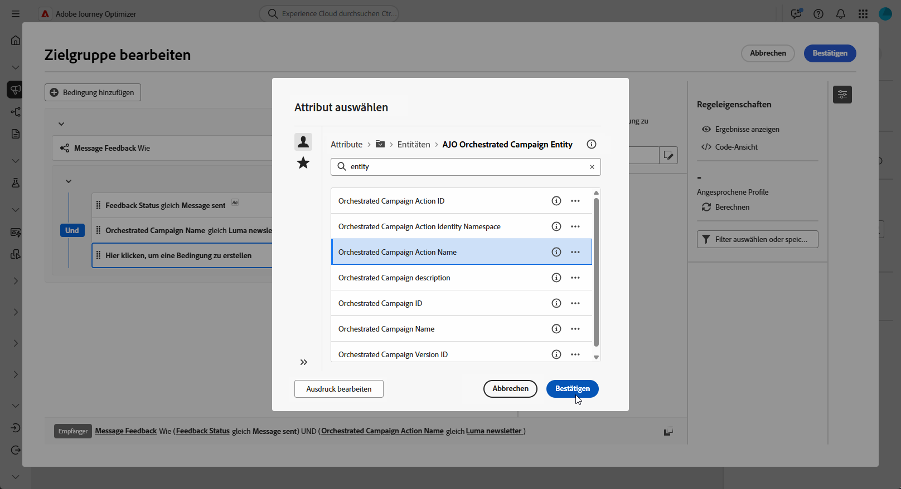

# Erstellen von Retargeting-Abfragen {#retarget}

+++ Inhaltsverzeichnis

| Willkommen bei koordinierten Kampagnen | Starten Ihrer ersten orchestrierten Kampagne | Abfragen der Datenbank | Aktivitäten für orchestrierte Kampagnen |
|---|---|---|---|
| [Erste Schritte mit orchestrierten Kampagnen](gs-orchestrated-campaigns.md)  [Konfigurationsschritte](configuration-steps.md)  [Zugriff und Verwaltung orchestrierter Kampagnen](access-manage-orchestrated-campaigns.md)  [Wichtige Schritte zum Erstellen einer orchestrierten Kampagne](gs-campaign-creation.md) | [Erstellen und Planen der Kampagne](create-orchestrated-campaign.md)  [Orchestrieren von Aktivitäten](orchestrate-activities.md)  [ Starten und Überwachen der Kampagne](start-monitor-campaigns.md)  [Reporting](reporting-campaigns.md) | [Arbeiten mit dem Regel-Builder](orchestrated-rule-builder.md)  [Erstellen der ersten Abfrage](build-query.md)  [Ausdrücke bearbeiten](edit-expressions.md)  <b>[Retargeting](retarget.md)</b> | [Erste Schritte mit Aktivitäten](activities/about-activities.md)  Aktivitäten: [Und-Verknüpfung](activities/and-join.md) - [Zielgruppe aufbauen](activities/build-audience.md) - [Dimension ändern](activities/change-dimension.md) - [Kanalaktivitäten](activities/channels.md) - [Kombinieren](activities/combine.md) - [Anreicherung](activities/deduplication.md) - [Formulare](activities/enrichment.md) - [Abstimmung](activities/fork.md)    ->Zielgruppe speichern[ -AufspaltungWarten](activities/wait.md) |

{style="table-layout:fixed"}

+++

 

>[!BEGINSHADEBOX]

Dokumentation in Bearbeitung

>[!ENDSHADEBOX]

Beim Retargeting können Sie die Empfängerinnen und Empfänger darauf ansprechen, wie sie auf eine frühere orchestrierte Kampagne reagiert haben. Sie können beispielsweise eine zweite E-Mail an Profile senden, die die erste erhalten, aber nicht darauf geklickt haben.

**[!UICONTROL Orchestrierte Kampagne]** bietet hierfür zwei Hauptdatenquellen:

* **[!UICONTROL Nachrichten-Feedback]**: Erfasst Ereignisse im Zusammenhang mit dem Versand, z. B. gesendete, geöffnete, zurückgesendete Nachricht usw.
* **[!UICONTROL E-Mail-Tracking]**: Erfasst Benutzeraktionen, z. B. Klicks und Öffnungen.

## Erstellen einer Feedback-basierten Retargeting-Regel {#feedback-retarget}

Feedback-basierte Retargeting-Regel ermöglicht die erneute Zielgruppenbestimmung von Empfängern auf der Grundlage von Nachrichtenversand-Ereignissen, die im Datensatz **Nachrichten-Feedback** erfasst wurden. Zu diesen Ereignissen gehören Ergebnisse wie Nachrichten, die gesendet, geöffnet, zurückgewiesen oder als Spam gekennzeichnet werden.

Mithilfe dieser Daten können Sie Regeln definieren, um Empfänger zu identifizieren, die eine frühere Nachricht erhalten haben. Dies ermöglicht eine Folgekommunikation basierend auf bestimmten Versandstatus.

1. Erstellen Sie eine neue **[!UICONTROL Orchestrierte Kampagne]**.

1. Fügen Sie die Aktivität **[!UICONTROL Zielgruppe aufbauen]** hinzu und legen Sie für die Zielgruppendimension **[!UICONTROL Empfänger (caas)]** fest.

1. Klicken Sie **[!UICONTROL Regel-Builder]** auf **[!UICONTROL Bedingung hinzufügen]** und wählen Sie **[!UICONTROL Nachrichten-Feedback]** aus der **[!UICONTROL Attributauswahl]**. Klicken Sie **[!UICONTROL Bestätigen]**, um eine **Nachricht-Feedback ist vorhanden, z. B** Bedingung zu erstellen.

   

1. Wählen Sie das **[!UICONTROL Feedback-Status]**-Attribut aus, um Versandereignisse für Nachrichten anzusprechen.

+++ Detaillierte schrittweise Anleitungen

   1. Fügen Sie eine weitere mit dem Attribut **[!UICONTROL Nachrichten-Feedback]** verknüpfte Bedingung hinzu.

   1. Suchen Sie nach dem Attribut **[!UICONTROL Feedback-Status]** und klicken Sie auf **[!UICONTROL Bestätigen]**.

      

   1. Wählen Sie im **[!UICONTROL Benutzerdefinierte Bedingung]** in der Dropdown-Liste **[!UICONTROL Wert]** den zu verfolgenden Versandstatus aus.

      

+++

1. Wählen Sie das Attribut **[!UICONTROL Name der orchestrierten Kampagne]**, um eine bestimmte orchestrierte Kampagne auszuwählen.

+++ Detaillierte schrittweise Anleitungen

   1. Fügen Sie eine weitere mit dem Attribut **[!UICONTROL Nachrichten-Feedback]** verknüpfte Bedingung hinzu, suchen Sie nach **[!UICONTROL Entität]** und navigieren Sie zu:

      `_experience > CustomerJourneyManagement > Entities > AJO Orchestrated Campaign entity`.

   1. Wählen Sie **[!UICONTROL Orchestrierter Kampagnenname]** aus.

      

   1. Geben Sie im **[!UICONTROL Benutzerdefinierte Bedingung]** den Namen der Kampagne im Feld **[!UICONTROL Wert]** an.

+++

1. Wählen Sie das Attribut **[!UICONTROL Orchestrierte Kampagnenaktion - Name]**, um eine bestimmte Nachricht oder Aktivität in einer orchestrierten Kampagne auszuwählen.

+++ Detaillierte schrittweise Anleitungen

   1. Fügen Sie eine weitere mit dem Attribut **[!UICONTROL Nachrichten-Feedback]** verknüpfte Bedingung hinzu, suchen Sie nach **[!UICONTROL Entität]** und navigieren Sie zu:

      `_experience > CustomerJourneyManagement > Entities > AJO Orchestrated Campaign entity`.

   1. Wählen Sie **[!UICONTROL Orchestrierte Kampagnenaktion - Name]** aus.

      

   1. Geben Sie im Menü **[!UICONTROL Benutzerdefinierte]**) den Namen der Kampagnenaktion im Feld **[!UICONTROL Wert]** an.

      Aktionsnamen finden Sie, indem Sie auf das  neben einer Aktivität auf der Arbeitsfläche klicken.

   ++

1. Alternativ können Sie auch nach der **[!UICONTROL Kampagnen-ID]** (UUID) filtern, die Sie in Ihren Kampagneneigenschaften finden.

## Erstellen einer Tracking-basierten Retargeting-Regel

Die Tracking-basierte Retargeting-Regel richtet sich anhand der Daten aus dem Datensatz **[!UICONTROL E-Mail-Tracking]** an Empfänger auf der Grundlage ihrer Interaktionen mit einer Nachricht. Es werden Benutzeraktionen wie E-Mail-Öffnungen und Link-Klicks erfasst.

Um Empfängerinnen und Empfänger auf der Grundlage von Nachrichteninteraktionen (z. B. Öffnen oder Klicken) erneut anzusprechen, verwenden Sie die Entität **[!UICONTROL E-Mail-Tracking]** wie folgt:

1. Erstellen Sie eine neue **[!UICONTROL Orchestrierte Kampagne]**.

1. Fügen Sie die Aktivität **[!UICONTROL Zielgruppe aufbauen]** hinzu und legen Sie die Zielgruppendimension auf **[!UICONTROL Empfänger (caas)]** fest, um sich auf die zuvor orchestrierten Kampagnenempfängerinnen und -empfänger zu konzentrieren.

1. Klicken Sie im **[!UICONTROL Regel-]** auf **[!UICONTROL Bedingung hinzufügen]** und wählen Sie **[!UICONTROL E-Mail-Tracking]** aus der **[!UICONTROL Attributauswahl]**.

   Klicken Sie **[!UICONTROL Bestätigen]**, um eine **E-Mail-Tracking existiert, z. B** Bedingung zu erstellen.

   

1. Um die Interaktionen von Profilen mit einer Nachricht auszuwählen, fügen Sie eine weitere Bedingung hinzu, die mit dem Attribut **[!UICONTROL E-Mail-Tracking]** verknüpft ist, und suchen Sie nach dem Attribut **[!UICONTROL Interaktionstyp]**.

   

1. Verwenden Sie in den benutzerdefinierten Bedingungsoptionen **[!UICONTROL Enthalten in]** als Operator und wählen Sie einen oder mehrere Werte je nach Anwendungsfall aus, z. B. **[!UICONTROL Nachricht geöffnet]** oder **[!UICONTROL Nachrichtenlink angeklickt]**.

   

1. Um die Tracking-Daten mit einer bestimmten Kampagne zu verknüpfen, fügen Sie eine neue **[!UICONTROL Nachrichten-Feedback]**-Bedingung hinzu und befolgen Sie die [in diesem Abschnitt](#feedback-retarget).
