# Starten und Überwachen von orchestrierten Kampagnen {#start-monitor}

>[!CONTEXTUALHELP]
>id="ajo_campaign_publication"
>title="Veröffentlichen einer orchestrierten Kampagne"
>abstract="Um Ihre Kampagne zu starten, müssen Sie sie veröffentlichen. Stellen Sie sicher, dass alle Fehler vor der Veröffentlichung gelöscht wurden."

Nachdem Sie Ihre orchestrierte Kampagne erstellt und die Aufgaben entworfen haben, die auf der Arbeitsfläche ausgeführt werden sollen, können Sie sie veröffentlichen und ihre Ausführung überwachen. Sie können die Kampagne auch im Testmodus ausführen, um ihre Ausführung und das Ergebnis der verschiedenen Aktivitäten zu überprüfen.

## Kampagnen-Lebenszyklus auf einen Blick {#lifecycle}

Orchestrierte Kampagnen durchlaufen einen definierten Satz von Status. Die wichtigsten Phasen des Veröffentlichungs-Workflows sind:

| Status | Bedeutung |
|---|---|
| **Entwurf** | Die Kampagne wird erstellt und getestet - noch nicht aktiv. |
| **Live** | Die Kampagne wurde veröffentlicht und wird ausgeführt. |
| **Geschlossen** | Die wiederkehrende Kampagne wird für neue Einträge geschlossen, aber die aktiven Profile bleiben bis zum Abschluss aller Aktivitäten erhalten. |
| **Abgeschlossen** | Kampagnenausführung abgeschlossen. |

>[!NOTE]
>
>Informationen zu allen Status (einschließlich Geplant, Gestoppt, Archiviert) und verfügbaren Aktionen in jeder Phase finden Sie unter [Kampagnenstatus](../campaigns/manage-campaigns.md#statuses).

## Testen der Kampagne vor der Veröffentlichung {#test}

Mit [!DNL Journey Optimizer] können Sie orchestrierte Kampagnen vor der Live-Schaltung testen. Wenn eine Kampagne erstellt wird, befindet sie sich standardmäßig im Status **Entwurf**. In diesem Status können Sie die Kampagne manuell ausführen, um den Fluss zu testen.

>[!IMPORTANT]
>
>Es werden alle Aktivitäten auf der Arbeitsfläche ausgeführt, mit Ausnahme von Aktivitäten des Typs **[!UICONTROL Zielgruppe speichern]** und Kanalaktivitäten. Es gibt keine funktionalen Auswirkungen auf Ihre Daten oder Ihre Zielgruppe.

Um eine orchestrierte Kampagne zu testen, öffnen Sie die Kampagne und wählen Sie **[!UICONTROL Starten]** aus. Jede Aktivität in der Kampagne wird sequenziell ausgeführt, bis das Ende der Arbeitsfläche erreicht ist.

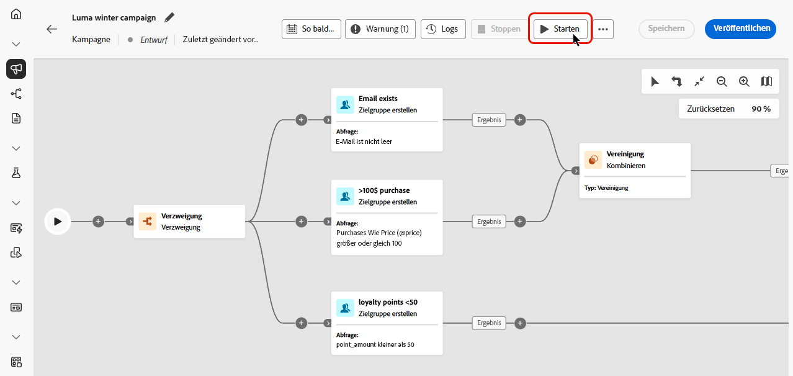{zoomable="yes"}

Bei **ausgelösten orchestrierten Kampagnen** wartet das System auf einen API-Aufruf, um die Kampagne zu starten. Sie müssen das Signal senden, um den Test fortzusetzen. [Erfahren Sie, wie Sie signalgesteuerte Kampagnen testen](trigger-orchestrated-campaign.md#complete-and-test).

Während des Tests können Sie die Kampagnenausführung über die Aktionsleiste auf der Arbeitsfläche verwalten. Dort haben Sie folgende Möglichkeiten:

* **Stoppen** Sie die Ausführung jederzeit.
* **Starten** Sie die Ausführung erneut.
* **Starten Sie** Ausführung neu, um den Workflow zurückzusetzen und erneut auszuführen. Dies ist besonders nützlich, wenn Sie den Kampagnenfluss nach dem Vornehmen von Änderungen schnell erneut testen möchten.
* **Setzen Sie die Ausführung fort**, wenn sie zuvor angehalten wurde.

Das Symbol **[!UICONTROL Warnhinweise]**/**[!UICONTROL Warnung]** in der Symbolleiste der Arbeitsfläche benachrichtigt Sie über Probleme, darunter Warnungen, die ggf. proaktiv vor der Ausführung angezeigt werden, und Fehler, die während oder nach der Ausführung auftreten.

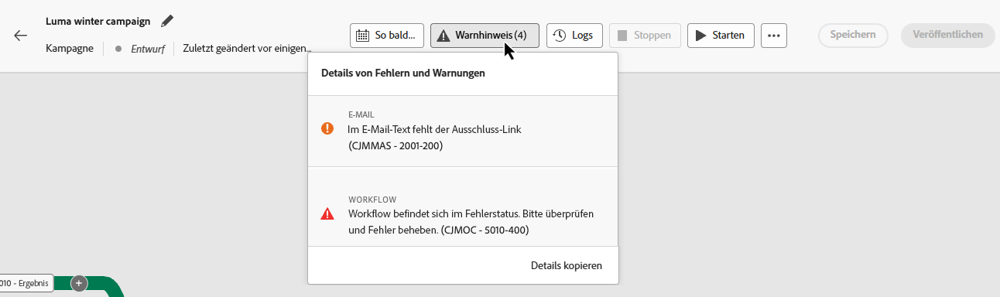{zoomable="yes"}

Außerdem können Sie fehlgeschlagene Aktivitäten schnell mithilfe der [visuellen Statusindikatoren](#activities) erkennen, die direkt auf jeder Aktivität angezeigt werden. Eine ausführliche Fehlerbehebung finden Sie in den [Kampagnenprotokollen](#logs-tasks), die detaillierte Informationen zum Fehler und seinem Kontext enthalten.

Wenn Sie Kanalaktivitäten in der Arbeitsfläche hinzugefügt haben, können Sie mit der Schaltfläche **[!UICONTROL Inhalt simulieren]** den Inhalt Ihrer Nachrichten in der Vorschau anzeigen und testen. [Erfahren Sie, wie Sie mit Kanalaktivitäten arbeiten und Inhalte simulieren](activities/channels.md#simulate-content-test-profiles).

>[!TIP]
>
>Bevor Sie auf **[!UICONTROL Veröffentlichen]** klicken, bestätigen Sie Folgendes:
>* Die Kampagne wurde im Testmodus erfolgreich ausgeführt, ohne dass Fehler in den [Protokollen](#logs-tasks) aufgetreten sind.
>* Der Nachrichteninhalt wurde mit „Inhalt simulieren **[!UICONTROL in der Vorschau]**.
>* Der [Zeitplan ist konfiguriert](create-orchestrated-campaign.md#schedule) wenn es sich um eine geplante Kampagne handelt.
>* Sie haben das Verhalten [Versandbestätigung](#confirm-sending) geprüft. Bei nicht wiederkehrenden Kampagnen werden erst dann Nachrichten gesendet, wenn Sie den Versand nach der Veröffentlichung ausdrücklich genehmigen.

## Veröffentlichen der Kampagne {#publish}

Sobald Ihre Kampagne getestet wurde und bereit ist, klicken Sie auf **[!UICONTROL Veröffentlichen]**, um sie live zu schalten.

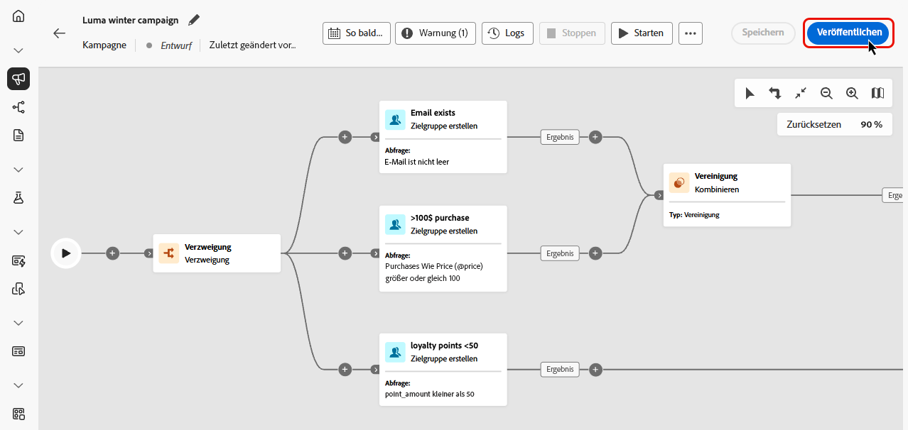{zoomable="yes"}

>[!NOTE]
>
>Wenn die Schaltfläche **[!UICONTROL Veröffentlichen]** deaktiviert (ausgegraut) ist, greifen Sie über die Aktionsleiste auf die Protokolle zu und überprüfen Sie die Fehlermeldungen. Bevor eine Kampagne veröffentlicht werden kann, müssen alle Fehler behoben werden.

Der visuelle Fluss wird neu gestartet, und echte Profile beginnen, in Echtzeit die Journey zu durchlaufen.

Wenn die Veröffentlichungsaktion fehlschlägt (z. B. wegen fehlenden Nachrichteninhalts), werden Sie benachrichtigt und müssen das Problem beheben, bevor Sie es erneut versuchen. Nach erfolgreicher Veröffentlichung wird die Kampagne ausgeführt (sofort oder planmäßig), wechselt von **Entwurf** in **Live**-Status und wird zu „Schreibgeschützt“.

>[!IMPORTANT]
>
>Bei nicht wiederkehrenden Kampagnen wird der Nachrichtenversand nach der Veröffentlichung angehalten, bis Sie den Versand im Eigenschaftenbereich der Kanalaktivität explizit bestätigen. Die Kampagne wird als **Live** angezeigt, es werden jedoch keine Nachrichten gesendet, bis sie bestätigt werden. [Weitere Informationen](#confirm-sending)

### Ausführungssequenz zur Veröffentlichungszeit {#publication-sequence}

Wenn Sie auf **[!UICONTROL Veröffentlichen]** klicken, tritt intern die folgende Sequenz auf:

1. **Planeraktivierung** - Wenn für die Kampagne ein [Zeitplan konfiguriert](create-orchestrated-campaign.md#schedule) ist, wird die Planung gestartet und die Trigger werden zum definierten Zeitpunkt ausgeführt.
1. **Audience-Aktivitäten speichern werden zuerst ausgeführt** — Alle [Audience speichern](activities/save-audience.md)-Aktivitäten im Workflow werden ausgeführt, bevor die Nachrichtenaktivitäten angezeigt werden. Die Audience-Shell wird im [Audience Portal](../audience/about-audiences.md#browse) erstellt und qualifizierte Profile beginnen mit der Aufnahme.
1. **Die Nachrichtenausführung beginnt** - [Kanalaktivitäten](activities/channels.md) Die Verarbeitung für die erste Nachrichtenaktivität im Workflow wird gestartet.
1. **Suche nach Profilschnappschüssen** - Profildaten werden anhand eines Schnappschusses aufgelöst, der zum Zeitpunkt der Veröffentlichung erstellt wurde, nicht anhand des Echtzeit-Profils. Dadurch wird die Konsistenz über die gesamte Ausführung hinweg sichergestellt.
1. **Einverständnisbewertung** - Für übereinstimmende Profile wird das Einverständnis direkt aus dem Profildatensatz berücksichtigt. Das Einverständnis wird zum Zeitpunkt des Versands nicht erneut ausgewertet. [Erfahren Sie mehr über die Einverständnisverwaltung](../action/consent.md)
1. **On-the-fly-Profilerstellung** - Profile, die mit keinem vorhandenen Datensatz übereinstimmen, werden während der Ausführung direkt erstellt.
1. **Erstellung von Versandlogs** - Versandereignisse werden im [`ajo_message_feedback_event`](../data/datasets-query-examples.md#message-feedback-event-dataset) Datensatz aufgezeichnet, der die primäre Quelle für Versandlogs und die Validierung nach dem Versand ist.

Um die Ergebnisse nach der Ausführung zu validieren, verwenden Sie die Reporting-Funktionen von Journey Optimizer. [Weitere Informationen über das Reporting zu orchestrierten Kampagnen](reporting-campaigns.md)

## Kampagne auf Entwurf zurücksetzen {#back-to-draft}

Mit **[!UICONTROL Funktion „Zurück zum Entwurf]** können Sie die Veröffentlichung einer orchestrierten Kampagne aufheben und sie in bestimmten Situationen auf den Entwurfsstatus zurücksetzen. Dieser Mechanismus wurde als Wiederherstellungsmechanismus konzipiert, um Probleme zu beheben, bevor Nachrichten gesendet werden, wobei die Integrität des Kampagnenlebenszyklus gewahrt bleibt.

Diese Option ist in zwei Szenarien verfügbar:

* **Geplante Kampagnen mit ausstehender Ausführung**: Wenn die Ausführung einer Kampagne zu einem bestimmten Zeitpunkt geplant ist und dieser Zeitpunkt noch nicht erreicht wurde, können Sie die Kampagne mit „Zurück zum Entwurf“ überprüfen und ändern, bevor sie ausgeführt wird. Wenn die Kampagne jedoch wiederkehrend ist (z. B. eine tägliche geplante Kampagne) und bereits mindestens eine Ausführung stattgefunden hat, ist die Option nicht mehr verfügbar. In diesem Fall sollten Sie stattdessen [die Kampagne duplizieren](../campaigns/manage-campaigns.md#duplicate-a-campaign).

* **Live-Kampagnen mit Ausführungsfehlern**: Wenn eine Kampagne während der Ausführung einen Fehler festgestellt hat und angehalten wird und noch keine Kampagnenausführungen abgeschlossen wurden, können Sie „Zurück zum Entwurf“ verwenden, um den Fehler zu beheben und die Kampagne erneut zu veröffentlichen.

Um eine Kampagne wieder in den Entwurfsstatus zu versetzen, öffnen Sie die orchestrierte Kampagne und klicken Sie auf die Schaltfläche **[!UICONTROL Zurück zum Entwurf]** in der Symbolleiste der Kampagnen-Arbeitsfläche.

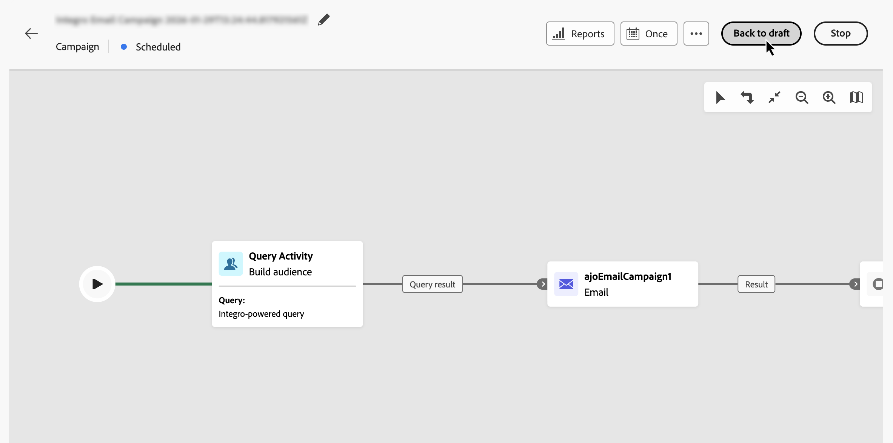

Die Veröffentlichung der Kampagne wird aufgehoben und der Workflow gestoppt. Die Kampagne kehrt zum Status **Entwurf** zurück. Sie können jetzt die identifizierten Probleme beheben, die Kampagne [ testen ](#test) sie dann erneut [veröffentlichen](#publish) wenn sie bereit ist.

## Nachrichtenversand bestätigen {#confirm-sending}

Standardmäßig wird der Nachrichtenversand bei nicht wiederkehrenden orchestrierten Kampagnen angehalten, bis Sie den Versand ausdrücklich genehmigen. Nachdem Sie die Kampagne veröffentlicht haben, bestätigen Sie die Sendeanfrage über den Bereich Eigenschaften der Kanalaktivität. Bis es bestätigt wird, bleibt die Kanalaktivität ausstehend und es wird keine Nachricht gesendet.

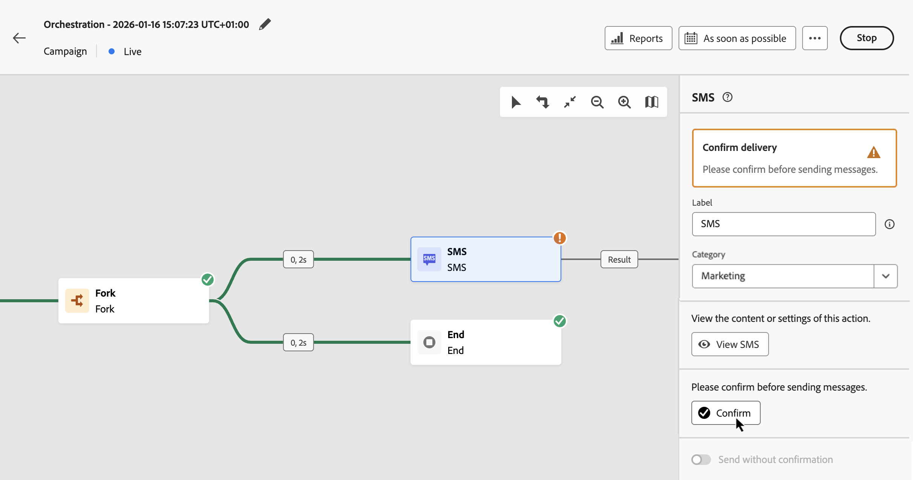

Vor der Veröffentlichung können Sie im Eigenschaftenbereich der Kanalaktivität die Option zum Senden von Bestätigungen deaktivieren. Weitere Informationen finden Sie unter [Nachrichtenversand bestätigen](activities/channels.md#confirm-message-sending).

## Überwachen der Kampagnenausführung {#monitor}

### Visuelle Flussüberwachung {#flow}

Während der Ausführung (im Test- oder Live-Modus) zeigt der visuelle Fluss an, wie sich Profile in Echtzeit durch den Journey bewegen. Es wird die Anzahl der Profile angezeigt, die von einer Aufgabe in die nächste übergehen.

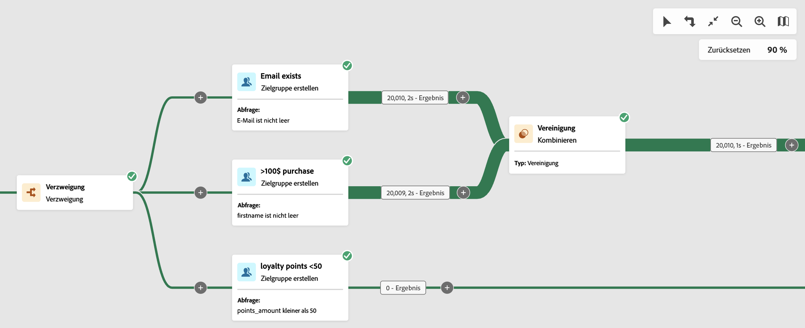{zoomable="yes"}

Die über Transitionen von einer Aktivität zu einer anderen übertragenen Daten werden in temporären Arbeitstabellen gespeichert. Diese Daten können für jede Transition angezeigt werden. So überprüfen Sie die zwischen den Aktivitäten übergebenen Daten:

1. Wählen Sie eine Transition aus.
1. Klicken Sie im Eigenschaftenbereich auf **[!UICONTROL Vorschau für Schema anzeigen]**, um das Schema der Arbeitstabelle anzuzeigen. Wählen Sie **[!UICONTROL Vorschau der Ergebnisse]** aus, um die übertragenen Daten anzuzeigen.

   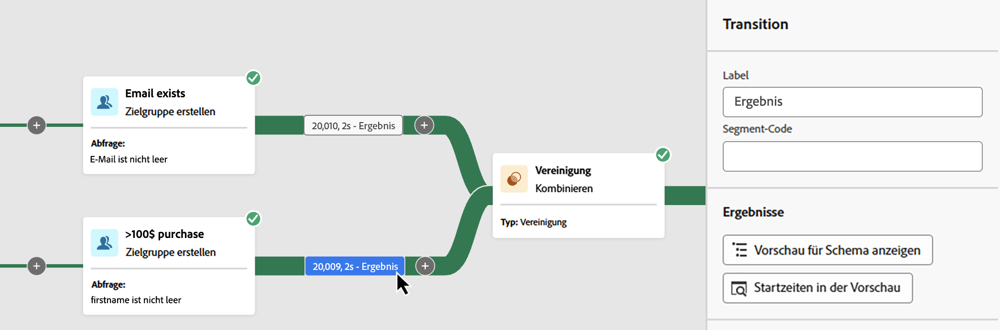{zoomable="yes"}

Sie können jetzt die zwischen den Aktivitäten übergebenen Daten überprüfen, um Ihren Kampagnenfluss zu überprüfen und sicherzustellen, dass jede Aktivität die erwarteten Profile verarbeitet.

### Indikatoren zur Aktivitätsausführung {#activities}

Visuelle Statusindikatoren helfen, zu verstehen, wie jede Aktivität funktioniert:

| Visueller Indikator | Beschreibung |
|-----|------------|
| 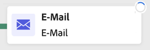{zoomable="yes"}{width="70%"} | Die Aktivität wird derzeit ausgeführt. |
| 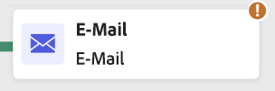{zoomable="yes"}{width="70%"} | Die Aktivität erfordert Ihre Aufmerksamkeit. Dies kann die Bestätigung eines Versands oder die Ergreifung einer notwendigen Maßnahme beinhalten. |
| 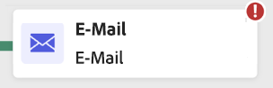{zoomable="yes"}{width="70%"} | Bei der Aktivität ist ein Fehler aufgetreten. Um das Problem zu beheben, öffnen Sie die Protokolle zu orchestrierten Kampagnen , um weitere Informationen zu erhalten. |
| 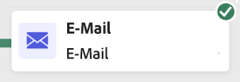{zoomable="yes"}{width="70%"} | Die Aktivität wurde erfolgreich ausgeführt. |

### Logs und Aufgaben {#logs-tasks}

>[!CONTEXTUALHELP]
>id="ajo_campaign_logs"
>title="Logs und Aufgaben"
>abstract="Der Bildschirm **Protokolle und Aufgaben** enthält einen Verlauf der Ausführung der orchestrierten Kampagne, in dem alle Benutzeraktionen und aufgetretenen Fehler aufgezeichnet werden."

Die Überwachung von Protokollen und Aufgaben ist ein wichtiger Schritt, um Ihre orchestrierten Kampagnen zu analysieren und sicherzustellen, dass sie ordnungsgemäß ausgeführt werden. Protokolle und Aufgaben können sowohl im Test- als auch im Live-Modus über die Schaltfläche **[!UICONTROL Logs]** in der Symbolleiste auf der Arbeitsfläche aufgerufen werden.

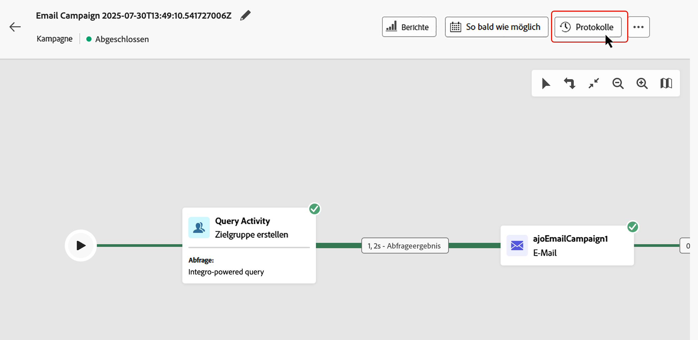{zoomable="yes"}

Der Bildschirm **[!UICONTROL Logs und Aufgaben]** enthält einen Verlauf der Kampagnenausführung, in dem alle Benutzeraktionen und aufgetretenen Fehler aufgezeichnet werden. 

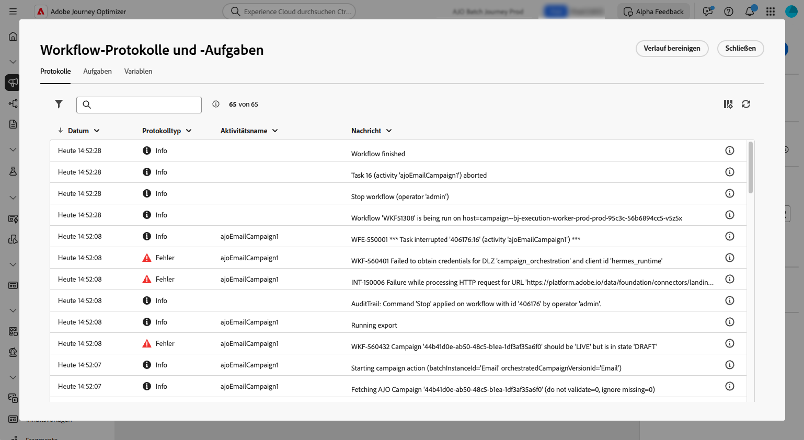{zoomable="yes"}

Es stehen zwei Arten von Informationen zur Verfügung:

* Die Registerkarte **[!UICONTROL Log]** enthält den chronologischen Verlauf aller Vorgänge und Fehler. 
* Auf der Registerkarte **[!UICONTROL Aufgaben]** wird die Ausführungssequenz der Aktivitäten Schritt für Schritt beschrieben.

Auf beiden Registerkarten können Sie die angezeigten Spalten und ihre Reihenfolge auswählen, Filter anwenden und das Suchfeld verwenden, um die gewünschten Informationen schnell zu finden.

## Nächste Schritte {#next}

Nach dem Start der Arbeitsfläche für die koordinierte Kampagne können Sie die Reporting-Funktionen von Journey Optimizer verwenden, um Erkenntnisse zu erhalten, z. B. um das Verhalten der Zielgruppe zu verstehen und die Leistung der einzelnen Schritte in Ihrer Customer Journey zu messen. [Weitere Informationen über das Reporting zu orchestrierten Kampagnen](../orchestrated/reporting-campaigns.md)

Haben Sie Fragen zu orchestrierten Kampagnen? In den [Häufig gestellte Fragen zu Orchestrierten Kampagnen](orchestrated-campaigns-faq.md) finden Sie Antworten auf die häufigsten Fragen von Fachleuten.
