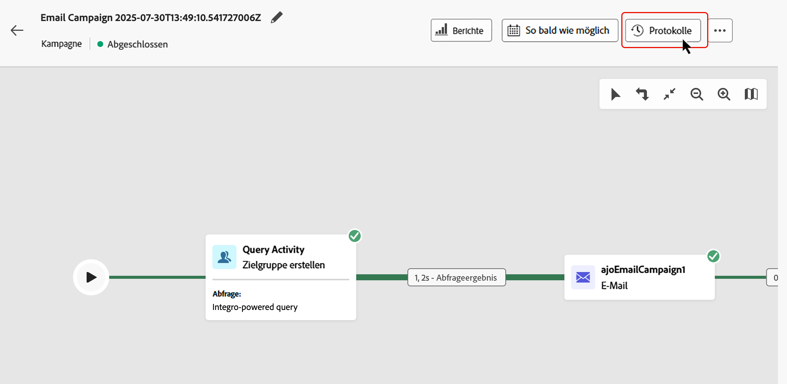

# Starten und Überwachen von orchestrierten Kampagnen {#start-monitor}

>[!CONTEXTUALHELP]
>id="ajo_campaign_publication"
>title="Veröffentlichen einer orchestrierten Kampagne"
>abstract="Um Ihre Kampagne zu starten, müssen Sie sie veröffentlichen. Stellen Sie sicher, dass alle Fehler vor der Veröffentlichung gelöscht wurden."

Sobald Sie Ihre orchestrierte Kampagne erstellt und die auszuführenden Aufgaben in der Arbeitsfläche entworfen haben, können Sie die Kampagne veröffentlichen und ihre Ausführung überwachen.

Sie können die Kampagne auch im Testmodus ausführen, um ihre Ausführung und das Ergebnis der verschiedenen Aktivitäten zu überprüfen.

## Testen der Kampagne vor der Veröffentlichung {#test}

Mit [!DNL Journey Optimizer] können Sie orchestrierte Kampagnen vor der Live-Schaltung testen. Wenn eine Kampagne erstellt wird, befindet sie sich standardmäßig im Status **Entwurf**. In diesem Status können Sie die Kampagne manuell ausführen, um den Fluss zu testen.

>[!IMPORTANT]
>
>Es werden alle Aktivitäten auf der Arbeitsfläche ausgeführt, mit Ausnahme von Aktivitäten des Typs **[!UICONTROL Zielgruppe speichern]** und Kanalaktivitäten. Es gibt keine funktionalen Auswirkungen auf Ihre Daten oder Ihre Zielgruppe.

Um eine orchestrierte Kampagne zu testen, öffnen Sie die Kampagne und wählen Sie **[!UICONTROL Starten]**.

{zoomable="yes"}

Jede Aktivität in der Kampagne wird sequenziell ausgeführt, bis das Ende der Arbeitsfläche erreicht ist. Während des Tests können Sie die Kampagnenausführung über die Aktionsleiste auf der Arbeitsfläche verwalten. Dort haben Sie folgende Möglichkeiten:

* **Stoppen** Sie die Ausführung jederzeit.
* **Starten** Sie die Ausführung erneut.
* **Setzen Sie die Ausführung fort**, wenn sie zuvor angehalten wurde.

Das Symbol **[!UICONTROL Warnhinweise]**/**[!UICONTROL Warnung]** in der Symbolleiste der Arbeitsfläche benachrichtigt Sie über Probleme, darunter Warnungen, die ggf. proaktiv vor der Ausführung angezeigt werden, und Fehler, die während oder nach der Ausführung auftreten.

{zoomable="yes"}

Außerdem können Sie fehlgeschlagene Aktivitäten schnell mithilfe der [visuellen Statusindikatoren](#activities) erkennen, die direkt auf jeder Aktivität angezeigt werden. Eine ausführliche Fehlerbehebung finden Sie in den [Kampagnenprotokollen](#logs-tasks), die detaillierte Informationen zum Fehler und seinem Kontext enthalten.

Wenn Sie Kanalaktivitäten in der Arbeitsfläche hinzugefügt haben, können Sie mit der Schaltfläche **[!UICONTROL Inhalt simulieren]** den Inhalt Ihrer Nachrichten in der Vorschau anzeigen und testen. [Erfahren Sie, wie Sie mit Kanalaktivitäten arbeiten](activities/channels.md)

Nach der Validierung kann die Kampagne veröffentlicht werden.

## Veröffentlichen der Kampagne {#publish}

Sobald Ihre Kampagne getestet wurde und bereit ist, klicken Sie auf **[!UICONTROL Veröffentlichen]**, um sie live zu schalten.

{zoomable="yes"}

>[!NOTE]
>
>Wenn die Schaltfläche **[!UICONTROL Veröffentlichen]** deaktiviert (ausgegraut) ist, greifen Sie über die Aktionsleiste auf die Protokolle zu und überprüfen Sie die Fehlermeldungen. Bevor eine Kampagne veröffentlicht werden kann, müssen alle Fehler behoben werden.

Der visuelle Fluss wird neu gestartet, und echte Profile beginnen, in Echtzeit die Journey zu durchlaufen.

Wenn die Veröffentlichungsaktion fehlschlägt (z. B. wegen fehlenden Nachrichteninhalts), werden Sie benachrichtigt und müssen das Problem beheben, bevor Sie es erneut versuchen. Nach erfolgreicher Veröffentlichung beginnt die Kampagne mit der Ausführung (sofort oder planmäßig), wechselt vom **Entwurf**- in den **Live**-Status und wird „Schreibgeschützt“.

## Überwachen der Kampagnenausführung {#monitor}

### Visuelle Flussüberwachung {#flow}

Während der Ausführung (im Test- oder Live-Modus) zeigt der visuelle Fluss an, wie sich Profile in Echtzeit durch die Journey bewegen. Es wird die Anzahl der Profile angezeigt, die von einer Aufgabe in die nächste übergehen.

{zoomable="yes"}

Die über Transitionen von einer Aktivität zu einer anderen übertragenen Daten werden in temporären Arbeitstabellen gespeichert. Diese Daten können für jede Transition angezeigt werden. So überprüfen Sie die zwischen den Aktivitäten übergebenen Daten:

1. Wählen Sie eine Transition aus.
1. Klicken Sie im Eigenschaftenbereich auf **[!UICONTROL Vorschau für Schema anzeigen]**, um das Schema der Arbeitstabelle anzuzeigen. Wählen Sie **[!UICONTROL Vorschau der Ergebnisse]** aus, um die übertragenen Daten anzuzeigen.

   {zoomable="yes"}

### Indikatoren zur Aktivitätsausführung {#activities}

Visuelle Statusindikatoren helfen, zu verstehen, wie jede Aktivität funktioniert:

| Visueller Indikator | Beschreibung |
|-----|------------|
| {zoomable="yes"}{width="70%"} | Die Aktivität wird derzeit ausgeführt. |
| {zoomable="yes"}{width="70%"} | Die Aktivität erfordert Ihre Aufmerksamkeit. Dies kann die Bestätigung eines Versands oder die Ergreifung einer notwendigen Maßnahme beinhalten. |
| {zoomable="yes"}{width="70%"} | Bei der Aktivität ist ein Fehler aufgetreten. Öffnen Sie zur Behebung dieses Problems die Protokolle der orchestrierten Kampagne, um weitere Informationen zu erhalten. |
| {zoomable="yes"}{width="70%"} | Die Aktivität wurde erfolgreich ausgeführt. |

### Logs und Aufgaben {#logs-tasks}

>[!CONTEXTUALHELP]
>id="ajo_campaign_logs"
>title="Logs und Aufgaben"
>abstract="Der Bildschirm **Logs und Aufgaben** enthält einen Verlauf der Ausführung der orchestrierten Kampagne, in dem alle Benutzeraktionen und aufgetretenen Fehler aufgezeichnet werden. "

Die Überwachung von Protokollen und Aufgaben ist ein wichtiger Schritt, um Ihre orchestrierten Kampagnen zu analysieren und sicherzustellen, dass sie ordnungsgemäß ausgeführt werden. Protokolle und Aufgaben können sowohl im Test- als auch im Live-Modus über die Schaltfläche **[!UICONTROL Logs]** in der Symbolleiste auf der Arbeitsfläche aufgerufen werden.

{zoomable="yes"}

Der Bildschirm **[!UICONTROL Logs und Aufgaben]** enthält einen Verlauf der Kampagnenausführung, in dem alle Benutzeraktionen und aufgetretenen Fehler aufgezeichnet werden. 

{zoomable="yes"}

Es stehen zwei Arten von Informationen zur Verfügung:

* Die Registerkarte **[!UICONTROL Log]** enthält den chronologischen Verlauf aller Vorgänge und Fehler. 
* Auf der Registerkarte **[!UICONTROL Aufgaben]** wird die Ausführungssequenz der Aktivitäten Schritt für Schritt beschrieben.

Auf beiden Registerkarten können Sie die angezeigten Spalten und ihre Reihenfolge auswählen, Filter anwenden und das Suchfeld verwenden, um die gewünschten Informationen schnell zu finden.

## Nächste Schritte {#next}

Nach dem Start der Arbeitsfläche für die koordinierte Kampagne können Sie die Reporting-Funktionen von Journey Optimizer verwenden, um Erkenntnisse zu erhalten, z. B. um das Verhalten der Zielgruppe zu verstehen und die Leistung der einzelnen Schritte in Ihrer Customer Journey zu messen. [Weitere Informationen über das Reporting zu orchestrierten Kampagnen](../orchestrated/reporting-campaigns.md)
