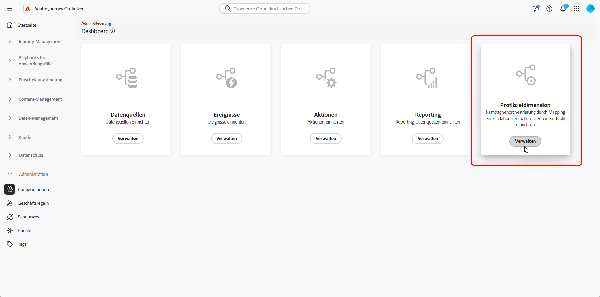
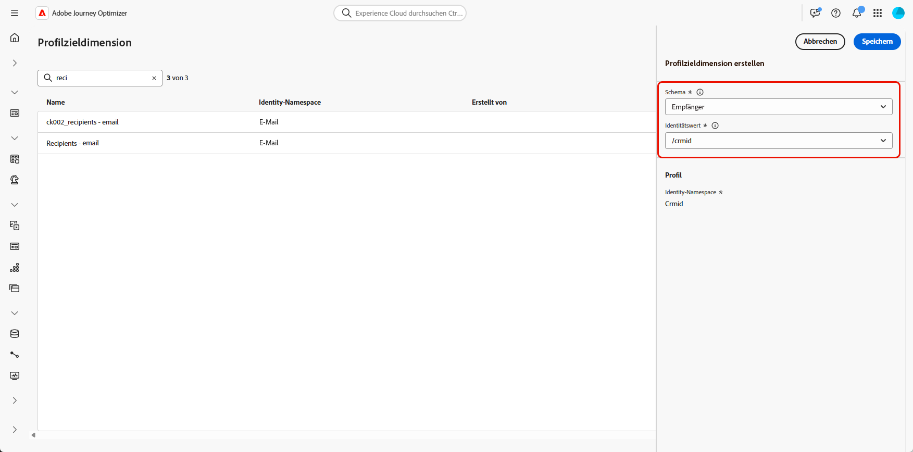

# Konfigurieren einer Zielgruppendimension {#configuration}

Mit **[!UICONTROL orchestrierten Kampagnen]** können Sie zielgerichtete Kommunikation auf Entitätsebene gestalten und bereitstellen und dabei die Funktionen von relationalen Schemata von Adobe Experience Platform nutzen. Schemata dienen in Experience Platform zur konsistenten und wiederverwendbaren Beschreibung der Struktur von Daten. Wenn Daten in Experience Platform aufgenommen werden, werden sie nach einem XDM-Schema strukturiert.

Auch wenn die Segmentierung für **[!UICONTROL orchestrierte Kampagnen]** hauptsächlich in relationalen Schemata erfolgt, erfolgt der tatsächliche Nachrichtenversand immer auf der Ebene **Profil**.

Bei der Konfiguration der Zielgruppenbestimmung definieren Sie zwei wichtige Aspekte:

* **Targetierbare Schemata**

  Sie legen fest, welche relationalen Schemata für die Zielgruppenbestimmung infrage kommen. Standardmäßig wird das Schema mit dem Namen `Recipient` verwendet, Sie können jedoch Alternativen wie `Visitors`, `Customers` usw. konfigurieren.

  >[!IMPORTANT]
  >
  > Orchestrierte Kampagnen ermöglichen Targeting für jedes Schema, das eine direkte oder verwandte Beziehung zum Schema **Profil** aufweist. Obwohl die Verwendung in erster Linie für 1:1-Beziehungen vorgesehen ist, unterstützt sie auch 1:N-Beziehungen wie „Konto“ `>` „Empfänger“, sofern der Beziehungspfad im Datenmodell ordnungsgemäß modelliert ist. Dies ermöglicht Targeting anhand von Daten auf Kontoebene, während gleichzeitig die richtige Profilidentität für den Nachrichtenversand aufgelöst wird.

* **Profilverknüpfung**

  Das System muss verstehen, wie das Zielschema dem `Profile`-Schema zugeordnet ist. Dies wird durch ein gemeinsames Identitätsfeld erreicht, das sowohl im Zielschema als auch im `Profile`-Schema existiert und als Identity-Namespace konfiguriert ist.

➡️ [Weitere Informationen zu modellbasierten Schemata finden Sie in der Dokumentation zu Adobe Experience Platform](https://experienceleague.adobe.com/de/docs/experience-platform/xdm/schema/relational#how-relational-schemas-differ-from-standard-xdm-schemas)

## Erstellen einer Zielgruppendimension {#targeting-dimension}

Richten Sie zunächst die Kampagnenorchestrierung ein, indem Sie dem Kundenprofil ein relationales Schema zuordnen.

1. Rufen Sie unter **[!UICONTROL Administration]** das Menü **[!UICONTROL Konfigurationen]** auf und wählen Sie **[!UICONTROL Zieldimension für Kampagne]**.

   

1. Klicken Sie auf **[!UICONTROL Erstellen]**, um mit der Erstellung Ihrer **[!UICONTROL Zielgruppendimension]** zu beginnen.

1. Wählen Sie Ihr [zuvor konfiguriertes Schema](gs-schemas.md) aus der Dropdown-Liste aus.

   Es werden zwar alle relationalen Schemata angezeigt, doch können nur Schemata mit einer direkten Identitätsbeziehung zum **Profil** ausgewählt werden. Vermeiden Sie die Auswahl von Nicht-Personen-Schemata, z. B. Käufe, und wählen Sie ein Schema aus, das direkt mit einem Profil verknüpft ist.

1. Wählen Sie den **[!UICONTROL Identitätswert]** für die Entität aus, die Sie ansprechen möchten.

   In diesem Beispiel ist das Kundenprofil mit mehreren Abonnements verknüpft, die jeweils durch einen eindeutigen `crmID` im `Recipient`-Schema dargestellt werden. Wenn Sie die **[!UICONTROL Zieldimension]** auf die Verwendung des `Recipient`-Schemas und dessen Identität `crmID` festlegen, können Sie Nachrichten auf Abonnementebene anstatt an das Hauptkundenprofil senden. Dadurch wird sichergestellt, dass jeder Vertrag oder jede Zeile eine eigene personalisierte Nachricht erhält.

   [Weitere Informationen hierzu finden Sie in der Dokumentation zu Adobe Experience Platform](https://experienceleague.adobe.com/de/docs/experience-platform/xdm/schema/composition#identity).

   

1. Klicken Sie auf **[!UICONTROL Speichern]**, um die Einrichtung abzuschließen. Beachten Sie, dass eine **[!UICONTROL Zieldimension]** nach ihrer Erstellung nicht mehr entfernt oder bearbeitet werden kann.

Fahren Sie nach der Konfiguration der **[!UICONTROL Zieldimension]** mit der Erstellung und Einrichtung Ihrer **[!UICONTROL Kanalkonfiguration]** fort und definieren Sie die entsprechenden **[!UICONTROL Ausführungsdetails]**.