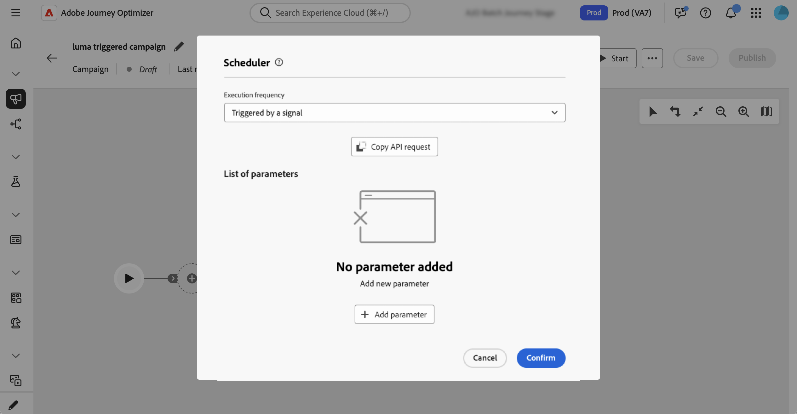
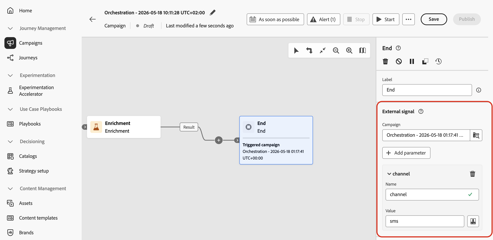

# Auslösen von orchestrierten Kampagnen durch ein Signal {#trigger-signal}

Sie können eine orchestrierte Kampagne mit einem Signal anstelle eines festen Zeitplans starten. Wenn die Kampagne das Signal erhält, wird sie ausgeführt und Sie können Parameter in der Payload übergeben. Sie werden als Variablen für Zielgruppenbestimmungen, Bedingungen oder Ausdrücke verfügbar.

Das Signal kann aus einem der folgenden Elemente stammen:

* REST-API - Ihre Anwendung oder Integration ruft den Trigger-Endpunkt auf (siehe [Veröffentlichen und Trigger der Kampagne](#publish) und die [API-Referenz](https://developer.adobe.com/journey-optimizer-apis/references/oc-trigger){target="_blank"}).
* Eine andere orchestrierte Kampagne: Die **[!UICONTROL Ende]**-Aktivität einer Upstream-Kampagne sendet dasselbe Signal, wenn eine Verzweigung abgeschlossen wird. [Erfahren Sie, wie Sie die Endaktivität konfigurieren](#signal-end).

Auf dieser Seite wird beschrieben, wie Sie die Kampagne einrichten, die das Signal erhält (Zeitplan, Parameter, Test, Veröffentlichung), und es dann über die API oder eine **[!UICONTROL End]**-Aktivität auslösen. Sobald die Variablen verfügbar sind, finden Sie weitere Informationen zu ihrer Verwendung in Regeln und **[!UICONTROL Test]**-Bedingungen unter [Verwenden von Variablen in orchestrierten Kampagnen](variables-orchestrated-campaigns.md).

Die vollständige REST-Spezifikation für den Trigger-Endpunkt (Pfade, Kopfzeilen, Hauptteil, Antworten und Fehler) finden Sie unter [Trigger Orchestered Campaign API](https://developer.adobe.com/journey-optimizer-apis/references/oc-trigger){target="_blank"} in der Adobe Journey Optimizer-API-Dokumentation.

End-to-End-Prozess zum Trigger einer orchestrierten Kampagne mithilfe eines Signals:

1. [Planung der durch ein Signal ausgelösten Kampagne](#configure-signal)
1. [Parameter für die Signal-Payload hinzufügen](#parameters) (optional)
1. [Erstellen und Testen der Kampagne](#build-and-test)
1. [Veröffentlichen und Trigger der Kampagne](#publish)

>[!NOTE]
>
>Um eine orchestrierte Kampagne mithilfe eines Signals Trigger, benötigen Sie die **[!DNL Publish orchestrated campaigns]** (`orchestrated-campaign.publish`). Siehe [Integrierte Berechtigungen](../administration/ootb-permissions.md).

## Planung der durch ein Signal ausgelösten Kampagne {#configure-signal}

Gehen Sie wie folgt vor, um eine orchestrierte Kampagne so einzurichten, dass sie mit einem Signal statt mit einem Zeitplan startet:

1. Öffnen Sie die orchestrierte Kampagne, die Sie mit einem Signal Trigger machen möchten.

1. Öffnen Sie die Zeitplankonfiguration. [Erfahren Sie, wie Sie eine koordinierte Kampagne planen](create-orchestrated-campaign.md#schedule).

1. Wählen Sie **[!UICONTROL Wird durch ein Signal ausgelöst]**, damit die Kampagne auf ein Signal wartet, anstatt nach einem Zeitplan zu laufen.

   {zoomable="yes"}

## Parameter für die Signal-Payload hinzufügen (optional) {#parameters}

Sie können Parameter im Kampagnensignal übergeben und in Ihrer Trigger im Ausführungskontext verwenden, z. B. bei der Zielgruppenbestimmung, in Bedingungen oder Ausdrücken. Definieren Sie jeden Parameter zuerst in den Zeitplaneinstellungen und übergeben Sie dann seinen Wert, wenn Sie die Trigger-API aufrufen oder wenn Sie Parameter aus der **[!UICONTROL Ende]**-Aktivität einer Upstream-Kampagne zuordnen ([siehe unten](#signal-end)).

1. Öffnen Sie die Kampagnenplanung und wählen Sie **[!UICONTROL Parameter hinzufügen]** aus.

1. Definieren Sie den Namen und den Datentyp jedes Parameters, der in der Signal-Payload gesendet werden soll. Sie können auch **Testwerte** angeben, die beim Trigger der Kampagne im Testmodus verwendet werden. [Erfahren Sie, wie Sie eine ausgelöste Kampagne testen](#build-and-test).

   {zoomable="yes"}

>[!NOTE]
>
>Bei orchestrierten Kampagnen, die von der REST-API ausgelöst werden, ist der API-Aufruf erfolgreich, wenn Sie einen Parameter im API-Aufruf übergeben, der nicht im Scheduler definiert wurde, und der Parameter wird weitergegeben. Sie können ihn in Ausdrücken verwenden. Die koordinierte Kampagnenschnittstelle hilft Ihnen jedoch nicht bei der Verwendung. Beispielsweise werden in der Testaktivität keine Parameter aufgelistet oder angezeigt, die nicht in der Planung definiert wurden.

## Testen der Kampagne {#build-and-test}

Erstellen Sie Ihre Kampagne auf der Arbeitsfläche und testen Sie sie dann in **[!UICONTROL Entwurf]** bevor Sie sie veröffentlichen, indem Sie das Signal über die REST-API senden.

* **Von der REST-API ausgelöste orchestrierte Kampagnen** - Führen Sie die folgenden Schritte aus, um die Kampagne vor der Veröffentlichung im Entwurf auszuführen und ihre Zielgruppenbestimmung, Parameter und Versandlogik zu validieren.

* **Orchestrierte Kampagnen, die durch eine Endaktivität ausgelöst werden** - Sie können die vollständige Kette nicht durchgängig im Entwurf ausführen: Sobald die Upstream-Kampagne veröffentlicht wurde, beginnt ihre **[!UICONTROL End]**-Aktivität nur noch mit einer veröffentlichten Downstream-Kampagne. Um die nachgelagerte Seite zu testen, bevor beide Kampagnen veröffentlicht werden, behalten Sie diese Kampagne in **[!UICONTROL Entwurf]** bei, legen **[!UICONTROL Testwerte]** für Ihre Signalparameter im Planer fest ([Parameter für die Signal-Payload hinzufügen](#parameters)) und führen Sie dann die folgenden API-Schritte aus. Der Trigger-API-Aufruf verwendet zur Laufzeit dieselbe Payload wie eine **[!UICONTROL End]**-Aktivität, sodass Sie das Parameter-Routing und die Arbeitsflächen-Logik vor der Veröffentlichung der nachgelagerten Kampagne validieren und die Upstream-**[!UICONTROL End]**-Aktivität konfigurieren können ([Trigger aus der Endaktivität einer anderen Kampagne](#signal-end)).

1. Fügen Sie Aktivitäten (Audience, Zielgruppenbestimmung, Sendungen) auf der Arbeitsfläche hinzu und verbinden Sie sie. [Weitere Informationen zur Orchestrierung von Kampagnenaktivitäten](orchestrate-activities.md)

1. Wenn Sie Parameter im Signal definiert haben, können Sie diese in Ihre Arbeitsflächen-Logik verkabeln (z. B. in Bedingungen oder beim Targeting). In diesem Beispiel wird der Parameter „channel“ als Bedingung in einer &quot;**[!UICONTROL &quot;-]** verwendet.

   

   Um einen Signalparameter im Ausdruckseditor zu verwenden (z. B. um eine Abfrage in der Aktivität **[!UICONTROL Zielgruppe aufbauen]**), geben Sie `$(vars/@<parameterName>)` in das Ausdrucksfeld ein. Ersetzen Sie `<parameterName>` durch den im Planer definierten Parameternamen, z. B. `$(vars/@channel)`. [Erfahren Sie mehr über die Arbeit mit dem Ausdruckseditor](edit-expressions.md).

1. Öffnen Sie die Kampagnenplanung, wählen Sie **[!UICONTROL API-Anfrage kopieren]** und das Format aus (cURL- oder HTTP-Anfrage).

   Die kopierten Informationen enthalten die orchestrierte Kampagnen-ID, den Sandbox-Namen, die Organisations-ID und Testwerte für Ihre Parameter, sofern Sie welche hinzugefügt haben.

   

   +++Beispielhafte cURL-Anfrage mit einem -Parameter und einem Testwert

   ```bash
   POST https://platform.adobe.io/ajo/campaign-orchestration/orchestratedCampaigns/1c7529c7-7a8c-491a-a2c6-3d8131d2e17d/trigger
   
   Headers:
   Authorization: Bearer ## Access token ##
   Content-Type: application/json
   x-api-key: ## Provide API Key here ##
   x-api-version: 1
   x-gw-ims-org-id: 123456ABCDEFG@LumaOrg
   x-sandbox-name: prod
   
   Body:
   {
   "variables": {
      "channel": "sms"
   }
   }
   ```

   +++

1. Klicken Sie **[!UICONTROL Starten]**, um die Kampagne zu starten.

1. Senden Sie den Trigger-API-Aufruf mit der Beispielanfrage, die Sie aus der Planung kopiert haben. Details zu Anfragen und Antworten finden Sie unter [&#128279;](https://developer.adobe.com/journey-optimizer-apis/references/oc-trigger){target="_blank"} API für orchestrierte Kampagnen in Trigger.

Wenn Sie mit den Testergebnissen zufrieden sind, veröffentlichen [&#x200B; die Kampagne](#publish).

## Veröffentlichen und Trigger der Kampagne {#publish}

Nachdem Sie [&#x200B; Kampagne getestet haben](#build-and-test) veröffentlichen Sie sie, damit sie ein Signal von Ihrer Anwendung oder der Aktivität **[!UICONTROL Ende]** einer anderen Kampagne empfangen kann. [Weitere Informationen zum Starten und Überwachen der Kampagne](start-monitor-campaigns.md#publish).

Sie können ihn dann über die REST-API oder die Aktivität „Ende **[!UICONTROL einer anderen Kampagne]**. Siehe die folgenden Abschnitte.

### Senden des Signals mit der REST-API {#publish-api}

Führen Sie nach der Veröffentlichung jedes Mal, wenn Sie die Kampagne aus Ihrer eigenen Anwendung heraus Trigger haben, die folgenden Schritte aus:

1. Öffnen Sie die Kampagnenplanung, wählen Sie **[!UICONTROL API-Anfrage kopieren]** und das Format aus (cURL- oder HTTP-Anfrage).

   Die kopierten Informationen enthalten die Kennung der orchestrierten Kampagne, den Sandbox-Namen, die Organisations-ID und die Parameter, sofern Sie welche hinzugefügt haben.

   

1. Rufen Sie die Trigger-API von Ihrem System aus auf. Siehe [API für orchestrierte Trigger &#x200B;](https://developer.adobe.com/journey-optimizer-apis/references/oc-trigger){target="_blank"} für die Live-Endpunktspezifikation.

   >[!IMPORTANT]
   >
   >Bei einer orchestrierten Live-Kampagne erzwingt eine Drosselungsmaßnahme ein Mindestintervall von einer Stunde zwischen zwei API-Trigger-Ausführungen. Wenn Sie die API erneut aufrufen, bevor dieses Intervall abgelaufen ist, gibt die API HTTP 429 (zu viele Anfragen) zurück. Diese Schutzmaßnahme wird nicht angewendet, wenn Sie Trigger für eine Entwurfsversion ausführen, um sie zu testen.

   Wenn Sie Parameter zur Signal-Payload hinzugefügt haben, werden die Werte, die Sie im API-Aufruf übergeben, bei der Ausführung der Kampagne als Kampagnenereignisvariablen verfügbar gemacht. Um sie zu überprüfen, öffnen Sie die Kampagnenprotokolle in der Symbolleiste der Kampagnen-Arbeitsfläche. Identifizieren Sie auf **[!UICONTROL Registerkarte]** die Aufgabe, die dem Signal entspricht, und klicken Sie auf das Stiftsymbol, um auf die zugehörigen Ereignisvariablen zuzugreifen. [Erfahren Sie, wie Sie auf Protokolle und Aufgaben zugreifen können](start-monitor-campaigns.md#logs-tasks).

   {zoomable="yes"}

### Senden des Signals aus der Endaktivität einer anderen Kampagne {#signal-end}

Verwenden Sie diesen Pfad, um orchestrierte Kampagnen zu verketten: Wenn die Upstream-Kampagne eine Verzweigung beendet, sendet die **[!UICONTROL End]**-Aktivität ein Signal an eine Downstream-Kampagne, die bereits auf **[!UICONTROL Ausgelöst durch ein Signal]** gesetzt ist. Auf diese Weise können Sie kleinere Kampagnen wiederverwenden und von jedem Aufrufer eine andere Payload übergeben.

>[!NOTE]
>
>* Sie können mehrere **[!UICONTROL End]**-Aktivitäten auf derselben Arbeitsfläche verwenden und jede so konfigurieren, dass sie einen Trigger für eine andere nachgelagerte Kampagne erstellt.
>* Dieselbe nachgelagerte Kampagne kann auch von mehreren Kampagnen Trigger werden. Jeder Aufruf kann eine andere Payload senden.

Führen Sie die folgenden Schritte für die Kampagne aus, die zuerst ausgeführt werden soll:

1. Öffnen Sie die orchestrierte Kampagne, die das Signal senden soll, und wählen Sie eine **[!UICONTROL Ende]**-Aktivität am Ende der Verzweigung aus, die abgeschlossen sein muss, bevor die nachgelagerte Kampagne beginnt.
1. Wählen Sie im Abschnitt **[!UICONTROL Externes Signal]** die nachgelagerte Kampagne aus, die Trigger werden soll.

1. Optional können Sie Parameter hinzufügen: Verwenden Sie dieselben Namen wie im Zeitplan der nachgelagerten Kampagne und legen Sie jeden Wert fest.

   

1. Um die nachgelagerte Kampagne vor der Veröffentlichung im Entwurfsmodus zu testen, führen Sie die Schritte im Abschnitt [Testen der Kampagne](#build-and-test) aus, um sie mit der REST-API als Entwurf Trigger.

Die nachgelagerte Kampagne muss veröffentlicht werden, bevor die vorgelagerte Kampagne weit genug ausgeführt wird, um die **[!UICONTROL Ende]**-Aktivität zu erreichen, mit der sie Trigger wird. Wenn das Signal gesendet wird, während die Zielkampagne nicht veröffentlicht ist, schlägt die Ausführung fehl. Veröffentlichen Sie die nachgelagerte Kampagne und setzen Sie sie dann bei Bedarf fort oder starten Sie sie neu.
