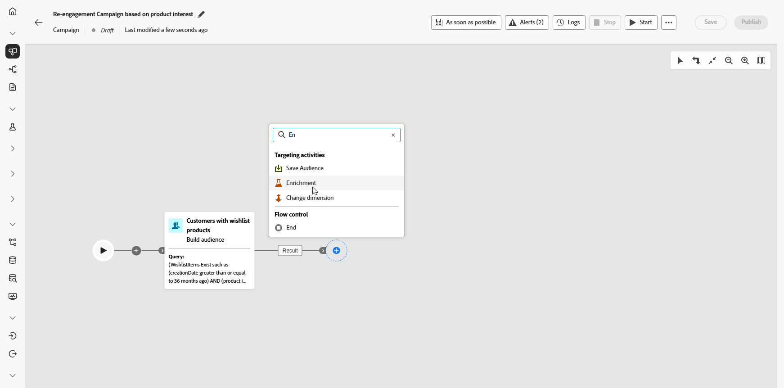
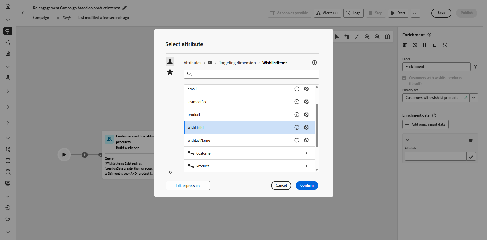
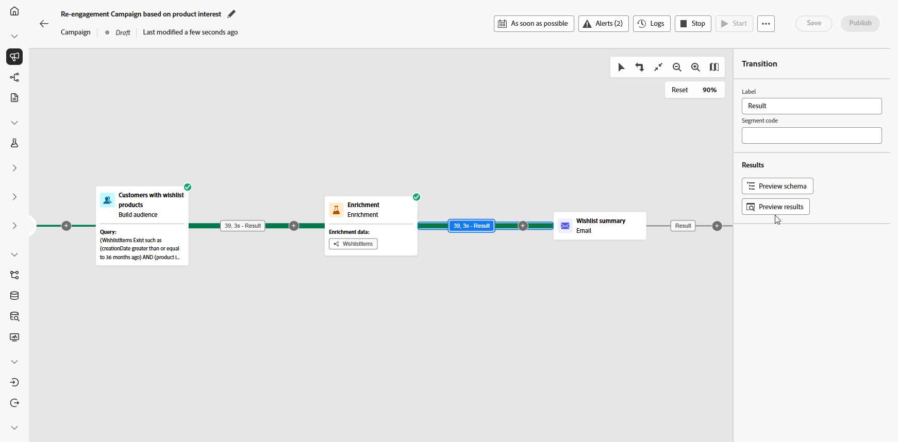

# Senden von Aktualisierungen von Wunschlistenartikeln {#wishist-uc}

>[!BEGINSHADEBOX]

In diesem Beispiel wird ein **Wunschliste**-Schema verwendet. Dasselbe Verfahren gilt jedoch für alle Entitäten mit einer Eins-zu-viele-Beziehung zu **Empfangenden** wie **Käufe**, **Abonnements** oder jedem benutzerdefinierten Schema, in dem jeder Empfängerin bzw. jedem Empfänger mehrere Einträge zugeordnet sein können.

**Für diesen Anwendungsfall erforderliche Schemata:**

* **Empfangende:** wird als Zielgruppendimension verwendet
* **Wunschlistenartikel:** mit Feldern: `creationDate`, `product`, `Wishlistid`
* **Produkt:** mit Feldern: `description`, `priceref`, `imageurl`
* **Abgebrochene Warenkörbe** (optional): mit Feld: `lastmodified`

➡️ [Erfahren Sie, wie Sie relationale Schemata konfigurieren](gs-schemas.md)

>[!ENDSHADEBOX]

{zoomable="yes"}

Diese orchestrierte Kampagne konzentriert sich auf die Wiederaufnahme der Interaktion mit Besuchenden, indem sie an Produkte erinnert werden, die in ihrer Wunschliste gespeichert wurden. Definieren Sie mithilfe der Kampagnenorchestrierung die Zielgruppe mit Bedingungen, die auf der Aktivität „Wunschliste“ basieren, und fördern Sie so Konversionen von Besuchenden.

1. Erstellen Sie zunächst eine neue Kampagne, die speziell auf die Rückgewinnung anhand von Wunschlisten ausgerichtet ist. Auf diese Weise können Sie die Nachrichten auf Personen konzentrieren, die ihre Kaufabsicht durch das Speichern von Artikeln gezeigt haben.

   {zoomable="yes"}

1. Füllen Sie Ihre **Kampagneneinstellungen** aus.

1. Fügen Sie eine Aktivität des Typs **[!UICONTROL Zielgruppe erstellen]** hinzu, um die Kundengruppe zu identifizieren, die basierend auf dem Wunschlistenverhalten angesprochen werden soll.

   {zoomable="yes"}

1. Legen Sie ein beschreibendes **[!UICONTROL Label]** für diese Zielgruppe fest und wählen Sie **[!UICONTROL Empfangende]** als **[!UICONTROL Zielgruppendimension]**. Klicken Sie dann auf **[!UICONTROL Fortfahren]**, um die Zielgruppe zu konfigurieren.

1. Klicken Sie auf **[!UICONTROL Bedingung hinzufügen]**, um Ihre Zielgruppe einzuschränken, indem Sie die folgende Bedingung erstellen:

   `WishlistItems Exist such as (creationDate greater than or equal to 36 months ago) AND (product is not empty`
ODER
   `AbandonedCarts Exist such as lastmodified greater than or equal to 36 months ago`

   Diese Zielgruppe basiert auf Empfangenden, die eine Wunschliste haben, über Artikel mit Produktbildern verfügen oder innerhalb des definierten Zeitraums einen Warenkorb abgebrochen haben.

   {zoomable="yes"}

1. Klicken Sie auf **[!UICONTROL Berechnen]**, um die Anzahl der von diesen Bedingungen betroffenen Profile anzuzeigen, und wählen Sie **[!UICONTROL Ergebnisse anzeigen]** aus, um Details für jede Bedingung zu überprüfen und zu bestätigen, dass die Zielgruppe Ihrem Zielsegment entspricht.

   {zoomable="yes"}

1. Klicken Sie auf **[!UICONTROL Bestätigen]**.

1. Fügen Sie eine Aktivität des Typs **[!UICONTROL Anreicherung]** hinzu, um die Kampagne mit **Wunschliste** und **Produktinformationen** zu personalisieren.

   {zoomable="yes"}

1. Klicken Sie auf **[!UICONTROL Anreicherungsdaten hinzufügen]**.

1. Rufen Sie `Targeting dimension > Wishlistitems > Wishlistid` auf.

   {zoomable="yes"}

1. Wählen Sie aus, wie die Daten erfasst werden (in diesem Fall **[!UICONTROL Daten erfassen]**), um Details zur Wunschliste für Ihre Zielgruppe zu erfassen.

1. Wählen Sie die Anzahl der abzurufenden Zeilen. Standardmäßig werden drei Elemente pro Wunschliste abgerufen. Dies kann jedoch je nach den Anforderungen der Kampagne angepasst werden, um mehr oder weniger Produkte hervorzuheben.

1. Klicken Sie auf **[!UICONTROL Attribut hinzufügen]**, um die folgenden drei Attribute zu erstellen:

   * `Product > description`
   * `Product > priceref`
   * `Product > imageurl`

   Dadurch wird die Nachricht mit detaillierten Produktinformationen angereichert, um Konversionen zu fördern.

   {zoomable="yes"}

1. Fügen Sie eine E-Mail-Aktivität hinzu, um für jede Kundin und jeden Kunden eine individuell personalisierte Nachricht zur Wiederaufnahme der Interaktion zu erstellen. Klicken Sie auf **[!UICONTROL Inhalt bearbeiten]**, um mit der Inhaltserstellung zu beginnen.

   ➡️ [Weitere Informationen zur E-Mail-Personalisierung](../email/content-from-scratch.md)

   {zoomable="yes"}

1. Speichern Sie nach Abschluss der E-Mail und führen Sie die Kampagne im Entwurfsmodus aus, indem Sie in der orchestrierten Kampagne auf **[!UICONTROL Starten]** klicken.

1. Nach dem Starten des Entwurfsmodus können Sie eine Vorschau der Zielgruppe mit Details zur Wunschliste anzeigen.

   Um detailliertere Erkenntnisse zu erhalten, klicken Sie auf ein Ausgabeergebnis und wählen Sie **[!UICONTROL Vorschau der Ergebnisse]** aus.

   {zoomable="yes"}

Nachdem die Kampagne ausgeführt wurde, können wir unsere Berichte lesen, die uns einen robusten Satz von Daten und KPIs über die Leistung unserer Kampagne liefern.

➡️ [Weitere Informationen zum Reporting](../reports/campaign-global-report-cja.md)
