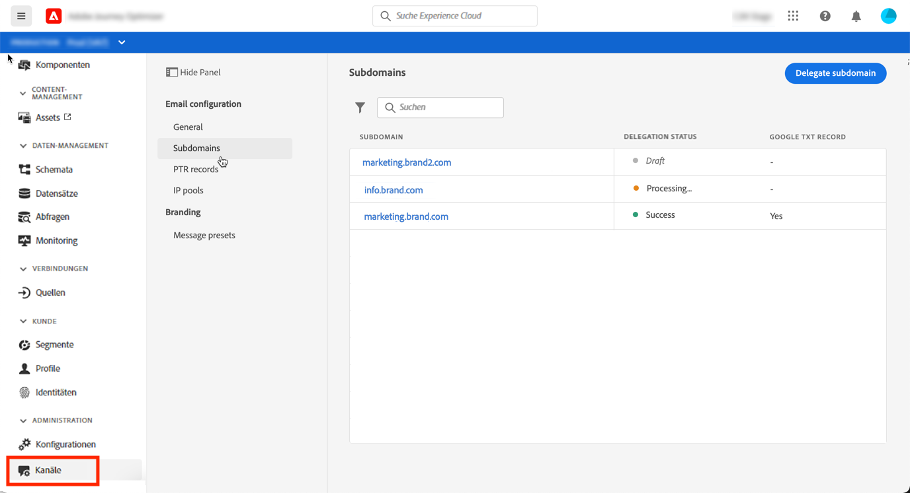
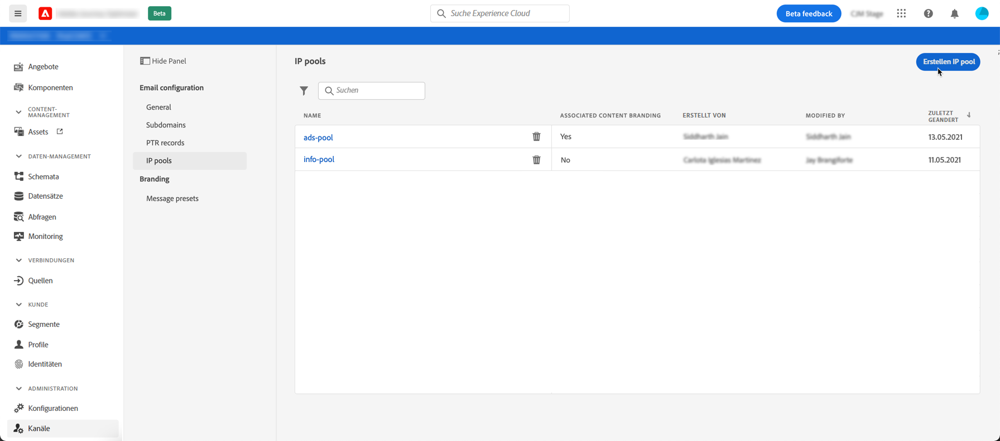

# Erste Schritte für Systemadministratoren

Bevor Sie mit der Verwendung von [!DNL Adobe Journey Optimizer] beginnen, sind mehrere Schritte erforderlich, um Ihre Umgebung vorzubereiten.  Führen Sie diese Schritte aus, damit die Variable [Dateningenieur](data-engineer.md) und [Journey Practicionner](marketer.md) kann mit der Arbeit mit [!DNL Adobe Journey Optimizer].

Als **Systemadministrator**, müssen Sie **Produktprofile und Berechtigungen verstehen** für die Sandbox-Verwaltung und Kanalkonfiguration. Außerdem müssen Sie Sandboxes einrichten und entsprechend den verfügbaren Produktprofilen verwalten. Anschließend können Sie Produktprofilen Team-Mitglieder zuweisen.

Diese Funktionen können von **[!UICONTROL Produktadministratoren]** , die Zugriff auf die Admin Console haben. [Weitere Informationen zu Adobe Admin Console](https://helpx.adobe.com/de/enterprise/admin-guide.html){target=&quot;_blank&quot;}.

Informationen zur Zugriffsverwaltung finden Sie auf den folgenden Seiten:

1. **Sandboxes erstellen** , um Ihre Instanzen in separate, isolierte virtuelle Umgebungen zu unterteilen. **Sandboxes** werden in [!DNL Journey Optimizer]. Weitere Informationen finden Sie unter [Sandboxes](../administration/sandboxes.md) Abschnitt.

   >[!NOTE]
   >Als **Systemadministrator**, wenn die **[!UICONTROL Sandboxes]** Menü in [!DNL Journey Optimizer], aktualisieren Sie Ihre Berechtigungen in der [Admin Console](https://adminconsole.adobe.com/){_blank}. Erfahren Sie, wie Sie Ihr Produktprofil aktualisieren können in [diese Seite](../administration/permissions.md#edit-product-profile).

1. **Produktprofile verstehen**. Produktprofile sind eine Reihe von Einzelrechten, die Benutzern den Zugriff auf bestimmte Funktionen oder Objekte in der Benutzeroberfläche ermöglichen. Weitere Informationen finden Sie unter [Vordefinierte Produktprofile](../administration/ootb-product-profiles.md) Abschnitt.

1. **Berechtigungen festlegen** für Produktprofile, einschließlich **Sandboxes** und geben Sie Zugriff auf Ihre Team-Mitglieder, indem Sie sie verschiedenen Produktprofilen zuweisen. Dieser Schritt wird im [Admin Console](https://adminconsole.adobe.com/){_blank}. Berechtigungen sind Einzelrechte, mit denen Sie die Berechtigungen definieren können, die **[!UICONTROL Produktprofil]**. Jede Berechtigung wird unter Funktionen erfasst, z. B. Journey, Nachrichten oder Angebote, die die verschiedenen Funktionen oder Objekte in [!DNL Journey Optimizer] darstellen. Weitere Informationen finden Sie unter [Berechtigungsebenen](../administration/high-low-permissions.md) Abschnitt.

Darüber hinaus müssen Sie **Bereitstellen[!DNL Adobe Experience Manager Assets Essentials]** zum Verwalten von Assets und Bildern in Ihren Nachrichten: Benutzer, die Zugriff benötigen auf [!DNL Assets Essentials] muss Teil der **Assets Essentials-Kundenbenutzer** oder/und **Assets Essentials-Benutzer** Produktprofile. [Weitere Informationen finden Sie in der Dokumentation zu Assets Essentials](https://experienceleague.adobe.com/docs/experience-manager-assets-essentials/help/deploy-administer.html?lang=de){target=&quot;_blank&quot;}.

Beim erstmaligen Zugriff auf [!DNL Journey Optimizer] wird Ihnen eine Produktions-Sandbox bereitgestellt und je nach Vertrag eine bestimmte Anzahl von IPs zugewiesen.

Um Journey erstellen und Nachrichten senden zu können, rufen Sie die **VERWALTUNG** Menü. Durchsuchen Sie die **[!UICONTROL Kanäle]** Menü, um Ihre E-Mail-Nachrichten und Vorgaben zu konfigurieren.

>[!NOTE]
>Als **Systemadministrator**, wenn die **[!UICONTROL Kanäle]** Menü in [!DNL Journey Optimizer], aktualisieren Sie Ihre Berechtigungen in der [Admin Console](https://adminconsole.adobe.com/){_blank}. Erfahren Sie, wie Sie Ihr Produktprofil aktualisieren können in [diese Seite](../administration/permissions.md#edit-product-profile).

Führen Sie die folgenden Schritte aus:

1. **Nachrichten und Kanäle konfigurieren**: Vorgaben definieren, E-Mail- und Push-Nachrichten anpassen

   * Definieren **Push-Benachrichtigungseinstellungen** in beiden [!DNL Adobe Experience Platform] und [!DNL Adobe Experience Platform Launch]. [Weitere Informationen](../push-gs.md)

   * Erstellen **Nachrichtenvorgaben** um alle technischen Parameter zu konfigurieren, die für E-Mail- und Push-Benachrichtigungen erforderlich sind. [Weitere Informationen](../configuration/message-presets.md)

   * Verwalten der Anzahl von Tagen, in denen **retries** werden durchgeführt, bevor E-Mail-Adressen an die Unterdrückungsliste gesendet werden. [Weitere Informationen](../configuration/manage-suppression-list.md)

1. **Subdomains zuweisen**: Für jede neue Subdomain, die in Journey Optimizer verwendet werden soll, besteht der erste Schritt darin, sie zuzuweisen. [Weitere Informationen](../configuration/about-subdomain-delegation.md)

   

1. **Erstellen von IP-Pools**: Verbessern Sie die Zustellbarkeit Ihrer E-Mails und Ihre Reputation, indem Sie IP-Adressen gruppieren, die mit Ihrer Instanz bereitgestellt wurden. [Weitere Informationen](../configuration/ip-pools.md)

   

1. **Verwalten der Unterdrückung und Zulassungsliste**: Zustellbarkeit durch Unterdrückung und Zulassungslisten verbessern

   * A [Unterdrückungsliste](../suppression-list.md) besteht aus E-Mail-Adressen, die Sie von Ihren Sendungen ausschließen möchten, da der Versand an diese Kontakte Ihrer Reputation und den Versandraten schaden könnte. Sie können alle E-Mail-Adressen überwachen, die automatisch vom Versand ausgeschlossen werden, wie ungültige Adressen, Adressen, die konsistent Softbounce verwenden und sich negativ auf Ihre E-Mail-Reputation auswirken könnten, sowie Empfänger, die eine Spam-Beschwerde einer Ihrer E-Mail-Nachrichten richten. Erfahren Sie, wie Sie die [Unterdrückungsliste](../configuration/manage-suppression-list.md) und [retries](../configuration/retries.md).
   

   * Die [Zulassungsliste](../allow-list.md) ermöglicht die Angabe einzelner E-Mail-Adressen oder Domains, die als einzige Empfänger oder Domains berechtigt sind, E-Mails zu empfangen, die Sie von einer bestimmten Sandbox aus senden. Dadurch können Sie verhindern, dass Sie in einer Testumgebung versehentlich E-Mails an echte Kundenadressen senden. Erfahren Sie, wie Sie [Zulassungsliste aktivieren](../allow-list.md).
   Erfahren Sie mehr über die Verwaltung der Zustellbarkeit in [!DNL Adobe Journey Optimizer] [auf dieser Seite](../deliverability.md).
