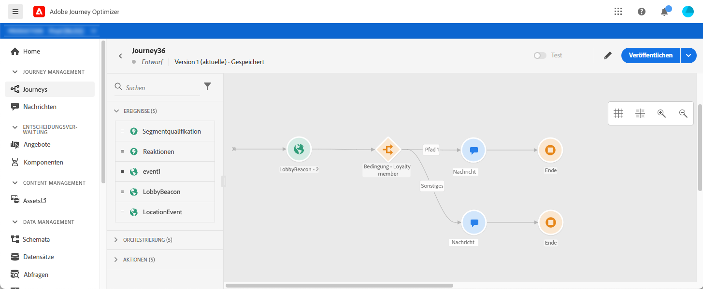

# Erste Schritte für Marketingexperten

Als **Marketer** oder **Journey Practicionner**, sind Sie für die Erstellung von Nachrichten, Angeboten und Journey verantwortlich. Sie können damit beginnen, [!DNL Adobe Journey Optimizer] einmal die [Systemadministrator](administrator.md) und [Dateningenieur](data-engineer.md) gewährt Ihnen Zugriff und vorbereitete Ihre Umgebung.

In den folgenden Abschnitten erfahren Sie, wie Sie Ihre erste Journey einrichten, Angebote und Assets hinzufügen und Nachrichten senden:

1. **Segmente erstellen**. Mit Journey Optimizer können Sie Zielgruppensegmente direkt aus dem **Segmente** und nutzen Sie sie in Ihren Journey.  Weitere Informationen zu Segmenten [auf dieser Seite](../segment/about-segments.md). Erfahren Sie, wie Sie Segmente erstellen [in diesem Beispiel](../segment/creating-a-segment.md).

1. **Nachrichten erstellen**. Erfahren Sie, wie Sie E-Mail- und Push-Benachrichtigungen in Journey Optimizer erstellen [auf dieser Seite](../create-message.md).

   

1. **Hinzufügen von Personalisierung**. Nutzen Sie die Personalisierungsfunktionen von Journey Optimizer, um Ihre Nachricht an Ihre Zielgruppe anzupassen. Weitere Informationen zur Personalisierung [in diesem Abschnitt](../personalization/personalize.md).

   

1. **Erstellen und Verwalten von Assets**. [!DNL Adobe Experience Manager Assets Essentials] bietet ein zentrales Repository mit Assets, die Sie für Ihre Nachrichten verwenden können. Weiterführende Informationen finden Sie [in diesem Abschnitt](../assets-essentials.md).

1. **Angebote hinzufügen**. Verwenden Sie [!DNL Journey Optimizer], um Ihren Kunden über alle Berührungspunkte hinweg zur richtigen Zeit das beste Angebot und Erlebnis zu bieten. Nach der Erstellung können Sie personalisierte Angebote an Ihre Audiences senden. Erfahren Sie mehr über die Entscheidungsverwaltung [in diesem Abschnitt](../../using/offers/get-started/starting-offer-decisioning.md).

   

1. **Nachrichten testen und validieren**. Sobald der Inhalt der Nachricht erstellt wurde, können Sie mithilfe von Testprofilen eine Vorschau erstellen und einen Testversand durchführen. Bei Verwendung von [personalisiertem Inhalt](../personalization/personalize.md) können Sie prüfen, ob dieser Inhalt in der Nachricht korrekt angezeigt wird, und dabei Daten von Testprofilen nutzen. Nutzen Sie außerdem Ihr **Litmus**-Konto in [!DNL Journey Optimizer], um Ihr **E-Mail-Rendering** in gängigen E-Mail-Clients zu überprüfen. Auf diese Weise stellen Sie sicher, dass Ihr E-Mail-Inhalt in jedem Posteingang ansprechend aussieht und korrekt funktioniert. Erfahren Sie, wie Sie Ihre Nachrichten testen und validieren [in diesem Abschnitt](../preview.md).

1. **Journey für Designkunden** um personalisierte, kontextbezogene Erlebnisse bereitzustellen. Mit [!DNL Journey Optimizer] können Sie Anwendungsfälle für die Echtzeit-Orchestrierung erstellen und dabei kontextbezogene Daten nutzen, die in Ereignissen oder Datenquellen gespeichert sind. Entwickeln Sie mehrstufige fortgeschrittene Szenarien mit folgenden Funktionen:

   * Senden Sie **einheitliche Nachrichten** in Echtzeit, ausgelöst durch den Empfang eines Ereignisses, oder **im Batch** mit Adobe Experience Platform-Segmenten.

   * Nutzen Sie **Kontextdaten** aus Ereignissen, Informationen aus Adobe Experience Platform oder Daten aus API-Services von Drittanbietern.

   * Verwenden Sie die **integrierte Aktion** zum Senden von in [!DNL Journey Optimizer] entworfenen Nachrichten oder erstellen Sie **benutzerspezifische Aktionen**, wenn Sie zum Senden Ihrer Nachrichten ein Drittanbietersystem verwenden.

   * Erstellen Sie mit dem **Journey Designer** Ihre mehrstufigen Anwendungsfälle: Ziehen Sie einfach per Drag-and-Drop ein Eintrittsereignis oder eine Aktivität zum Lesen von Segmenten in den Arbeitsbereich, fügen Sie Bedingungen hinzu und senden Sie personalisierte Nachrichten.

   

   Erfahren Sie, wie Sie Journey erstellen und ausführen [in diesem Abschnitt](../building-journeys/journey-gs.md)

1. **Nachrichten und Journey überwachen**. Um sicherzustellen, dass Ihre Nachrichten erfolgreich ausgeführt, gesendet und zugestellt werden, bietet [!DNL Journey Optimizer] Funktionen zum Überwachen der aktuell veröffentlichten und ausgelösten Nachrichten. Erfahren Sie, wie Sie die Leistung überwachen [in diesem Abschnitt](../message-monitoring.md).

