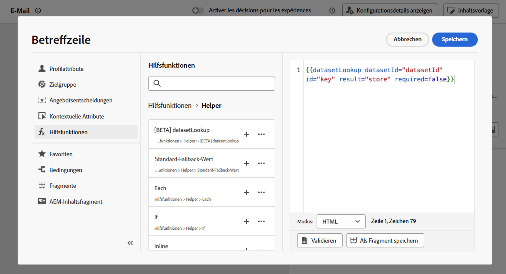
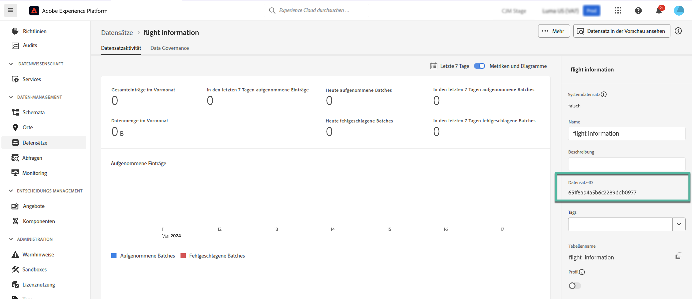
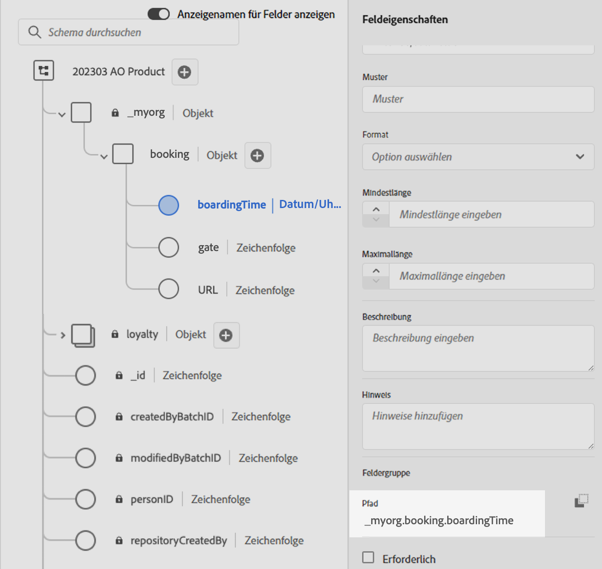
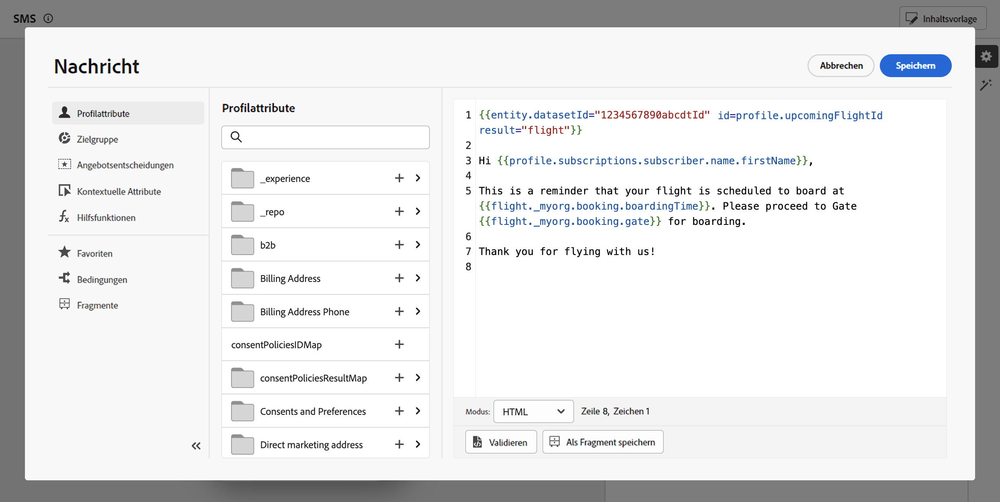

# Verwenden von Adobe Experience Platform-Daten für die Personalisierung {#aep-data}

>[!AVAILABILITY]
>
>Diese Funktion steht derzeit allen Kunden als eingeschränkte Verfügbarkeitsversion zur Verfügung.
>
>Derzeit kann die Hilfsfunktion „datasetLookup“ in Ausdrucksfragmenten für eine begrenzte Anzahl von Kunden verwendet werden. Wenden Sie sich an Ihren Adobe-Support-Mitarbeiter, um Zugriff zu erhalten.

Mit Journey Optimizer können Sie Daten aus Adobe Experience Platform-Datensatzdatensätzen im Personalisierungseditor nutzen, um [Inhalte zu personalisieren](../personalization/personalize.md). Bevor Sie beginnen, müssen für die Lookup-Personalisierung erforderliche Datensätze zunächst für die Suche aktiviert werden. Detaillierte Informationen finden Sie in diesem Abschnitt: [Verwenden von Adobe Experience Platform-](../data/lookup-aep-data.md).

Sobald ein Datensatz für die Lookup-Personalisierung aktiviert wurde, können Sie seine Daten verwenden, um Ihren Inhalt in [!DNL Journey Optimizer] zu personalisieren.

1. Öffnen Sie den Personalisierungseditor, der in jedem Kontext verfügbar ist, in dem Sie Personalisierungen wie Nachrichten definieren können. [Erfahren Sie, wie Sie mit dem Personalisierungseditor arbeiten](../personalization/personalization-build-expressions.md)

1. Navigieren Sie zur Liste der Hilfsfunktionen und fügen Sie die Hilfsfunktion **datasetLookup** zum Code-Bereich hinzu.

   

1. Diese Funktion bietet eine vordefinierte Syntax, mit der Sie Felder aus Ihren Adobe Experience Platform-Datensätzen aufrufen können. Die Syntax sieht folgendermaßen aus:

   ```
   {{datasetLookup datasetId="datasetId" id="key" result="store" required=false}}
   ```

   * **datasetId** ist die ID des Datensatzes, mit dem Sie arbeiten.
   * **id** ist die ID der Quellspalte, die mit der primären Identität des Lookup-Datensatzes verbunden werden soll.

     >[!NOTE]
     >
     >Bei dem für dieses Feld eingegebenen Wert kann es sich entweder um eine Feld-ID (`profile.packages.packageSKU`), ein in einem Journey-Ereignis übergebenes Feld (`context.journey.events.event_ID.productSKU`) oder einen statischen Wert (`sku007653`) handeln. In jedem Fall verwendet das System den Wert und sucht im Datensatz, um zu überprüfen, ob er mit einem Schlüssel übereinstimmt.
     >
     >Wenn Sie einen literalen Zeichenfolgenwert für den Schlüssel verwenden, setzen Sie den Text in Anführungszeichen. Beispiel: `{{datasetLookup datasetId="datasetId" id="SKU1234" result="store" required=false}}`. Wenn Sie einen Attributwert als dynamischen Schlüssel verwenden, entfernen Sie die Anführungszeichen. Beispiel: `{{datasetLookup datasetId="datasetId" id=category.product.SKU result="SKU" required=false}}`

   * **result** ist ein beliebiger Name, den Sie angeben müssen, um auf alle Feldwerte zu verweisen, die Sie aus dem Datensatz abrufen werden. Dieser Wert wird in Ihrem Code verwendet, um jedes Feld aufzurufen.

   * **required=false**: Wenn erforderlich auf „TRUE“ gesetzt ist, wird die Nachricht nur gesendet, wenn ein übereinstimmender Schlüssel gefunden wird. Wenn dies auf „false“ gesetzt ist, ist kein übereinstimmender Schlüssel erforderlich und die Nachricht kann weiterhin gesendet werden. Beachten Sie, dass bei Festlegung auf „false“ Ausweich- oder Standardwerte im Nachrichteninhalt berücksichtigt werden sollten.

   +++Wo kann ich eine Datensatz-ID abrufen?

   Datensatz-IDs können in der Benutzeroberfläche von Adobe Experience Platform abgerufen werden. Wie Sie mit Datensätzen arbeiten, erfahren Sie in der [Dokumentation zu Adobe Experience Platform](https://experienceleague.adobe.com/en/docs/experience-platform/catalog/datasets/user-guide#view-datasets){target="_blank"}.

   

   +++

1. Passen Sie die Syntax an Ihre Anforderungen an. In diesem Beispiel möchten wir Daten zu Passagierflügen abrufen. Die Syntax sieht folgendermaßen aus:

   ```
   {{datasetLookup datasetId="1234567890abcdtId" id=profile.upcomingFlightId result="flight"}}
   ```

   * Wir arbeiten mit dem Datensatz, dessen ID „1234567890abcdtId“ ist,
   * Das Feld, das wir für einen Join mit dem Lookup-Datensatz verwenden möchten, lautet *profile.upcomingFlightId*,
   * Wir möchten alle Feldwerte unter der Referenz „Flug“ einbeziehen.

1. Nachdem die im Adobe Experience Platform-Datensatz aufzurufende Syntax konfiguriert wurde, können Sie angeben, welche Felder Sie abrufen möchten. Die Syntax sieht folgendermaßen aus:

   ```
   {{result.fieldId}}
   ```

   >[!NOTE]
   >
   >Stellen Sie beim Referenzieren eines Datensatzfelds sicher, dass Sie mit dem vollständigen Feldpfad übereinstimmen, wie im Schema definiert.
   >
   >Es gibt keine festen Beschränkungen für die Anzahl der Felder, die mit der Hilfsfunktion abgerufen werden können. Um eine optimale Leistung zu erzielen, wird jedoch empfohlen, die Anzahl der Felder unter 50 zu halten, um eine Beeinträchtigung des Durchsatzes zu vermeiden.

   * **result** ist der Wert, den Sie dem Parameter **result** in der Hilfsfunktion **datasetLookup** zugewiesen haben. In diesem Beispiel „Flug“.
   * **fieldID** ist die ID des Felds, das Sie abrufen möchten. Diese ID ist beim Durchsuchen [!DNL Adobe Experience Platform] Datensatzschemas im Zusammenhang mit Ihrem Datensatz in der -Benutzeroberfläche sichtbar:

     +++Wo kann ich eine Feld-ID abrufen?

     Feld-IDs können bei der Vorschau eines Datensatzes in der Benutzeroberfläche von Adobe Experience Platform abgerufen werden. Erfahren Sie in der Dokumentation zu [Adobe Experience Platform, wie Sie eine Vorschau von Datensätzen anzeigen können](https://experienceleague.adobe.com/en/docs/experience-platform/catalog/datasets/user-guide#preview){target="_blank"}.

     

     +++

   In diesem Beispiel möchten wir Informationen verwenden, die sich auf die Zeit und das Gate der Passagiere beim Einsteigen beziehen. Daher fügen wir diese beiden Zeilen hinzu:

   * `{{flight._myorg.booking.boardingTime}}`
   * `{{flight._myorg.booking.gate}}`

1. Jetzt, da Ihr Code fertig ist, können Sie Ihren Inhalt wie gewohnt abschließen und ihn mit der Schaltfläche **Inhalt simulieren** testen, um die Personalisierung zu überprüfen. [Erfahren Sie, wie Sie Inhalte in der Vorschau anzeigen und testen können](../content-management/preview-test.md)


   
