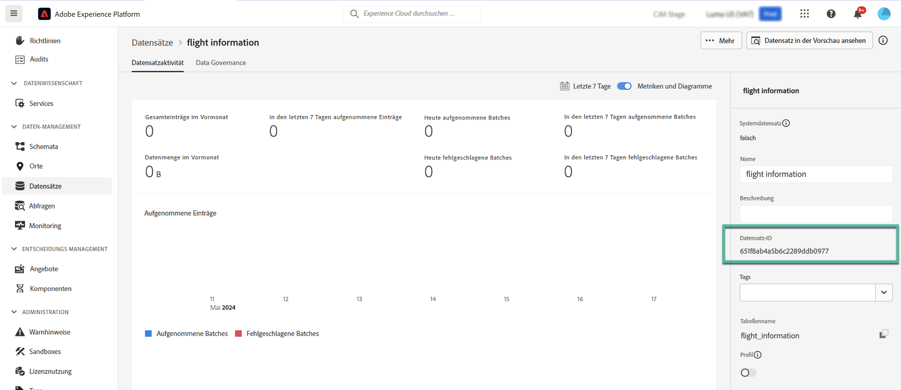

# Verwenden von Adobe Experience Platform-Daten für die Personalisierung {#aep-data}

>[!AVAILABILITY]
>
>Diese Funktion steht derzeit allen Kunden als eingeschränkte Verfügbarkeitsversion zur Verfügung.
>
>Derzeit kann die Hilfsfunktion „datasetLookup“ in Ausdrucksfragmenten für eine begrenzte Anzahl von Kunden verwendet werden. Um Zugriff zu erhalten, wenden Sie sich an den Adobe-Support.

Mit Journey Optimizer können Sie Daten aus Adobe Experience Platform-Datensatzdatensätzen im Personalisierungseditor nutzen, um [Inhalte zu personalisieren](../personalization/personalize.md). Bevor Sie beginnen, müssen für die Lookup-Personalisierung erforderliche Datensätze zunächst für die Suche aktiviert werden. Detaillierte Informationen finden Sie in diesem Abschnitt: [Verwenden von Adobe Experience Platform-](../data/lookup-aep-data.md).

Sobald ein Datensatz für die Lookup-Personalisierung aktiviert wurde, können Sie seine Daten verwenden, um Ihren Inhalt in [!DNL Journey Optimizer] zu personalisieren.

1. Öffnen Sie den Personalisierungseditor, der in allen Kontexten verfügbar ist, in denen Sie Personalisierungen definieren können, z. B. Nachrichten. [Erfahren Sie, wie Sie mit dem Personalisierungseditor arbeiten](../personalization/personalization-build-expressions.md)

1. Navigieren Sie zur Liste der Hilfsfunktionen und fügen Sie die Hilfsfunktion **datasetLookup** in den Code-Bereich ein.

   

1. Diese Funktion bietet eine vordefinierte Syntax, mit der Sie Felder aus Ihren Adobe Experience Platform-Datensätzen aufrufen können. Es gilt folgende Syntax:

   ```
   {{datasetLookup datasetId="datasetId" id="key" result="store" required=false}}
   ```

   * **datasetId** ist die ID des Datensatzes, mit dem Sie arbeiten.
   * **id** ist die ID der Quellspalte, die mit der primären Identität des Nachschlagedatensatzes verknüpft werden soll.

     >[!NOTE]
     >
     >Der für dieses Feld eingegebene Wert kann entweder eine Feld-ID (*profile.packages.packageSKU*), ein in einem Journey-Ereignis übergebenes Feld (*context.journey.events.event_ID.productSKU*) oder ein statischer Wert (*sku007653*) sein. In jedem Fall verwendet das System den Wert und durchsucht den Datensatz, um zu überprüfen, ob er mit einem Schlüssel übereinstimmt.
     >
     >Wenn Sie einen Zeichenfolgenwert in Textform für den Schlüssel verwenden, lassen Sie den Text in Anführungszeichen stehen. Beispiel: `{{datasetLookup datasetId="datasetId" id="SKU1234" result="store" required=false}}`. Wenn Sie einen Attributwert als dynamischen Schlüssel verwenden, entfernen Sie die Anführungszeichen. Beispiel: `{{datasetLookup datasetId="datasetId" id=category.product.SKU result="SKU" required=false}}`

   * **result** ist ein beliebiger Name, den Sie angeben müssen, um auf alle Feldwerte zu verweisen, die Sie aus dem Datensatz abrufen wollen. Dieser Wert wird in Ihrem Code verwendet, um jedes Feld aufzurufen.

   * **required=false**: Wenn „required“ auf „TRUE“ gesetzt ist, wird die Nachricht nur gesendet, wenn ein übereinstimmender Schlüssel gefunden wird. Wenn der Wert auf „false“ gesetzt ist, ist kein übereinstimmender Schlüssel erforderlich, um die Nachricht zuzustellen.  Beachten Sie, dass bei Festlegung auf „false“ empfohlen wird, Fallback- oder Standardwerte in Ihrem Nachrichteninhalt zu berücksichtigen.

   +++Wo kann ich eine Datensatz-ID abrufen?

   Datensatz-IDs können in der Benutzeroberfläche von Adobe Experience Platform abgerufen werden. In der [Adobe Experience Platform-Dokumentation](https://experienceleague.adobe.com/de/docs/experience-platform/catalog/datasets/user-guide#view-datasets){target="_blank"} erfahren Sie, wie Sie mit Datensätzen arbeiten.

   

   +++

1. Passen Sie die Syntax an Ihre Anforderungen an. In diesem Beispiel möchten wir Daten zu Passagierflügen abrufen. Es gilt folgende Syntax:

   ```
   {{datasetLookup datasetId="1234567890abcdtId" id=profile.upcomingFlightId result="flight"}}
   ```

   * Wir arbeiten mit dem Datensatz, dessen ID „1234567890abcdtId“ lautet.
   * Das Feld, das wir verwenden möchten, um einen Join mit dem Suchdatensatz herzustellen, lautet *profile.upcomingFlightId*,
   * Wir möchten alle Feldwerte unter der Referenz „Flug“ einbeziehen.

1. Nachdem die im Adobe Experience Platform-Datensatz aufzurufende Syntax konfiguriert wurde, können Sie angeben, welche Felder Sie abrufen möchten. Es gilt folgende Syntax:

   ```
   {{result.fieldId}}
   ```

   >[!NOTE]
   >
   >Stellen Sie bei Verweisen auf ein Datensatzfeld sicher, dass der Verweis mit dem vollständigen Feldpfad, der im Schema definiert ist, übereinstimmt.

   * **result** ist der Wert, den Sie dem Parameter **result** in der Hilfsfunktion **MultiEntity** zugewiesen haben. In diesem Beispiel „Flug“.
   * **fieldID** ist die ID des Feldes, das Sie abrufen möchten. Diese ID ist in der Benutzeroberfläche von [!DNL Adobe Experience Platform] sichtbar, wenn Sie das Eintragschema durchsuchen, das mit Ihrem Datensatz verknüpft ist:

     +++Wo kann ich eine Feld-ID abrufen?

     IDs für Felder können bei der Vorschau eines Datensatzes in der Benutzeroberfläche von Adobe Experience Platform abgerufen werden. In der [Adobe Experience Platform-Dokumentation](https://experienceleague.adobe.com/de/docs/experience-platform/catalog/datasets/user-guide#preview){target="_blank"} erfahren Sie, wie Sie eine Vorschau von Datensätzen anzeigen.

     

     +++

   In diesem Beispiel möchten wir Informationen über die Einstiegszeit und den Flugsteig der Fluggäste verwenden. Fügen Sie daher die beiden folgenden Zeilen hinzu:

   * `{{flight._myorg.booking.boardingTime}}`
   * `{{flight._myorg.booking.gate}}`

1. Nun, da Ihr Code fertig ist, können Sie Ihren Inhalt wie gewohnt vervollständigen und ihn mit der Schaltfläche **Inhalt simulieren** testen, um die Personalisierung zu überprüfen. [Erfahren Sie, wie Sie Inhalte in der Vorschau anzeigen und testen können](../content-management/preview-test.md)


   
