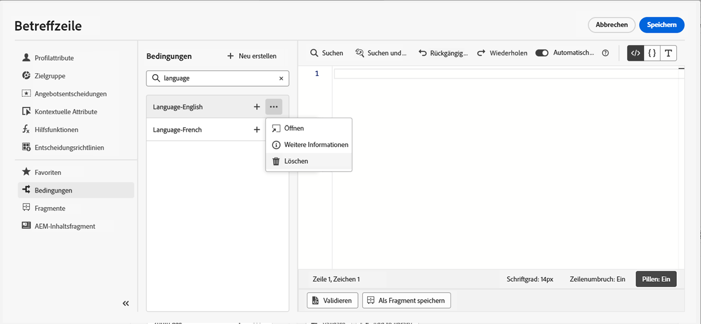

# Arbeiten mit bedingten Regeln {#conditions}

Bedingte Regeln sind Regelsätze, die festlegen, welcher Inhalt in Ihren Nachrichten angezeigt werden soll, abhängig von verschiedenen Kriterien wie Profilattributen, Segmentzugehörigkeit oder Kontextereignissen.

Bedingte Regeln werden mit dem Ausdruckseditor erstellt und können gespeichert werden, wenn Sie sie für alle Inhalte wiederverwenden möchten. [Erfahren Sie, wie Sie eine bedingte Regel in der Bibliothek speichern](#save)

>[!NOTE]
>
>Der Einzelne benötigt die [Bibliothekselemente verwalten](../administration/ootb-product-profiles.md) Berechtigung zum Speichern oder Löschen von bedingten Regeln. Gespeicherte Bedingungen stehen allen Benutzern in einer Organisation zur Verfügung.

## Zugriff auf den Bedingungsregel-Builder {#access}

Bedingte Regeln werden aus dem **[!UICONTROL Conditions]** -Menü im Ausdruckseditor zur Verfügung, auf das Sie zugreifen können:

* In Email Designer beim Aktivieren von dynamischem Inhalt für eine Komponente im E-Mail-Textkörper. [Erfahren Sie, wie Sie dynamische Inhalte zu E-Mails hinzufügen.](dynamic-content.md#emails)

   

* In allen Feldern, in denen Sie mithilfe der [Ausdruckseditor](personalization-build-expressions.md).

   

## Bedingte Regel erstellen {#create-condition}

>[!CONTEXTUALHELP]
>id="ajo_expression_editor_conditions_create"
>title="Bedingung erstellen"
>abstract="Kombinieren Sie Profilattribute, kontextbezogene Ereignisse oder Zielgruppen, um Regeln zu erstellen, die festlegen, welcher Inhalt in Ihren Nachrichten angezeigt werden soll."

>[!CONTEXTUALHELP]
>id="ajo_expression_editor_conditions"
>title="Bedingung erstellen"
>abstract="Kombinieren Sie Profilattribute, kontextbezogene Ereignisse oder Zielgruppen, um Regeln zu erstellen, die festlegen, welcher Inhalt in Ihren Nachrichten angezeigt werden soll."

Gehen Sie wie folgt vor, um eine bedingte Regel zu erstellen:

1. Zugriff auf **[!UICONTROL Conditions]** im Ausdruckseditor oder in Email Designer auf und klicken Sie dann auf **[!UICONTROL Create new]**.

1. Erstellen Sie die bedingte Regel entsprechend Ihren Anforderungen. Ziehen Sie dazu die gewünschten Attribute per Drag-and-Drop aus dem linken Menü in die Arbeitsfläche und ordnen Sie sie an.

   Die Schritte zum Kombinieren von Attributen auf der Arbeitsfläche ähneln dem Erlebnis beim Erstellen von Segmenten. Weitere Informationen zum Arbeiten mit der Arbeitsfläche des Regel-Builders finden Sie unter [diese Dokumentation](https://experienceleague.adobe.com/docs/experience-platform/segmentation/ui/segment-builder.html?lang=en#rule-builder-canvas).

   

   Attribute sind in drei Registerkarten unterteilt:

   * **[!UICONTROL Profile]**:
      * **[!UICONTROL Segment Membership]** listet alle Segmentattribute auf (d. h. Status, Version usw.) für [Segmentierungsdienst für Adobe Experience Platform](https://experienceleague.adobe.com/docs/experience-platform/segmentation/home.html),
      * **[!UICONTROL XDM Individual profiles]** listet alle Profilattribute auf, die mit dem [Schema des Experience-Datenmodells (XDM)](https://experienceleague.adobe.com/docs/experience-platform/xdm/home.html) definiert in Adobe Experience Platform.
   * **[!UICONTROL Contextual]**: Wenn Ihre Nachricht in einer Journey verwendet wird, stehen in diesem Tab kontextbezogene Journey-Felder zur Verfügung.
   * **[!UICONTROL Audiences]**: listet alle Zielgruppen auf, die aus Segmenten generiert wurden, die in [Segmentierungsdienst für Adobe Experience Platform](https://experienceleague.adobe.com/docs/experience-platform/segmentation/home.html).

1. Sobald Ihre bedingte Regel fertig ist, können Sie sie zu Ihrer Nachricht hinzufügen, um dynamischen Inhalt zu erstellen. [Erfahren Sie, wie Sie dynamische Inhalte hinzufügen](dynamic-content.md)

   Sie können die Regel auch speichern, um eine weitere Wiederverwendung zu ermöglichen. [Erfahren Sie, wie Sie eine Bedingung speichern](#save)

## Bedingte Regel speichern {#save}

Wenn es Bedingungsregeln gibt, die Sie häufig wiederverwenden, können Sie sie in der Bedingungsbibliothek speichern. Alle gespeicherten Regeln werden freigegeben und können von Einzelanwendern in Ihrem Unternehmen aufgerufen und verwendet werden.

>[!NOTE]
>
>Bedingte Regeln, die kontextbezogene Attribute von Journeys nutzen, können nicht in der Bibliothek gespeichert werden.

1. Klicken Sie im Bildschirm zur Bedingungsbearbeitung auf das **[!UICONTROL Save condition]** Schaltfläche.

1. Geben Sie der Regel einen Namen und eine Beschreibung (optional), und klicken Sie dann auf **[!UICONTROL Add]**.

   

1. Die bedingte Regel wird in der Bibliothek gespeichert. Jetzt können Sie damit dynamische Inhalte in Ihren Nachrichten erstellen. [Erfahren Sie, wie Sie dynamische Inhalte hinzufügen](dynamic-content.md)

## Bearbeiten und Löschen gespeicherter bedingter Regeln {#edit-delete}

Sie können eine bedingte Regel jederzeit mit der Schaltfläche mit den Auslassungspunkten löschen.

In der Bibliothek gespeicherte bedingte Regeln können nicht geändert werden. Sie können sie jedoch weiterhin verwenden, um neue Regeln zu erstellen. Öffnen Sie dazu die bedingte Regel, nehmen Sie die gewünschten Änderungen vor und speichern Sie sie dann in der Bibliothek. [Erfahren Sie, wie Sie eine Bedingung in der Bibliothek speichern](#save)
