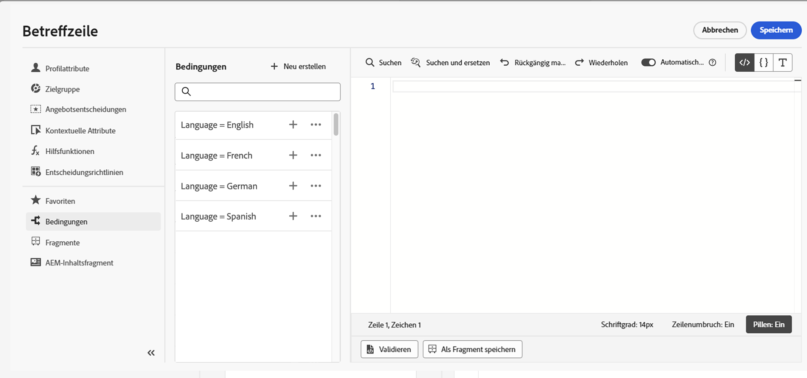

# Arbeiten mit bedingten Regeln {#conditions}

Bedingte Regeln sind eine Reihe von Regeln, die festlegen, welche Inhalte in Ihren Nachrichten angezeigt werden sollen. Sie sind abhängig von verschiedenen Kriterien wie Profilattributen, Segmentzugehörigkeit oder kontextbezogenen Ereignissen.

Bedingte Regeln werden mit dem Ausdruckseditor erstellt und können gespeichert werden, wenn Sie sie für Ihre Inhalte wiederverwenden möchten. [Erfahren Sie, wie Sie eine bedingte Regel in der Bibliothek speichern](#save)

>[!NOTE]
>
>Zum Speichern oder Löschen von bedingten Regeln ist die Berechtigung zum [Verwalten von Bibliothekselementen](../administration/ootb-product-profiles.md) erforderlich. Gespeicherte Bedingungen stehen allen Benutzenden in einer Organisation zur Verfügung.

## Zugreifen auf den Builder für bedingte Regeln {#access}

Bedingte Regeln werden im Menü **[!UICONTROL Bedingungen]** im Ausdruckseditor erstellt, auf das Sie wie folgt zugreifen können:

* In Email Designer beim Aktivieren von dynamischen Inhalten für eine Komponente im E-Mail-Textkörper. [Erfahren Sie, wie Sie dynamische Inhalte zu E-Mails hinzufügen](dynamic-content.md#emails)

   

* In allen Feldern, in denen Sie mithilfe des [Ausdruckseditors](personalization-build-expressions.md) eine Personalisierung vornehmen können.

   

## Erstellen einer bedingten Regel {#create-condition}

>[!CONTEXTUALHELP]
>id="ajo_expression_editor_conditions_create"
>title="Erstellen einer Bedingung"
>abstract="Kombinieren Sie Profilattribute, kontextbezogene Ereignisse oder Audiences, um Regeln zu erstellen, die festlegen, welcher Inhalt in Ihren Nachrichten angezeigt werden soll."

>[!CONTEXTUALHELP]
>id="ajo_expression_editor_conditions"
>title="Erstellen einer Bedingung"
>abstract="Kombinieren Sie Profilattribute, kontextbezogene Ereignisse oder Audiences, um Regeln zu erstellen, die festlegen, welcher Inhalt in Ihren Nachrichten angezeigt werden soll."

Die Schritte zum Erstellen einer bedingten Regel sind:

1. Greifen Sie auf das Menü **[!UICONTROL Bedingungen]** im Ausdruckseditor oder in Email Designer zu und klicken Sie dann auf **[!UICONTROL Neu erstellen]**.

1. Erstellen Sie die bedingte Regel entsprechend Ihren Anforderungen. Ziehen Sie dazu die gewünschten Attribute aus dem linken Menü per Drag-and-Drop auf die Arbeitsfläche und ordnen Sie sie an.

   Die Schritte zum Kombinieren von Attributen auf der Arbeitsfläche ähneln denen zum Erstellen von Segmenten. Weitere Informationen zum Arbeiten mit der Arbeitsfläche des Regel-Builders finden Sie in [dieser Dokumentation](https://experienceleague.adobe.com/docs/experience-platform/segmentation/ui/segment-builder.html?lang=de#rule-builder-canvas).

   

   Attribute sind in drei Registerkarten unterteilt:

   * **[!UICONTROL Profil]**:
      * **[!UICONTROL Segmentzugehörigkeit]** listet alle Segmentattribute (d. h. Status, Version usw.) für den [Segmentierungs-Service von Adobe Experience Platform](https://experienceleague.adobe.com/docs/experience-platform/segmentation/home.html?lang=de) auf.
      * **[!UICONTROL Individuelle XDM-Profile]** listet alle Profilattribute auf, die mit dem [Schema des Experience-Datenmodells (XDM)](https://experienceleague.adobe.com/docs/experience-platform/xdm/home.html?lang=de) verknüpft sind, das in Adobe Experience Platform definiert ist.
   * **[!UICONTROL Kontextbezogen]**: Wenn die Nachricht in einer Journey verwendet wird, stehen auf dieser Registerkarte kontextbezogene Journey-Felder zur Verfügung.
   * **[!UICONTROL Audiences]**: Listet alle Audiences auf, die aus Segmenten generiert wurden, die im [Segmentierungs-Service von Adobe Experience Platform](https://experienceleague.adobe.com/docs/experience-platform/segmentation/home.html) erstellt wurden.

1. Wenn Ihre bedingte Regel fertig ist, können Sie sie zu Ihrer Nachricht hinzufügen, um dynamische Inhalte zu erstellen. [Erfahren Sie, wie dynamische Inhalte hinzugefügt werden](dynamic-content.md)

   Sie können die Regel auch speichern, um eine spätere Wiederverwendung zu ermöglichen. [Erfahren Sie, wie Sie eine Bedingung speichern](#save)

## Speichern einer bedingten Regel {#save}

Wenn es Bedingungsregeln gibt, die Sie häufig wiederverwenden, können Sie sie in der Bedingungsbibliothek speichern. Alle gespeicherten Regeln werden freigegeben und können von anderen in Ihrer Organisation aufgerufen und verwendet werden.

>[!NOTE]
>
>Bedingte Regeln, die kontextbezogene Journey-Attribute nutzen, können nicht in der Bibliothek gespeichert werden.

1. Klicken Sie im Bildschirm zur Bedingungsbearbeitung auf die Schaltfläche **[!UICONTROL Bedingung speichern]**.

1. Geben Sie der Regel einen Namen und eine Beschreibung (optional) und klicken Sie dann auf **[!UICONTROL Hinzufügen]**.

   

1. Die bedingte Regel wird in der Bibliothek gespeichert. Jetzt können Sie damit dynamische Inhalte in Ihren Nachrichten erstellen. [Erfahren Sie, wie dynamische Inhalte hinzugefügt werden](dynamic-content.md)

## Bearbeiten und Löschen von gespeicherten bedingten Regeln {#edit-delete}

Sie können eine bedingte Regel jederzeit mithilfe der Schaltfläche mit den Auslassungspunkten löschen.

In der Bibliothek gespeicherte bedingte Regeln können nicht geändert werden. Sie können sie jedoch verwenden, um neue Regeln zu erstellen. Öffnen Sie dazu die bedingte Regel, nehmen Sie die gewünschten Änderungen vor und speichern Sie sie dann in der Bibliothek. [Erfahren Sie, wie Sie eine Bedingung in der Bibliothek speichern](#save)
