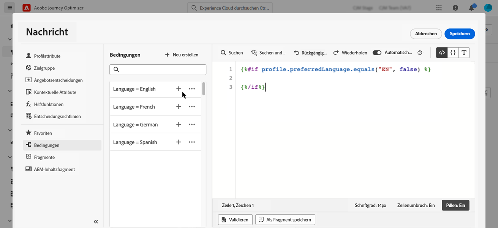
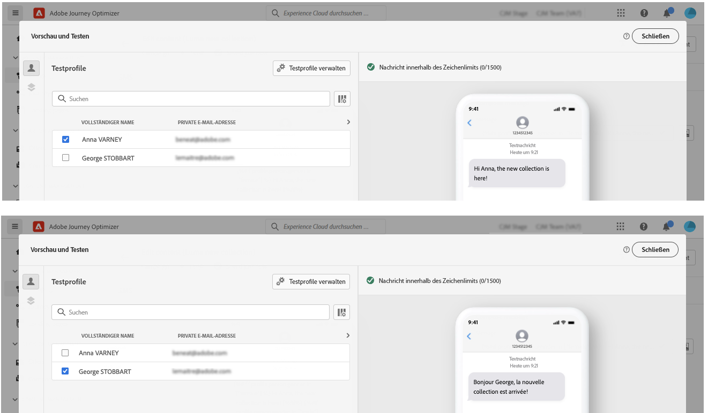

# Dynamischen Inhalt erstellen {#dynamic-content}

Mit Adobe Journey Optimizer können Sie bedingte Regeln nutzen, die in der Bibliothek erstellt wurden, um Ihren Nachrichten dynamische Inhalte hinzuzufügen.

Dynamische Inhalte können in jedem Feld erstellt werden, in dem Sie mithilfe des Ausdruckseditors Personalisierung hinzufügen können. Dazu gehören Betreffzeile, Links, Inhalte von Push-Benachrichtigungen oder Darstellungen von Angeboten vom Typ Text. [Weitere Informationen zu Personalisierungskontexten](personalization-contexts.md)

Darüber hinaus können Sie bedingte Regeln in Email Designer verwenden, um mehrere Varianten einer Inhaltskomponente zu erstellen.

## Dynamischen Inhalt in Ausdrücke hinzufügen {#perso-expressions}

Gehen Sie wie folgt vor, um dynamischen Inhalt in Ausdrücken hinzuzufügen:

1. Navigieren Sie zu dem Feld, dem Sie dynamischen Inhalt hinzufügen möchten, und öffnen Sie dann den Ausdruckseditor.

1. Wählen Sie die **[!UICONTROL Conditions]** -Menü, um die Liste der verfügbaren bedingten Regeln anzuzeigen. Klicken Sie auf die Schaltfläche + neben einer Regel, um sie dem aktuellen Ausdruck hinzuzufügen.

   Sie können auch eine neue Regel erstellen, indem Sie **[!UICONTROL Create new]**. [Erfahren Sie, wie Sie Bedingungen erstellen](create-conditions.md)

   

1. Zwischen den `{%if}` und `{%/if}` markiert den Inhalt, der angezeigt werden soll, wenn die bedingte Regel erfüllt ist. Sie können beliebig viele Regeln hinzufügen, um mehrere Varianten eines Ausdrucks zu erstellen.

   Im folgenden Beispiel wurden je nach bevorzugter Sprache des Empfängers zwei Varianten für einen SMS-Inhalt erstellt.

   

1. Sobald Ihr Inhalt fertig ist, können Sie die verschiedenen Varianten mit der **[!UICONTROL Simulate content]** Schaltfläche. [Erfahren Sie, wie Sie Nachrichten testen und in der Vorschau anzeigen](../email/preview.md)

   

## Dynamischen Inhalt in E-Mails hinzufügen {#emails}

>[!CONTEXTUALHELP]
>id="ac_conditional_content"
>title="Bedingter Inhalt"
>abstract="Verwenden Sie bedingte Regeln, um mehrere Varianten einer Inhaltskomponente zu erstellen. Wenn beim Versand der Nachricht keine der Bedingungen erfüllt ist, wird der Inhalt der Standardvariante angezeigt."

>[!CONTEXTUALHELP]
>id="ac_conditional_content_select"
>title="Bedingter Inhalt"
>abstract="Verwenden Sie eine in der Bibliothek gespeicherte bedingte Regel oder erstellen Sie eine neue."

Gehen Sie zur Erstellung von Varianten einer Inhaltskomponente in Email Designer wie folgt vor:

1. Wählen Sie in Email Designer eine Inhaltskomponente aus und klicken Sie auf **[!UICONTROL Enable conditional content]**.

   

1. Die **[!UICONTROL Conditional Content]** wird auf der linken Seite angezeigt. In diesem Bereich können Sie mithilfe von Bedingungen mehrere Varianten der ausgewählten Inhaltskomponente erstellen.

   Konfigurieren Sie Ihre erste Variante, indem Sie die **[!UICONTROL Apply condition]** Schaltfläche.

   

1. Die Bedingungsbibliothek wird angezeigt. Wählen Sie die bedingte Regel aus, die der Variante zugeordnet werden soll, und klicken Sie dann auf **[!UICONTROL Select]**. In diesem Beispiel möchten wir den Komponententext entsprechend der bevorzugten Sprache des Empfängers anpassen.

   

   Sie können auch eine neue Regel erstellen, indem Sie auf **[!UICONTROL Create new]**. [Erfahren Sie, wie Sie Bedingungen erstellen](create-conditions.md)

1. Die bedingte Regel ist mit der Variante verknüpft. Um die Lesbarkeit zu verbessern, wird empfohlen, die Variante umzubenennen, indem Sie auf das Menü mit den Auslassungspunkten klicken.

   Konfigurieren Sie jetzt, wie die Komponente angezeigt werden soll, wenn die Regel beim Senden der Nachricht erfüllt ist. In diesem Beispiel soll der Text auf Französisch angezeigt werden, wenn er die bevorzugte Sprache des Empfängers ist.

   

1. Fügen Sie so viele Varianten hinzu, wie für die Inhaltskomponente erforderlich sind. Sie können jederzeit zwischen den verschiedenen Varianten wechseln, um zu überprüfen, wie die Inhaltskomponente je nach den bedingten Regeln dargestellt wird.

   >[!NOTE]
   >Wenn keine der in den Varianten definierten Regeln beim Versand der Nachricht erfüllt ist, zeigt die Inhaltskomponente den in der Variablen **[!UICONTROL Default variant]**.
   >
   >Bedingter Inhalt wird anhand verknüpfter Regeln in der Reihenfolge bewertet, in der die Varianten angezeigt werden. Die Standardvariante wird immer angezeigt, wenn keine anderen Bedingungen erfüllt sind.
